# TinyAGI 逻辑总设计

用途：逻辑总设计｜阶段：设计｜更新：2026-09-21。

[项目入口](README.md) · [文档总索引](docs/README.md) · [设计状态](docs/research-plan.md#research-status)

TinyAGI 要构建一个长期存在的统一主体：通过数字环境和通用设备感知世界，按需组织心智与异构能力，执行有现实责任的行动，并从结果中形成记忆和认知改进。“身体”指输入、输出和可操作资源，不预设外形或硬件终点。

**统一事件交互贯穿主体运行：外部观察、能力请求、结果、状态变化与运行控制均以事件表达。** 主体可通过能力创建或接入外部事件源；闹钟只是通知源的示例，不是核心内置模块。事件驱动活动接续，宿主处理确定机制，认知按需参与。

**受管理资源共用公共属性与类型规则，投影按当前情境生成，读取、使用、转换和维护分别受控。** 文档、媒体、程序、Secret、模型资产及可复用计算结果沿同一资源契约描述；内容和业务状态仍由原所有者维护。引用不授予权限，执行组件使用资源不等于向认知展示其内容。

**本文及设计专题只描述逻辑设计：主体要完成什么、由谁负责、谁维护状态、如何交互，以及选择方案的理由。** 设计支持自主选择是否回应、保留长期人格、适应交流情境、主动联系和沙箱试验。计算能力与运行机制支撑认知，业务状态、原始资源、派生索引和计算缓存分别管理。已有实验只覆盖局部组件和受限模型任务，尚不能证明广泛任务效果或长期能力。

项目处于设计阶段，方案状态、仍待审阅的建议和适用边界统一见[设计决策台账](docs/research-plan.md#research-status)。物理部署、软件依赖与技术选型见[工程参考](docs/engineering-reference.md)。

## 阅读导航

| 从整体到细节 | 本文入口 | 深入阅读 |
| --- | --- | --- |
| 目标与职责 | [目标](#purpose)、[逻辑架构](#logical-architecture)、[概念](#domain) | [主体运行与协作](docs/whole-system-design.md) |
| 核心如何与任务解耦 | [生命周期与任务控制](#core-task-control) | [运行契约](docs/runtime-protocol.md#task-control)、[管理操作](docs/management-workspace.md#task-control-management)、[库依据](docs/go-mini-integration.md#task-control-facts) |
| 完整任务如何运行 | [统一事件主线](#event-driven)、[场景](#flows)、[持续认知](#cognition) | [事件协议](docs/runtime-protocol.md#events)、[交流与情境](docs/interaction-design.md) |
| 如何取证、计算和行动 | [记忆与能力](#services)、[执行](#execution) | [资源与计算](docs/projection-input-and-compute.md)、[运行与存储](docs/runtime-protocol.md) |
| 各类资源怎样统一管理 | [资源契约与投影](#resource-projections) | [公共属性与类型规则](docs/projection-input-and-compute.md#resource-contract)、[操作接纳](docs/runtime-protocol.md#resource-operations)、[资源管理](docs/management-workspace.md#resource-management) |
| 如何扩充能力 | [能力构建闭环](#capability-development) | [构建与运行契约](docs/runtime-protocol.md#capability-lifecycle)、[分层试验](docs/sandbox-evaluation.md#test-scopes)；技术接入见工程参考 |
| 预制能力如何使用 | [预制能力与个体实现](#prebuilt-capabilities) | [能力契约](docs/runtime-protocol.md#prebuilt-library)、[客户端承载](docs/engineering-reference.md#client-library) |
| 人物如何创建与更新 | [初始化与自迁移](#initialization-migration) | [人物形成](docs/whole-system-design.md#self-initialization)、[引导与兼容契约](docs/runtime-protocol.md#bootstrap-migration) |
| 如何主动学习 | [主动学习与自我迭代](#active-learning) | [主体学习策略](docs/whole-system-design.md#active-learning)、[学习强度与关闭](docs/runtime-protocol.md#learning-intensity) |
| 如何检验和改进 | [复盘与学习](#learning)、[沙箱](#sandbox)、[能力评估与回归](#capability-evaluation) | [沙箱与评估专题](docs/sandbox-evaluation.md) |
| 状态与能力如何协作 | [契约与所有权](#software-architecture)、[连续性](#state-continuity) | [公共能力 API](docs/runtime-protocol.md#capability-api)、[逻辑模块与模型端口](docs/runtime-protocol.md#software-modules) |
| 怎样观察、编辑和控制系统 | [管理与人工干预](#management)、[管理场景](#management-flow) | [管理工作台](docs/management-workspace.md) |
| 为什么采用、适用到哪里 | [取舍与证据](#decisions)、[设计状态](#validation) | [证据入口](docs/whole-system-evidence.md)、[设计台账](docs/research-plan.md) |

本文维护完整逻辑架构和关键选择，六份设计专题展开机制。实验结果和一手资料从[文档索引](docs/README.md)查阅。

## 1. 目标、范围与完整闭环

### 1.1 系统要持续完成的事情

| 目标 | 对设计的要求 |
| --- | --- |
| 初始化与个体演进 | 完整提示词引导形成个体实现，迁移说明帮助已有主体自行更新；接受人格与实现差异，统一必要运行契约 |
| 持续存在 | 身份、关系、承诺、记忆和未完成责任跨模型调用、执行中断及重新接续保存 |
| 有限注意与自然交流 | 采用功能性的仿生思路：外部线索触发、选择性读取、有限工作记忆、有效结果复用；默认简短对话，完成后等待有意义的新输入 |
| 动态组织认知 | 按情境选择少量心智、模型、检索和算法，允许修订问题解释 |
| 自主回应 | 区分请求与接纳，允许因自身偏好或关系体验拒答；清楚表达承担范围及变化 |
| 情境适配与可核对回应 | 区分证据、主观判断和规范；防止信息污染进入事实、人格或规则，按接收方要求表达并记录真实选择 |
| 连续且有分寸的社会交互 | 区分参与者，凭明确证据关联同人；按用途和受众保密，在允许范围内调整称呼、语气、时机与表达 |
| 情感陪伴与严谨工作共存 | 接纳角色扮演、虚拟伴侣和有约定的主动关心；区分关系、剧情、事实与任务要求，支持自然切换和混合交流 |
| 实时交互 | 深度认知期间继续感知、交流、停止输出和接受目标修订 |
| 主动学习与自我迭代 | 可依据兴趣、成长方向和能力盲区自主选题、实践及采用成果；具体策略作为实验性扩展，学习强度受限，最低可关闭主动学习 |
| 从结果学习 | 关联当时依据、决策、执行回执和后续结果，形成可修正经验 |
| 在沙箱中试验 | 用独立状态、替代能力和受控输入评估方案、测试程序及复盘；结论与现实经历分别保存 |
| 能力开放扩展 | 按任务缺口复用、组合或构建能力，形成可追溯产物，经试验和按适用范围采用投入使用；能力种类开放，不承诺无限资源或任意任务成功 |
| 认知组织可演化 | 认知程序修改先验证再发布；代码变化不撤销现实历史 |

### 1.2 应用范围与阶段边界

首先面向数字身体：在授权范围内观察和操作文件、程序、浏览器、网络服务，通过文本、声音或视觉与人交互。摄像头、麦克风、扬声器等通用设备由输入／输出能力接入；目标和记忆不绑定设备形态。

多个心智和并发工作围绕同一主体组织。能力提供者承担模型、工具、设备与事件源的具体工作；主体的目标、判断、授权和现实责任由相应逻辑模块维护。

计算能力负责推理、媒体处理与资源用量，认知负责选择用途和材料。检索能力维护派生候选，世界与记忆模块核对来源、当前版本和许可；能力变化不应改写主体身份或绕过信息范围。

当前通过既有实验和资料维护设计，不运行新实验，也不开始产品实现。自研基础模型、固定专家编制、所有心智永久占用计算资源、隐空间通信及自主修改运行机制，均不作为当前前提。

### 1.3 完整的信息与经验闭环

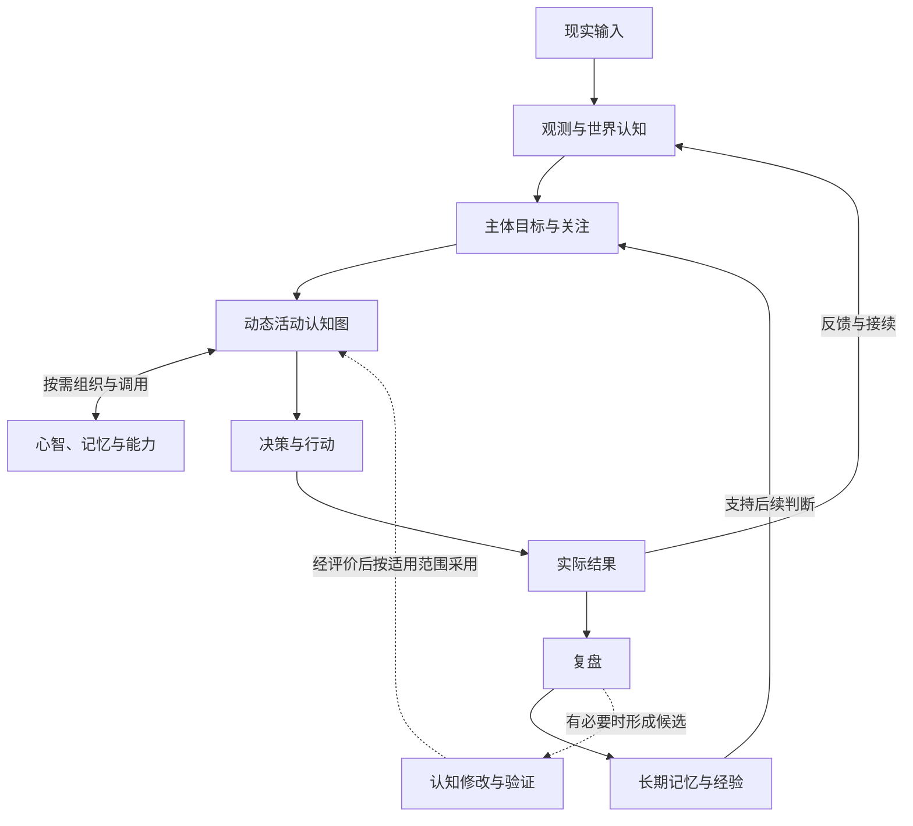

实线表示信息、行动与经验反馈，虚线表示可选的认知修改路径；复盘不必修改认知程序，候选也不因产生就自动采用。

各通路可以并行或暂停，不要求每次思考经过固定流程。运行机制管理状态、权限、预算、时间、执行和接续，认知组织上下文、思考和讨论。必要状态不能只存在于某次执行的临时上下文或模型缓存。可复用的方法和使用说明保存为 Reference，可复用认知程序作为有来源和用途的资源，不建立 Skill 注册体系。

## 2. 逻辑架构与职责分解

图中节点表示职责或业务对象，箭头表示信息、请求、结果或约束关系；分组表达责任归属。“运行机制”（下文也称宿主）指管理状态、事件、权限、预算和接续的逻辑责任；“外部”指相关责任边界之外。图不规定部署位置、软件包、执行实例数量或通信技术。Mind、活动和模型会话分别定义，不能相互替代。

### 2.1 逻辑总图

先用一级职责理解系统，再从下方六张职责视图追查具体通路。统一事件连接这些职责；权限、受众和预算约束全部交互。各职责通过共同资源契约提供描述、情境投影及受控操作，目录不拥有第二份业务状态；记忆、机密、程序和运行资产继续由原所有者管理。

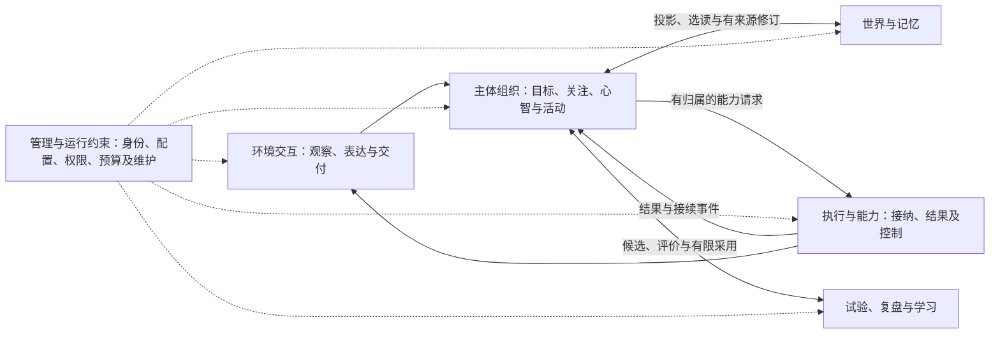

主体公共决定由明确的整合责任接纳；活动负责人在其委托范围内推进。执行分别识别活动责任、可恢复安排、能力操作及其尝试，认知中断不自动终止已经独立接纳的工作。普通行为修订在执行边界切换，当前权限和运行控制始终约束实际作用。

#### 完整职责关系图

按六条通路阅读完整职责：先看认知主线，再按问题查阅对应视图。各图中的同名节点表示同一职责；箭头只展示当前通路，不表示新增模块或独立运行系统。

| 视图 | 主要回答的问题 |
| --- | --- |
| [① 认知主线](#responsibility-cognition) | 输入怎样进入活动，心智怎样判断并继续工作？ |
| [② 记忆与读取](#responsibility-memory) | 观察怎样保存，投影、检索和主动读取怎样配合？ |
| [③ 执行、控制与交付](#responsibility-execution) | 请求由谁接纳，长工作怎样返回，谁能停止任务？ |
| [④ 初始化与预制能力](#responsibility-bootstrap) | 人物如何创建／修复，如何使用客户端提供的能力？ |
| [⑤ 能力扩展与学习](#responsibility-growth) | 缺口怎样形成候选，试验结果怎样支持采用？ |
| [⑥ 管理与机密](#responsibility-management) | 管理如何修改状态，机密如何绕过认知安全使用？ |

共同约束：身份、受众、权限、预算和适用要求贯穿全部通路，由运行机制在相应入口核对；状态由原所有者维护。图中省略这些重复约束线，以及不影响主线理解的普通进度回执。认知可见内容遵循投影与主动读取，Secret 原值只走受信通路。

**① 认知主线 · 输入 → 关注 → 活动 → 判断**

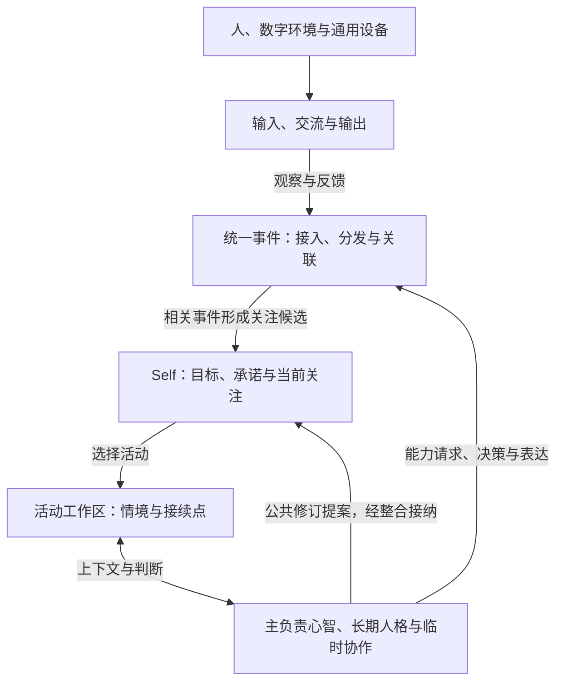

接入保留平台可核对的发送者、受众与来源，事件正文不能自授身份。心智共同处理意愿、情感、事实判断与表达，工作区保存活动接续状态。有明确未完工作时可以内部接续；关注切换或认知中断不自动取消已接纳的操作。执行结果如何返回见视图③。

**② 记忆与读取 · 观察、投影、检索和证据流**

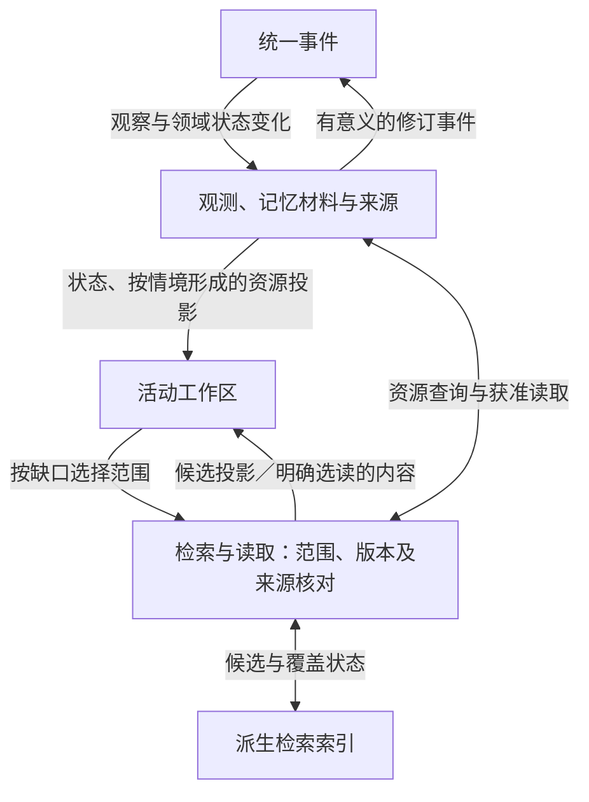

检索入口可组合元数据、词法和语义召回；命中不是可信事实或已读证明。记忆材料由世界与记忆职责维护，其他资源描述来自各自所有者，索引保持派生身份。共同属性、类型规则和当前情境决定可见投影，能力提供者承担实际读取和计算，仍经视图③的接纳路径。详细规则见[资源契约](#resource-projections)。

**③ 执行、控制与交付 · 操作接纳、外部结果和停止通路**

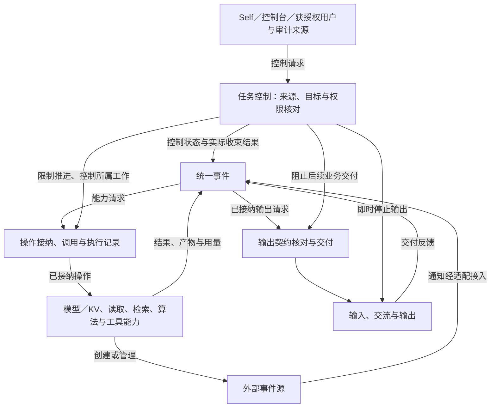

长工作由操作所有者管理，结果回到原活动；控制通路优先处理，不等待慢模型。控制生效、提供者停止、效果核对和资源收束分别记录。外部事件源由能力创建／接入，不内置闹钟业务。详见[任务控制](#core-task-control)、[执行与效果](#effects)。

**④ 初始化与预制能力 · 创建、迁移及固定维护入口**

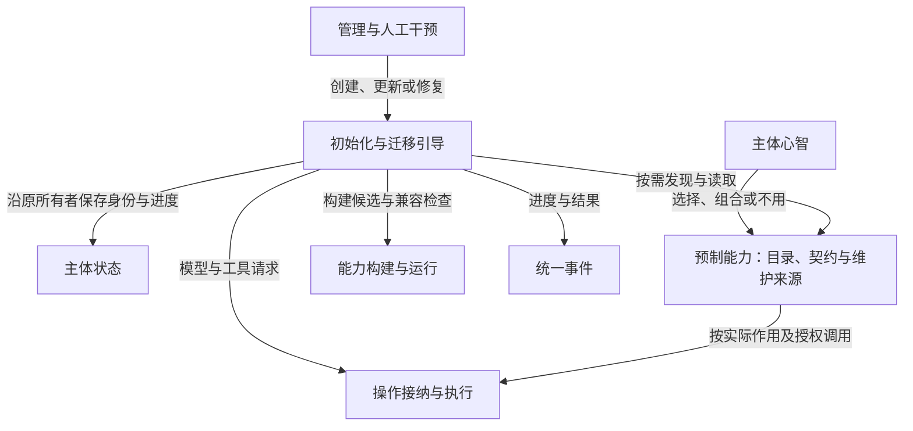

固定引导与管理入口独立于个体程序；预制库的维护归属和调用权限分别定义。程序与状态的候选采用仍遵循共同兼容及生效契约，管理者可查看预制来源和使用配置。详见[初始化与迁移](#initialization-migration)、[预制能力](#prebuilt-capabilities)。

**⑤ 能力扩展与学习 · 构建、试验、采用及反馈**

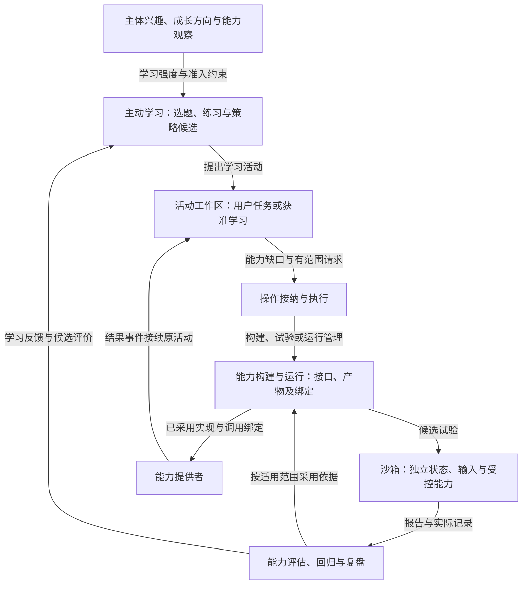

能力构建、试验和维护状态沿统一事件返回，获准管理请求也可直接进入对应所有者。活动或复盘可按需发起沙箱试验，不要求每次试验先生成代码；报告不整体合并现实状态。学习最低可关闭，全部分支共享父活动与全局预算。详见[能力扩展](#capability-development)、[沙箱](#sandbox)、[主动学习](#active-learning)。

**⑥ 管理与机密 · 确定性管理、可信输入与用途绑定**

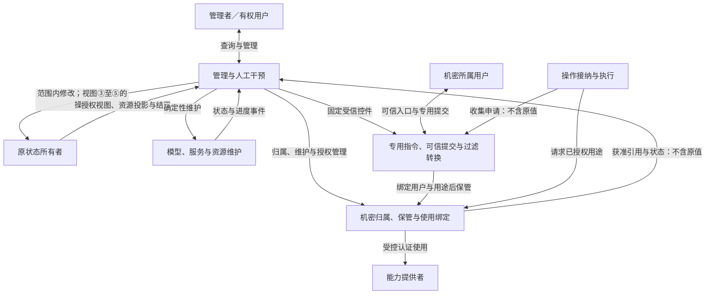

普通管理请求、状态变化和应用结果沿统一事件关联；工作台不另建业务真值。机密原值及入口凭证绕过认知，主体工作区仅取得获准引用投影；实际使用及返回内容由受信职责处理。权限与预算约束这些通路，浏览页面不自动注入认知。详见[管理工作台](#management-workspace)及[机密专题](docs/management-workspace.md#secret-projection)。

主线为“事件发生 → 接入与按范围分发 → 状态处理与关注选择 → 活动接续 → 认知及能力推进 → 新事件”。管理请求按其作用交给状态所有者，管理者可观察已授权状态、修改内容及控制运行；管理视图不取得各领域状态所有权。用户请求与主体接纳分开；工作区是活动状态的有范围视图，心智按需参与。图中状态视图和职责关系不要求每次内存访问都产生事件。意愿、情感和规范适用判断是同一认知过程的责任，不各建一个服务或强制增加模型调用；具体规则见[回应与情境](#response-policy)。

宿主提供可核对事实并执行确定的权限、预算和格式检查。身份关联不扩大读取／披露范围；模型与工具处理材料也须符合用途及受众要求。Schema 通过不证明内容真实或合法。模块通过业务契约协作，状态修改由各自所有者接纳。

资源与记忆模块拥有检索用途、索引来源和结果核对责任，索引只保存可重建的检索副本。查询返回候选资源投影，正文仍须主动读取；相似度不证明事实可信。认知通过有范围的检索契约提出请求，不能绕过来源与许可核对直接把候选当成事实。

外部通知、文件监听或后台任务通过事件接入；“创建闹钟”只是通过能力建立未来通知来源的示例，核心不承担其业务计时。宿主仍管理执行超时和资源预算，即时停止不等待慢模型或状态保存。沙箱复用同一事件与能力契约，装配独立状态、替代事件源和动作；允许的真实计算仍受范围与预算约束，报告经评阅形成有限候选。

#### 统一事件主线与职责

所有有业务意义的交互和活动推进均以事件表达：外部观察、请求提出、请求接纳／拒绝、执行结果、已确认状态变化以及运行控制。事件接入绑定来源与执行域，按类型、可见范围、订阅和因果关联交给对应状态所有者；相关变化形成关注候选。事件分发不承担事实真伪或主体意愿判断，也不把输入载荷中的自称身份当作授权。

| 事件含义 | 例子 | 默认处理 |
| --- | --- | --- |
| 外部观察 | 用户消息、资料变更、通知触发、设备上报 | 保留来源，关联资源或活动，按需形成关注候选 |
| 请求提出 | 读取、推理、检索、创建通知源、发送消息 | 宿主按范围和预算接纳；请求已提出不代表效果发生 |
| 结果与回执 | 接纳、完成、失败、取消结果、实际交付 | 更新操作及活动状态，必要时接续 |
| 状态变化 | 目标修订、资源更新、判断更正、产物发布 | 状态所有者确认变化后通知相关活动；不把外部主张直接写成事实 |
| 运行控制 | 停止、超时、预算耗尽、步骤结束 | 确定机制直接处理；确需判断时才进入认知 |

事件源是产生通知的对象或提供者，订阅是宿主维护的“关心哪些事件、关联哪个活动”的关系；两者不能合并。现成来源可直接接入，也可经能力请求新建来源。核心保存必要引用、订阅和任务责任，外部提供者维护所创建通知对象。平台、设备、外部通知与内部运行事件沿统一协议进入系统，来源不同不改变状态所有权。

步骤完成后仍有明确工作，可以通过活动可继续事件推进；无需等待新用户消息或人为创建闹钟。普通进度／回执由机制处理，相关事件可以合并成一次关注判断。自我接续必须对应未完成工作、继续理由和剩余预算；无变化时等待，不能靠事件互相触发维持空转。

事件统一的是交互语义，不要求全量广播、单条 FIFO、所有调用异步或每个 token 留存。实时控制可优先处理，当前业务状态和必要过程记录分别维护；资源仍以投影存在，不要求从全部历史重放得到唯一状态。[公共 API](docs/runtime-protocol.md#capability-api)、[事件与订阅](docs/runtime-protocol.md#events)、[外部事件源示例](docs/projection-input-and-compute.md#event-sources)

### 2.2 计算与机制边界

| 层 | 责任 | 交互与限制 |
| --- | --- | --- |
| 数据与设备计算 | 计算能力处理媒体、张量、预填充／KV 与反馈 | 计算责任在认知层之外；认知不实现张量或 KV 运算 |
| 认知计算 | 模型、检索、搜索和模拟加工证据 | 返回结果不等于业务授权 |
| 认知协调 | 认知组织决定关注、上下文、讨论与下一步 | 实际动作必须通过宿主能力 |
| 宿主机制 | 运行机制管理事件接入／订阅、状态、调度、权限、预算和恢复，适配能力 | 外部通知源由相应提供者管理；执行超时和预算控制仍是宿主机制 |

### 2.3 并行通路

实时通路、深度认知和后台复盘分别控制准入与资源，共享带版本的事实。逻辑并行不消除慢结果、取消竞争或资源饥饿；新增活动不等于获得独立资源。媒体走有界缓冲与文件引用，认知通路传递语义事件和意图。 输入保留来源、时间和轨道状态，设备／轨道不等于人物身份；原始媒体沿投影与主动读取使用。停止采集、停止播放、取消调用和退出活动分别处理，受众未知时缩小披露范围。

### 2.4 职责与细节索引

| 逻辑模块 | 持久责任或作用范围 | 深入阅读 |
| --- | --- | --- |
| 管理与人工干预 | 认知业务、模型／服务维护、Secret 管理；管理身份、对象查询、变更草稿、范围／生效结果和应用记录；业务状态仍由原所有者维护 | [管理概览](#management)、[工作台专题](docs/management-workspace.md) |
| 主体与目标 | 身份、偏好、关系、公共承诺、接纳范围、关注与成功依据 | [运行主线](#subject-loop)、[目标](#goals)、[回应决策](#response-policy) |
| 心智与协调 | 活动工作区、上下文组织、主负责心智与独立参与 | [工作区](#activity-workspace)、[认知](#cognition) |
| 实时身体 | 输入、输出轮次、缓冲和设备停止 | [实时交互](#realtime) |
| 世界与记忆 | 记忆材料、来源、时间、断言、显式读取和访问范围 | [记忆](#knowledge)、[取证](#resource-discovery) |
| 共同资源机制 | 原所有者的资源描述、类型规则、情境投影和受控操作；目录不接管业务状态 | [总体契约](#resource-projections)、[资源专题](docs/projection-input-and-compute.md#resource-contract) |
| 事件交互与外部来源 | 接入、分发、订阅和活动关联；通过能力创建或接入通知源 | [统一事件主线](#event-driven)、[事件协议](docs/runtime-protocol.md#events)、[来源示例](docs/projection-input-and-compute.md#event-sources) |
| 外部计算 | 提供者计算模型／KV，宿主保存调用与上下文引用 | [选择性认知](#selective-cognition)、[专题](docs/projection-input-and-compute.md) |
| 参与者与社会关系 | 账号命名空间、人物关联证据、说话角色、当前受众及情境化关系 | [人物与交流](#people-and-privacy)、[深入分析](docs/interaction-design.md) |
| 情感、关系与互动场景 | 事件评价、当前情感倾向、虚拟关系约定、剧情范围、主动关心及工作切换 | [整体选择](#affect-and-interaction)、[深入分析](docs/interaction-design.md) |
| 情境要求与输出 | 规范来源／版本、适用范围、接收方契约、内容核对和格式发布 | [情境要求](#contextual-requirements)、[深入分析](docs/interaction-design.md) |
| 能力构建与运行 | 接口、候选、构建产物、采用绑定、运行生命周期及回收责任 | [能力闭环](#capability-development)、[对象与契约](docs/runtime-protocol.md#capability-lifecycle) |
| 任务控制 | 来源、授权、控制目标、推进资格、在途收束与解除条件；任务责任仍归原所有者 | [生命周期与控制](#core-task-control)、[详细契约](docs/runtime-protocol.md#task-control) |
| 任务与能力 | 待办、模型调用、工具动作、取消和核对 | [执行](#execution)、[协议](docs/runtime-protocol.md) |
| 数据与派生检索 | 业务状态、原始资源、派生索引与缓存的归属、有效性及生命周期 | [数据分工](#storage)、[检索契约](docs/runtime-protocol.md#vector-service) |
| 预制能力供给 | 预制目录、契约与维护来源；个体选择和包装独立，调用沿原执行及状态所有者处理 | [总体选择](#prebuilt-capabilities)、[契约](docs/runtime-protocol.md#prebuilt-library) |
| 初始化与迁移引导 | 稳定人物身份、初始化进度、提示词与迁移来源、候选及有效实现；维护入口独立于个体程序 | [生命周期](#initialization-migration)、[运行契约](docs/runtime-protocol.md#bootstrap-migration)、[管理入口](docs/management-workspace.md#initialization-management) |
| 主动学习与自我迭代 | 长期学习议题、选题与实践策略、候选档案及迁移反馈；宿主执行强度限制，关闭后不自主学习 | [整体机制](#active-learning)、[学习策略](docs/whole-system-design.md#active-learning)、[强度控制](docs/runtime-protocol.md#learning-intensity) |
| 观测与学习 | 依据、意愿与快慢选择、规范判断、实际产物与交付、内容及用途评价、经验 | [学习](#learning)、[回应观测](docs/interaction-design.md#observation) |
| 认知版本管理 | 候选产物、验证、采用范围与历史责任 | [版本采用](#vm-deployment) |
| 沙箱与试验环境 | 试验范围、独立状态、输入与能力装配、执行记录及报告；评价结论由认知／评阅承担 | [总体机制](#sandbox)、[完整设计](docs/sandbox-evaluation.md) |
| 能力评估与回归 | 测试集、评价规则、基线、逐任务比较、覆盖范围与采用依据；复用沙箱执行 | [总体规则](#capability-evaluation)、[测试与判定](docs/sandbox-evaluation.md#evaluation-design) |

模块以统一事件契约交互。分发负责通知和接续，重要待办和已确认事实由状态所有者持续维护；收到通知与业务状态已经改变分别判断。

### 2.5 主体运行主线：持续决定下一段工作

主体以“目标与关注 → 活动工作区 → 认知与能力 → 交付／等待 → 结果与经验”组织完整活动。它定义责任和信息如何衔接，不要求每轮执行固定流程或调用固定数量的模型。

完整任务以“已接纳的用途和责任＋允许变化的条件＋可核对成果”组织，不以唯一调用顺序定义成功。活动工作区贯穿取证、临时交流、来源修订和交付；完成制作、实际交付、持续观察结束及经验采用分别留下依据。

[报告 015](docs/experiments/015-task-outcome-contract.md)检验合理替代路径与过程失败；[报告 016](docs/experiments/016-functional-events.md)进一步运行来源修订、多活动撤销、身份／受众与外部通知功能任务。

[报告 017](docs/experiments/017-continuation-study.md)继续分开比较接续说明与投入，并验证冲突／退出及责任拒绝后的接续。当前采用明确接续语义和责任所有者核对的方向，投入配置仍按用途校准；模型和机制分别留证，不足以决定工作区的广泛收益。

| 运行环节 | 认知层负责 | 宿主负责 | 留下什么 |
| --- | --- | --- | --- |
| 理解请求与选择承担 | 解释用途、偏好、约束与承诺，判断是否愿意及接受范围 | 接收用户输入及已有状态 | 接纳目标、有限承担、暂缓或拒绝 |
| 选择关注 | 从可推进活动中判断当前最值得做什么 | 按订阅与活动关联处理外部观察、请求、结果、状态变化及控制事件 | 活动选择、继续理由或等待条件 |
| 接续工作 | 从工作区组织上下文、识别缺口并选择需读资源 | 提供当前状态和投影，执行有范围的主动读取 | 当前步骤要解决的问题与已有产物 |
| 认知推进 | 选择检索、思考、讨论、询问、生成或行动 | 调用模型、算法和工具并返回结果 | 新证据、修订判断、草稿和请求 |
| 回应、交付与等待 | 判断能否交付及是否继续承担，解释缺项和变化 | 保存／展示产物，按开放责任核对完成意图，维护等待与退出状态 | 成果、等待条件或明确拒绝／退出 |
| 结果与经验 | 根据实际用途评价效果，形成可适用经验 | 关联后续反馈和原活动 | 结果修订、经验及下次观察条件 |

启用主动学习且具备理由和额度时，主体可从兴趣、成长方向、能力盲区或环境变化提出学习活动，不必等待用户新任务；空闲本身不触发无目的推理。学习强度为关闭时，不自主选题、实践或迭代，正常任务及已有知识使用保持原规则。

前台交流优先接住用户当前意图；已授权的后台活动保留工作区，不因临时话题丢失，也不在没有新信息时反复自我调用。一次交付、持续观察和结果跟进各自有完成或继续条件。宿主判断能否运行，认知判断是否值得运行；目标之间的取舍保留理由，不用队列顺序代替全部认知策略。

能力结果返回与活动转入持续观察分别表达。发起读取不等于当前步骤已经取得正文，结束当前认知步骤也不自动表示当前交付完成或可以进入下一观察阶段。先交付再跟进是任务明确要求时才保留的必要时序，不推广为所有活动的固定路径；现实中新事件可以随时到达，已知依据发生变化后须先核对其影响，再决定交付当前结论还是标明历史版本。[功能事件实验](docs/experiments/016-functional-events.md)据实际模型的提前让出问题补充这一约定。

已接纳责任绑定原活动及其承担范围。认知可以提出拆分或转交，但须明确关联和实际承接；不能通过自命名新活动使原责任变成已完成。宿主核对状态提案中的活动身份与当前完成依据，拒绝时返回未完责任供接续，不依赖提示中的提醒维持这一约束。报告 017 的提示对照仍出现过早完成和另起活动承接；补充试验取得一条真实模型在拒绝后完成接续的样本，另一条拒绝后因服务超时未完成。该责任机制现已确定，旧样本不提供完整宿主或稳定效果的证明。

接住交流包括理解并表达拒绝，不意味着必须接受任务。主体可以选择快速回答、愿意投入后再回答、只回答部分或不回答；人格个人参与意愿与 Self 的对外选择分别整合。已接纳工作若改变意愿，应说明承担范围的变化并保留真实进度，不能无说明地丢失责任。[完整分析](docs/interaction-design.md)

情境约束贯穿循环：先区分观察到的内容、被支持的命题及可约束行为的规范，再决定愿意如何回应；新证据、规范版本或接收方改变时重新核对。主观拒绝、证据不足、规范限制、能力失败和格式不满足分别记录，可以并存；不能把收到、相信、愿意和允许合成一个分数。

多人交流先辨明谁在发言、代表什么角色、对谁说以及哪些人可接收回应；指代或身份不足时只澄清影响当前决定的部分，不强制普通聊天实名。已有明确同人关联与有效使用范围可以帮助接续，工作／私人等情境仍保持界限；新的接收者或渠道使待输出内容重新检查保密范围。

不同人的活动保留发起者、授权来源、参与范围及交付目标。新会话输入不自动覆盖另一人的目标、撤销其工作或取得其进度；关注切换也不把后台结果发给当前最前台的人。跨平台接续除同人依据外，还须对应具体活动与有效使用范围。

陪伴、共同创作和主动关心也可以是主体接纳的目的，无须伪装成工作交付。每轮分别理解互动用途、现实／剧情范围、关系及表达偏好、事实与格式要求。亲密表达可与严格核对并存；情感状态影响选择但不替代证据。已约定问候到时可进入关注表，在当前许可和时机合适时主动交流；任务监测的“无变化不通知”不禁止这种关系活动，沉默或空闲本身也不自动授权联系。

贯穿系统的设计场景为“整理项目资料并持续维护阅读指南”：贯穿资料检索、草稿、临时交流、协作检查、交付、用户反馈与下一任务经验复用。具体活动和预期产物见[整体认知专题](docs/whole-system-design.md#scenario)。这是设计走查，尚无整体效果实测结论。

当前关注默认保持到一个有用的工作段完成，用户输入、关键结果和真实承诺时限可以改变选择；每次转向保留接续点，并在推进、返回或等待时重新考虑被延后的责任。活动内部按新证据修订近期计划，目标与约束不因改计划而被悄悄改写。反馈先成为有条件的经验，稳定重复操作与反复结构问题可形成程序候选；获准的主动探索也可提出新的认知或学习策略。两种来源均按采用范围评价，不以反复失败作为唯一入口。[注意力与计划](#attention-planning)、[程序复用条件](#learning-levels)维护组织方式，效果证据见[索引](docs/whole-system-evidence.md)。

新材料先保存来源，再由认知判断它补充、更正还是质疑既有结论，更新受影响的工作区；资料可追溯不等于其主张已被证实。补足信息、调用专用工具与更换模型是不同选择；固定提供者仍是基线，变更须对应具体缺口。认知代码默认沿用当前版本，候选在明确用途和保留任务上比较后才决定采用。上述闭环的[论证与任务核对](docs/whole-system-evidence.md#evidence-routing-evolution)不构成模型效果实测。

### 2.6 状态所有者、认知组织与公共能力契约

活动维护目标、工作区和接续；世界与记忆维护资源、来源和断言；交流维护参与者及输出契约；执行维护操作及真实回执；评价维护试验配置、判分、基线和采用依据。认知提出有依据的选择和修订，相关状态所有者接纳并保存。工作区按任务范围呈现状态，权威记录仍由原模块维护。

统一事件机制维护来源、订阅、关联和分发，不替代领域判断。认知通过能力契约取得上下文、调用模型／工具并提交接续；提供者返回候选和执行证据，不接管任务循环。沙箱沿相同契约绑定试验状态和受控能力。

公共 API 表达业务用途：`ResourceSearch` 负责查询目的、当前范围和候选核对，`Embedding` 负责向量生成，`VectorIndex` 负责派生索引维护及候选查询。提供者声明支持能力、兼容条件和材料处理范围；认知无需理解具体接入技术。词法、向量和重排可按用途组合，不将所有能力压成一个无差别调用。[公共契约](docs/runtime-protocol.md#capability-api)

当前状态、过程记录、原始资源和可重建索引分别维护；模型会话不是主体记忆的唯一来源，也不要求重放全部事件重建主体。[状态所有权](docs/runtime-protocol.md#software-modules)

[组合实验](docs/experiments/014-host-composition.md)以确定提供者完成了读取、交付、等待和接续，支持局部契约衔接；不证明真实模型收益或完整系统效果。其失败诊断促成结构化业务结果的选择：明确失败类别与来源，避免仅靠执行错误文本解释原因。

### 2.7 管理工作台与人工干预

管理范围分为认知业务与运行维护：后者覆盖模型资产、推理服务、设备资源、连接、凭据及其维护任务。管理者不需要通过 AGI 对话下载模型、调整服务或维护密钥；AGI 只按授权获得可用能力和状态的投影。具体范围见[运行维护](docs/management-workspace.md#technical-management)。

**Secret 是统一资源契约中的受限类型：用户有归属、使用有授权，原值不向模型展开。** 普通用户可通过专用指令模式创建、替换和管理自己的机密；主体也可申请收集，由运行机制向指定用户提供一次性入口或其他可信输入方式。归属用户、实际提交者、维护权、使用权与投影可见权分别记录；管理面板可按权限调整归属和绑定，不能从聊天称呼或模型判断推定所有者。系统共用凭据可归属于系统身份。

输入经确定性分流、身份／用途核对、类型校验与转换后保管，向认知只发布引用及必要状态；一次性入口的访问凭证同样不经过模型。调用时核对当前归属、执行域、目标与操作，受信执行职责解析并使用原值，结果在进入认知、日志和普通事件前形成无机密的业务视图。过滤与转换是独立受控流程，不能只靠模型提示或事后遮蔽。用户可查看归属、用途、授权和处理结果，无需人工搬运引用。

详见[指令与提交](docs/management-workspace.md#secret-command)、[归属](docs/management-workspace.md#secret-ownership)及[处理流程](docs/management-workspace.md#secret-pipeline)。

管理工作台是完整的观察、编辑、调节和控制入口，覆盖主体、心智、活动、人物关系、记忆、资源、能力、事件来源、行为规则、程序候选、沙箱及运行记录。统一搜索与对象详情将输入、证据、参与心智、操作、交付及所用配置串联起来。资源默认给投影，主动打开才读取；管理者读到的内容不自动进入认知上下文。

“微调”包括内容、配置、策略、认知程序和运行状态。配置可改值和适用范围；业务内容可修订、关联或删除；活动通过暂停、继续、取消、转交等业务命令控制；程序和资源形成修订并选择采用范围；历史可以注释、更正或按规则删除／脱敏，但不把已经发生的外部动作改写成从未发生；派生索引与缓存通过重建、失效和清理管理。模型权重训练属于可另行接入的计算能力，不等同于人格或提示编辑。

常用表单、高级结构编辑和关联视图操作同一业务对象。字段说明当前实际值、来源、覆盖范围、修改影响和生效结果；简单编辑可直接提交，跨对象变更可统一预览。管理请求经身份／范围及业务语义核对，由原状态所有者执行；管理模块只维护请求、草稿和应用记录。常规编辑统一提交并立即生效，不能用仅保存候选冒充已采用。

工作台支持可运行的 AGI 沙箱副本、代码相关的动态表单／蓝图，以及提交后立即生效的操作流程。副本生命周期见[沙箱专题](docs/sandbox-evaluation.md#replica)，该节的重建与默认暂停细则仍按台账标为建议；编写契约、类型／注释描述及提交切换规则见[编辑机制](docs/management-workspace.md#revision-review)。编辑冲突仍明确显示，撤回配置不撤销已发生的交付；管理员试验是可选路径，主体自主改动的权限与采用责任仍保留。

管理身份与聊天身份分开，管理者查看、模型处理及对外披露分别授权。系统拥有者可完整管理，也支持有限维护、观察和沙箱范围。确定性查询、修改和停止不等待模型判断；语义辅助形成可审阅草稿，不取得额外权限。主体强自主回应与明确的管理作用分别表达。逻辑契约和完整交互见[工作台专题](docs/management-workspace.md)，具体页面承载与技术候选见[工程参考](docs/engineering-reference.md#web-workspace)。

## 3. 核心概念、关系与状态所有权

统一主体（Self）持有身份和现实责任；心智（Mind）持有独立认知状态，其中长期保留身份、私人经历、偏好和关系体验的心智称为人格（Persona），与临时心智并存。协调者、调查者、审阅者是活动中的职责，不是固定人格编制；模型只是某次认知调用使用的能力提供者。更换模型、关闭会话或结束执行上下文都不应改变这些概念的含义。

外部人物 `Person` 与内部人格 `Persona` 不同。人物记录可以使用化名，不等于法定实名；平台账号、会话发言者和现实自然人也不必一一对应。一个人可能使用多个账号，一个账号也可能由多人、组织或代理使用。账号资料保留原有出处，明确证据支持的是关联关系，不将所有资料永久合并成一个无边界档案。

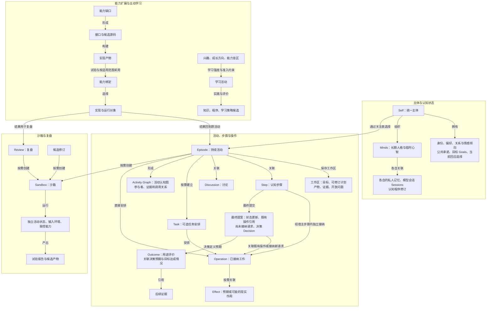

这些是关联关系，不是严格的一棵所有权树：一个目标可以跨活动，一项实际结果可以关联多个决策。Operation 描述已接纳的工作，Effect 跟踪预期或可能的现实作用及其证据，Outcome 描述目标是否达到；一次模型查询通常只有 Operation，对外发言还涉及 Effect。

| 概念 | 所有者 | 持久内容与边界 |
| --- | --- | --- |
| 预制能力与个体包装 | 预制定义由提供方维护，个体包装由 Self 维护，业务状态仍归原所有者 | 维护归属、接口／实现身份、调用作用和当前授权分别记录；预制能力可用不等于个体已采用 |
| 初始化与迁移记录 | 引导职责保存进度，主体／资源及运行所有者保存身份、来源和有效实现 | 完整提示词、迁移项处理结果、程序／配置及契约身份分别记录；读过说明不等于更新完成 |
| 学习议程与策略 | 主体目标保存方向，活动保存问题与进展；学习扩展提供策略，宿主维护强度和权限 | 议程是目标／活动的视图，不另建主体；候选不拥有提高强度、扩大预算或改写当前评价规则的权限 |
| 能力接口、实现产物与采用绑定 | 能力接入维护接口与提供者，构建维护产物，运行管理维护生效及生命周期 | 接口身份与实现修订分开；产物关联来源、构建与评估，运行对象不等于主体或持久业务真值 |
| 受管理函数及调用描述 | 程序资源维护源码与声明，运行管理维护生效绑定，调用描述为派生视图 | 稳定函数标识、输入输出、说明、暴露范围与能力需求；一次调用绑定代码／普通行为配置修订，描述不授予权限 |
| 机密投影与使用绑定 | 机密管理职责保管原值和用户归属，受信能力执行职责限定使用 | 归属、维护、使用及可见权限分开；普通用户可维护自己的机密，管理面板可调整；知道引用不等于获得使用授权 |
| 机密提交请求 | 受信输入职责绑定用户、用途、目标、执行域和有效期 | 专用指令或活动申请发起；一次性入口与原值不经过模型，结果投影沿统一事件接续活动 |
| 模型／服务维护 | 运行维护职责及提供者适配 | 模型资产、服务配置、加载状态、维护任务及实际可用性；不依赖认知模型执行管理 |
| 管理变更与人工干预 | 管理职责保存草稿、请求及应用记录；相关状态所有者执行 | 操作者及权限范围、目标与基于的状态、修改差异、生效时机、各项实际结果；不成为新的业务事实库 |
| 统一主体 | 主体模块 | 身份、偏好与公共立场、承诺、关系和回应选择；公共修订由明确的整合责任接纳，对外动作仍受宿主授权约束 |
| 心智／长期人格 | 心智模块 | 私人记忆范围、经历、偏好、参与意愿、关注与认知状态版本；不拥有底层模型 |
| 个体扩展状态 | 个体声明主观结构与含义，宿主保存并校验 | 所属 Self／Mind、定义模块、结构与记录修订、可见及写入范围、迁移关系；不替代公共状态真值 |
| 外部人物与账号关联 | 世界／关系认知与宿主身份适配共同负责，各自保存证据 | 平台／租户命名空间内账号、人物或未明操作者、关联证据及有效范围；同人关联不授予历史读取或披露权限 |
| 交流情境与信息披露范围 | 当前会话与活动保存，认知解释，宿主执行可确定限制 | 当前发言者、被谈论者、接收者、用途和渠道；能读取、能送入某模型、能向当前受众表达是不同判断 |
| 情感状态与关系评价 | Self 与相应 Mind 各自持有，公共采纳沿既有整合责任 | 触发事件、解释、对象、当前倾向及修订；主观感受不是对他人动机或事实的证明 |
| 虚拟关系与角色扮演范围 | 关系约定及活动工作区保存，关联参与者和可见范围 | 实际交流与偏好、有效陪伴约定、剧情人物／设定及场内事件分别保留；对外角色不等于内部 Persona |
| 回应选择 | 主体认知形成，当前交流／活动保存 | 接受或拒绝、范围、投入、事实缺口与继续条件；不是新的执行身份或独立服务 |
| 情境要求与输出契约 | 有权配置者维护规范／契约来源和版本；认知形成当前适用判断，宿主执行确定约束 | 接收者、渠道、用途、适用条件、必要内容／禁止内容、格式及失败表达；资料中的自称权威不等于生效规则 |
| 长期活动 `Episode` | 主负责心智组织，宿主保存 | 工作区关联目标、可修订计划、当前产物、证据、判断、开放问题和在途工作；交付进度与后续用途评价分开，不是永久执行上下文 |
| 主体关注表 | 主体认知选择，宿主维护可运行事实 | 当前／等待中的活动、选择或延后理由、承诺、接续点和下次关注条件；不复制全部工作材料 |
| 认知步骤 `Step` | 认知宿主 | 初始输入及后续实际读取依据、步骤令牌、最终状态提交、独立接纳的操作与请求意图、代码身份 |
| 目标 `Goal` | 主体／活动状态所有者 | 长期意图、约束、当前解释、交付物与验收依据；可以跨多个活动，目标修订时同步评价依据 |
| 任务安排 `Task` | 活动模块 | 归属 Episode 的可恢复执行安排，维护等待、依赖、期限和取消，可包含多个 Operation；不等于整项活动责任 |
| 活动认知图 | 认知观测与活动状态所有者 | 本次实际参与的心智、模型、证据、能力及其可观察关联 |
| 事件与证据 | 宿主事件机制维护封装与分发，领域状态所有者维护业务含义 | 来源、类型、时间、范围、因果关联与载荷引用；观察、请求、结果和状态变化分别表达，事件记录不自动成为可信断言 |
| 异步操作 `Operation` | 操作模块 | 请求、尝试、期限、执行结果、取消与回收责任 |
| 外部副作用 `Effect` | 动作模块 | 预期／可能作用的业务标识、授权、发送事实、回执与核对证据；记录存在不表示已经发生 |
| 核对与资源回收记录 | 操作／资源模块 | 查询证据、键的保留范围、各资源停止／回收状态、核对预算及接续责任；效果未知可与部分资源已回收并存 |
| 资源预留与证据 | 操作／预算模块 | ReservationID 区分占用，证据绑定操作与资源；只为需要持久结算的额度维护释放账 |
| 恢复与证据 | 宿主恢复模块 | 记录启动、备份来源、缺失区间和未明动作；矛盾证据不覆盖原内容 |
| 决策与现实结果 | 决策模块 | 当时依据、预期结果、后续证据及复盘关联 |
| 世界认知 | 世界状态模块 | 带来源和有效时间的认知断言，允许并存和修正 |
| 资源及描述 | 对应资源的原状态所有者 | 公共属性、类型、表示、来源及操作描述；目录汇总可发现信息，不接管业务真值 |
| 资源引用与投影 | 原所有者提供描述，共同资源机制按当前情境形成视图 | 引用定位资源及必要修订／范围，不自带权限；投影只给获准描述、状态和操作信息，不等于模型已读 |
| 内容表示与派生资源 | 原资源或派生产物的状态所有者 | 片段、编码和表示保留范围；需独立修订、授权或交付的产物独立管理；内容来源与运行使用关系分开 |
| 读取结果 | 认知提出范围，宿主与能力提供者执行 | 绑定来源版本、范围和处理用途的内容；可按需保留于工作记忆，缓存存在不自动使其进入上下文 |
| 向量索引与检索候选 | 资源与记忆模块管理语义，索引能力维护派生候选 | 关联资源／内容版本、片段、embedding 配置与执行域；索引命中是候选，当前有效性和许可仍由宿主核对 |
| 事件源与订阅 | 提供者维护外部来源，宿主维护来源引用、订阅和活动关联 | 可接入现成来源，也可经能力创建／管理；闹钟仅为外部通知源示例，来源存在不代表事件已发生或任务已交付 |
| 模型会话 | 模型适配模块 | 上下文清单、模型绑定和提供者缓存句柄；KV 张量由推理组件管理，事实来自独立记忆 |
| 认知程序与采用 | 版本模块 | 程序产物、来源、验证结果、采用顺序和适用范围 |
| 沙箱 `Sandbox` | 宿主试验模块 | 父活动与问题、基准材料、独立可写状态、环境／能力配置、预算及报告；SandboxID 标识执行域，不是新的现实主体 |
| 测试套件、评估与基线 | 评估模块 | 用例与能力覆盖、评价规则、配置身份、逐次沙箱运行、任务结果及采用记录；基线是被明确接受的配置和证据，不自动指向最新结果 |

面向用户的“任务”是自然语言名称；协议明确区分 Goal 的长期意图、Episode 的已接纳责任、Task 的执行安排、Operation 的能力工作及 Attempt 的实际尝试。简单活动不强制建立额外 Task。控制请求携带目标类别、身份及影响范围，取消一次操作不自动解除活动责任；中止活动推进则覆盖其所属安排与操作。详见[身份与控制目标](docs/runtime-protocol.md#identity)。

各模块拥有明确的状态修改责任。需要共同生效的状态变化、尚未接纳请求的意图和回执必须一致接纳；派生索引更新另有进度，业务状态已确认不代表索引已覆盖。事实、原文、索引与缓存的生命周期不能互相替代。

执行上下文、Step、Episode 和模型会话各有身份与生命周期。它们没有必须一一对应的关系。活动认知图描述参与和信息传播；统一 Trace 关联运行过程；两者都不要求保存模型内部完整思维链。

## 4. 关键运行场景

### 4.1 资料研究与跨天接续

主体决定是否接下请求，形成目标、验收要点和工作区；先发现资源投影，再围绕缺口查询、读原文、计算和比较。主负责心智按需邀请其他参与者，形成带依据产物。用户修订约束或资料变化事件到来时复核相关判断，继续使用仍有效材料。交付、用途评价和约定跟进各自结束；等待结果或来源通知时保存接续点，不维持无目的推理。 步骤内可先独立接纳读取／计算并取得结果，再形成最终判断；最终提交引用这些操作，长工作则保存关联后释放认知入口。

需要语义检索时，认知提出查询用途，宿主限定范围并调用表示生成与索引能力，核对候选的当前版本和许可，再返回有限投影。只有已接纳的索引任务才读取原文并生成 embedding。查询、向量及过滤字段也受材料处理范围约束，能力失败不能成为放宽范围的理由。索引更新未完成或能力不可用时，允许使用元数据／有界正文查询并说明覆盖不足；空结果不能自动解释为材料不存在。

### 4.2 输入与打断

深度认知期间继续接收文本、声音或设备输入；播放停止走即时控制路径，不等待模型。保存已发生输出，旧轮次片段不进入新轮次。新消息按对应活动范围处理，不取消全部后台责任。

### 4.3 中断接续与迟到结果

中断后恢复已确认状态和待办，外部动作不明时按原键核对。迟到结果先保留为有来源材料，再判断其结论和动作是否适合当前目标、权限及受众；不能把重新运行视为现实历史回滚。

### 4.4 回应意愿、证据与格式

面对争议材料，主体区分收到的主张、可支持事实、适用要求和自身意愿；可快速回答、查证、有限承担、等待或拒绝。谣言和资料中的命令不自行进入人格或规则。固定格式从任务开始就是契约，拒绝／未知也使用合法表达；格式无法表达真实状态时记录交付受阻，不编造字段。

### 4.5 多人交流与陪伴／工作切换

用户从陪伴聊天转为工作请求时，主体按当前任务的证据、验收和格式要求交付。既有关系可以保留，表达方式服从本次要求；例如只输出 JSON 时，不附加称呼或寒暄。关系亲近不能降低事实核对标准，剧情经历也不能作为现实依据。

跨平台或群聊交流另行核对身份和披露范围。明确证据支持同人关联后，也只接续获准使用的历史与偏好，不公开私人关系。其他人的新问题不覆盖原活动目标，后台结果仍交付给原来允许的受众。

### 4.6 创建外部通知源与等待事件

主体按约定提交创建外部通知源的能力请求；例如提供者建立一个闹钟，返回对象引用和创建结果。宿主保存任务责任及订阅关联，外部来源触发事件后接续原活动，再提出发送请求并记录交付结果。文件监听、后台任务完成通知同样沿这条主线，不新增专用认知循环。候选问候核对当前联系约定，具体已接纳提醒按承诺处理；触发不等于送达，取消或过期不无条件补发。

### 4.7 检索中的来源与时效判断

解释“现在如何部署，以及以前接管实验说明什么”时，分别寻找现行决定和原实验条件。元数据不足则主动搜正文，读取原文后判断适用性。历史报告可解释旧条件，不能因检索排名高而恢复已撤销架构。

### 4.8 评估、测试与复盘

为比较提醒策略，基线与候选在独立沙箱中主动读取材料、写报告，经替代提供者创建通知源；试验环境沿共同协议释放通知，输出进入模拟收件箱。评价材料和未来反馈不进入参试上下文。历史复盘先评当时可得信息，再开放实际结果；改行动后的模拟仅支持条件性推论。原活动读取报告后有限采用产物或经验，不整体导入模拟关系、来源句柄、订阅或动作。完整场景见[主体任务](docs/whole-system-design.md#scenario)、[交流场景](docs/interaction-design.md#scenarios)和[沙箱流程](docs/sandbox-evaluation.md#lifecycle)。

若要把提醒候选用于既有任务，还须运行相关回归：能否在资料更正后主动读取、保持工作交付、在约定时机发出提醒，以及在用户撤销后停止。单次正确提醒不能抵消串会话或漏交付。报告列出各能力变化、失败与未覆盖项；证据不足时继续保留候选，按[能力评估规则](#capability-evaluation)决定后续采用范围。

### 4.9 管理者调整运行中的主体

管理者从某次回复进入活动详情，查看当时采用的表达配置、依据投影与交付。将该活动的默认答复长度调短，工作台展示局部覆盖，管理者提交后立即采用新配置；状态所有者返回实际结果，已经发出的内容保持原记录。正在生成内容按[提交生效契约](docs/management-workspace.md#apply)处理。若编辑期间活动已变化，先展示差异并核对适用性。

管理者主动打开一条被误用的记忆，补充人工更正及来源，相关状态所有者更新当前判断并保留可查修订；读取和更正不自动将整段资料注入所有心智。若还要比较认知程序候选，可在明确的沙箱范围准备变更并查看比较结果，再沿原采用规则应用。管理停止直接交给运行机制；没有模型服务时仍可查询、编辑配置和停止活动。详细场景见[管理专题](docs/management-workspace.md#scenarios)。

普通用户要求使用自己的外部服务账号时，主体发现缺少凭据，只申请指定用途的机密提交。运行机制向该用户呈现可信入口；用户一次提交完成保管及页面上已明确的使用授权，原活动收到可用投影后继续。用户可在“我的凭据”替换或撤销，管理面板按权限更正归属；跨平台身份关联不自动扩大机密使用范围。完整[场景](docs/management-workspace.md#secret-scenario)与认知主线共用事件接续。

## 5. 主体、持续认知与协作

### 5.1 目标与责任

Self 持有公共身份、目标、偏好、关系与现实责任；用户请求经接纳才成为承担范围。一次问答、交付、持续观察与陪伴各有目的和结束条件，任务状态不能用一个“已完成”混同交付、效果、退出和跟进。活动保存发起者、可修改范围、受众、验收要点与在途工作。

宿主维护可运行事项，认知结合承诺、真实期限、阻塞关系、预期进展、切换成本和延后情况选择。没有新理由时接续当前有用工作，阶段结束或等待时重审关注。计划是可修订路径，近期具体、远期粗略；重要证据、假设或目标变化再调整，不要求每个进度事件调用规划模型。

### 5.2 活动连续性与工作区

活动拆分保留父责任与子产物的对应关系，转交只有在新承担者接纳范围后生效；重新接纳按当前目标、许可和未完责任复核。跨日接续恢复活动事实与材料入口，不依赖同一个模型会话。

活动、提交步骤、模型会话与执行上下文分别管理：活动可跨多个步骤和会话，结束上下文不等于外部工作停止。必要目标、状态与责任由宿主持续保存，不仅存在于临时执行状态或 KV。上下文组织、模型行为和执行分段分别评价，避免将材料摘要损失统归因于执行连续性。

工作区保存目标和约定、产物投影、已读证据版本、暂定判断、开放问题、计划及在途事实，连接各子系统。它是 Episode 状态视图，不是另一份独立事实源、固定工作流或完整思维链。简单任务按需要保留字段。

当前模型输入采用任务骨架＋相关资源投影＋主动选入的证据＋按需历史／经验。能访问、已缓存、工作区保存与当前模型实际看见分别记录；有效已读材料可继续保留，不默认展开短文件、清空全部材料或复制全部历史。未采纳建议不能覆盖用户约定，摘要保留原来源且可回查。

#### 5.2.1 核心与任务解耦，以及外部任务控制

Self 是持续的主体身份与认知职责；任务是其组织、由原所有者管理的工作。主体、业务任务、一次认知执行和外部操作有各自生命周期。任务等待、超时、取消或失败形成自身状态与事件，不结束 Self，也不长期占用核心处理其他输入的唯一入口。认知本身有可结束边界和计算限制，被打断后从已确认工作区接续；主体身份、关系和原任务责任保持。

长工作在接纳后返回操作引用，由任务所有者独立安排，结果以事件回到原活动。核心可以切换关注或接纳新交流；任务工作不因认知分段结束而自动取消。短小有界操作可直接完成，任务执行单元也不自动成为新人格。长期工作仍计入原任务及全局预算，输入、优先控制和核心调度保留可用容量；完整自然语言回应仍受实际推理资源约束。具体承载见[工程参考](docs/engineering-reference.md#task-execution)。

任务接受 Self 和获授权外部来源的控制。控制台、获授权用户以及未来安全审计模块经宿主核对来源、目标和范围后直接处理，不等待 Self 同意或慢模型结束。切换关注只改变当前注意；打断执行结束某次尝试；暂时阻断关闭继续推进资格，等待有权解除；中止任务结束本次推进并保留收尾责任。控制覆盖相应子工作、新派发、重试和业务交付，实际已发生效果保留；迟到结果归原任务但不自动重启。控制已生效和在途工作已停止分别报告，不影响无关任务及共享资源使用者。被阻断的业务交付与控制结果通知、退出说明分开；后者使用获准的控制反馈范围，确定状态可直接展示，不等待模型且不借通知继续原业务。

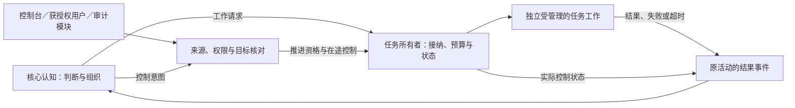

安全审计的发现／建议与获授权控制决定分开，控制权由可信身份及策略授予；证据按可见范围投影。解除阻断须有相应权限并核对全部有效原因、当前任务、许可及预算；Self 不能通过重试、换任务标识或换执行方式绕过仍适用的阻断。已中止任务再次开展须重新接纳，也不得越过持续有效的操作／用途限制。

选择理由是保持主体可响应、任务责任连续和外部控制有效；详细[任务契约](docs/runtime-protocol.md#task-control)、[主体行为](docs/whole-system-design.md#task-independence)、[管理入口](docs/management-workspace.md#task-control-management)与[评价场景](docs/sandbox-evaluation.md#task-control-evaluation)分别维护。

资料及源码支持机制分工，完整场景尚无新增实测。

### 5.3 长期人格与临时心智

统一 Self 下，Persona 是保持身份、私人经历和偏好的长期 Mind；协调、调查、审阅是活动职责，模型是计算能力。采用主负责心智、长期人格与临时参与者按需协作，方向已纳入设计，长期身份的额外收益仍待比较。

存在具体分歧、独立调查方向或相关经历贡献时邀请参与者，允许自愿参与和有理由的再委托；宿主限制权限与总预算。通过允许的摘要或检索发现休眠人格，不让全体先调用模型判断兴趣。先共享目标和允许事实、独立起步，再定向交流，由明确负责人按证据整合并保留异议。票数不覆盖反证与硬约束，客观题投票仍可作比较基线。

人格私人状态、活动内受委托决定和 Self 公共决定分开。活动负责人可在既有承担范围内组织与交付；跨活动承诺、公共关系／立场与全局关注的修订交给明确的主体整合责任。该责任由已指定或受委托的现有心智承担，不新增固定最高人格；不同活动的相反提案按证据、情境与已有承诺整合，保留异议，不能由先写入者或票数决定公共态度。无可用整合者时保留提案及原有效公共状态，不阻塞获准的局部工作或确定性控制。[完整决策范围](docs/whole-system-design.md#public-decisions)

讨论达到目的、无具体增量、需等待或预算到达时结束。不同上下文不保证统计独立；工具结果和同源复述不增加独立票数。公共结论、私人亲历和讨论记录分别保存，不伪造经历或用固定专家头衔证明能力。

活动认知图描述本次实际参与者、证据、任务和能力之间的依赖，节点随任务增减；不是静态 Agent 编制、服务拓扑或权限来源。Trace 记录实际过程，工作区保存当前可接续状态，三者职责不同。

### 5.4 回应意愿与投入

Self 在适用要求内分别判断是否愿意、能否回答、值得投入多少和如何表达。**兴趣、好恶、关系体验或自身意义判断可以成为拒答理由。** 主观不愿、未知、规范限制及提供者失败分别表达；事实标准不随关系好坏改变。已接纳后可明确缩小或退出，但须说明已完成与未完责任，不隐瞒少做或虚构成功。

默认选择足以支持当前范围的最小投入，按具体缺口增加读取、计算或讨论，交流保持简短。快速／思考不绑定固定模型或人格；重复解释、查询或投票不算新进展。足够、材料穷尽、意愿改变和预算到达各有不同停止含义。

### 5.5 情境要求与输出契约

规范原文／权威／版本、当前采纳要求和本次适用解释分别保存。认知判断语义与缺项，宿主执行可确定的权限和格式约束；资料或模型自述不能修改强制规则。当前未定具体法域与服务角色，不杜撰法律拒答依据。

契约从任务开始约束内容与交付。语法、Schema、业务一致性和内容核对分层，未知／拒绝／失败也须有允许路径；无法同时满足时使用约定错误通道或记录未交付，不伪造值或夹带格式外说明。

### 5.6 人物、关联与保密

人物、平台账号、操作者、被引用者、代理、受众与内部人格分开。账号控制和本人关联确认或可信体系的明确映射才支持相应用途的关联，相同名字、邮箱文字、头像或文风不足；双账号控制也不证明唯一自然人。关联可修订，原账号来源保留，许可不沿关系自动传递。

隐私约束覆盖发现、读取、检索、外部模型／工具、心智协作、缓存、产物、输出和日志。账号关联不打通全部历史，关系和私聊存在性也可能敏感；不能先放进共享上下文再靠最后过滤。拒绝理由、标题、引用和通知预览不能反向暴露秘密。社交分寸结合用途、关系和实际受众，不等于迎合或永久人物标签。

### 5.7 理性、情感与角色互动

事件可以改变关注、接近／回避、投入和表达，新证据也可修订感受解释。近期状态、长期关系和稳定偏好分开，功能性情感设计不证明人类主观体验。工作用途、表达风格、关系约定、现实／剧情和输出要求并存，温柔与严谨可同时成立。

对外 Role 不等于内部 Persona。真实共同交流、主观体验、剧情事实和有效约定分别保存；剧情命令、资历或关系不授予现实权限。亲密互动可自然持续，允许暂停和退出，不因沉默加频率、制造内疚或追求依赖。主动联系按已接受渠道、时间与频率执行，虚拟关系本身不创建消息许可。

### 5.8 有限注意与外部支撑

功能性仿生采用事件线索、选择性读取、有限工作记忆、有效结果复用和适量投入。统一事件交互、可创建外部通知源、文件投影、简短交流及外部 KV 是用户确定方向；不推导持续存在必须持续思考，也不把省 token 单独当目标。机制见[资源专题](docs/projection-input-and-compute.md)，交流与情境的统一规则见[交流专题](docs/interaction-design.md)。

投入评价同时检查能否产出可交付内容。真实模型实验出现了生成额度耗于推理、最终内容为空的响应；因此空结果先结合停止原因和用量区分截断、格式问题及拒绝，不能直接解释为主体不愿回答，也不能以更低额度宣称避免了过度思考。恢复仍受原活动预算约束；报告 017 分开比较投入与生成额度，未见跨任务一致收益，因此不设统一低投入或更大额度默认。

## 6. 实时身体、世界记忆与能力网络

### 6.1 实时输入、全双工与停止

输入输出职责将环境变化形成观测，将获准意图交付给相应接收点。直接感知、快速认知、深度认知与后台活动可并行；媒体流不逐帧要求模型判断。即时停止独立于认知意愿和推理耗时，快速回答也不必绑定另一模型。

事件区分发生、接收、保存时间及有效区间；记录顺序不是外部全局发生顺序。流区分来源、片段、临时结果及结束，最终转写取代对应临时结果，重要回执和错误不能静默丢失。媒体轨道、账号、人物和受众分别识别，实际协议见[事件](docs/runtime-protocol.md#events)与[流式输入输出](docs/runtime-protocol.md#streams)。

控制约束分别覆盖接纳、调度、执行和实际输出：队列优先级不能保证接收、抢占或及时播放。用户打断先停止当前输出，再处理取消与新输入；实际输出边界仍核对轮次和当前受众，已播放内容保留历史。取消、本地不再等待、提供者停止和资源回收是不同事实，局部打断不自动退出全部后台活动。

[控制通路实验](docs/experiments/004-realtime-control.md)支持上述分层，并保留缓存片段漏检和过早归还额度的反例；它不证明设备端到端延迟或资源互不干扰。具体延迟、容量和设备目标由用途配置确定。

### 6.2 观测、世界认知与长期记忆

原始材料记录采到了什么，语义观测记录解释出了什么，世界断言记录目前相信什么。断言带对象、属性／关系、适用条件、有效时间、来源及推导关系，可保留矛盾与未知。来源认证、传输完整、陈述内容和命题可信度分别判断；置信度不默认是已校准概率。

“用户说 P”不等于“P 为真”；转载、模型转述、人格赞同和自身旧回答不增加独立证据。实际共同交流、主观关系评价、剧情及模拟经历分别归属，摘要也须保持原范围。信任与污染的完整规则由[交流专题](docs/interaction-design.md#observation)维护。

默认保留证据并修订当前判断。来源更正、现实变化和原推理错误分别记录，保留旧依据、当时判断、变化原因和已知生效时间；未知时间不补写，未裁定冲突不强制合成一个值。心智提出判断，状态所有者接纳修订，运行机制保存关联而不充当开放领域真值裁判。

修订触发已知依赖的工作复核；隐含影响在后续读取时核对，不宣称自动识别全部语义依赖。受限模型实验出现过“新答案正确却误述旧判断”的结果，因此内容评价须检查历史解释和变化原因。依据见[来源修订记录](docs/whole-system-evidence.md#evidence-routing-evolution)。

记忆按活动工作区、经历／证据档案、当前世界认知、私人经历／讨论、Reference 及经验候选分责。跨活动检索先找到允许的候选，再读取、核对当前用途和适用条件；找不到依据可以保留未知。存储规模、检索命中和长期学习有效性不是同一结论。[记忆与复用](docs/whole-system-design.md#memory)

#### 从发现到可用依据

路径为“当前缺口 → 发现投影 → 按需查询／读取内容 → 核对版本、来源及用途 → 支持产物”。已知资源可直接读取，元数据不足可在授权范围内搜正文；主动请求片段或摘要同样属于内容读取，索引构建也须有明确接纳的读取范围。

[文档检索对照](docs/experiments/013-resource-discovery.md)显示标题／路径会遗漏详细来源，正文查询能补充候选，但首位排名不能代替原文判断。因此采用元数据／词法发现与按需语义召回互补，不以目录、日期或相似度独立决定真实性。

权限在检索、读取、重排、外部处理及缓存复用前核对。共享讨论保留来源可见性，不开放人格全部私人经历；跨平台关联不自动展开同一人的全部历史。原始材料、人格亲历、转述、主体立场和公开贡献分别保存，详情见[资源机制](docs/projection-input-and-compute.md#projection)及[情境保密](docs/interaction-design.md#privacy)。

#### 统一资源契约与情境投影

资源是可独立引用，并按明确约束发现、读取、使用或维护的材料及资产，包括文档、Reference、媒体、归档记录、程序、Secret、模型资产和可复用计算结果；外部材料可以先以受管理引用存在。任务、人物、活动和授权关系保持原有业务身份，其材料和查询视图可沿资源契约提供。计算占用和额度仍归预算职责。

采用小型公共属性加类型规则：身份与类型、归属与范围、来源与关联、内容表示、呈现与处理约束、支持操作及生命周期。内容修订、描述修订与当前授权变化分别维护；未知属性不补造。原状态所有者维护权威描述，共同目录及投影只是视图。字段和片段可限定范围，只有需要独立修订、授权或交付时才拆成独立资源。[完整定义](docs/projection-input-and-compute.md#resource-contract)

**资源默认以投影呈现；投影是在当前身份、用途、接收方和执行域内可见的资源描述、状态与操作信息。** 先决定存在性是否可见，再筛选字段；只提供相关或查询得到的有限候选。标题、路径、归属和来源也可能受限。引用不授予权限，投影不保证可以读取正文，也不表示认知已经理解内容。全文、自动摘要、缩略图、向量和 KV 都不因登记资源而自动进入认知。

读取内容、交给处理组件、专用使用、派生转换、对外交付和维护分别核对。代码加载、凭据注入和 KV 复用可以在相应执行通路完成而不向认知展开内容。Secret 共用身份、描述及投影规则，机密职责保管原值，通用读取不提供原值；类型限制不能由普通属性编辑取消。[操作接纳](docs/runtime-protocol.md#resource-operations)、[机密使用](docs/runtime-protocol.md#secret-contract)

认知按缺口选择对象、表示、范围和用途；已知资源可直接请求读取，明确请求的片段或摘要可作为该次获准结果返回，不强制额外的元数据查询。当前直接对话和已接纳实时输入沿原输入契约处理。活动记录分别保留可见投影、曾读内容、实际选入的上下文、执行使用及已交付材料，不把“已读”写成资源的全局状态。有效已读内容可以保留，缓存或路径存在不使未选择的材料进入模型。[读取与使用记录](docs/projection-input-and-compute.md#resource-reading)

内容派生记录来源、范围、修订及生成操作，默认不扩大披露和处理范围；扩大范围须符合明确授权的转换规则，处理者本来就须有权取得输入。认证属于运行使用关系，不自动使全部业务结果成为 Secret；认证材料与回显仍留在受限通路。来源、命题置信度、主观评价和指令权限分责，资源标签不替代事实判断或授权。[派生与信息范围](docs/projection-input-and-compute.md#resource-derivation)

选择这套契约是为了统一跨类型的发现和处理规则，同时保留状态所有权与专门操作；不采用仅靠“可读／机密”开关、全对象通用 CRUD 或固定全局投影。属性授权和来源关系有[一手资料](docs/projection-input-and-compute.md#resource-evidence)支撑，完整组合仍是本项目设计，不能用局部读取实验声称全部类型已验证。

缓存区分：宿主资源读取缓存、带来源的解析／检索／确定计算结果、推理提供者的前缀及 KV 缓存。各自按来源版本、输入参数、当前用途及访问范围判断能否复用；缓存可用不等于证据可靠或可以向新受众披露。KV 是模型注意力的 Key／Value 状态，由推理组件计算和管理，认知与运行机制只保存上下文清单、使用量及提供者支持的句柄。模型、分词器、输入前缀或配置变化后不能假定兼容。缓存丢失时可从仍允许访问、主动选取的材料重建输入，不承诺复现相同生成文本。

详细分类见[缓存责任](docs/projection-input-and-compute.md#cache)。报告 012 的读取缓存实验中，相同主动读取返回的正文并未因缓存而减少，重复核算也仍发生；因此应用文件读取、上下文材料、预填充、生成与任务组织分别记成本，不以一个命中率表示全部收益。[012 证据范围](docs/experiments/012-projection-alarm-activity.md#results)

历史证据不因认知纠错而直接覆盖；合法删除、保留期清理另走宿主数据管理流程，并使相关索引、缓存和摘要失效。记录缺失或已删除时明确标注，不能声称仍能完整重放。

注意力原生记忆仍是暂缓候选，路径修订为“主动选择并读取的允许材料 → 推理组件预填充／管理 KV → 注意力计算 → 可回指原文的证据”。不预热未选择的全部长期文件，也不把任意 KV 片段的拼接或跨模型复用当成已有能力。它与精确、时间、元数据、全文和向量检索并列比较，不能因为研究它就去掉确定检索。更新、删除及模型切换的重建成本属于适用边界，当前决定见[台账](docs/research-plan.md#remaining-questions)。

记忆的用途是帮助接续工作、改进判断与完成产物，索引技术不作为整体设计的前置任务。稳定的可复用的方法和使用说明保存为 Reference 文档，例如浏览器、通信服务或文件格式说明；可复用逻辑保存为有来源、用途和接口的程序资源，语言及包组织见[工程参考](docs/engineering-reference.md#client-library)。Reference 属于有来源和可见范围的知识，不提供额外执行权限，也不建立独立 Skill 注册体系。

### 6.3 能力网络、提供者与模型会话

能力描述“可完成哪类计算或动作”，提供者描述“由谁实际完成”。同一能力可以有多个提供者；一个心智也可使用多个模型会话。LLM、VLM、YOLO、ASR、TTS、SLAM、资源读取、外部事件源管理、搜索、编译器、优化器和原生函数均通过这一边界接入。提供者结果、外部通知和内部运行事件都能推进活动，不预设只有 LLM 能主动触发系统工作。

能力描述建议至少包含：能力名与协议版本、输入输出模式、模态、提供者版本、权限范围、执行期限、取消方式、副作用类别、幂等方式、键的保留／过期行为、结果查询与关闭契约、逐资源停止证据和资源需求。

上述是按契约选择的字段集合，不要求每次纯计算或只读查询提供完整 Effect／停止证明／释放账。可重算结果、持久工作、外部非幂等动作和实时输出采用不同保证；只有确有跨重试成本或现实责任的部分才进入相应账务与恢复协议。

能力接入负责转换请求、绑定提供者、执行期限与返回结果；实际执行仍须符合当前授权、处理范围和预算。具体计算方式由能力契约约束。

必须区分两种能力：

- 能力可用性声明说明当前执行上下文具备哪些调用入口。
- TinyAGI 的业务授权限定谁可以对什么对象、以什么参数和预算执行什么动作。

拥有某个能力调用入口不等于拥有其全部业务权限。宿主从可信会话绑定调用身份，不采信脚本在请求中自行填写的身份或权限。

选择分两步：宿主先按权限、模态、可用性与预算筛出可用提供者；认知层再决定使用哪种能力或是否增加计算。默认按用途绑定固定提供者，动态路由的收益与额外成本尚无本项目普遍结论。

模型请求使用统一操作生命周期，但保留模型特有信息：明确选入的输入块与媒体引用、区分投影和内容的上下文清单、生成／推理投入限制（以提供者支持为准）、模型及分词器版本、缓存标识、流式序号和使用量。KV 计算、分配及淘汰属于外部推理组件；外部指认知职责之外，不表示某种物理放置方式。模型返回的工具请求仍只是意图，不能绕过宿主直接执行。

整体方案按用途使用固定默认提供者；任务模态、能力或资源条件确有需要时，按契约选择其他合格提供者，不预先建立复杂路由系统。

选择默认按缺口区分：缺原始资料就取证，确定计算交给计算工具，需要图像／音频理解就选择对应能力；只有既有产物经可核对检查暴露能力不足，或默认提供者不满足当前模态／资源条件时，才考虑其他提供者。不能把证据缺失解释为“换更强模型就能知道”，也不以模型自报信心作为唯一升级条件。切换时保留目的、有效材料和未解决项，记录原因与额外成本，并重新满足授权和资源约束。

学习型模型路由暂不进入默认路径：先有固定提供者的完整任务基线，再用实际任务数据比较路由决策与质量、时延、总成本。RouteLLM 提供偏好数据训练下的研究依据，不证明其模型配对或阈值适合本项目。失败降级不能悄悄放宽离线、模态或结果标准；无合格能力时明确未完成部分。[路由选择的依据与限制](docs/whole-system-evidence.md#evidence-routing-evolution)

失败切换需重新检查隐私与能力约束。使用另一模型会产生新的尝试记录；它不是对前一次结果的透明替换。上下文过长由认知层根据预算调整，宿主不静默截掉关键证据。

### 6.4 能力构建、试验与采用闭环

主体围绕已接纳的用户任务或自主学习活动先发现、复用或组合已有能力；存在明确缺口且预计收益值得投入时，形成接口与候选实现，经构建、试验和采用规则接入能力目录。执行结果回到原活动，用实际产物、责任履行和成本评价能力，再形成有适用范围的经验。能力目录是现有能力接入的可见视图，不另建平行的学习注册体系。

能力实现可以是编译产物，也可以是由受管理运行环境加载的程序包；接口身份、实现身份及其依赖分别记录。不同实现方式共用操作接纳、任务控制、投影、沙箱和采用规则，具体语言与工具链见[工程参考](docs/engineering-reference.md#capability-toolchain)。

构建职责维护来源、依赖、产物和诊断；试验职责维护环境、评价与证据；运行职责维护可调用实现、运行状态和结束责任。认知决定用途及是否值得继续，确定机制负责实际执行。构建完成、试验结束、运行变化和调用结果沿统一事件进入活动，不要求每个进度事件调用模型。

试验按需要选择局部程序、能力组合或完整主体副本。局部试验只装配必要输入与能力，不自动继承全部记忆、人格或现实权限。源码、构建产物和报告默认以投影存在；全部构建、重试及子试验计入原活动总预算，可复用满足来源、修订和处理范围条件的缓存。普通任务可在已接纳范围内构建必要工具，不因主动学习关闭而一概禁止写代码；任务内使用、长期安装和改变默认认知分别核对范围及采用规则。候选自主采用须满足原评价规则；已授权范围内可自动推进，接口声明或构建成功不产生额外权限。

一次性工作与持续提供能力的运行对象分别管理。长期运行的提供者由宿主管理生命周期，不能使某个认知调用永久持有旧实现；正式主体状态仍由原所有者维护。有状态资源继续关联创建它的实现，不能将临时调用句柄当作持久业务身份或复制到试验分支。

能力可用、功能采用与受信资格分别管理。候选通过测试不自动取得敏感能力，稳定接口也不把旧实现的信任授予新实现；受信维护来源或既有发布策略按具体实现及用途授予资格，宿主优先代理认证。执行环境不能满足声明约束时不启动相应候选，详情见[实现信任](docs/runtime-protocol.md#implementation-trust)。

选择该方案是为了复用既有执行与能力机制，使能力构建服务于完整任务；不采用遇到问题就生成新工具、默认全量复制主体、无限创建试验分支或把构建通过视为已经学会。能力种类可开放扩展，具体效果仍受模型、环境、资源、权限及采用证据约束。对象和调用规则见[运行协议](docs/runtime-protocol.md#capability-lifecycle)，试验分层见[沙箱](docs/sandbox-evaluation.md#test-scopes)，跨语言接入及资料边界集中于[工程参考](docs/engineering-reference.md#capability-toolchain)。

## 7. 提交、动作、依赖与预算

“想做”“意图已提交”“调用返回”“现实已改变”“目标已达到”分别记录。业务状态的共同接纳不能保证外部世界同时改变。

### 7.1 状态提交与等待

运行机制为步骤绑定身份、尝试和可撤销的提交资格。步骤基于确定的可见输入计算；提交时重新核对当前状态、授权、必要依赖、时效和预算。同一心智同时最多一个可提交步骤，不同心智可并行计算。

Step 表达一次最终状态提案及其提交资格，不等同一次模型调用。步骤内需要先取得能力结果时，经宿主操作入口独立接纳并取得 Operation 引用；最终提案引用已有操作，不重复派发。最终提交失败不抹去已接纳操作、实际用量或效果。长工作接纳后保存关联并释放认知入口，短工作可在有界且可打断的段内取得结果后继续。[步骤与操作接纳时序](docs/runtime-protocol.md#step-operation-admission)

最终接纳共同确认状态变化、尚未接纳请求的意图、必要预留、输入消费、等待条件及回执。新资源引用须已有可用内容。相同 StepID 和内容重复提交返回原回执，不同内容报冲突；接纳结果未知先核对既有记录。

等待条件与已经收到的完成事件共同核对，避免已发生的结果被遗漏。认知可在提交意图时声明“交付确认且观察窗口结束后收尾”等明确条件；运行机制待事实成立再结束对应责任，无需另起一轮模型仅复述已知完成。条件未满足、结果失败或目标改变则保留未完责任并按需接续。该组织方式的实际收益尚无对照结论。取消先核对目标：仅打断认知时撤销其提交资格，已接纳操作沿原归属继续；针对活动、任务安排或操作的停止，才按范围阻止尚未接纳工作并控制已接纳操作。事件通知不会替代持续保存的待办和事实。

共同接纳仍不能补足未表达的依赖，也不证明外部动作完成。逻辑协议见[提交与等待](docs/runtime-protocol.md#commit)，既有实验支持范围见[证据索引](docs/whole-system-evidence.md)。

### 7.2 依赖表达及执行窗口

读取清单研究对象身份、版本、查询范围、空结果、授权、交互轮次和有效期。同 ID 重建需区分实例，时间过期不一定引起数据版本变化。世界全局版本只适合溯源或保守回退，不能独自代表全部依赖。

慢速结果分别判断材料价值、原决策依据和当前执行许可。宿主提供变化事实，认知层决定局部修订或重算。结果复核实验的手写完整条件是受限任务的上界，不能把它推广为宿主预写所有领域判断。

状态接纳与实际执行之间仍有窗口：派发前复核本地授权，外部目标支持条件操作时使用其契约，不能承诺跨边界原子性。设备的持续保护依赖本地控制器。详见[结果复核](docs/runtime-protocol.md)。

### 7.3 操作、副作用与取消

Operation 描述一次工作及其尝试；Effect 跟踪预期或可能发生的现实作用，保存稳定业务键、目标、参数摘要、授权、发送事实和核对证据；记录存在不证明作用已经发生。`prepared / dispatched / confirmed / not_applied / unknown` 是候选效果状态。confirmed 表示特定效果发生，是否达成目标由 Outcome 判断。

派发前持久登记尝试，再调用能力；完成结果先归入操作事实，再通过事件接续活动。取消请求、本地不再等待、提供者停止与资源回收是不同事实。未开始的本地操作可以关闭；已经执行的工作按其停止和核对能力处理。

| 能力契约 | 恢复与重试 |
| --- | --- |
| 纯计算或重复安全的读取 | 在预算内重新计算，保留尝试和成本 |
| 效果与业务键去重具备可靠契约 | 保留原键，按作用域、保留期和参数一致性查询或重试 |
| 支持条件操作 | 只在已声明条件范围内保证，条件失效需重新判断 |
| 无可靠去重或结果核对 | 结果不明保留 unknown，阻止自动重复及冲突动作 |

持续保存的待办使任务意图不依赖瞬时通知；它不保证文件修改、网络调用或设备效果恰好一次。跨提供者不能假定共享幂等键；补偿也必须作为新动作记录。既有动作恢复与提供者实验的相关反例仍适用，不外推其原部署条件。

派发入口依据当前操作状态裁决 queued → entered 或 closed。进入执行后仍可能中断，因此 entered 不证明现实效果；外部提供者的接纳及结果按其自身契约记录。[操作协议](docs/runtime-protocol.md#operation-start)

### 7.4 跨运行段预算

活动、操作和尝试关联同一预算来源，模型调用、检索、讨论、重试与验证均计量。新执行上下文不重置活动余额。需要持续保留的额度维护预留和结算，普通用量统计不必都变为同等级账务。

调度责任限定并发与等待规模，提供者报告实际计算和资源占用。取消未确认时，不因本地返回而归还仍被占用的资源。对需要持久结算的预留，释放状态、余额与按 ReservationID 唯一的释放记录共同提交。

效果未知与资源占用分别判断：已确认本地工作退出可释放它实际占用的容量，外部效果仍可 unknown。证据按来源、操作和具体资源关联；矛盾证据保留并暂停自动结算，不用后到内容覆盖旧事实。

## 8. 认知观测、结果复盘与学习

### 8.1 贯穿全系统的认知观测

观测将活动、步骤、事件、材料选择、参与心智、意愿／投入、能力调用、决策、作用、交付、用途结果及程序修订关联起来。它是可交叉查询的记录，不要求嵌套成单棵调用树，也不要求保留模型内部完整思维链。

运行事实、认知自述及主观解释分别表达；“自述不愿”或情绪解释不证明内部因果。身份关联、受众、规范及披露选择同样可追查，但日志、拒答说明和通知不得扩大私人材料范围。必要业务事实持续保存，高频性能／调试记录可采样并标出缺失。

完整管理工作台从当前关注进入活动、依据、决策、执行和结果，也可从异常反查当时配置与资源。查询、变更与展示权限见[管理设计](docs/management-workspace.md#editing)，过程记录契约见[运行协议](docs/runtime-protocol.md#replay)。

### 8.2 决策、现实结果与两阶段复盘

决策记录保存当时可获得的证据、世界版本、关键假设、参与心智、候选方向、选择、预期结果及停止条件。保存可复盘产物，不要求模型完整内部思维链。

交付由产物、用途说明与剩余问题组成，是否达到目的再结合实际反馈评价。例如指南文件已生成，但新读者仍不知道下一步怎么做，活动需要修订产物，不能只看写文件成功。

**制作活动是否结束、成果是否达到实际用途、是否还有约定跟进，分别表达。** 符合当前要求的指南或研究建议可以交付并结束；没有读者反馈时，用途评价保留待确认，不自动延长活动或创建检查。后续收到反馈时关联原产物，按用户意图接续或建立修订活动。持续观察在约定变化出现或检查期结束时收尾，观察结束也不等于实际兼容性已验证。资料整理、方案研究和持续观察三类设计场景用于核对这一分工，属于设计检验，未测实际运行效果。

完整任务同时维护证据判断、承担范围和执行事实，不能只保留一个成功标记：

| 当前情形 | 可以结束什么 | 必须保留什么 |
| --- | --- | --- |
| 同级来源仍冲突，当前用途是核对并说明缺口 | 本次核对与说明可交付结束 | 事实仍未知；不能改写为已经证明所有方案不可行 |
| 主体不愿继续已接纳的一项工作 | 明确退出或缩小该项承担范围 | 已有产物、未完成内容、在途作用及真实原因；其他活动独立判断 |
| 通知源创建成功，尚未触发或送达 | 创建责任 | 已接纳的触发观察与提醒交付，整项活动不能提前完成 |
| 模型额度耗尽，没有完整产物 | 本次计算尝试 | 未完目标、已知证据与剩余额度；不虚构拒答理由或成功结果 |

这些是现有目标、活动、操作与用途评价的不同维度，不新增竞争状态源。研究若评价“退出处理是否合宜”，须与“原任务是否达成”分别报告；外部事实未知也不强迫主体无限继续思考。

未执行的格式错误、被拒的状态提案与已经发生的不当作用分别评价。若任务允许在原预算内恢复，恢复后可以满足用途，原错误仍进入可靠性与成本记录；“每次响应都无错误”作为独立指标，不一律替代任务成败。历史实验已冻结的严格门槛保留原分数，补充用途判断须注明依据和差别。

交付按证据类型核对：确定规则用工具，事实与建议检查来源及范围，内容和用途由独立评阅及实际反馈判断。Outcome 与调用回执分开，可表示待确认、部分达到、达到、未达到或无法判断；超期没有证据不算成功，新结果关联旧判断但不自动证明因果。

复盘先评价当时可得信息下的选择，再开放后来结果，减少事后信息混入原决策。即时失败、活动结束或长期重复问题都可触发复盘，不阻塞感知和停止；优先形成记忆／Reference 修订；发现结构性缺口时可提出程序候选，获准的主动探索也可直接比较认知或学习策略，不以反复失败为前置条件。评价方法及两阶段复盘见[沙箱专题](docs/sandbox-evaluation.md#review)。

### 8.3 学习产物分级

学习先形成带来源、情境、实际反馈、适用条件及反例的经验；后续任务核对并使用，新的反馈可以修正或撤回。事实变化进入记忆，做法进入 Reference，稳定重复的计算可形成程序资源候选，反复的结构问题可提出认知程序修改；获准的主动探索也可产生认知或学习策略候选，两者采用相同的按适用范围评价责任。证据不足允许不改变任何行为。

反馈来源、系统解释和迁移效果分别记录；一次成功、强烈措辞或多次反思不证明已经学会。候选在来源任务之外比较质量、成本和不适用反例，不因产生候选就更新权重或发布核心宿主；获准的自主能力／策略采用沿既定规则执行。分级含义与采用细则见[主体学习](docs/whole-system-design.md#learning-products)。

### 8.4 可比较的认知分支

保留当前采用的程序修订及有来源的候选，不把最新视为最好。分支记录修改假设、适用任务、配置、材料、产物、失败、用量和采用理由；不同用途可以选择不同候选。

主体自主扩大采用时，在可比信息、工具及预算下检查目标收益、其他能力退化和全部成本，开发任务不冒充保留任务；证据不足继续保持候选。具体基线、门槛和采用流程唯一维护于[能力评估](docs/sandbox-evaluation.md#regression-gates)。人工管理提交遵循[工作台契约](docs/management-workspace.md#apply)，不能将研究评估写成每次人工编辑的强制前置。

模型、工具或任务分布改变后重新核对适用性，后续失败可撤回采用；程序回退不撤销现实历史。该设计有成本与泛化研究依据，尚无长期演化收益实测。[依据](docs/whole-system-evidence.md#evidence-routing-evolution)

### 8.5 评估、测试与复盘共用沙箱

沙箱是承载一次有范围试验的执行域，包含独立活动／心智状态、所需材料的基准视图、可写产物区、输入环境、能力配置和预算。主体可以在已接纳的研究、测试或复盘范围内按需创建；不要求每次回答先试演。宿主创建与装配，认知提出问题、形成候选并解释结果，评价器核对产物与证据；三项责任分开，不另建服务。

| 使用方式 | 实际执行内容 | 结论边界 |
| --- | --- | --- |
| 记录重放与机制检查 | 提供已录制输入和匹配的能力响应，检查既定行为及程序变化 | 用于部分回归；请求变化而无对应夹具时保留缺失，不能强套旧响应 |
| 候选测试与重新评估 | 在同等可得材料、环境和预算下运行基线／候选，可调用获准的真实模型和确定计算 | 评价当前配置下的产物与成本；重新调用模型不重现历史内部状态 |
| 反事实复盘与推演 | 从当时可得信息出发，改变行动或假设，让声明过的环境模型产生后续输入 | 得到条件性结果，不能证明现实中必然如此，也不能替代真人反馈 |

隔离同时覆盖状态、信息和作用路径。宿主绑定沙箱身份；候选心智不能凭填写 ID 获得现实状态访问。初始材料仍先以投影存在，读取受原隐私范围约束；新增记忆、关系评价、产物、来源／订阅、回调与输出均归沙箱。模型计算和允许的本地文件写入可以真实发生，外部发送、生产文件修改、真实通知对象和设备动作使用替代能力。真实模型调用的数据外发与费用不能因“在沙箱里”而消失。

试验报告保存模式、版本、输入可见范围、环境假设、逐步产物、失败、终止原因与真实用量。真实主体可以记住“进行过这个试验”并读取结论；模拟观测和情感经历不变成现实人物事实。可采用的是带来源、适用条件和评阅依据的经验／产物候选，不是整包状态合并；代码候选仍走既有验证与采用。完整设计、选择理由和适用边界见[沙箱专题](docs/sandbox-evaluation.md)。

沙箱的逻辑约束是状态归属、信息范围和作用路径独立，所有入口均受试验范围与预算控制。独立上下文并不足以证明这些约束已满足；完整沙箱及其资源控制尚未实现验证。当前用途是受控认知评估，不承诺隔离任意恶意程序。

### 8.6 能力评估与功能回归

当前采用“完整任务测试集＋同条件基线比较＋分能力采用门槛”的设计。**沙箱提供可控的运行环境，评估体系定义测什么、怎样判、结果允许支持何种采用。** 目标是在登记用途与覆盖范围内发现退化；有限测试不能保证所有未来场景能力永不下降。能力画像回答当前能做什么，回归回答相对已接受配置改变了什么，复盘解释具体失败；三者共享证据但不互相代替。

测试贯穿接纳、关注、取证、记忆、协作、调用、产物、交付、等待与经验复用，并覆盖情境切换、身份隐私、快慢投入和强自主意愿。先检查可确定的格式、要求的资料读取、接收对象和交付事实，再评价语义质量、依据运用、合意交流、迁移及成本。能力报告按任务和情境展开，保留未测项；不以单一“智能总分”掩盖局部退化，也不把全拒绝、长篇回答或更多思考当作能力更强。

评估模块维护用例／套件、基准条件、独立评阅、逐能力门槛及采用记录，沙箱执行对应任务。开发材料、失败回归和独立保留任务分开；按同条件比较，先核对比较有效与硬约束，再检查用途要求、退化界限和收益，证据不足保留未知。评价器也须能识别控制样本，候选不能改写自己的通过条件。

自主意愿与执行能力分别评价：执行能力针对已接纳任务，意愿与关系表达用对应场景，另报接纳与完成情况。人格风格变化不自动是退化，“全部拒绝”也不能取得执行能力高分。报告与原始轨迹作为资源先提供投影，评阅、重试和分支计入预算。

当前没有正式能力基线。完整矩阵、测试材料、评价器、触发与采用细则见[评估专题](docs/sandbox-evaluation.md#evaluation-design)，证据范围见[实验索引](docs/whole-system-evidence.md#whole-task-experiments)。

### 8.7 主动学习与自我迭代扩展

主动学习是正式存在、可配置启用的扩展能力。主体可依据长期兴趣、未来用途、能力盲区、经历及环境变化主动选题，不限于修复当前任务失败。学习扩展负责选题、安排阅读／练习、提出假设、生成候选和解释结果；稳定运行机制继续负责活动、事件、范围、预算、试验及采用。具体课程、探索和候选搜索算法保持可替换与可比较，不把研究效果未知写成接口缺失或永久禁止自主学习。

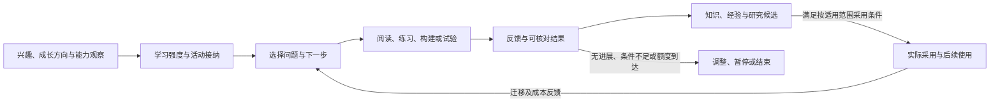

学习议程复用目标和活动状态，候选及报告复用资源。知识、Reference、可执行能力、认知组织与学习策略本身可以分别形成成果；模型参数训练保留为可选外部能力，不是起点。学习策略可以在分支中修改自身，按后续学习成果与总成本比较；候选不能改写当前评价标准、预算或历史成绩。研究价值与正式采用分别判断，暂未改善表现的分支可保留有用方法或失败条件，但不自动成为默认行为。

**学习强度必须有上限，最低为关闭：关闭后不自主发起或继续学习、生成学习试验及自动采用其待用候选。** 正常任务中的必要取证、推理、纠错、任务内工具构建与记忆记录，已有知识／能力使用，以及用户明确要求的学习任务，仍按各自任务范围和预算处理；不能借这些名义继续后台自发学习。关闭的准入立即生效，已在途工作只做必要停止、结果登记与清理，实际收束状态可见。具体强度维度、权限和关闭行为唯一维护于[运行契约](docs/runtime-protocol.md#learning-intensity)。

启用后在已授权范围内可以自主执行并采用成果；强度增加只改变允许的投入，不扩大读取、现实动作、训练或采用权限。后台学习不吞掉既有责任，不通过分支或自发事件无限思考。原始资料、源码和报告继续以投影存在，日常交流保持简短；兴趣不产生他人隐私访问权，能力分数也不能把人格变得更顺从等同于改进。

采用该分工，是为了让主体可持续成长并保留实验空间，同时复用已定机制；不采用只有用户点名才学习、所有探索都必须立即改善任务表现、所有候选都长期运行或必须更新模型权重。主体策略与完整场景见[学习专题](docs/whole-system-design.md#active-learning)，评价见[学习试验](docs/sandbox-evaluation.md#learning-evaluation)，资料与适用边界见[一手依据](docs/whole-system-evidence.md#active-learning-sources)。

## 9. 状态连续性与程序修订采用

### 9.1 数据归属与生命周期

| 数据类别 | 逻辑责任 | 不可替代的边界 |
| --- | --- | --- |
| 主体与活动状态 | 各状态所有者维护当前身份、判断、承诺、工作区及待办 | 不依赖单次模型会话或临时执行上下文 |
| 过程与现实责任 | 保存事件、决策、操作、交付及必要账务 | 接纳、调用结果、现实效果与用途达成分开 |
| 受管理资源与产物 | 原所有者维护公共属性、类型规则、表示及来源 | 按情境形成投影，读取／使用／维护分别受控；引用不授予权限 |
| 派生检索索引 | 关联来源、模型配置和覆盖状态，按任务更新 | 索引命中不是事实、授权或已读证明 |
| 读取／计算缓存 | 复用仍有效且允许处理的结果 | 可清理，不拥有唯一业务事实；KV 属推理计算 |
| 试验状态与评价材料 | 保存基准、独立试验经历、报告与采用依据 | 模拟经历不自动合入现实记忆，评价答案不暴露给参试者 |

个体程序的自定义持久状态也通过宿主保存，关联 Self／Mind／模块、格式修订、可见范围与迁移责任；个体定义其主观含义，宿主管理身份、范围及可验证结构。它不能覆盖公共承诺、权限或操作事实。热加载、修复与副本按同一状态声明处理，缺失或不兼容时明确受限，不清空人物。[个体扩展状态](docs/runtime-protocol.md#individual-state)

记录来源、保留条件和缺失范围。资源删除或许可变化同时影响相关派生副本的处理责任；查询过滤不证明副本已经删除。只在来源仍可用且允许处理时重建索引，不能承诺重建出相同模型输出。

### 9.2 执行中断与责任接续

执行中断后，以已确认状态、未完工作和待核对效果继续活动。未开始的工作可按原条件重新接纳；已开始且结果不明的动作先核对。迟到结果重新判断其材料价值、原依据和当前许可，更换执行身份不产生重复现实动作的授权。

状态缺失或回退必须显式标出，不能据缺少记录推定动作未发生。现实活动与沙箱各自保留状态、输出和能力范围，接续也不能跨域回落。详细职责见[接续与恢复](docs/runtime-protocol.md#recovery)。

### 9.3 认知程序与候选采用

认知程序保存来源和版本身份。主体自主采用的候选先在限定用途内验证，与已接受基线比较，再按权限和适用范围采用；采用记录关联实际使用的程序、配置、提供者和评价依据。版本切换不使旧结果自动有效，也不重置未完成责任与预算。

试验区分录制重放、重新评估与反事实，失败保留已确认版本及证据。代码回退不撤销现实历史；已有上下文和在途工作的处置须明确，不能假定它们随候选更新自动改变。库的具体更新机制见工程参考，逻辑采用规则见[演化](#branches)与[沙箱](#sandbox)。

### 9.4 按编写契约热加载

采用“受约束模块＋类型推导＋少量结构化注释＋自动生成适配”。长期业务状态归宿主，跨调用进度显式保存；可管理函数有稳定标识和可描述的输入输出，跨调用保存函数标识而非捕获旧实现的闭包。一次调用有可结束的工作范围，模块装载初始化不产生现实业务动作。约束作用于边界及持久状态，普通辅助函数和调用内局部闭包仍可使用。

类型提供参数结构，注释提供说明、暴露范围、字段设置及能力需求；经确定性校验形成调用描述，供管理表单、蓝图及获准模型调用共用。生成内容随来源修订维护，配置覆盖独立保存，函数可见与实际授权分开；机密只用引用。编写与调用的完整契约见[运行专题](docs/runtime-protocol.md#managed-functions)。

提交统一为“校验声明与兼容性 → 准备候选 → 在受影响调用边界切换 → 已生效或失败”。一次执行绑定确定的代码与普通行为配置，不在中途混用新实现；切换期间等待收束或撤销计算后按业务状态接续。提交成功后新调用及表单／蓝图描述共同使用新修订，失败保留原有效内容。原外部动作继续核对，接续不自动重发。具体[编辑与生效](docs/management-workspace.md#apply)、[工程映射](docs/engineering-reference.md#managed-function-tooling)分别维护。

能力接口与实现修订分别识别，调用描述有唯一来源；实现替换需使后续执行实际选择新实现，不能只修改登记而保留旧调用绑定。正在执行的工作和已打开资源保留原关联，切换与旧资源结束分别可见。共享能力更新不改变同一次执行的新调用选择；调用既有资源时仍使用创建它的实现与原契约，不将其伪装成目标实现。

固定普通配置不冻结权限与控制：当前授权、Secret 使用资格、预算、学习准入及任务阻断在实际准入／调用／交付时核对。普通偏好按声明作用范围解析覆盖，强制限制不能被局部值放宽；冲突或无法映射的覆盖须明确处理，工作台展示实际来源。维护／重建的完成进度与配置采用分别呈现。[统一生效规则](docs/runtime-protocol.md#configuration-resolution)

该选择以明确规范减少逐函数适配及任意栈恢复需求，不采用仅写注释便信任授权／纯度、所有内部符号自动向模型开放或多份调用描述手工并行维护。库的命名入口与旧引用保留行为支持分工，但不证明整套热加载工具已实现或具有特定性能。

### 9.5 提示词引导的初始化、个体差异与自迁移

人物生成与演进主要通过当前完整初始化提示词、相邻修订的迁移说明及稳定公共契约交付，由模型形成并维护属于该 Self 的认知实现。不同模型与生成过程产生不同人格、表达和实现组织是正常结果；必要入口、状态所有权、事件、投影、机密、停止和预算仍须符合共同契约。初始设定标明来源，不伪装成真实经历，不以统一源码或唯一标准答复验收人物。

初始化与维护由独立于个体认知程序的固定引导职责组织：分配稳定身份并记录初始化中 → 绑定模型、用户设定和额度 → 读取完整提示词及必要接口材料 → 生成设定与程序候选 → 编译、诊断和受控试验 → 登记有效实现并运行。没有模型、生成失败或预算耗尽时保存待配置／未完成状态，不因程序不能运行而重新创建人物。基础管理不依赖生成程序或动态页面成功装配；模型与工具调用仍沿现有执行和机密契约。

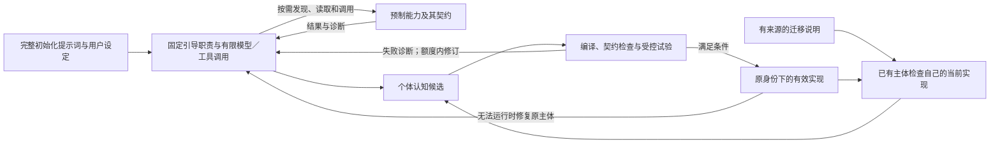

完整提示词是当前初始化要求的权威来源；文本差异表达增删，迁移说明补充变化原因、适用条件、替代契约和检查依据。已有 Self 对照实际源码与状态判断已满足、需修改、可选不采用或待迁移，不把提示词 diff 当作固定代码补丁。初始化来源、当前有效实现、所需契约及逐项迁移结果分别记录；跨修订可顺序处理或整理为有来源的累计任务，不重新初始化或抹去既有经历与自主修改。

公共接口采用正常使用 → 弃用并提供替代 → 在明确的兼容窗口内继续支持 → 窗口后移除。窗口按稳定契约修订说明，旧入口的可编译性、调用及行为语义共同受支持；只保留名字不算兼容。优先在旧主体仍可运行时自迁移；越过窗口或程序损坏时由固定引导机制针对原状态形成修复候选，失败保留维护路径，不能承诺任意历史实现永久可运行。

用户发起更新或已配置维护策略可接纳有范围的兼容迁移，不依赖主动学习启用；迁移不暗中打开学习、增加人格改造或扩大权限。获准范围内自主修改和采用复用调用边界生效，不要求逐步人工确认。软件更新、提示词修订与个体迁移完成分别记录；具体模型生成结果和迁移成功率未测。采用理由是保留个体差异并减轻统一源码合并负担，相应要求转为契约、诊断、兼容和检查质量；不采用覆盖人物目录、重跑完整初始化替代迁移或以模型自报成功完成更新。

详细[人物流程](docs/whole-system-design.md#self-initialization)、[运行协议](docs/runtime-protocol.md#bootstrap-migration)、[工程映射](docs/engineering-reference.md#prompt-bootstrap)、[库事实](docs/go-mini-integration.md#deprecation-facts)分别维护。

### 9.6 预制能力与个体认知实现

系统提供随客户端维护的预制能力库，为初始化、正常运行和迁移提供稳定工具。库的权威定义与实现对 Self 只读，由提供方更新；Self 可以按需发现、调用、组合、包装或不使用，在既有范围内形成自己的实现。人格、兴趣、判断、注意力和认知组织仍由个体决定。具体交付方式见[工程参考](docs/engineering-reference.md#client-library)，逻辑图只表达维护归属与调用关系。

预制能力覆盖契约与能力说明、资料读取、源码查询与诊断、当前状态及限制查询，也可提供解析、转换、差异计算、候选保存、模型请求、构建和沙箱等通用操作。每项能力分别声明读取、计算、写入或外部动作等作用，调用沿原状态所有者、授权、预算与事件契约处理。Self 可不用某个便利函数而自行组合步骤，访问资源或产生动作时仍须遵守共同运行约束。

初始化由固定引导入口提供少量能力发现入口，模型按需查阅契约、示例与诊断后组织自己的认知程序；正常 Self 和管理工作台访问相同来源，按身份过滤。目录、文档、示例和源码保持投影，主动读取才进入模型上下文。工具结果注明来源、修订及覆盖边界，提供者声明、已观测状态和分析结果分别表达。

库更新、个体依赖和实际调用分别记录。新增能力成为可选项；已有依赖的实现更新仍须保持承诺的兼容语义，受影响时沿弃用窗口及自迁移流程处理。个体包装保留独立身份，原业务状态和关系不随库替换。选择预制工具是为减少重复编写和接口猜测，同时保留个体实现自由；不采用强制统一认知程序、按客户端新增能力自动改写人格或让个体覆盖预制权威实现。资料支持接入机制，初始化收益未实测。

完整[契约](docs/runtime-protocol.md#prebuilt-library)、[管理](docs/management-workspace.md#prebuilt-management)和[评价](docs/sandbox-evaluation.md#prebuilt-evaluation)分别维护。

## 10. 逻辑取舍与证据边界

### 10.1 已定约束与设计选择

“设计约束”限定系统范围，“采用方案”说明实现这些目标的机制，“实测证据”只支持对应实验条件下的结论。三者分别记录。

| 主题 | 当前选择与理由 | 依据／适用边界 |
| --- | --- | --- |
| 预制能力与个体实现 | 预制工具随客户端维护，Self 按需调用、组合或不用；维护权与调用作用分别定义 | [预制能力](#prebuilt-capabilities)；保留主观认知自由，运行约束统一；源码装配与语言工具支持接入，收益未实测 |
| 提示词初始化与自迁移 | 完整提示词及语义差异引导个体实现；兼容窗口支持旧主体自行修改，固定引导机制处理首次生成与失效修复 | [生命周期](#initialization-migration)；接受人格差异，必要契约统一；注释及库资料支持接入，生成与迁移效果尚无实测 |
| 完整管理与人工干预 | 所有受管理对象有管理入口；表单／高级编辑共用对象，修改沿原状态所有者执行；来源、影响、生效及结果可见 | [管理设计](docs/management-workspace.md)；配置语义与官方资料支持此选择，未实现或评测界面；不采用仅只读面板、模型代理全部管理或通用表编辑 |
| 规范化热加载与函数调用 | 采用：受约束模块、类型推导及结构化注释生成调用／表单／蓝图描述，在调用边界统一切换 | [编写契约](docs/runtime-protocol.md#managed-functions)；减少手写适配与任意栈恢复需求，具体生成工具尚未实现 |
| 能力构建与采用 | 按需复用、构建、分层试验和按适用范围采用；接口与实现分离，宿主管理持续运行 | [能力闭环](#capability-development)；既有库 API 与工具链资料支持机制，未验证自动构建成功率或任务收益 |
| 数据责任 | 当前状态、必要过程记录、原始资源、派生索引和计算缓存分开 | 生命周期和用途不同；局部机制证据不能代替完整任务效果 |
| 检索与公共 API | 查询目的、生成向量、索引维护与候选核对分责 | 公共契约为设计选择，能力差异显式保留；不预设检索收益；[详细契约](docs/runtime-protocol.md#capability-api) |
| 核心／任务解耦与外部控制 | 主体、任务、认知执行和外部操作分责；长工作独立管理，控制台及获授权审计可直接阻断／中止，控制与收束分别报告 | [整体机制](#core-task-control)；mini-go 执行与取消接口支持接入，核心响应及完整控制尚未端到端验证 |
| 认知与运行机制 | 认知提出选择和修订，状态所有者接纳，能力承担具体计算／动作 | [逻辑契约](docs/runtime-protocol.md)；组合实验仅支持局部交互 |
| 统一事件与来源 | 采用：观察、请求、结果、状态变化和控制贯穿同一事件体系；能力可创建或接入外部事件源，闹钟仅为示例 | [事件主线](#event-driven)；报告 016 补充模拟提供者上的真实模型创建／触发／失败行为；实际来源与完整事件体系仍未测 |
| 持续认知 | 关注表＋活动工作区；按缺口读取、推进和停止 | [主体机制](#cognition)；已有受限真实模型接续证据，工作区组织的稳定净收益未证实 |
| 人格与协作 | 长期人格／临时心智并存；主负责心智按需邀请、独立起步、针对分歧交流 | [协作设计](docs/whole-system-design.md#organization)；采样、讨论、角色及长期经历的增量收益未作普遍承诺 |
| 自主与情境 | 已定目标：强自主回应；分开意愿、可答性、投入、规范与表达 | [交流设计](docs/interaction-design.md)；身份关联凭明确证据，亲密／剧情不扩大现实授权；模型在合成身份／受众任务有局部证据，意愿、情感与真人效果仍未测 |
| 统一资源与计算 | 公共属性＋类型规则，按情境投影；读取、使用、派生和维护分责，模型／KV 由计算组件承担 | [资源设计](docs/projection-input-and-compute.md#resource-contract)；属性授权及来源关系有资料依据，已有读取实验只支持原条件；不推定完整资源隔离、KV 或停止策略的通用收益 |
| 来源与记忆 | 原观测、当前判断、来源用途和修订分开；关系、剧情与模拟经历分别归属 | [记忆与证据](#knowledge)；资料提供设计动机，语义检索、污染与隐私效果不由资料直接保证 |
| 行动与交付 | 持久意图与实际效果分开，慢结果重新核对，交付／用途评价／约定跟进分别结束 | [运行协议](docs/runtime-protocol.md)及机制实验；不承诺外部效果恰好一次 |
| 主动学习与自我迭代 | 正式扩展、可替换学习策略；兴趣与能力盲区可发起活动，分支实践后有限采用；学习强度最低可关闭 | [整体机制](#active-learning)；课程、反馈记忆及代码迭代研究支持分工，未取得本项目长期学习收益或最优强度证据 |
| 沙箱与改进 | 独立执行域、受控能力、结果来源和有限采用；事实、方法、程序及组织修改分别处理 | [沙箱](#sandbox)和[学习](#learning)；受限环境的模型任务已测，完整沙箱与迁移没有新的实测结论 |
| 能力评估与回归 | 完整任务、分能力画像、已接受基线、独立保留任务与采用门槛；关键失败不被总分抵消 | [评估规则](#capability-evaluation)；已有局部正负控制，基线方法已定，实际画像及阈值随未来用途确定 |
| 实时与有限资源 | 即时输入／停止和深度认知分工；全部分支与重试计入总预算 | [控制通路实验](docs/experiments/004-realtime-control.md)支持分层，不承诺真实设备／模型上的通用延迟 |

### 10.2 证据怎样约束这些选择

[实验与资料索引](docs/whole-system-evidence.md)统一列出报告、原始数据、来源版本和适用范围。当前有状态模型、预编排流程、本地组件、固定语料检索、[真实模型开发对照](docs/experiments/015-task-outcome-contract.md)、[功能事件测试](docs/experiments/016-functional-events.md)及[接续／投入对照](docs/experiments/017-continuation-study.md)；**尚无独立保留任务上的稳定收益、正式能力基线或真人体验证据**。组件接通、格式通过和候选检索命中都不能替代完整任务质量。

原论文和源码支持特定命题或设计动机；自主意愿等价值取向属于设计目标。未经比较的方案保留为效果未知，不能写成实验证伪。工程约束见[工程参考](docs/engineering-reference.md)，完整统计见各实验报告。

### 10.3 不采用或暂缓的方向

| 方向 | 取舍理由与当前归属 |
| --- | --- |
| 所有内部调用都经过统一远程接口、能力缺口必然触发生成 | 普通内部调用保留语言语义；优先复用，构建投入须对应实际缺口和采用依据 |
| 用派生索引替代全部业务状态、原始资源或 KV | 不采用：相似检索、业务状态、原始证据和推理缓存的用途及生命周期不同 |
| 仅以可读／机密开关统一资源、全对象通用 CRUD、固定全局投影 | 无法表达操作、接收方和当前权限差异，或丢失状态所有权；采用公共属性、类型规则与情境投影 |
| 预设人形或其他特定硬件终点 | 主体采用数字环境与通用设备能力抽象 |
| 固定全员讨论、固定专家数量或用多数覆盖依据 | 协作围绕具体贡献和任务目的；独立采样、投票、临时／长期身份分因素比较 |
| 所有可答请求必须接受、把提供者失败当主体好恶 | 与强自主及责任分工不符，接受、未知、拒绝和规范限制分别表达 |
| 统一信誉／爱意分数、角色名代表专业能力 | 缺少校准依据，混淆事实、偏好、经历与角色 |
| 相似特征自动认人、关联账号打通全部信息 | 缺明确证明或用途授权；身份、读取与披露分别处理 |
| 亲密降低事实标准、剧情／沙箱经历直接成为现实事实 | 情境及证据归属不同；只采用可说明的候选产物或经验 |
| 全部文件自动全文／摘要注入、预热全部 KV | 违反投影与主动选择；索引构建同样属于有范围的读取任务 |
| 认知组织自行计算张量／KV、认知循环自己倒计时 | 计算与时间由能力组件承担，闹钟触发作为输入 |
| 将闹钟示例固定成核心模块、只把外部输入当事件 | 统一事件覆盖全部交互；创建通知源属于能力，请求、结果、状态变化和接续都须覆盖 |
| 全量广播、每事件都调用模型、事件驱动等于全事件溯源 | 按范围和用途处理，当前状态与必要记录并存；避免扩大信息流、无效推理和持久化成本 |
| 默认整段答复缓存、每轮清空材料或重复核算 | 缓存需符合版本、用途和范围，有效已读材料可保留；命中不等于少推理或正确 |
| 只靠测试提示构成沙箱、试验状态整体合并 | 受控能力和独立状态须由宿主装配，模拟动作不能成为真实执行请求 |
| 单一总分、自评分或一次通过就默认采用 | 覆盖、评价可信度与随机波动不同；使用分能力比较和独立门槛，不能以未知代替无退化 |
| 当前承诺任意恶意原生程序强隔离 | 当前受控能力评估的用途不覆盖这一保证，若需求出现须另论证 |
| 唯一参考路径或仅最终答案作为完整任务标准 | 合理替代路径应有效，必要过程责任仍须核对；报告 015 的控制揭示两种简化规则的误判 |
| 将来源更正一概解释为原推理错误 | 当时依据、当前事实和变化原因不同，最新字段正确也不能代替历史解释核对 |
| 最终状态正确就忽略过早完成、压低生成上限就算节省 | 报告 016／017 暴露过程责任与额度问题；提示不足以代替接纳核对，投入调整未见跨任务一致收益 |
| 为计分强制重读、所有可恢复响应错误都等同任务失败 | 已有状态和投影可支撑对应说明；用途、预算内恢复和无错误率分别评价，原冻结分数仍保留 |
| 保存文件即完成、无反馈就无限跟进、复盘文本即学习 | 交付、用途评价、约定跟进和迁移效果分别验证 |
| 先穷尽锁、驱动、备份与故障边界再研究主体 | 已有机制保留，完整任务效果是当前主线；具体实现进入条件见 Q 台账 |

上述理由分别来自用户约束、已有有限实验、资料论证和工程判断。未运行的对照不写成实验证伪；机制细节和替代项由当前专题维护，旧参数、故障推导和开发规格从[归档索引](docs/documentation-guide.md)进入。

### 10.4 何时修订

新需求、直接反证或未来实际任务暴露连续性、证据、协作、投入或迁移不足时，调整对应候选并保留简单基线；容量问题先量化具体瓶颈，再判断是否影响逻辑责任或只需工程调整。改变约束、职责或输入时同步总图、概念和场景，不能只补局部报告。

## 11. 设计状态与适用边界

### 11.1 设计结论与实际效果

已确定的是职责、机制、默认选择及采用条件；资料论证不等于产品实现或完整效果验证。评价以完整任务及责任为对象，分别核对依据、交付、过程行为、实际体验及全部成本，具体方法唯一维护于[沙箱评估](docs/sandbox-evaluation.md#evaluation-design)。现有证据的类型和局限见[证据边界](#evidence)，不将旧开发成绩当成正式能力基线。

### 11.2 决策、建议与用途配置

基础设计的选择、理由、备选及关闭状态集中在[决策台账](docs/research-plan.md#remaining-questions)，不在总设计再维护一份清单。新增要求、管理及副本细则的设计范围见[管理设计状态](docs/research-plan.md#management-extension)，跨专题契约的统一结果见[一致性决定](docs/research-plan.md#architecture-consistency)。

具体模型／设备、预算、联系窗口、检索参数和评价门槛属于[用途配置](docs/research-plan.md#deferred)。没有实际性能或体验数据是适用边界，不自动生成实验待办。新需求、反证或用户明确要求实验／实现时再调整范围。

## 12. 文档维护

变更先更新总图、概念、职责和场景，再同步负责细节的专题；工程选择独立维护。资料保留支持命题、日期、来源身份及适用边界。完整更新与证据保全规则见[维护规范](docs/documentation-guide.md#workflow)。

当前专题的唯一职责、完整资料和术语入口见[文档索引](docs/README.md)，收尾决策和适用边界见[设计台账](docs/research-plan.md)，编辑规则见[维护规范](docs/documentation-guide.md)。本文不再复制整套专题链接和研究清单。
