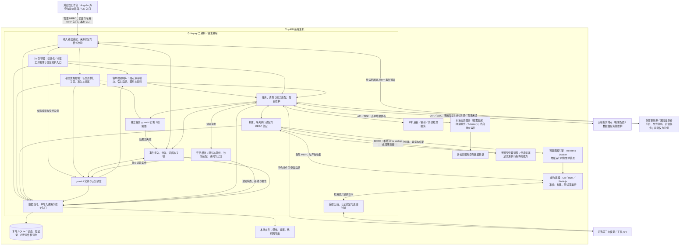
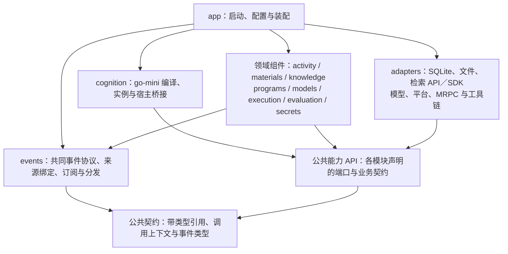
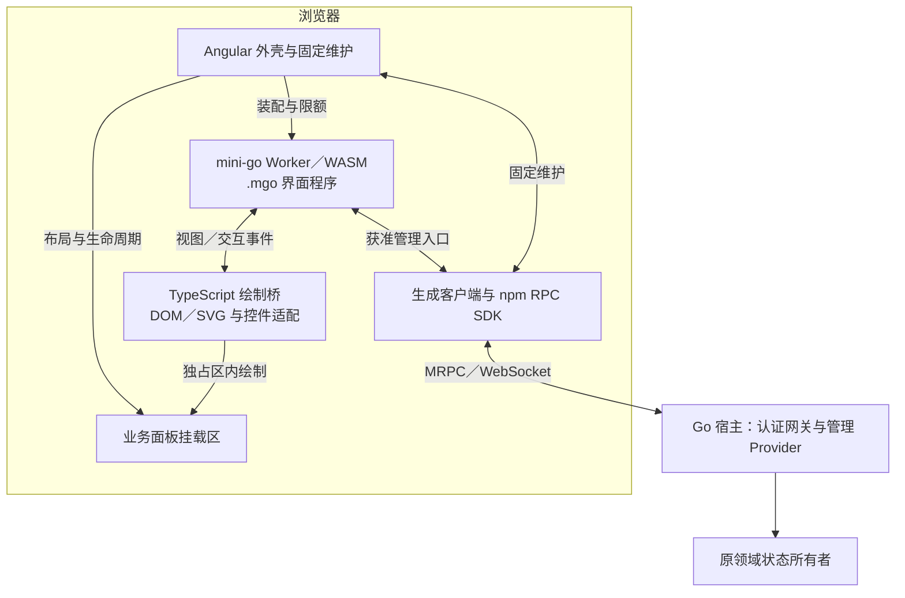

# 工程选型与部署参考

用途：工程参考（与逻辑设计分开维护）。

[项目入口](../../README.md) · [文档索引](README.md) · [逻辑总设计](../DESIGN.md) · [逻辑契约](runtime-protocol.md) · [go-mini 库行为](go-mini-integration.md)

本文说明物理部署、软件依赖、技术栈和存储机制，并记录选型理由与证据边界。工程组件承载逻辑职责，但 Mind、活动和能力不必各自对应一个进程。方案设计范围统一见[设计台账](research-plan.md#research-status)。

| 阅读主题 | 章节入口 |
| --- | --- |
| 总体承载 | [物理部署](#physical-architecture) · [软件依赖](#software-modules) · [技术栈](#technology-stack) |
| 管理前端 | [Angular 外壳与动态界面](#management-web) · [绘制与输入](#workspace-rendering) · [MRPC 与身份](#workspace-rpc) · [分发与更新](#workspace-distribution) · [资料依据](#management-web-sources) |
| 主体与执行 | [初始化与兼容](#prompt-bootstrap) · [预制能力库](#client-library) · [任务控制](#task-execution) · [热加载工具](#managed-function-tooling) |
| 能力扩展 | [工具链与运行](#capability-toolchain) · [Node.js 与 npm](#node-rpc-integration) · [主动学习](#active-learning-integration) · [实现准入](#implementation-admission) · [容器执行](#container-execution) |
| 数据与服务 | [领域接口与共用承载](#domain-integration) · [模型维护与机密](#maintenance-secrets) · [认知辅助组件](#optional-cognition-components) · [计算节约接入](#efficiency-integration) · [检索提供者](#retrieval-providers) |
| 持久化 | [领域存储](#persistence) · [数据放置](#storage) · [个体状态](#individual-state-storage) · [备份](#recovery) · [容量与维护](#storage-maintenance) · [性能与依据](#storage-performance) |
| 接入与依据 | [库接入](#vm-deployment) · [一手依据](#stack-sources) · [检索接口资料](#retrieval-sources) · [向量资料](#vector-sources) · [容器资料](#container-sources) |

<a id="physical-architecture"></a>

## 1. 承载约束与物理部署

本节定义核心及其能力依赖的部署边界。主体行为与职责分工见[逻辑总设计](../DESIGN.md#subject-loop)。

核心采用以下承载约束：TinyAGI 核心单机、单二进制、单宿主进程；SQLite 保存业务状态与普通短记录，本地文件承载大型内容。向量服务与 Attemory 作为同级外部检索提供者，经 API／SDK 按需接入；本地和远程均可配置，向量路线初始选择为本地单节点 Qdrant。Go 承担宿主机制，go-mini 组织认知。核心之外允许宿主管理的本地能力子进程、原生构建产物、Node.js 程序包及 Go／Rust／Node.js（npm）工具链与运行依赖；单二进制描述核心发布物，不表示整个运行环境只有一个文件或进程。子进程不拥有第二份主体真值，也不构成 TinyAGI 集群。

不采用 TinyAGI 集群、Kubernetes、节点接管、服务发现、对象存储或独立业务数据库，以保持单机核心和本地状态的边界。嵌入向量引擎及 SQLite 向量扩展暂缓，原因是当前选择通过 SDK 接入独立向量服务，并非性能实验证伪。外部模型、工具和远程向量服务不改变核心部署约束。

核心为受管理认知程序提供基础受限执行，并默认携带额外隔离执行的契约与适配入口。容器引擎、镜像和工具链按需配置，缺失不阻止核心启动或基础人物初始化；直接接触系统环境、运行依赖脚本或执行高风险远程操作等能力，按实际要求使用合格容器。基础执行与额外隔离的分类见[逻辑契约](runtime-protocol.md#execution-classes)。容器不拥有主体真值，也不要求部署 TinyAGI 集群；工程接入优先 Linux 上的 Rootless Docker，增强隔离预留 gVisor，具体条件见[容器执行](#container-execution)。

### 1.1 物理部署总图



TinyAGI 自有逻辑模块和事件机制映射到进程内组件，核心不内置闹钟业务模块。外部通知源可位于本机的独立程序、操作系统设施或远程服务，经适配器接入；图中置于宿主进程之外，不要求它必须在远端。SQLite 保存任务责任、来源引用、订阅和必要事件，通知对象与计时由相应提供者管理。宿主执行期限和预算控制仍属于运行机制。模型计算交给外部推理组件，选用库时可在宿主内运行，使用已有运行时／API 时属于能力接入。发布单个 TinyAGI 可执行文件；当前完整初始化提示词、预制库源码与接口资料、固定引导支持及管理静态文件可内嵌，各 Self 生成的认知源码、修改产物与用户数据写本地目录，不引入内部服务集群。

外部检索提供者是独立能力依赖，可配置同机或远程服务；各服务维护自己的材料副本和检索状态。图中连接表示按用途选用，不要求同时部署、双写或调用全部提供者。向量服务与 Attemory 同级接入，Qdrant／本地单节点只是向量路线的初始配置。单二进制描述 TinyAGI 核心，服务内部实现与拓扑不属于主体运行架构。[检索接入与取舍](#retrieval-providers)

回应的证据核对、意愿与规范适用判断仍由 go-mini 组织模型及工具完成；宿主输出入口执行确定格式检查，规则／契约版本和观测关联仍使用同一 SQLite 与本地文件。逻辑上新增的责任不对应新进程或外部审查服务。

沙箱沿同一事件／能力接口装配替代来源、输出、试验文件区和环境时钟；允许的模型计算仍经宿主适配并计入全局计算资源预算。数据库按宿主绑定的执行域隔开正式状态与试验状态，试验文件放入各自本地目录；共享的只读基准材料必须满足原可见范围，不向候选开放原始数据库连接、宿主路径或生产能力句柄。

平台适配器接收其可确认的账号、会话及受众元数据，人物关联和情境化记忆仍位于同一宿主的数据与认知层。对接多个聊天平台是能力接入，不是分布式部署；不新增独立身份服务或人物图数据库。

<a id="software-modules"></a>

## 2. 软件组合与编译依赖

采用明确状态所有者和可替换能力端口的模块化设计。下图是编译依赖方向；前后调用产生的事件流见[总逻辑架构](../DESIGN.md#logical-architecture)，两者不混用。名称用于说明分工，尚未创建产品包。



宿主桥接将认知请求表达为有类型的事件，分发给状态所有者或能力接纳入口；所有者经端口调用存储或能力。适配器将结果归入同一事件协议，不直接重入 VM 或任意修改其他模块。同步 API 可以等待并返回同一结果事件的业务视图，不另产生一个语义重复的完成事件。事件机制通过进程内接口和有界队列承载，跨模块的必要共同提交仍由宿主协调，不建立独立消息中间件。接口以业务用途划分，不做一套对所有对象通用的 CRUD／插件框架。

| 模块候选 | 独占维护的业务含义 | 主要输入和输出 |
| --- | --- | --- |
| `activity` | Self／Mind 业务身份与状态、已接纳目标、Episode、工作区、关注候选与接续点 | 输入／完成事件 → 可运行步骤；认知修订 → 活动状态／等待条件 |
| `events` | 共同事件封装、来源绑定、订阅／关联和按范围分发；不拥有领域事实或主体意愿 | 外部观察、请求、结果、状态变化和控制 → 对应处理者；重要记录沿统一数据入口保存 |
| `materials` | 文档、媒体、来源定位、内容快照和表示 | 导入、抓取、选读、解析及清理；文件工具不授予领域权限 |
| `knowledge` | 经历、断言、证据关联、Reference 和经验候选 | 查询、带依据的更正与采用；不覆盖原始资料或裁定人物认证 |
| 检索适配 | 提供者绑定、用途策略、来源映射、准备及查询记录 | 按各领域范围调用外部服务并整理有类型结果；引擎和服务侧数据由提供者维护 |
| `programs` | 源码、接口、配置／蓝图定义及其修订 | 受管理编辑、检查和迁移；各行为所有者保存配置值，构建及生效由运行职责接续 |
| `models` | 模型描述、权重产物、连接及能力绑定 | 维护请求沿提供者适配，实际加载和计算由推理提供者负责 |
| `secrets` | 原值、归属、SecretGrant、可信提交与审计 | 专用授权、代理使用或原值交付，普通读写端口不能取得原值 |
| `interaction` | 账号与人物关联依据、当前受众、互动约定、接纳前请求记录、适用契约和输出轮次 | 平台输入与认知候选 → 澄清、拒绝或转入活动及有当前范围的输出；意愿和情感评价仍由认知提出 |
| `execution` | Operation、派发、外部回执、取消／未知、能力准入和实际用量 | 归属主体／心智及可选交流／活动的能力意图 → 提供者调用 → 完成事实与按需接续 |
| `cognition` | Program／Instance／scope 与宿主绑定；不另持有唯一业务事实 | StepContext → go-mini 组织模型／工具 → Continuation／候选 |
| `evaluation` | 测试套件、试验配置、输入环境、参试／评价材料分离、基线、比较报告及采用依据 | 同一任务接口装配独立域；运行、评价和比较分责，按覆盖及门槛判断用途，参试候选不能改写本次评价规则 |
| 构建与运行适配 | 工具链、产物来源、受管理子进程、MRPC Provider／绑定及清理；复用 execution／evaluation 的活动与预算 | 受控构建／试验／运行请求 → 产物投影、生命周期事件与实际调用；名称尚非产品包 |
| `adapters` | 外部协议、物理存储和设备差异 | 实现调用方声明的端口；不自行决定是否接受任务或扩大读取范围 |
| `app` | 进程生命周期、配置核对、模块装配和执行实例归属 | 绑定真实域或某个 SandboxID 的全部入口；不提供候选可换成现实域的开关 |

工作区可引用上述状态，但不复制成另一个事实库。一次用户交流可关联多个 Episode，一个 Episode 也可跨会话接续；不得用“聊天 ID＝活动 ID＝模型会话 ID”合并三者。人物关系／剧情、现实观测／体验和沙箱经历沿已有语义分开，表结构不得把它们压成无来源的聊天文本。

调用上下文由宿主绑定 Self／Mind、可选交流／活动或直接管理请求，以及实际执行者、能力范围、用途、执行域与预算。认知可以没有会话和 Episode，操作与费用仍归属于对应主体／心智；转入活动后保留原请求及用量关联。各领域按当前授权裁决，委托不扩大父范围；SecretGrant 继续由独立机密模块核对，不把多方权限合并成进程级通用凭据。[交互归属](runtime-protocol.md#interaction-scope)与[授权上下文](runtime-protocol.md#capability-authority)规定逻辑语义，不要求增加数据库或服务。

认知输入保存所选来源、修订、派生关系及会话使用记录；撤权或用途变化时，宿主使受影响上下文和候选输出失效，不能确认已经移除内容的外部会话停止沿用。长期记忆由 knowledge 按保留规则维护，必要过程记录仍留在原模块；已交付结论的纠正使用 activity、knowledge 与交付记录的既有关联，不以重放全部历史代替影响判断。[上下文有效性](materials-and-context.md#context-validity)、[记忆与纠正](whole-system-design.md#memory-lifecycle)

**持久化模式默认采用当前业务状态＋必要过程记录＋可重建派生索引。** 状态用于接续，事件／决策／操作记录用于查证，原文与内容修订由资料和记忆职责分别保留。当前不采用“所有状态只能重放全部事件得到”的完整事件溯源：模型和外部动作无法仅凭本地事件重新产生相同结果，且重放与隐私保留会增加复杂度。这是工程取舍，未做框架优劣对照。ORM、依赖注入容器及 Agent 工作流框架也不作为默认依赖；先用显式 Go 结构、构造函数及参数化 SQL 表达当前有限边界。

<a id="technology-stack"></a>

## 3. 技术栈与依赖版本

“默认”表示当前设计选择；“已测”只限报告列出的组件组合。本文定义设计选择，不构成产品实现。

| 层次 | 当前选择 | 为什么及边界 |
| --- | --- | --- |
| 宿主与并发 | Go；现有根模块声明 1.27，研究固定记录实际工具链 | 类型化端口、goroutine／context 与标准库足以承载单进程；不为多个 Mind 创建进程，版本不是未经验证的跨平台保证 |
| 认知程序 | 嵌入 `github.com/d7z-team/mini-go`，源码／产物固定身份 | 可变认知与原生机制分开；独立实验导出已提交快照，避免相邻开发工作区变化污染证据；产品版本仍需进入实现时锁定 |
| 能力扩展 | MRPC 生成 Go／Mini-Go／Rust／TypeScript 绑定；稳定 Go 能力本地注入，动态 Go／Rust／Node.js（npm）能力用受管理子进程 | 复用库的绑定、资源、取消和服务替换；工具链及子进程管理由宿主适配，未实现组合闭环 |
| 结构化数据 | `database/sql`＋`modernc.org/sqlite` 为当前默认候选；实验依赖固定为驱动 v1.59.0／libc v1.75.7 | 无 CGO 构建便于单二进制发布；保持驱动所要求的 libc 配套。没有与 C 驱动比较性能，不宣称更快 |
| 文件与内嵌材料 | Go `os`／`io/fs`，`embed` 打包初始化提示词、预制库源码／接口资料及固定管理静态文件 | 个体生成的认知源码、用户材料和证据在数据目录；内嵌引导材料不意味着自动读取用户材料 |
| 存储访问与迁移 | 参数化 SQL、显式版本迁移、限定访问范围的仓储接口 | 数据所有者和共同提交清楚；暂不引入 ORM／独立迁移服务，具体 DDL 随业务样本再定 |
| 领域检索 | 记忆、资料、程序定位及能力发现共用外部提供者接入；向量服务与 Attemory 同级，按用途选择或组合；元数据／全文查询保留 | API／SDK 对接已有组件，材料准备有明确范围；报告 013 只支持固定语料的内容查询，外部服务组合与任务收益尚未实测 |
| 模型／工具接入 | 宿主端口＋提供者适配；HTTP 使用复用的 `net/http.Client` | 宿主绑定凭据和协议，服务执行实际计算；具体模型由真实任务条件选择，不锁死某厂商 SDK 或假定兼容端点语义相同 |
| 输入、事件与交互 | CLI／本地入口为首批候选；进程内事件机制与外部事件源适配 | 闹钟仅为可创建通知源的示例，不内置核心计时业务；具体来源／平台提供者及真实发送仍待定 |
| Web 管理工作台 | Angular 外壳＋浏览器 `.mgo` 界面程序＋独立 TypeScript 绘制桥；npm SDK 经 WebSocket 调用宿主管理 MRPC，静态产物可内嵌 | 业务界面不逐项改写成 Angular 组件；固定维护不依赖动态程序，运行时无需独立 Node 服务；界面库与绘制桥属于待实现适配 |
| 契约与序列化 | 跨语言接口以 `.mrpc` 为唯一来源，生成 Go／Mini-Go／TypeScript 绑定；领域内部使用 Go 类型，文件及声明式数据按需使用 JSON／JSON Schema | 协议编解码复用库；解析与类型检查不代替范围、权限和业务语义核对，不再平行手写管理 REST 类型 |
| 观测 | `log/slog` 结构化运行日志＋业务 Trace／Operation／Outcome 记录 | 日志不自动包含材料全文、凭据或私密模型载荷；业务依据按访问范围读取，暂不要求外部日志／指标服务 |
| 测试与沙箱 | 局部 go-mini 实例、能力组合与主体级试验分层；需隔离的原生构建／测试复用容器执行 | 试验状态与系统执行隔离分别装配；容器不替代初态、环境覆盖或评价条件 |
| 可选容器执行 | Linux 优先接入 Rootless Docker，预留 gVisor 增强隔离；公共契约独立于具体引擎 | 默认提供适配入口，运行时按需装配；实际约束须满足请求，缺失不降级到宿主进程；依据见[容器资料](#container-sources) |

[宿主组合实验](experiments/014-host-composition.md)已验证固定 go-mini、Go 标准库、modernc SQLite 和本地文件在本机组成无 CGO 可执行文件，并经确定提供者完成两段活动；这支持当前默认，未测试真实模型、生产负载或跨平台。

执行库更新另以[当前固定提交](go-mini-integration.md#current-verification)核对，库回归及跨语言互通结果见[报告 018](experiments/018-go-mini-library-validation.md)。报告 014 的工具链和组合成绩保持原条件；新库用例不替代完整宿主组合重测。

已测构建目标是本机 Linux/amd64 的最小文本闭环；Windows／macOS、本机 GPU／语音库、跨机型安装与真实容量留到明确用途后验证。单二进制目标不等于把权重、显卡驱动、CA／操作系统环境或第三方工具都内嵌。

`mattn/go-sqlite3` 暂不作默认，主要理由是其 CGO／C 编译依赖与当前简化构建的偏好；它仍可构建单二进制，不是违反架构或被性能实验否定。若实际任务暴露驱动负担、扩展需求或目标平台问题，再在相同业务负载比较。向量服务的选型不重新打开业务状态数据库选型。

FTS5 默认 unicode61 以连续 token 字符分词，不是中文语义分词器；trigram 对少于三个 Unicode 字符的全文查询有限制。因此保留有界原文扫描作为覆盖路径，按实际中文／混合文本查询选择分词或索引，不直接把 BM25／向量相似度当成证据可信度。向量存储采用下述 SDK 路线，embedding 模型、切分和检索策略按用途配置，组合收益尚无本项目实测；不要求每次活动都使用语义检索。

<a id="management-web"></a>
<a id="web-workspace"></a>

### 3.1 Web 工作台

工作台采用 **Angular 固定外壳、`.mgo` 动态业务界面、独立浏览器绘制桥及 MRPC 管理接口**。Go 宿主提供管理服务、静态文件及专用 HTTP 入口，前端产物可内嵌二进制，运行时无需独立 Node 服务。浏览器运行的是界面程序实例；认知实例、领域状态、任务及能力执行仍在宿主侧管理。逻辑分工见[管理专题](management-workspace.md#dynamic-workspace)。

| 层次 | 工程职责 |
| --- | --- |
| Angular／TypeScript 外壳 | 登录、路由、导航、页签与整体布局、面板挂载、主题、连接及运行管理；固定诊断、修复、停止和可信机密输入 |
| 浏览器 `.mgo` 程序 | 具体业务区布局、组件组合、条件显示、草稿、交互处理与获准管理调用；不是主体认知实例 |
| TypeScript 绘制桥 | 框架无关的视图与事件适配，操作限定挂载区内的 DOM／SVG，接入原生控件及必要的复杂编辑组件 |
| npm SDK 与生成客户端 | 使用 `@d7z-team/mini-go` 执行界面，使用 `/rpc` 及生成绑定接入管理服务；编译及语言工具 `/tools` 按需加载 |
| Go 宿主管理服务 | 会话认证、领域投影、当前权限与范围核对、请求接纳、实际采用和控制；不依赖人物程序启动 |



<a id="workspace-rendering"></a>

#### 绘制、控件与本地交互

Angular 管理挂载节点的存在、位置和尺寸，绘制桥独占其中的业务 DOM；两者不同时更新同一组内部节点。Angular 的渲染完成回调用于建立挂载与必要观察，卸载时解除监听并释放界面实例。动态视图不逐节点生成 Angular 业务组件，也不要求再引入第二个页面框架。

界面预制库提供带稳定标识的控件树、属性与语义事件；初始采用有界视图提交及按标识更新，不先设计通用远程 DOM 指令集。条件、循环和组件组合在 `.mgo` 中表达。普通界面使用 DOM／CSS 的布局和输入能力，图形或蓝图按需要使用 SVG／画布与已有编辑组件，不自建文字排版或整套画布 GUI。

输入法组合、光标、滚动和拖动反馈保留在主线程控件内，业务值变更再交给界面程序；状态更新保留稳定控件身份，避免每次刷新重建输入框。文件选择等需要用户激活的操作由受信点击处理直接打开，再向程序返回允许的引用或结果。显示适配保留原生标签、键盘和焦点语义；本地绘制与事件桥不必每帧经过远程 MRPC。

纯 `.mgo` 组合控件可随界面源码更新；编辑器、文件选择、虚拟列表及图形画布等底层适配随客户端交付，需要新原语时更新客户端。主题通过固定样式与受约束属性传入；Shadow DOM 可用于样式封装，不承担机密或权限隔离。

客户端只执行受信的 TypeScript 适配。界面候选不能提供任意 JavaScript、Angular 模板、`providerModule`、Worker 地址或通用 DOM／网络对象；绘制桥按控件类型处理文本、属性、事件与获准内容地址，不直接执行程序生成的 HTML、脚本或任意 URL。候选受限于挂载区和已装配的能力，不能覆盖外壳身份／执行域标识。Secret 原值只进入固定可信输入及专用提交通路，不经过动态树、界面 Worker 或通用状态存储。[机密工程契约](#maintenance-secrets)

<a id="workspace-rpc"></a>

#### 管理 MRPC、身份与状态观察

`.mrpc` 是管理跨语言接口的唯一声明来源，生成 Go Provider 和 TypeScript／Mini-Go 调用适配。浏览器使用 npm `/rpc`，动态界面通过受控桥接访问获准管理客户端；固定维护直接使用相同契约。认知的主观算法仍由原认知程序组织，业务规则与真实操作由宿主或其能力端执行；浏览器只计算界面状态和编辑辅助结果。不会因为共享源码就将主体状态或领域裁决搬入页面。

业务查询、修改、函数调用、控制和观察共用 MRPC。HTTP 保留静态资源、会话建立、文件上传／下载及可信机密提交等用途，复用相同领域鉴权；不为同一管理业务另写平行 REST 协议，也不以 SSE 作为必备状态通道。浏览器不直接访问 SQLite、检索服务、认知实例或未开放的能力服务。

初始状态观察采用快照与带游标的有界等待调用：快照关联观察位置，后续请求携带范围和游标；无变化时有限等待，游标失效或连接重建时重新读取。宿主只返回获准领域的变化，支持取消并限制未消费结果；它是现有事件与查询的管理适配，不复制全量事件日志。SDK 不自动重连或重放，外壳负责连接恢复、重新绑定及读取；提交结果未知时按原请求查询，不能自动再执行命令。浏览器一般作为调用方，不要求每个页面发布反向 Provider。

管理入口默认同源部署，采用受保护的 HttpOnly 会话 Cookie；WebSocket 升级前校验会话与 Origin，通过 Gateway 的 `PeerInfo` 绑定可信身份，逐次调用仍核对当前授权、界面允许范围和执行域。HTTP 修改入口使用相应请求来源与防伪校验。不得依赖浏览器自定义 WebSocket 认证头、URL 中的长期令牌或候选自报角色。浏览器所持管理会话与 Secret 原值分别管理；具体生产 TLS 与会话参数按部署条件确定。

调用超时或页面关闭首先终止本地等待；宿主已接纳的 Operation 不因此消失，明确停止沿原控制接口处理。列表、日志及文件采用分页、有限观察或分块读取，不能将所有资料和记录灌入页面。MRPC 的 64 位整数沿 SDK 的 `bigint` 处理，展示和持久草稿显式转换，不无损假设为 JavaScript `number`。

<a id="workspace-distribution"></a>

#### 源码分发、界面更新与测试

界面源码是权威内容，编译镜像是派生产物，绑定源码、依赖、编译器／runtime 和接口身份。常规打开页面复用匹配镜像；源码编辑默认可交由宿主编译并返回诊断及候选镜像，浏览器 `/tools` 按支持范围提供本地语言查询、诊断和编译预览，相关工具按需加载。[报告 019](experiments/019-management-workspace-validation.md#compiler-budgets)中小型纯逻辑工作区通过，但两个实际界面工作区在默认及追加预算下均未完成打开；关闭累计步数限制、扩大逻辑堆／对象额度并延长至 300 秒也未解决。本地实验补丁不属于发布 API，预算可配置不能替代编译开销改进。[依赖与 CPU 诊断](experiments/019-management-workspace-validation.md#compiler-diagnosis)未发现调用方式错误，已识别标准库依赖展开和 VM 运行热点。[报告 020](experiments/020-go-mini-performance-recheck.md)复测 `0.0.19-git.gfc9366c`：主链路 14 项通过，原两个工作区在默认配置仍触发 `step_limit`，尚无优化后的完整浏览器编译成绩。当前不将浏览器本地编译作为所有页面的必经条件。正式提交仍由宿主检查当前接口、权限、状态兼容及采用结果，本地编译成功不是正式采用。仅分发获准的界面模块和共享库，不把宿主全部源码、配置或私有材料交给浏览器。

编译结果须同时核对诊断与镜像存在性，源码错误不一定以抛出异常表示。交付镜像保留工具链产物字节；自行编码 Go Image 时与库的规范编码保持一致，避免重新转义内部产物引发哈希校验失败。固定包、实际接入方式和失败修正见[实验接入要求](experiments/019-management-workspace-validation.md#requirements)。

界面实例使用明确的能力集合、执行额度、堆与队列限制；每个挂载会话的 Worker、观察和句柄由外壳管理，关闭时释放。程序采用有界交互处理，界面草稿显式保存，不依赖无限根调用。浏览器 Worker／WASM 只提供运行机制，完整限制由桥接和装配实现；界面执行可用不代表已创建完整 AGI 沙箱。

提交流程沿[逻辑生效契约](management-workspace.md#apply)。宿主准备并采用后，在线面板在交互边界使用新实例及显式状态转换；无需依赖 `patch` 迁移任意旧闭包。旧界面修订与宿主已采用修订分别展示，旧描述请求重新核对；面板重载、编译或失败恢复不得重复派发已接纳操作。Angular 外壳和底层适配随客户端更新，`.mgo` 界面组合与普通行为配置按契约热调整。

界面局部测试使用固定输入、替代管理接口和独立草稿；需要验证主体行为时连接宿主按问题装配的试验主体，真实／试验范围由宿主绑定且外壳明确显示。检验界面交互、协议接入和主体能力时分别记录覆盖，见[界面评价规格](sandbox-evaluation.md#workspace-evaluation)。

<a id="management-web-sources"></a>

#### 采用理由、资料与边界

选择 Angular 是为统一外壳、路由及维护入口；详细界面由 `.mgo` 与小范围绘制桥承载，以便复用现有程序、类型和 RPC 机制。代价是维护界面库及控件适配，不能由 npm SDK 已存在推定动态 UI 已完成。第一条链路只要求一块业务面板具备显示、编辑、调用、状态观察和关闭；后续按真实页面需要扩充。

| 一手资料与范围 | 支持的命题 | 采用及限制 |
| --- | --- | --- |
| [go-mini 浏览器固定源码](go-mini-integration.md#browser-workspace-facts) | SDK 提供浏览器 RPC、Worker／WASM 执行、编译及语言工具；DOM 行为由应用提供 | 复用已有执行与通信；最小 Angular 接入已由[报告 019](experiments/019-management-workspace-validation.md)验证，完整界面库、绘制桥和领域 Provider 仍须实现 |
| [Angular DOM APIs](https://angular.dev/guide/components/dom-apis)，在线 API 文档 | 可取得宿主元素并在渲染完成后接入 DOM；通常应优先使用模板，原生 DOM 不自动获得模板保护 | 将独立绘制限制在专用挂载区是本项目取舍，外壳与内部节点分开管理；框架不负责候选内容安全 |
| [WHATWG Web Workers](https://html.spec.whatwg.org/multipage/workers.html#worker) 与 [MDN Shadow DOM](https://developer.mozilla.org/en-US/docs/Web/API/Web_components/Using_shadow_DOM) | Worker 消息通道与 DOM／样式封装有各自用途 | 运行、绘制及样式分责；Worker 或 Shadow DOM 本身不等于可信机密输入或完整沙箱 |
| [Go embed](https://pkg.go.dev/embed) | 编译期可内嵌静态文件 | 支持单核心发行物承载前端；界面源码、分发文件及依赖仍须匹配 |

不采用全部业务 UI 固定为 Angular 组件、两套前端框架并行、庞大 UI Schema 编程语言、任意 JavaScript 页面注入或自建通用 GUI 引擎；这些方案会扩大重复定义或运行边界。也不把所有输入事件发送给远端绘制，避免将本地交互绑定网络往返。具体控件库、包版本及用量上限按实现用途锁定。[报告 019](experiments/019-management-workspace-validation.md)总体判定为成功但存在性能问题，验证了真实浏览器中的最小完整往返、直接 Mini-Go RPC 与受控 TypeScript 桥；[更新复测](experiments/020-go-mini-performance-recheck.md)保持主链路通过，浏览器源码编译仍受限；原失败记录保留，修复跟踪见[工作台接入状态](research-plan.md#management-extension)。这些结果支持承载方向，不替代完整产品界面、生产安全、性能或开发成本评价。

<a id="prompt-bootstrap"></a>

### 3.2 提示词初始化、自迁移与 API 兼容

采用“当前完整初始化提示词 + 相邻修订的差异与迁移说明”交付认知初始化要求。每份完整提示词有来源、日期和内容身份；历史正文保留，文本 diff 从相应两份正文生成，语义说明补充变化原因、影响范围、必要／可选项、替代接口及检查条件，并与相同起止身份关联。跨多次修订可顺序处理或使用有完整覆盖关系的累计说明。差异表达要求变化，不是针对所有个体源码的统一补丁；实际运行提示词和人物程序尚未交付。

| 接入部分 | 工程承担方式 |
| --- | --- |
| 发布内容 | 当前完整提示词、可追溯的迁移链、预制能力库及其宿主 API／MRPC 声明与适配、固定管理页面；通用绑定及受约束模块骨架可生成，不发布统一人格程序覆盖个体 |
| 人物与产物 | SQLite 保存人物身份、初始化进度、迁移项及采用关系；本地文件保存提示词来源、个体源码与候选；源码和依赖身份可追溯，生成式初始设定不伪装为真实经历 |
| Go 引导器 | 不依赖待生成或已损坏的 `.mgo`；用现有模型适配、工具接纳、Secret 引用和事件通路完成有界生成／修复循环，支持停止和续接，不形成第二套长期认知主体 |
| 编译与试验适配 | 封装 Engine.Check／Compile、Program.Instantiate 及命名入口调用；向独立实例装配受控测试能力，经现有候选规则采用；模块装载初始化仍不得产生现实业务动作 |
| 运行跟踪 | 分开记录客户端构建、提示词来源、宿主 API 契约、生成源码／依赖、检查结果与有效程序；读取新说明不等于个体已经兼容 |
| 固定维护入口 | Go 提供管理 MRPC、专用 HTTP 与 CLI 入口，固定页面可配置模型、显示诊断和维护当前支持范围内的代码／资料；不依赖界面程序或认知 VM 成功启动；没有模型时可维护但不承诺自动修复成功 |

TinyAGI 对自身公开给 `.mgo` 的稳定接口承担兼容责任：旧导入路径、类型、调用入口、MRPC handler 或适配层在声明窗口内确实可用，并保留承诺的参数、结果、错误、状态和资源语义。弃用说明提供替代方式、开始弃用的契约修订、支持范围及最早移除条件。窗口按若干次稳定 API 契约修订计数，不能把每次提示词编辑或客户端补丁都计为一次；具体保留数量属于发布支持策略，尚未指定。无法保持旧语义的改变应明确为不兼容迁移，不能只保留同名函数却改变含义。

采用 Go 的 `Deprecated:` 注释习惯，并复用 go-mini 文档提取结果展示给 Self 和工作台。调用点提示、依赖影响分析、兼容清单与旧实现保留由 TinyAGI 工具及适配层补充；注释不会自动实现兼容，也不能据此声称库已提供完整弃用告警或迁移系统。稳定宿主包装层隔开第三方接口变化，生成绑定仍由相应声明重新生成。

优先在旧程序仍可运行、旧接口仍受支持时，让 Self 根据实际源码和迁移项完成改写、编译及受影响功能检查。跨客户端更新时还要检查语言、标准库、编译工具链和运行依赖；宿主 API 兼容不能覆盖这些变化。go-mini 将源码、资源和 `.mrpc` 作为分发边界，执行镜像与缓存属于当前工具链派生物，不能保证旧字节码跨客户端继续启动。旧程序不可运行时，Go 引导器按原身份和可读状态修复候选；不依赖旧 VM 自己先成功启动，也不默认捆绑所有旧 VM。无法识别的数据格式进入受限维护，由原状态所有者处理迁移，回退可执行文件不自动等于数据可回退。

引导与迁移使用管理操作或既有授权策略绑定的范围和独立维护预算，沿用领域视图、按需读取、机密注入／过滤及候选采用规则。学习强度为关闭时，获准的必要兼容维护仍可执行；不得因此开启主动学习、改写人格目标或扩大权限。客户端更新、提示词发布、个体程序采用和业务数据迁移分别显示实际结果，准备耗时可见，成功采用仍按提交即生效。

选择理由：提示词与语义差异适合个体程序有不同结构的前提；宿主独立引导消除“生成或修复程序必须先运行该程序”的循环依赖；显式兼容窗口为 Self 留出迁移机会。未采用统一默认人格代码、强制套用源码补丁、更新即重新初始化或永久保留全部历史运行时，分别因为会覆盖个体差异、误配实际源码、破坏连续性或失去可控支持范围。这些是工程取舍，未被性能实验证伪。

[Go Doc Comments 的弃用约定](https://go.dev/doc/comment#deprecations)支持弃用信息的表达；[go-mini 固定提交记录](go-mini-integration.md#deprecation-facts)支持文档提取、源码注册与编译／实例分工。资料不证明本项目引导器已实现、任意模型可生成可运行程序或长期迁移无退化。逻辑语义见[引导契约](runtime-protocol.md#bootstrap-migration)，检查设计见[沙箱评价](sandbox-evaluation.md#initialization-evaluation)。

<a id="client-library"></a>

### 3.3 客户端预制能力库的交付与接入

TinyAGI 随核心客户端提供预制工具能力，采用固定源码模块、宿主实现／适配及同源文档／示例的组合。库对 Self 的只读性是维护权和交付边界：权威源码与绑定由客户端维护，个体认知源码、包装和构建产物保存在自己的工作区。库内函数按实际用途执行计算、读取、写入或外部操作，权限及状态修改仍经现有宿主入口。

| 接入部分 | 工程映射与理由 |
| --- | --- |
| 固定源码库 | 复用 go-mini 的模块源码注册机制，预制前缀与个体工作区分开，装配时拒绝个体覆盖预制权威模块；同一次构建绑定不变源码快照，实际 import 决定依赖 |
| 宿主及 MRPC 适配 | 预制操作复用既有类型、handler、Host／Provider 与能力端口；初始化模型工具适配和 `.mgo` 调用适配使用同一业务契约，管理入口按自己的身份访问 |
| 工具查询与分析 | 复用文档提取、compiler/language 与 Check 等现有基础；TinyAGI 补充运行契约、能力范围、配置来源、诊断覆盖和返回过滤；这些封装仍属待实现设计 |
| 配套资料 | 接口签名、错误及作用说明、示例、弃用信息与实现来源一致；通用示例帮助使用工具，个体人格及策略不固定为模板；目录和内容分别按投影／读取处理 |
| 外部依赖 | 客户端可携带稳定入口和适配器，模型、原生工具链及能力服务按原设计装配；核心发布物不必包含所有模型权重、工具程序和配套文件，缺少依赖时返回真实限制 |
| 更新与缓存 | 记录客户端构建、预制接口／实现身份和个体实际依赖；更新后按工具链与来源身份重建必要派生物，静态查询缓存固定输入，动态许可和状态重新核对 |

预制工具可覆盖 API／能力查询、资料读取、源码结构与诊断、配置及预算查询、解析转换、差异计算，以及候选编辑、模型、构建和沙箱的受控接口。函数清单与命名按具体接入确定，不另建一套直接操作数据库、任意文件或不受控进程的旁路。稳定业务状态、权限及各领域生命周期仍由已有宿主模块负责。

库更新随客户端提供新增能力、修复及弃用说明。新增项可选；已依赖模块的实现变化可能直接影响行为，须保持承诺的兼容语义，必要时由 Self 在窗口内迁移。预制权威实现不经个体热加载改写，个体包装可按受管理程序契约更新；同次执行和编译绑定确定来源，不强行复用不兼容旧镜像。核心软件更新与预制库更新一并记录实际完成状态，不新增在线替换核心 Go 任意代码的承诺。

采用理由是复用成熟语言工具和通用操作，减少初始化时的接口猜测与机械性重复编写，同时保留个体逻辑自由。不采用强制使用固定便利层、手工维护多份接口说明或按新增库能力自动改写个体程序；前两者增加约束或漂移，后者混淆能力供给与个体采用。预期收益属于工程判断，尚无初始化成功率或性能实测。

资料依据为 go-mini 固定提交的[源码注册、显式宿主装配及语言工具](go-mini-integration.md#prebuilt-library-facts)；逻辑维护归属见[预制库契约](runtime-protocol.md#prebuilt-library)。

<a id="task-execution"></a>

### 3.4 主体认知、任务执行与外部控制

核心 `.mgo` 保持关注、判断和任务组织，Go 宿主负责接纳、执行与控制。Self／Mind 的认知执行可独立于交流和 Episode 创建，宿主绑定主体额度、代码、已装配能力和结果关联；形成活动后沿用已有操作及投入。主体生命周期不使用业务任务的 deadline；长任务提交成功即返回操作引用，由宿主任务所有者维护 context、预算、工作者与结果事件。认知分段仅拥有局部计算和短调用，跨分段工作归 Operation 管理。接纳边界保存原来源、授权及预算关联，既不把任务挂在提交它的短调用 context 下，也不通过移除取消传播获得不受控后台工作。

宿主普通操作使用有界工作者；长时间脚本或需要隔离 guest 故障的工作按需使用独立 Instance，Program 可在兼容条件下共享，globals／scope／FFI Session 分开。任务实例不是另一个 Self，不拥有第二份主体真值；同进程的独立实例也不提供操作系统级资源隔离。原生能力继续按既有子进程设计管理。输入、停止与核心调度不等待后台队列排空，后台工作限制并发及份额；Executor 容量、模型队列与进程资源按用途装配，未承诺硬实时响应或无推理容量时即时答复。

受管理认知程序通过显式绑定的 FFI／MRPC 能力操作状态及外部环境，不默认装配任意文件、网络、进程或宿主环境访问。宿主负责核对可达入口、接口契约、额度和状态提交；这是本项目基础执行的装配要求，不能仅凭使用 go-mini 宣称自动满足。模型生成的认知候选可在该范围完成初始化及局部检查；调用原生命令、依赖脚本或其他需额外隔离的实现时，沿[执行分类](runtime-protocol.md#execution-classes)切换到合格环境，基础程序包装不免除执行方要求。

| 控制对象 | 宿主接入 |
| --- | --- |
| 主体暂停 | 阻止目标 Self 的新认知推进及动作，控制既有执行，保留输入登记、状态查询与必要清理；输出停止单独控制交付 |
| 当前认知／任务 Execution | 持有该次 InterruptHandle，优先通路提交中断请求；控制执行器完成取消及状态观察，旧句柄不代替新的任务绑定 |
| scope 与 Instance | ScopeDone／WaitScope 观察本次收束，等待期限与取消分开；需要结束独立任务实例时由其所有者 Shutdown，不能关闭共享 Host 或其他实例所需 Executor |
| 模型与外部操作 | 使用原操作绑定的 context／提供者取消接口，按实际契约等待或登记停止未知；不能以本地请求返回取消推断远端已停 |
| 任务准入和结果处理 | 任务所有者保存控制状态，限制新的派发、重试、采用及交付；迟到结果只登记到原任务，保留已发生效果及必要清理 |
| 控制台与审计来源 | 共用受信控制入口及身份／权限校验；未来审计模块的算法输出与可直接执行的授权决定分开，模块来源不能由模型文本伪造 |

InterruptHandle.Interrupt 只提交取消请求；Execution.Cancel 实现需要取得 VM owner，故控制入口不能同步等待任意清理才接收其他请求。FFI Open／Start 必须快速返回，阻塞工作在 provider 自有有界执行器中完成；子进程及远端服务按原生命周期处理。核对当前控制范围与任务到 Execution／操作／子工作的映射后执行，不能仅取消一次调用却允许任务调度器继续重试。

API 装配使用普通 library 入口承载有界认知段，避免 main 生命周期结束其他工作。同一 Instance 有活跃前台 Execution 时不能另起前台入口；Pending FFI 虽让出 worker，核心须结束／中断占用入口的认知段，由宿主按事件安排后续有界认知执行。核心分段的 WaitScope 仅等待局部所属工作，不等待整项外部任务。任务使用独立 Instance 时，后台 guest panic 的实例级影响不落到核心实例；业务错误用结构化结果返回。具体固定提交事实见[库记录](go-mini-integration.md#task-control-facts)。

[Go context 文档](https://pkg.go.dev/context#pkg-overview)（页面所示 go1.27.1）：取消沿派生 context 传播，支持分清提交请求与已接纳任务的生命周期。结合 mini-go 源码，本项目采用独立归属、分段接续和受控取消；这是接入设计，未新增完整响应性、隔离或停止延迟实测。既有报告 014 只支持异步 FFI 与顺序跨实例接续，不覆盖此处的并行中止场景。选择理由及业务约束见[总设计](../DESIGN.md#core-task-control)，未来评价见[沙箱](sandbox-evaluation.md#task-control-evaluation)。

<a id="managed-function-tooling"></a>

### 3.5 受管理函数的声明与生成工具

采用 TinyAGI 构建工具读取 go-mini 源码快照、类型信息与结构化注释，经确定性校验生成调用描述、适配代码及前端表单／蓝图描述，再编译完整候选 Program。普通内部函数沿语言规则调用，跨宿主边界的可调用函数必须登记并适配受支持的 HostValue 类型。具体注释语法、类型子集和生成工具尚未实现，以下仅为声明示意：

```go
// ComposeReply 根据当前任务材料组织答复。
//agi:entry id="reply.compose" expose="workflow,console,model"
//agi:requires model.generate
// 对应函数签名：ComposeReply(ctx Context, input ReplyInput) (ReplyResult, error)
```

```go
type ReplyOptions struct {
    // 回答长度的目标上限。
    //agi:field title="回答长度" min=1 default=200
    MaxChars int
}
```

参数／返回类型从类型信息推导，不在注释中手写第二份完整 Schema；说明由普通文档注释提供，默认值与字段约束作为声明，用户修改存为配置覆盖。特殊注释是受限元数据，不执行注释中的任意命令。类型、描述、适配代码及其依赖绑定同一来源产物，生成结果不供人工独立修改。

内部受管理函数可采用固定宿主入口加生成分派代码：函数稳定标识映射到类型适配及普通命名调用，避免每新增一个受管理函数都人工维护宿主入口和 UI。分派层采用现有显式 EntryPoint 与 Call／Start 路径，不能声称库可直接调用任意未登记符号；方法、泛型和特殊参数仅在适配工具能够明确解析时支持。固定分派入口只减少入口变化，不保证任意内部签名或状态变更均可原地补丁。

候选连同调用描述及普通行为配置一起准备；有效配置使用统一的声明与覆盖解析，当前授权、Secret、预算和控制另行核对，规则见[配置解析](runtime-protocol.md#configuration-resolution)。兼容时在受影响执行／scope 收束后使用补丁，需改变状态契约时明确准备替代实例及转换，不兼容则提交失败。一次执行期间不应用会改变其调用图的补丁。提交结果在可调用实现和管理描述已经一致切换后报告成功，已有外部 Operation 独立保留。试验主体及临时函数测试入口使用同一生成路径，绑定试验域。

检查分为声明／类型／禁止依赖等构建期规则与授权／预算／机密／作用等运行期规则。不能从纯计算注释推定实际纯度；受限能力装配和宿主执行检查仍须成立。核心 Go 宿主本身的任意代码在线替换不纳入此机制；受管理原生能力走独立的 Provider 替换路径。

[Go 官方 Generating code](https://go.dev/blog/generate)，2014-12-22 发布，说明特殊注释与显式生成工具可用于生成代码；`go generate` 不自动属于 `go build`。这里只借鉴元数据驱动生成方式，不直接执行用户源码中的生成命令，也不据此宣称 go-mini 已支持 `agi:` 语法。固定库提交的[命名调用与热更新核对](go-mini-integration.md#managed-entry-facts)支持接入分工；整套生成工具、类型覆盖和性能未经实现或实测。

<a id="capability-toolchain"></a>

### 3.6 能力工具链、MRPC 与运行管理

采用范围：尽量复用 go-mini 的 MRPC 与嵌入 API，补充宿主侧构建、局部 VM 试验与子进程生命周期适配。它们实现[能力构建逻辑契约](runtime-protocol.md#capability-lifecycle)，不修改通用 VM 的认知语义，也不将全部内部调用改成 RPC。

#### 接口权威与多语言生成

| 入口 | 权威来源与生成方式 | 限制 |
| --- | --- | --- |
| 内部受管理函数 | Mini-Go 类型与少量结构化注释 → 入口、类型适配、表单和蓝图描述 | 沿既有 EntryPoint／Call／Start 路径；普通辅助函数无需暴露 |
| 跨语言能力服务 | `.mrpc` → Go／Mini-Go／Rust／TypeScript 类型、客户端与服务端；管理元数据引用对应接口和方法 | 不再手写平行 JSON 分派协议或多份参数 Schema；接口声明不等于授权 |
| 从脚本发布服务 | 对 MRPC 可表达的签名可单向生成 `.mrpc`，再使用库生成器 | 明确输入与派生产物；无法映射的类型报错，不承诺任意函数跨语言调用 |

表单、蓝图、模型调用描述关联接口修订，服务产物另记录所支持的接口和实现修订；纯实现变化无需伪造接口变化。TinyAGI 的注释／元数据生成器仍是待实现的设计，MRPC 生成器则是库已有能力，二者不能混写成同一验证状态。现有声明示意中的 `int` 等内部类型不直接成为 MRPC 类型；跨语言发布遵循库的固定宽度等类型约束。

#### 接入选择与工具链

| 实现 | 默认承载 | 选择理由 |
| --- | --- | --- |
| 稳定且受信任的 Go 宿主能力 | 生成 Provider，经本地 Host／FFI 或 LocalBinder 调用 | 复用 MRPC 类型与调用句柄契约，避免为了本机调用增加网络服务 |
| 动态原生 Go／Rust 能力 | 系统工具链构建独立程序，由宿主管理，通过 MRPC 发布服务 | 复用相应 SDK／库，减少原生动态装载及 ABI 管理负担；不要求服务端嵌入 VM |
| Node.js（JavaScript／TypeScript、npm）能力 | 生成 TypeScript ESM 绑定并形成 JavaScript 程序包，由宿主管理 Node 子进程，通过 SDK 发布 MRPC 服务 | 复用 npm 生态与既有 JavaScript SDK；不要求服务端加载 Mini-Go Program，Node 运行环境与 SDK 分发文件按固定版本装配 |
| 小型试验与认知编排 | Engine 检查／编译／测试，Program 实例化后调用命名入口 | 复用已有 API，按需创建独立状态，不复制整个 AGI |
| 外部模型、向量与工具 | 官方 SDK／原有协议适配 | MRPC 用于本项目能力边界，不要求第三方改用该协议 |

宿主调用已配置的 Go 工具链、Cargo／rustc，或 Node.js／npm 与需要的 TypeScript 构建工具，记录版本、目标平台、依赖与锁定输入、源码／接口及生成器身份、构建参数和产物摘要。复用缓存须满足输入身份及处理范围；原生 Go 适合已有 Go SDK，Rust 适合相关库或明确原生处理需要，Node.js 适合 npm 生态中的 SDK 与业务整合；按现成依赖、运行条件及任务需要选择，不预设某语言必然更快。工具链为可选能力依赖，安装及更新沿已授权维护操作处理；缺少环境时报告依赖不足，不假定核心内嵌全部编译器。

MRPC 本地固定绑定足够时不使用 Router；动态 Provider 才使用 Router。Go／Rust 跨进程能力使用库已有的 Unix socket／WebSocket 接入，支持平台上优先受限本地 Unix socket；当前 Node RPC SDK 使用 WebSocket，采用明确配置的受限回环 ws／wss 接入，不把原生端的 Unix socket 能力推定给 JavaScript SDK；Gateway 作为库装配，不要求启动独立中间件。业务 RPC 不另设未经库确认的 stdio 传输。发布入口与调用路由由宿主管理，不能对候选开放任意 fallback 或未授权服务。

<a id="node-rpc-integration"></a>

#### Node.js、npm 与 JavaScript RPC 的装配

`.mrpc` 仍为跨语言接口唯一来源；用 `-ts-out` 生成 TypeScript ESM 绑定，再由项目构建流程生成 JavaScript。Node 能力使用 `@d7z-team/mini-go/rpc` 的连接、生成客户端和 Provider 适配，不另写一套 JSON RPC。

当前 SDK 内部使用 Worker、Rust WASM Endpoint 与 WebSocket，无需创建 MiniGo 或加载 Program；“无需 Mini-Go 程序”不等于没有 SDK 的 WASM／Worker 分发依赖。接口沿[JavaScript RPC 记录](go-mini-integration.md#javascript-rpc-facts)解释，当前分发及验证范围见[更新基线](go-mini-integration.md#current-verification)。SDK 的编译器与语言工具可供非 Go 工具端按需使用，不改变核心 Go 宿主的编译职责，也不要求管理页面取得原生能力。

采用产物包含实际 JavaScript 入口、生成绑定、包清单、依赖锁定输入及必要分发文件，并关联 Node、npm、SDK、生成器和可选构建工具身份；源码、依赖或 SDK 改变均形成新的实现候选。依赖取得、生命周期脚本及打包过程只在获准准备环境执行，正式启动使用已准备产物，不默认临时安装最新版包。复用已构建 SDK 分发包与从库源码构建 SDK 分别记录条件；包名或本地版本号不证明已从公共仓库取得某一发布物。

Node 服务按既有子进程机制准备、启动、publish、绑定、替换和关闭，其 Worker、连接及下属工作由该运行对象负责。宿主显式传入调用期限与取消信号；SDK 取消等待不当成处理函数或其外部动作已经停止，`terminate()` 也不替代完整清理。断线后原绑定及资源按实际契约失效，重新连接、bind／publish 经原任务与授权核对，不能自动重发不明动作。接口的 64 位整数、字节、可选值和资源沿生成类型处理，不经通用 JSON 转换损失精度或归属。

npm 程序与原生程序共用实现信任、Secret 投影、执行环境准入、父活动预算和沙箱规则；Worker 分离或 WASM 计量不代表整个 Node 服务被隔离。Node 能力端与[浏览器工作台](#management-web)分别装配身份和接口范围；后者通过核心的管理 MRPC 访问领域，不能取得任意宿主能力。选用 Node 能力不要求另设管理后端。

#### 局部 VM 服务与子进程管理

宿主封装局部 VM 的创建、检查、执行、观察、取消和结果读取，并可经 MRPC 向获准认知程序提供。每次试验使用独立 Instance 与受控 FFI，允许复用不可变 Program；较长试验通过 Operation／结果事件接续。不得从 FFI 同步重入同一活跃 Instance，也不把 VM 逻辑额度解释为整个进程的 CPU／RSS 限制。

Go／Rust／Node.js 外部能力工作由宿主管理：依赖准备、构建、测试和一次性转换是任务进程；持续提供能力的是服务进程。状态覆盖准备、启动、接口可绑定、运行、退出与清理，关联 PID 等运行身份、所属活动或已安装能力、固定产物与用量。进程退出信息、RPC 就绪和业务成功分别记录。子进程树及其输出、取消和结束责任归启动者，不能用直接子进程已退出证明全部后代已停止。

Go `os/exec` 提供启动、管道、等待和取消基础；面向 TinyAGI 的进程管理及经 RPC 暴露的局部 VM 服务是本项目待封装能力，本次库快照未确认现成通用实现。标准输入输出可用于构建诊断及受控命令交互，业务 MRPC 连接仍遵循上述传输契约。

#### 实现替换与资源归属

认知脚本补丁与外部能力 Provider 替换分别执行。Go／Rust／Node.js 服务更新先准备固定产物，启动候选并核对接口和可绑定性，再用 Router 的准备／替换机制更新 publication。库中旧客户端绑定旧 Provider，因此宿主还必须在受影响执行边界更新绑定：同一次执行保留固定实现，新执行选择目标实现，调用描述与实际绑定一致后才报告提交成功。

旧执行句柄留在创建它的 Provider 与连接上，不能自动迁移；需要新实现时显式重开或转换，否则继续记录旧执行句柄的收束。MRPC resource 是临时会话对象，不写成 SQLite 中可恢复的唯一业务身份，也不复制进试验主体。旧 publication 的实际关闭与 backend 释放由其所有者负责，停止新绑定不等于既有调用已停止。

服务可以长驻并被多个活动复用；认知的有界调用不要求每次重启服务。宿主能力可按权限被服务反向调用，使文件读取、产物提交和状态修改仍沿原所有者处理。外部能力进程不取得业务 SQLite 或全部主体状态的直接控制权。

<a id="implementation-admission"></a>

#### 构建环境、机密与输出

文件读取、可写目录、网络、环境变量及实际计算资源限制覆盖依赖处理、代码生成、构建、测试和运行。Cargo 构建脚本及包准备中获准的脚本执行也在控制范围内，控制不能等到最终能力程序启动才开始。需要隔离的候选统一使用[受控容器执行](#container-execution)，不将进程分离或 VM 限额当作完整隔离证明。适配器须声明实际可强制执行的文件、网络、进程、资源与输出限制；宿主按候选所需约束选择可用环境，无法满足则拒绝构建／运行该候选，不降级到普通生产进程。

功能采用记录与实现信任记录分开；后者绑定受信维护者或既定发布策略、来源及产物摘要、适用用途与敏感能力。接口稳定、MRPC 类型正确、沙箱通过或候选自称可信都不能自动授予原值访问；新产物按原发布策略重新核对，不强制已有自动授权范围每次再人工审批。

默认不继承宿主完整环境与凭据。Secret 由独立机密模块管理，宿主代理使用与按读取授权向 RPC 执行方交付原值并存；后者核对固定产物、接收方、当前 SecretGrant 和审计条件，经专用通路返回或注入。认证数据不进入模型、普通事件、日志、索引或试验快照；沙箱执行方领取须有单独的测试授权。构建和运行日志先经确定性过滤，再由相应操作保存为受限记录；模型只见状态与投影，按需读取。大对象使用 MRPC resource 分块读取，不将 SecretRef 映射为普通内容读取句柄。

#### 依据、替代项与适用边界

go-mini 适用提交、实测范围及更新流程唯一维护于[库参考](go-mini-integration.md#current-verification)；[RPC 机制](go-mini-integration.md#rpc-extension-facts)与[Node／TypeScript 契约](go-mini-integration.md#javascript-rpc-facts)保留各自来源，早期实验仍按原提交解释。下列在线官方资料未固定成本项目工具链依赖版本：

| 一手来源 | 支持命题 | 设计推论与边界 |
| --- | --- | --- |
| [Go os/exec](https://pkg.go.dev/os/exec) | 提供外部命令启动、I/O、等待；CommandContext 默认取消直接 Process，不自动调用 Shell | 可封装宿主进程管理；进程树回收及完整沙箱是额外职责，不能声称标准库已经全部保证 |
| [Cargo Build Scripts](https://doc.rust-lang.org/cargo/reference/build-scripts.html) | Cargo 在包构建前编译并执行 build.rs | 构建阶段也纳入受控环境；文档的 OUT_DIR 使用约定不等于强制文件隔离 |
| [go-mini 固定提交读取记录](go-mini-integration.md#rpc-extension-facts) | 多语言生成、本地／跨进程绑定、资源及替换、独立实例 API | 优先复用库；不证明本项目构建与采用闭环已实现或具有特定性能 |

不采用全函数 RPC 化、另一套跨语言序列化协议、每项局部试验复制完整主体或默认常驻所有服务，原因是增加重复状态、成本与生命周期负担。进程内 Go plugin／Rust 动态库热装载不作为默认，避免为动态能力引入额外 ABI 与宿主稳定性耦合；这是工程取舍，未经性能对照。能力种类可继续扩展，但构建成功率、运行成本和真实任务收益没有新增实测结论。

<a id="active-learning-integration"></a>

### 3.7 主动学习扩展的接入与强度控制

学习策略作为可替换的 go-mini 受管理模块接入，原生计算及试验工具经 MRPC 能力调用；复用 activity、knowledge、programs、execution、evaluation 及管理配置，不增加独立学习服务、数据库或进程。长期方向使用 Goal，问题使用 Episode，构建／练习／试验使用 Operation，知识候选由记忆维护，程序候选由构建职责维护，报告正文归资料，评价结论归 evaluation。核心 VM 不需要理解“兴趣”“学习议程”等业务概念。

| 接入边界 | 工程映射 | 设计限制 |
| --- | --- | --- |
| 选题与进展 | 受管理入口读取获准议程／观察投影，提出学习活动及下一步 | 按需执行，扩展启用不等于启动永久推理循环或内置闹钟 |
| 读取、实践与构建 | 沿已有 Host／FFI、MRPC、工具链和 Operation 路径 | 继承父活动的可信来源、执行域、预算和资料处理范围 |
| 候选试验 | 独立 Instance、能力组合或主体级试验；复用不可变程序及符合范围的缓存 | 不复制生产凭据和资源会话，分支不新增学习额度 |
| 自我迭代 | 当前策略提出候选源码／配置，通过已有生成、评估及调用边界切换 | 评价条件、强度配置及实际历史由宿主管理，候选无权自行覆盖 |
| 强度与停止 | 管理配置映射为宿主准入、实际用量、并发／分支及连续推进上限 | 零强度在调用模型之前拒绝自发学习准入，不仅在提示词中要求停止 |

学习强度配置从受信管理通路提交，宿主在选题调用、操作进入、子工作接纳、接续及自动采用入口核对当前限制；不能仅在编译策略或启动 VM 时读取一次。配置修订不要求中途热补丁：关闭和调低额度作为运行控制执行，普通代码／配置的单次执行一致性仍沿既有契约。下属 VM、能力子进程和后续事件保留原活动来源，换服务、换实例或保存再读取候选不能绕过关闭。

关闭后终止自发学习的新增准入、接续和自动采用，按所属 Operation／scope／Provider 管理在途取消及清理；共享模型、能力服务、正常主体认知及普通活动不随学习关闭而整体停止。迟到结果只登记状态或受限产物，不再启动学习。已关闭状态在宿主重启后仍从已保存配置装配，不因重新创建实例变成启用。用户明确学习任务使用独立接纳范围和预算，不隐式调整主动学习开关。

学习策略的库依据复用[MRPC 与嵌入核对](go-mini-integration.md#rpc-extension-facts)，所核对的库接口不包含自主选题、学习强度或学习收益评价；这些是 TinyAGI 的宿主与策略设计。强度的逻辑语义见[运行协议](runtime-protocol.md#learning-intensity)，工作台见[学习管理](management-workspace.md#learning-management)。课程、反馈记忆及代码迭代的原论文依据集中于[资料索引](whole-system-evidence.md#active-learning-sources)，没有本项目实际性能或学习效果数据。

模型参数训练保留为外部训练能力接入选项，管理训练任务、数据许可、候选模型和采用绑定；当前不选择训练框架，训练与推理继续通过外部服务接口接入。具体学习算法、工具链参数及强度档位数值按用途配置，实验性不等于已经运行实验。

<a id="maintenance-secrets"></a>

### 3.8 模型维护与机密处理

维护入口位于同一 TinyAGI 宿主，连接模型资产、加载状态、服务配置和能力绑定。远程维护只执行提供者真实支持的接口；下载、卸载或删除以维护操作记录，不依赖模型生成管理请求。

Secret 是独立模块，身份、归属、SecretGrant、值修订及审计由专用接口在现有 SQLite 中维护，原值默认以加密载荷保存；必要时使用受限机密文件或操作系统凭据设施。解锁材料与普通导出分开，普通领域接口不能读取原值；无需增加独立服务。加密保护保管与传输过程，防止错误外发仍由真实接收方、目标接口和数据路径落实，具体库与平台适配按接入选择。

Web 使用固定受信控件和专用 API，CLI 可用无回显输入或受控流；专用指令不带明文参数，在普通请求日志、聊天记录和模型调用之前分流。用户可以维护自己的凭据，管理者可按权限调整归属及使用配置。临时入口绑定用户、用途与有效期，接纳有效提交后失效；原值不放 URL，入口凭证不进入普通日志、远程内容分析或通用通知。

输入页面不加载任意动态脚本、第三方录屏或分析组件；动态工作台通过隔离的受信控件完成提交。无原值权限的中继只转发面向保管方封装的数据，宿主仍核对提交身份。获写入权的组件可以提交自己已有的新值，不自动获得旧值读取权限。

普通配置、认知 VM 和模型请求持有 SecretRef。宿主适配器在最终认证字段注入原值，或将原值交给受信 SDK／RPC 实现；不放进通用环境、任意临时文件或默认日志。远程模型服务的认证头与其推理正文是不同接收用途，配置允许前者不意味着允许把凭据写入提示词。

<a id="secret-rpc-delivery"></a>

#### 实际接收方、RPC 交付与返回处理

Go／Rust／Node.js 能力端以宿主绑定的服务及实现身份调用专用机密接口，SecretGrant 核对实际用途和目标。原值直接到达指定组件，普通工具响应只返回引用、状态或业务结果。MRPC 的认证、拦截器及传输是接入工具，不自动提供 Secret 隔离；绑定和序列化检查由 TinyAGI 适配，见[库事实](go-mini-integration.md#secret-rpc-facts)。

若计算组件确需处理原值，配置必须明确组件身份、输入用途、后续服务和输出范围，使用独立注入及记录路径。组件可为模型或程序，可本地运行或远程接入；这些标签不代替信任判断。特殊输入不混入默认上下文保存、缓存导出、遥测和调试记录。受信组件若调用其他远程 API，该目标仍须在允许范围内，不能沿普通代理或重定向自动携带凭据。

确定性管线执行可信输入、字段校验、保管与引用、用途核对、认证注入或原值交付、返回处理。凭据编码不等于脱敏；业务结果不因使用认证就全部成为 Secret。返回中的认证回显、异常载荷和请求头不进入普通输出，无法安全分离时只返回状态。额外原值处理规则采用受信配置，不由模型临时生成一段过滤代码自行授权。

必要记录保存 Secret 修订、操作者、实际接收方、用途、目标与结果，不保存原值。放行前记录决定，失败时拒绝新的原值交付，撤销和禁用仍可执行；执行方上报与宿主观察分别标明。更换凭据或撤销约束后续访问，已经交付的静态值需通过上游吊销、轮换或到期失效。试验配置单独绑定允许的凭据用途，不把生产原值和授权复制进初态或快照。

逻辑目的与边界见[机密契约](runtime-protocol.md#secret-contract)，归属、可信提交及管理操作见[工作台](management-workspace.md#secret-management)。此处是接入方案，未声称已有端到端防泄漏实测。

<a id="model-evidence"></a>

### 3.9 模型接入的证据与选择

实验使用同一模型网关的`chat/completions`接口承载 JSON 动作。请求标识`kimi-k3`、`deepseek-v4-flash`对应实际响应`k3-256k`、`deepseek-flash`；没有独立核实上游权重或固定快照。服务修复与功能轨迹见报告[015](experiments/015-task-outcome-contract.md)、[016](experiments/016-functional-events.md)，参数及接续对照见[017](experiments/017-continuation-study.md)。

| 接入方面 | 已有依据与当前处理 | 不能据此推定 |
| --- | --- | --- |
| 普通消息中的 JSON 动作 | 独立脚本已完成读取、交付、修订与事件接续；提案仍须经宿主接纳 | go-mini／SQLite／向量 SDK 组合、原生工具及流式已验证 |
| 截断与错误 | 保留原始停止原因和 usage；运行记录区分 length 截断、空内容、JSON 错误与服务故障 | HTTP 成功等于存在可用动作，或空内容就是自主拒答 |
| 生成额度与投入档位 | 分别测试默认/1024、low/1024、默认/2048；没有跨任务一致收益，暂不更改统一默认 | 参数被接受就等于网关真实透传；更大额度或更低投入必然省成本 |
| 用量与缓存 | 保存网关原字段及实际恢复调用；按[复用接入](#efficiency-integration)区分输入处理、结果复用和费用口径，冲突及未知明确保留 | 官方缓存能力或折扣已由网关透传、确定账单、跨模型速度排名或完整服务隔离已验证 |

[DeepSeek官方投入说明](https://api-docs.deepseek.com/guides/thinking_mode/)给出推理档位与默认设置，并区分普通消息和原生tools的推理块续接；[接口契约](https://api-docs.deepseek.com/api/create-chat-completion/)定义生成上限和截断含义。这些支持参数候选及错误映射，不证明网关身份、最优额度或任务可靠性。未来接入原生工具须另按提供者契约保留必要续接块，不能照搬报告 017 中普通消息的处理方式。

<a id="optional-cognition-components"></a>

#### 3.9.1 可选的外部认知辅助组件

分类、重排和记忆整理等开源组件通过既有 RPC／API 适配接入，按实际用途定义接口，不将某产品的判断类型固化为核心契约。支持本地运行或远程服务，运行环境属于可选依赖；管理与沙箱复用已有装配机制，领域视图、Secret、预算及必要执行隔离沿原规则处理。停用或替换时保留原始资料和主体状态，能用既有方法就继续，任务确有依赖则报告缺失，不自动扩大处理范围。

资料范围为官方在线文档及仓库默认分支的说明、许可证。以下资料支持将局部判断与生成式综合分工的思想融入[有限思考](materials-and-context.md#effort)，不证明本项目质量或性能收益。接入原则与候选状态见[决策台账](research-plan.md#remaining-questions)。

| 对象与一手来源 | 已确认范围与接入边界 |
| --- | --- |
| [Jev 模型说明](https://docs.typesafe.ai/models)，Jev 1.13 | 官方提供托管 API；未确认模型权重及本地推理实现的开源发布，不将其登记为已可本地运行的开源模型 |
| [System One Adapter](https://github.com/typesafe-ai/system-one-adapter-python)及 [MIT 许可证](https://github.com/typesafe-ai/system-one-adapter-python/blob/main/LICENSE) | 可用其他 LLM API 完成相同形式的结构化判断；接口相近不意味着相同速度或概率质量 |
| [Jev-Mem](https://github.com/libingzheren/Jev-Mem)及 [MIT 许可证](https://github.com/libingzheren/Jev-Mem/blob/main/LICENSE) | 记忆组织与检索代码可复用；真实模型路径依赖配置的模型服务，离线演示使用模拟判断。派生索引与原始业务状态分别归属 |

<a id="retrieval-providers"></a>

### 3.10 外部检索提供者与 API 接入

**向量检索服务与 Attemory 是同级的外部检索提供者。** 两者经公共检索契约用于记忆、资料、程序定位和能力发现等已定义领域；支持独立登记、发现、指定调用、用途配置、维护和评价，实际安装与启用可选。TinyAGI 实现接入与请求组织，检索引擎、计算及服务侧数据维护由组件负责。[逻辑契约](runtime-protocol.md#retrieval)

#### 3.10.1 共用接入与本地／远程配置

Go 宿主优先使用提供者已有 API 或 SDK，适配器转换请求及有类型结果。已有 HTTP 接口可直接接入；需要受管理的本地桥接程序时才使用现有 RPC 与子进程机制，不为所有提供者增加必经桥接层。领域入口决定查询含义，策略选择单次、并行、分步或替代调用；适配器不要求每个实现支持向量特有字段。

| 配置 | 连接及数据责任 | 适用边界 |
| --- | --- | --- |
| 同机独立服务 | 宿主通过 API／SDK 连接本机端点，服务管理自身文件与检索状态 | 当前向量初始配置为本地单节点；组件可选，需考虑本机容量与任务竞争 |
| 远程自建／托管服务 | 连接获准端点，认证引用和传输条件按实际服务契约装配 | 查询、背景和材料均须允许交给该提供者；不能从接口可连接推定具备认证、过滤或管理能力 |

同一产品优先共用适配器处理连接差异，不默认双写或联查全部服务。管理页面仅展示实际支持的操作；查询权不包含维护权，Secret 通过专用授权绑定使用。外部服务不接管主体调度、领域业务状态或原文真值。

| 保存位置 | 内容与责任 |
| --- | --- |
| SQLite 中的领域记录 | 资料、记忆、程序及能力说明的身份、修订、来源和许可，以及适合直接入库的短正文 |
| SQLite 中的接入记录 | 提供者及策略配置、外部空间引用、提交材料映射、操作记录和服务报告的覆盖；不复刻服务内部状态 |
| TinyAGI 本地文件 | 各领域的大型原始内容、媒体、证据和产物，按实际所有权维护 |
| 外部检索服务 | 接收的材料副本或检索表示、派生索引以及服务自身运行数据 |

准备材料和持续同步各有明确范围与后台任务。主体只取得获准描述或明确请求的片段，服务返回的全部文本不自动入模。跨域结果保留类型，组合按来源对象、修订及片段关联；得分和排序附带提供者语义，不直接跨实现相加。覆盖不足与调用失败可触发允许的替代策略，所有分支和重试计入原认知或活动预算。[管理](management-workspace.md#retrieval-management)、[评价](sandbox-evaluation.md#retrieval-evaluation)

<a id="vector-service"></a>

#### 3.10.2 向量服务适配

向量检索通过 SDK 接入独立向量数据库，当前初始配置选择 Qdrant、本地单节点。该选择只确定向量路线的默认组件，不规定所有领域先用向量，也不降低其他提供者的接入地位。服务端不必使用 Go，索引引擎无需链接进核心。

选择依据是官方客户端、部署复杂度和过滤契约。Qdrant 官方 Go SDK `github.com/qdrant/go-client/qdrant` 使用 gRPC，提供本机与远程连接、集合、写入、查询和过滤示例；本地单容器及持久目录便于初始装配。实际接入须固定服务端与 SDK 版本。[向量服务依据](#vector-sources)

| 向量实现 | 当前取舍 | 理由与边界 |
| --- | --- | --- |
| Qdrant＋官方 Go SDK | 向量路线初始配置 | 职责集中，来源映射和过滤方式与接入契约匹配；未取得本项目 SDK 组合或检索性能实测 |
| Weaviate＋官方 Go SDK | 可替换选择 | 官方 Go 接入与单节点路径明确；需要其特定能力时按用途配置，不迁移领域真值 |
| Milvus＋官方 Go SDK | 暂不作向量默认 | 所查 Docker Compose 组成超出初始简化方向；不推广为全部部署模式的限制，客户端以主仓库现行路径为准 |
| 嵌入式索引及 SQLite 向量扩展 | 暂缓嵌入路线 | 当前使用外部服务，不承担索引引擎的核心内构建；未做性能对照，不宣称方案被实验证伪 |

各领域提供获准内容和修订，embedding 提供者生成向量，向量适配器执行条目维护及查询。`Embedding`／`VectorIndex` 只表达此路线的调用分工。条目关联执行域、对象类型、标识、修订和片段，模型、切分、维度和度量作为该适配的配置；维度相同不保证兼容。数据库点 ID 不替代业务身份，payload 只保留定位及过滤所需信息。

分别核对 embedding 服务和向量数据库的材料处理范围，查询向量及过滤字段也受约束。配置与原领域状态变更形成明确的准备或清理操作，服务报告完成后记录可确认覆盖；本地业务变更不表示索引已经同步。检索结果核对当前来源，过滤不能冒充已删除。

<a id="attemory-service"></a>

#### 3.10.3 Attemory 适配

Attemory 经已有 HTTP API 接入；官方 Python 客户端是可复用的另一种接入方式，不要求核心增加 Python 运行依赖。它与向量适配同级，可独立配置为某类查询的提供者，也可参与组合。TinyAGI 只对接材料准备、查询、状态及服务支持的维护操作。

| 对接职责 | 适配方式与本地记录 |
| --- | --- |
| 服务登记 | 配置端点、提供者身份、适用领域、处理范围和支持操作；记录连接与服务报告状态 |
| 材料准备 | 映射外部检索空间，提交获准文本及来源标识，请求准备；保存与业务对象、修订和片段的对应关系 |
| 查询 | 将问题、允许的背景与数量要求映射到服务 API，返回来源明确的候选描述或获准片段 |
| 结果整理 | 按接口实际返回的排序及分组限制控制总返回量；进一步筛选须使用支持的操作并计入原预算 |
| 维护 | 按已声明操作查询、保存／恢复或删除外部空间；更新与删除粒度按实际版本处理，不虚构能力 |

服务中的 `Session` 作为外部检索空间引用，不等同于 TinyAGI 的聊天会话、人物或活动。上传的是允许处理的材料副本，原领域身份和来源修订仍由 TinyAGI 维护。程序定位与能力发现通过对应领域选择允许检索的说明或内容，不把程序执行权、机密原值或全部人物历史作为检索材料。

采用已有接口可减少接入工作，代价是承担服务运行、材料准备、覆盖滞后和接口差异。当前确认依据是[官方接口资料](#retrieval-sources)，不是本项目端到端验证；不采用厂商性能数字作为默认收益，也不把具体接入参数列为必须先完成的新实验。


<a id="container-execution"></a>

### 3.11 可选的原生容器执行能力

容器执行适配承载[预制隔离执行契约](runtime-protocol.md#isolated-execution)中的额外系统隔离，不替代核心基础受限执行。稳定入口与宿主适配随客户端维护；引擎、基础镜像和工具链是可选依赖，不自动安装、提升系统权限或随主体初始化启动。首先面向 Linux 接入 Rootless Docker，公共接口保留其他合格提供者的扩展位置；不要求同时维护多种引擎，也不引入集群控制面。

宿主负责生成受约束的执行请求并调用引擎，Self 只提交用途、能力及计算资源需求。Docker socket、任意引擎 API、特权参数和宿主挂载配置不暴露给候选。高风险远程调用的本地实现、不可信解析、动态 Go／Rust／Node.js 程序、Shell 及依赖脚本在容器内运行；普通路径仅承载满足其准入条件的受信能力，不能通过直接 `os/exec`、FFI 或 MRPC 绑定绕过检查。远端服务本身的运行位置不由本地容器控制。

#### 默认约束与实际能力检查

| 范围 | 宿主装配要求 |
| --- | --- |
| 系统权限 | 优先无特权引擎和非特权容器用户，裁减 Linux capabilities，启用适用的 seccomp 与系统访问控制；不开放特权容器、宿主命名空间或容器管理 socket |
| 文件与产物 | 只读基础文件系统，按许可提供输入，分配独立可写工作区；不挂载主体数据库、完整用户目录或宿主根目录；取出产物仍经资料或程序产物接纳入口核对 |
| 网络与认证 | 无需联网时禁用网络；需要时按目标、用途与操作装配受控出站路径，限制非授权内网及宿主入口；代理环境变量本身不算强制隔离，不保留绕过受控路径的直连 |
| 计算资源投入 | 核对并配置 CPU、内存、进程数、期限和可写空间的有效上限；所需限制不可执行时报告不足，不把参数已设置当作已生效 |
| 实现与供应来源 | 镜像、代码、依赖锁定输入、运行时及执行配置关联具体修订或摘要；摘要标识内容，不单独授予来源信任；准备及构建脚本与最终运行同受限制 |
| 输出与机密 | 不继承宿主完整环境和凭据；代理使用与原值交付分别核对 SecretGrant、实现及审计；普通日志／产物先过滤，普通认知及内容输出保持引用，特殊原值处理按实际组件与用途配置 |

Rootless 降低引擎与容器依赖宿主 root 权限的范围，但不自动提供全部限额。环境检查须报告实际内核、引擎、cgroup 与控制器条件，网络及文件限制同样按所选提供者核对；约束不满足时该执行不可用。具体开关、额度及运行时版本由用途配置确定，不能把已安装 Docker 当作全部请求均可接纳。

构建适配器也不能通过向候选挂载引擎 socket 获得便利。依赖下载、包生命周期脚本和编译安排在相应容器执行范围内，正式运行使用已准备产物；构建阶段的联网资格不自动延续到运行阶段。容器取得的原始材料须满足外部处理许可，执行组件加载程序或使用材料不等于模型已经读过它们。

#### 调用、复用与停止

一次构建、任务或受管理服务会话可对应一个持续执行环境，多次 MRPC 调用复用原实现和作用范围；不按每个 RPC 重建容器。不同用户、试验分支或信任范围默认不共享可变环境。传输适配只开放所需业务通道，并绑定原操作身份及回调范围，不开放宿主通用管理端点；容器环境的传输装配不作为既有 go-mini 库已验证的行为。

宿主保留容器运行身份、原 Operation、固定产物、实际限制、用量及收尾状态。停止按任务范围传递到所属容器工作，清理子工作和临时目录、连接及执行句柄；控制请求发出、持久接纳、进程停止及远端效果核对分别显示。共享受信服务只结束目标任务的使用，不以中止一次调用关闭其他任务。引擎失联时记录实际未知状态，不宣称全部停止，也不转到宿主重新执行。

容器镜像及可共享的只读缓存按来源、修订和处理范围复用，工作目录与可变会话按原范围隔开。产物收集、日志登记和清理属于原执行责任，仍受限额约束；容器退出不自动表示任务已交付或全部临时目录、连接及执行句柄已回收。管理页面见[执行环境](management-workspace.md#execution-environments)。

#### 选择理由与替代项

采用容器是为动态能力提供可管理的文件、网络、权限和资源边界，同时复用现有运行生态；Rootless Docker 是首个工程接入选择，未由性能对照得出最优结论。成本包括额外运行时、镜像维护、启动及兼容性限制。其他引擎可作为同一契约的后续提供者，当前不同时展开实现。

需要进一步减少不可信程序接触宿主内核时，预留 gVisor 等增强隔离提供者。增强环境有自己的兼容性和系统调用开销，必须按实际组合报告能力；不预设它与任意 Rootless 配置均可直接组合。任务要求增强隔离而环境缺失时拒绝该执行，不降为普通容器。

不采用全能力强制容器化、把 TinyAGI 核心一并迁入容器作为前提、每次调用新建容器或缺失时回落宿主；这些方式分别增加环境依赖、耦合及启动成本，或违背准入要求。资料支持见[来源表](#container-sources)，实际状态及适用边界见[设计台账](research-plan.md#isolated-execution-extension)。

<a id="efficiency-integration"></a>

### 3.12 计算节约与复用的工程接入

沿[逻辑节约契约](../DESIGN.md#resource-efficiency)，Go 宿主在原模型、读取、检索、构建及运行适配器中利用现有机制。小型热点结果可在进程内有界保存，派生文件和必要索引信息沿现有本地文件／SQLite 承载；不新增 Redis、统一缓存服务或 TinyAGI 分布式部署。原始材料、主体状态和正式产物独立于可清理缓存。

#### 3.12.1 提供者和本地组件映射

| 接入位置 | 采用方式与条件 |
| --- | --- |
| 模型请求装配 | 复用同修订输入块的稳定表示，工具及格式描述来自同源契约；追踪元数据不混入提示。角色、语义顺序、材料选择和必要动态状态不为缓存改变 |
| 自动前缀缓存 | 调用实际支持的服务，由适配器保留用量和命中反馈；请求相同不保证命中，缓存不是普通结果文件或业务记忆 |
| 显式缓存边界／引用 | 仅按实际模型和端点支持的参数配置；持有引用不等于可向新身份或用途交付内容。失效后允许普通请求，不要求认知生成厂商控制字段 |
| 网络读取 | 利用 HTTP 的验证器和条件请求确认表示仍有效，按 Cache-Control、Vary、认证及当前访问范围复用；未变化回应不等于所有下游结论仍有效 |
| 在途只读工作 | 可复用 Go `singleflight` 或同等机制合并相同执行；外围宿主仍维护请求归属、各等待者取消、共享执行控制及预算，库本身不提供这些业务保证 |
| 解析与确定计算 | 关联内容修订／摘要、范围、实现和参数；复用键及日志不含 Secret 原值。需要随机新样本或独立模型判断时，不合并生成结果 |
| 检索准备 | 向量路线按内容片段、嵌入模型和切分配置复用表示；查询另核对过滤、范围及索引覆盖变化。Attemory 等按实际更新接口接入，不虚构局部重建能力 |
| 能力构建 | 优先利用 Go、Cargo、npm 与容器构建工具的依赖／构建缓存；源码、锁定依赖、生成器、工具链、目标和选项继续关联产物。缓存命中不授予执行或采用资格 |
| 认知程序编译 | 复用 go-mini 自带的编译缓存与会话；源码、依赖导出、泛型模板、构建标签和优化选项按库规则参与有效性判断。固定提交的契约与回归范围见[缓存记录](go-mini-integration.md#compiler-cache-facts) |
| 连接与运行环境 | 复用合格 HTTP Transport、RPC 连接、已加载服务和受管理环境；限制空闲占用、并发和保留范围，身份会话及可变工作状态独立装配 |
| 后台批量接口 | 明确允许等待的准备或评价工作可接入，保留期限、实际完成和用量；不把同步请求自动转为长窗口批量工作 |

复用能力和计费口径绑定实际端点、账户处理范围、模型／实现及配置。应用内分组键不自动构成上游隔离；跨用途、试验域或身份共用只读准备仍须符合原信息范围。缓存放行也不能使特殊机密计算进入普通缓存、输入日志或诊断通路。

首次准备、重复使用、失效重建及空闲占用分别计量；写入／读取费用可能互斥或包含在其他字段中，按提供者原口径映射，不静默重复相加。预期避免的费用与服务报告、估算及最终账单分别显示。缓存配置和前缀发生变化时保留原因及相关修订，不必记录敏感正文来解释未命中。

<a id="efficiency-sources"></a>

#### 3.12.2 一手契约、选择依据与适用边界

下列在线官方契约支持机制选择；实际接入按所用模型、版本、账户及端点固定支持范围。供应商调整参数、期限或价格时更新适配，逻辑正文不固化统一 token 门槛、保留时间或折扣。

| 来源 | 支持的命题 | TinyAGI 的采用与边界 |
| --- | --- | --- |
| [OpenAI Prompt caching](https://developers.openai.com/api/docs/guides/prompt-caching)，匹配、配置差异与输出说明 | 相同前缀和兼容请求配置可复用输入处理；不同模型的边界、期限和计费不同，仍生成新的输出 | 提供者适配映射支持的参数及原用量，稳定表示不等于任意提示重排无损，也不承诺逐字重复 |
| [DeepSeek Context Caching](https://api-docs.deepseek.com/guides/kv_cache/)，命中规则与使用统计 | 默认自动缓存，命中依赖已形成的前缀单元；返回 `prompt_cache_hit_tokens`／`prompt_cache_miss_tokens`，命中尽力提供 | 接入自动复用并保留反馈；相同公共片段不保证下一请求立即命中，官方契约不证明现有网关透传或折扣 |
| [Anthropic Prompt caching](https://platform.claude.com/docs/en/build-with-claude/prompt-caching)，匹配、边界及计费 | 支持稳定前缀及缓存边界；缓存段须精确匹配，写入、读取及期限有各自价格 | 按预期重复使用和维护成本选择支持的方式；不默认预热、空请求保温或延长全部内容的保留期 |
| [vLLM Automatic Prefix Caching](https://docs.vllm.ai/en/latest/features/automatic_prefix_caching/)，用途及限制 | 本地推理服务可复用相同前缀处理；收益取决于重复输入，不能等同减少输出生成工作 | 作为外部服务能力配置和观察，不在 TinyAGI 内实现模型引擎或创建其内部状态对象 |
| [RFC 9111 §4.3](https://www.rfc-editor.org/rfc/rfc9111.html#section-4.3) | 条件请求和未修改回应支持缓存表示的验证与复用 | 遵守来源验证及缓存范围；网络错误不能直接解释为材料未变化 |
| [Go singleflight](https://pkg.go.dev/golang.org/x/sync/singleflight) 与 [net/http Transport](https://pkg.go.dev/net/http#Transport) | 同键在途调用可共享结果，HTTP 连接可通过 Transport 复用 | 利用已有库；各请求权限、取消语义、期限与成本归属仍由宿主负责 |
| [Docker 构建缓存优化](https://docs.docker.com/build/cache/optimize/) | 依赖层及缓存挂载可减少重复下载和构建准备 | 在原工具链与隔离范围内复用，依赖及平台变化按构建契约重算；不因缓存存在信任产物 |
| [OpenAI Batch API](https://developers.openai.com/api/docs/guides/batch) | 批量请求有独立完成窗口和计费条件 | 仅用于期限允许的后台工作；费用优势不能代替实时响应要求 |

采用分层复用，是为了利用组件已有能力并保留业务所有权；不采用自建通用缓存后端、合并独立推理结果、为了命中填充提示或按费用自动降级模型。已有报告仅支持各自读取、构建或模型条件，没有形成完整节约性能基线；设计与观测字段可确定，实际收益仍是适用边界。[状态](research-plan.md#efficiency-design)、[评价](sandbox-evaluation.md#efficiency-evaluation)

<a id="persistence"></a>

## 4. 领域状态与内容存储

逻辑上的提交、接续和外部不确定性见[运行契约](runtime-protocol.md#commit)。以下说明领域接口、SQLite、文件与恢复机制。

<a id="domain-integration"></a>

### 领域接口与共用承载

[领域对象](materials-and-context.md#domain-objects)在同一 Go 宿主内按状态所有者组织接口和记录。资料、记忆、程序、配置、模型、运行、检索及机密各自处理请求；不建立统一 Resource 表、必填公共属性结构或能访问所有对象的通用读写服务。SQLite 与本地文件工具可以共用，文件位置不决定业务归属或权限。

大段文档、媒体、源码、权重及必要记录可由文件工具承载，原领域保存自己的标识、修订、引用和约束；小文本可直接保存在 SQLite。内部字节定位不向调用者提供绕过领域授权的路径。内容共享或复用不得复制另一份可独立改写的业务真值，具体存储结构不在逻辑设计中规定。

查询编排调用各领域的受限查询，管理页面复用展示和关联组件。默认表单从领域接口及受管理函数描述生成，专用界面程序沿同一生成契约调用；提交进入对应处理器，界面描述不授予任意数据库字段编辑权。文档读取、记忆查询、程序构建、模型加载及机密领取拥有不同的参数与返回。

跨语言接口继续复用 MRPC 生成与绑定。业务引用使用有类型的对象标识及必要修订，SecretRef 只用于专用机密接口。MRPC 的 resource 是服务所属的传输／调用句柄，保持库的原生命周期，不定义 TinyAGI 的业务对象分类，也不让协议句柄自带业务授权。完整库事实见[接入记录](go-mini-integration.md#rpc-extension-facts)。

读取／结果缓存由对应处理能力维护，检索提供者通过独立适配调用；共享来源关联、日志元数据及授权上下文工具不合并其所有权。机密保管和原值交付另见[专用映射](#maintenance-secrets)，不进入普通文件读取、认知工具响应或通用导出。

<a id="commit"></a>

### 4.1 SQLite 提交机制

现有机制基线为 WAL／FULL、读取结束后短写；依据限于[报告 010](experiments/010-local-storage.md)的条件，吞吐、checkpoint 和超时参数尚未选定。派发入口以条件状态转换共同裁决 queued → entered 或 closed；此事务不覆盖提供者的现实效果。

宿主为步骤绑定身份、尝试号和可撤销令牌。步骤读取固定上下文后进行计算，不持有长事务；每心智最多一个可提交步骤。不同心智可以并行计算，写入通过一个宿主写入通路串行安排；写入顺序不授予 Self 公共决策权，公共提案先沿[整合职责](whole-system-design.md#public-decisions)处理。

步骤内需要先取得工具结果时，按[独立操作接纳](runtime-protocol.md#step-operation-admission)通过短事务保存 StepID、RequestKey、请求内容、Operation、预算关联及接纳回执，成功后才派发。相同请求键与内容返回原回执，冲突内容拒绝；该操作不等待最终 Continuation 才成立。

计算完成后以 `BEGIN IMMEDIATE` 开始短 SQLite 写事务，复核当前令牌、状态版本、授权、必要依赖及预算，将状态变化、尚未接纳的请求意图、既有操作引用、必要预留、输入消费、等待订阅和提交回执共同保存。既有操作只关联，不再次派发或扣取同一预留；步骤内实际读取的结果留存输入依据，最终提交失败不回滚已经独立接纳的操作。相同 StepID 与相同内容重试返回原回执，不同内容视为冲突。需要的新文件先按[文件发布协议](#storage)准备完成，再在事务中保存引用。

上下文读取结束即释放读事务，不将旧快照保持到模型返回。`BUSY_SNAPSHOT` 时回滚并重新读取／复核；普通写入竞争有界等待或重试，不能重发已经发生的外部动作。S1a 已观察旧快照升级失败及长读阻碍 checkpoint，生产参数仍待负载验证。

事务内不调用模型或外部工具，不等待大文件生成。提交后唤醒进程内派发器；内存通知丢失时，定期扫描数据库中的未完待办。等待条件与消费游标共同提交，并检查已经到达的完成事件，避免丢失唤醒。

正式任务控制与工作接纳按宿主持久顺序裁决，均携带目标类型和传播范围。经授权的实时通路可在持久化完成前先发送止动信号；阻断／中止状态须成功保存到 SQLite 后，才返回“控制已正式接纳”的确认。保存失败或结果未知时，分别报告失败或待确认，保留已知止动结果；不能因本地执行已停就声称任务中止已持久接纳，或承诺重启后仍有该控制。请求发送、接纳记录和提供者停止观察按[控制契约](runtime-protocol.md#task-control)分开呈现。

仅取消认知步骤时撤销旧令牌，拒绝其后续提交，已经独立接纳的 Operation 仍归原活动继续；中止 Episode／Task 或取消指定 Operation 时，才按其范围关闭派发并向所属在途工作传递控制。不能从“请求已接纳”自动推导该请求应被认知取消连带终止。结果复核实验表明串行写入不能补足遗漏依赖，进程／提供者实验只支持部分事务边界，不代表完整单机协议已测。

<a id="storage"></a>

### 4.2 数据放置与文件发布

采用一份 SQLite 业务数据库与本地内容目录。下表是各领域的物理映射，不创建通用 Resource 表，也不为每个领域另建数据库。短文本和小型结构化内容直接入库，大型正文和二进制内容放文件；分界按实际访问模式确定，不要求每条消息成为独立文件。

| 领域 | SQLite 保存 | 本地文件或外部提供者保存 |
| --- | --- | --- |
| Self／Mind | 身份、关注、偏好、个体持久状态、公共决策与程序绑定；无需关联聊天或任务才能保存 | 大型获准快照或导出 |
| 人物与关系 | 平台账号、身份关联证据及适用范围、关系、披露约定与承诺 | 大型证明附件；身份关联不改写来源账号 |
| 交流及原始记录 | 来源消息标识、参与者与渠道、来源／接收时间、普通正文、修订、回复、接纳和交付状态 | 大型正文、附件、音视频原件 |
| 观察与事件源 | 来源登记、订阅、必要观察、消费游标及待处理状态 | 高频观察批次或媒体流片段；数据库保存必要范围与引用 |
| Goal／Episode／Task／Operation | 目标、活动工作状态、执行安排、尝试、控制、待办及实际结果关联 | 大型工具结果和正式输出 |
| 世界与记忆 | 断言、信念、经历、Reference、冲突、证据关系与适用条件；小型正文 | 长篇内容及对应修订 |
| 程序与能力 | 源码修订、接口、依赖、构建／测试结果、候选、采用与调用绑定 | `.mgo` 源码、依赖包、编译产物及原生可执行文件 |
| 配置与界面蓝图 | Schema、作用范围、有效修订与普通配置值 | 大型蓝图内容，是否外置取决于大小与读取方式 |
| 模型及服务 | 模型资产元数据、端点、能力配置、加载状态和 SecretRef | 权重及大型服务资产；外部服务维护自己的运行数据 |
| Secret | 独立机密职责管理的身份、归属、授权、值修订、加密载荷与访问审计 | 必要时使用专用机密文件；不进入普通资料、缓存或模型轨迹通路 |
| 预算与必要审计 | 预留、实际用量、结算引用、授权变化、接纳及交付事实 | 必要的大型受限附件，不默认复制全部输入正文 |
| 沙箱与评价 | 试验规格、初态清单、范围配置、独立状态、运行关联、评价及采用依据 | 独立材料和产物；只读基准按范围共享 |
| 外部检索 | 提供者绑定、来源映射、准备进度、来源修订、可确认覆盖及失败 | 本地或远程向量／Attemory 提供者管理实际检索数据 |
| 派生与临时内容 | 必要的来源关联、有效性和维护进度 | 有界解析／构建缓存、临时文件和诊断日志；正式成果另行保存 |

领域记录按需要保存文件修订、大小、校验摘要与可用性。物理文件工具可以共用，权限仍由原领域判断；去重不使相同字节自动获得相同读取权限。机密字段和原值通过专用接口访问，在同一数据库保存不意味着向普通查询或导出开放；具体映射见[机密保管](#maintenance-secrets)。

精确条件、时间与关联查询使用 SQLite 索引，FTS5 作为可选全文加速。默认 `unicode61` 不提供中文词语切分，分词器或其他适用方案按语料选定，不能仅凭启用 FTS5 就承诺中文检索效果。向量与 Attemory 经同级接口接入；异步准备的覆盖和延迟明确记录，使用候选时仍检查当前修订、可用性和权限。

```text
tinyagi                 单个二进制
<data-dir>/
  state.sqlite          业务状态；SQLite 管理 WAL／SHM
  files/                已发布证据和媒体
  artifacts/            认知代码、构建与验证产物
  sandboxes/<id>/       试验材料与产物
  tmp/  cache/  logs/   未发布文件、派生缓存与有界日志
  runtime.lock          宿主独占锁的稳定载体
<backup-dir>/           数据库与必要文件的完整备份
<retrieval-data-dir>/   各本地检索服务分别配置；提供者维护，TinyAGI 不直接读写其内部文件
```

目录名是候选。远程向量选项只配置端点与凭据引用，服务侧数据不映射为本机目录。资料、记忆、程序和模型各自提供受限视图；宿主经对应领域接口核对范围后解析文件，路径不是授权。单数据目录只由一个宿主持有，Linux 候选使用稳定锁对象，不靠 PID 文件存在判断；不删除／重建在用锁或把锁句柄传给工具。

文件先发布，后提交数据库引用。失败可留下未引用文件，不能让已确认引用指向未发布内容。维护覆盖从发布到引用事务结束的完整阶段，备份／回收关闭新准入并排空相关工作和读者，不能误删在途文件。原实验支持其指定夹具条件，不证明掉电和完整产品恢复。

SQLite 中的业务状态／短记录与本地大型内容共同构成持久保存；外部检索服务按[提供者配置](#retrieval-providers)接入，不引入对象存储后端。服务自有数据目录不纳入 TinyAGI 文件发布／回收算法，清理由相应维护契约处理；重建取决于仍保留的来源、当前处理许可及服务支持，不能承诺任意历史材料都能重建。Go 驱动默认候选与组合验证范围见上文；生产负载与运行参数的适用边界见[性能判断](#storage-performance)。

<a id="individual-state-storage"></a>

#### 4.2.1 个体自定义状态的承载

个体可定义自己的记忆辅助结构、策略状态和工作区内容，宿主在同一 SQLite 中管理其 Self／Mind／模块命名空间、逻辑标识、Schema 身份、结构修订、记录修订、可见范围、写入权限与迁移来源。载荷采用经过 Schema 校验的 JSON，小文本直接保存，大内容沿文件带类型引用。身份、版本、权限范围以及需要过滤、关联和约束的高频字段使用显式关系字段，不把整个主体世界塞进单个 JSON 后反复整体改写；具体 DDL 随领域接口落实，不增加第二套业务数据库或向 `.mgo` 开放任意 SQL 入口。

宿主校验归属、结构及版本，个体程序解释主观语义；公共目标、关系承诺、授权和预算仍由原所有者维护，不能因自定义字段同名而获得修改资格。表单描述绑定结构修订，未知结构保留原数据和受限维护视图。程序、Schema、配置与候选转换结果按一致采用边界准备；失败保留旧有效组合，回退也需满足当前状态及在途结果兼容性，不能单独退回旧代码后假定数据兼容。

试验按问题导入所需且获准的个体状态，保留定义、格式修订及必要迁移身份。导入限定支持的格式与程序组合，不自动理解任意扩展或遍历全部依赖；相关状态缺失不能用空载荷掩盖，无关状态不要求全量重建。完整逻辑见[个体状态契约](runtime-protocol.md#individual-state)与[试验初态](sandbox-evaluation.md#trial-initial-state)。此为存储映射，无新增持久化或迁移实测。

<a id="recovery"></a>

### 4.3 重启、备份与保留

正常重启取得独占运行资格，检查存储和代码身份，恢复已确认状态，接续待办，核对未明效果。旧备份恢复需先停止旧派发，校验数据库、文件清单与代码，记录缺失区间，避免重放可能已经发生的外部动作；换身份不能抹去这段现实历史。

备份使用一致的数据库快照，并收集该快照所需的全部引用文件及清单，完成可用性核对后才标为完整。SQLite Backup API 只覆盖数据库，不自动复制外部文件；不能直接复制正在使用的主数据库文件并忽略 WAL。文件收集与回收沿发布协议协调，机密备份另按保管权限处理。已有机制及其限制见[报告 010](experiments/010-local-storage.md)。

删除、保留期、派生索引／缓存、沙箱材料及备份中的副本分别管理。旧备份恢复后先重新核对适用的许可和删除要求，再开放使用；无法确认覆盖时保持受限。记录缺失如实可见，不能承诺在线删除清除了所有副本或总能重放。

<a id="storage-maintenance"></a>

### 4.4 保留、清理与容量

按[逻辑保留规则](materials-and-context.md#retention)配置渠道、用户和用途范围。数据库保存有效策略与清理进度，领域接口负责判断可删除内容，维护工具负责有界批次执行。先限制后续使用，再追踪正文、修订、派生内容、备份和外部提供者的实际处置；不要把删除一条引用当作全部内容已清理。

容量统计分别呈现数据库、WAL、各类文件、缓存、临时内容、备份及可确认的外部服务占用；共享字节的物理占用和各领域引用量分开。统计采用增量或后台有界汇总，正常页面查询不反复扫描全部历史。未引用文件的回收须避开在途发布、有效读者和备份收集；外部索引清理由提供者接口完成。

磁盘压力下先清理策略明确允许丢弃的临时文件和可重建缓存。当前主体状态、有效承诺、原始记录与正式成果不能被容量清理静默删除；空间不足以可靠保存新输入或工作接纳时，明确限制或拒绝接纳，保留可用的维护与停止入口。普通交流默认长期保留意味着容量持续增长，管理页须展示占用和保留配置，不能用缓存清理代替原始内容的保留决策。

<a id="storage-performance"></a>

### 4.5 性能判断、依据与取舍

SQLite 适合当前单宿主、短事务、领域接口统一访问的形态。模型与工具计算在事务外并行，权威写入通过一个宿主通路串行处理，读连接保持有界并发；网络客户端和工作台调用宿主接口，不直接共享数据库文件。该结构支持采用 SQLite，但没有本项目完整业务负载的吞吐或延迟实测，不能给出任意设备上的容量保证。

| 负载 | 处理方式 |
| --- | --- |
| 输入接纳、状态提交、操作与控制 | 使用必要的短事务及时持久化，限制队列与等待；不跨模型、工具、文件生成或页面会话持有事务 |
| 流式输出、高频进度及诊断 | 临时片段不逐 token 提交；必要记录有界合并，已实际交付的部分与最终完成分别保存 |
| 用量 | 有界合并明细，保留能核算的实际用量；预算预留、准入和必要结算不依赖可丢弃进度日志 |
| 历史与管理查询 | 按渠道、主体、时间及状态等实际查询建立索引并分页；不在常规请求中读取全部历史或重算所有统计 |
| 个体状态与资料变更 | 更新对应记录和修订；索引按能力增量或异步准备，不在每次修改后同步重建全库 |
| 大型媒体与高频观察 | 文件分段／批次保存，数据库登记必要范围；避免每帧写入权威状态事务 |
| 清理与索引准备 | 有界批次、短事务与受控并发，观察写入队列、WAL 增长和磁盘压力 |

权威状态维持 WAL／FULL 基线。WAL 可让读写并行，但仍只有一个写者；长读可能妨碍 checkpoint。`synchronous=NORMAL` 在 WAL 模式下允许系统崩溃或掉电导致已提交事务丢失，不能把降低持久性当作无损性能优化。批处理也必须保留“已接纳”承诺所要求的持久边界。

容量先按记录量与正文大小估算。例如每天 1 万条、平均每条 2 KB，按 365 天及十进制单位计算约 7.3 GB／年；每天 10 万条则约 73 GB／年。这只是正文体积示例，不含索引、修订、WAL、备份、媒体和文件系统开销，也不是吞吐测试结果。

实现时在目标硬件上以真实的输入接纳、状态提交、操作接纳和历史分页组合确定参数，观察排队及提交的 p95／p99、读延迟、WAL 与磁盘增长。连接数、正文外置阈值、批次、超时和 checkpoint 参数随实际负载确定；目前不因缺少这些运行参数增加数据库种类，也不把机制测试计数当作性能指标。

| 一手依据 | 支持的选择与适用边界 |
| --- | --- |
| [SQLite 适用场景](https://www.sqlite.org/whentouse.html) | 支持本地嵌入式存储及由应用服务器统一访问的形态；单写者限制仍需按业务负载评估 |
| [WAL](https://www.sqlite.org/wal.html) 与 [synchronous](https://www.sqlite.org/pragma.html#pragma_synchronous) | 支持读写并行、短事务和 FULL 持久基线；不证明本项目吞吐，长读与 checkpoint 须协调 |
| [内部与外部 BLOB 对照](https://www.sqlite.org/intern-v-extern-blob.html) | 小内容直接入库有合理依据；该对照依赖其软硬件条件，不采用固定大小作为通用最优阈值 |
| [FTS5 分词器](https://www.sqlite.org/fts5.html#tokenizers) | 全文索引和分词可配置；默认分词不等同中文词语切分，实际检索质量单独评价 |
| [Online Backup API](https://www.sqlite.org/backup.html) | 支持一致数据库快照；外部内容文件与机密范围仍由宿主维护 |
| [本地存储机制实验](experiments/010-local-storage.md) | 固定夹具验证短事务、文件发布、快照与恢复相关机制，包含失败对照；未覆盖完整产品、掉电或实际业务吞吐 |

不采用纯文件作为全部业务真值：身份关联、状态约束、待办和账务需要一致事务与条件查询。也不把大型媒体全部塞入数据库，以免加重主库读写、备份和维护。暂不引入独立业务数据库、对象存储、全量事件溯源或统一缓存服务：它们增加部署、恢复和数据所有权复杂度，现有负载依据不足以支持这些成本。外部检索解决候选发现，不能替代权威记录；具体提供者继续沿[检索选型](#retrieval-providers)接入。

<a id="vm-deployment"></a>

## 5. go-mini 接入与运行版本

go-mini 是嵌入式认知执行库，宿主提供状态、权限、能力和预算，脚本负责上下文、判断及协调。实例、scope、Step、活动和模型会话分别管理。生产与沙箱只装配受控接口，关闭 VM 不等于所有外部工作已停止。

候选程序独立构建，保留代码与来源身份；按业务提交边界和 VM 支持的补丁机制部署。旧闭包／defer 和带类型引用不因命名函数更新而自动升级；失败保留当前已确认版本，不自动重试现实动作。库事实和接口版本以[go-mini 核对记录](go-mini-integration.md)为准，不把上游最新代码与旧实验混用。

影子验证统一使用[沙箱](../DESIGN.md#sandbox)：录制重放、真实模型重新评估和反事实模拟分开报告；响应按请求含义匹配，缺环境夹具如实说明。没有完整调度和非确定输入记录，不宣称 VM 级确定重放；代码回滚不撤销现实历史。

### 沙箱装配的库依据

沙箱接入复用独立实例、受控能力和独立业务状态。对应库行为及其固定源码版本见[库接入参考](go-mini-integration.md#library-facts)，完整隔离效果仍需在实际装配条件下评价。

[试验主体](sandbox-evaluation.md#trial-subject)复用正式的认知程序、宿主业务处理及能力端口，差异集中在初态、执行域、提供者绑定和输入输出去向。SQLite 中的试验状态、本地独立文件区及提供者映射按问题装配；宿主仅激活指定工作，不把导入的生产待办、订阅或学习议程直接放入运行队列。源 Self／Mind 身份仅用于追溯，状态读写始终绑定试验域。

初态可使用固定夹具、获准个体状态或已保存的活动状态，导入沿现有格式及兼容机制处理，保留程序和状态修订。完整状态导入按明确用途及支持条件选用，不为每个模块另建必须支持任意克隆的接口。数据库快照只承载已有数据；文件依赖和外部环境仍须装配，不以备份成功证明试验就绪。[资料与设计边界](sandbox-evaluation.md#trial-sources)

创建后默认暂停，记录所需条件、环境覆盖和实际用量。VM 栈、连接、生产授权、机密原值和外部会话不随初态导入；在途活动测试使用明确的后续输入及替代响应。重置或分支使用新的运行绑定，旧回调不能写入新运行，历史用量和父预算不变；采用只提交有明确范围的候选。独立 Instance 是执行手段，不承诺完整克隆或自动隔离，库事实仍沿固定接入记录解释。

<a id="stack-sources"></a>

## 6. 技术选择的一手依据

存储依据：[SQLite 使用场景](https://www.sqlite.org/whentouse.html)支持将其用于本地应用存储；[同步配置](https://www.sqlite.org/pragma.html#pragma_synchronous)说明同步级别及耐久性差异。它们支持机制选择，不证明本项目吞吐或硬件掉电行为。

下面支持能力事实或工程推论，未复现官方性能数据；本机组合实验单独报告。

| 来源、版本与定位 | 支持的命题 | 本项目推论／未测部分 |
| --- | --- | --- |
| [Go database/sql，go1.27.1](https://pkg.go.dev/database/sql@go1.27.1)、[embed，go1.27.1](https://pkg.go.dev/embed@go1.27.1) | SQL 通用接口与连接池、编译期嵌入文件机制 | 可实现嵌入数据访问与默认资源；不证明本项目事务、恢复或发行兼容 |
| [modernc.org/sqlite v1.59.0](https://pkg.go.dev/modernc.org/sqlite@v1.59.0)，Overview／libc dependency | 提供无需 CGO 的 SQLite 驱动，要求配套 libc 版本 | 作为默认构建候选；性能、平台覆盖和复杂扩展仍需项目实测 |
| [mattn/go-sqlite3 官方 README](https://github.com/mattn/go-sqlite3)，Installation／Compilation，未锁定 tag | 通常构建要求 CGO_ENABLED=1 和 C 编译器，支持静态构建路线 | 选择依据是依赖偏好，不是认为 CGO 无法单二进制发布 |
| [Go net/http](https://pkg.go.dev/net/http)、[log/slog](https://pkg.go.dev/log/slog)，API | 提供 HTTP client/server、可复用 transport 与结构化日志 | 标准库覆盖当前协议和观测基础；不证明应用限流、停机或隐私行为 |
| [SQLite FTS5](https://www.sqlite.org/fts5.html)，§4.3.1／§4.3.4 | unicode61 连续字符 token、trigram 的短查询限制 | 中文检索需按语料验证；建表成功不作为问答／召回成绩 |
| [JSON Schema Core 2020-12](https://json-schema.org/draft/2020-12/json-schema-core)，方言与 vocabulary | 校验依赖声明的方言和关键字语义 | 各适配器说明支持子集，结构通过不能证明事实／授权 |
| [Anthropic 工具定义](https://platform.claude.com/docs/en/agents-and-tools/tool-use/define-tools)、[Ollama Chat](https://docs.ollama.com/api/chat)，在线契约，无固定服务器版本 | 工具 schema、消息／调用结构及返回元数据存在提供者差异 | 模型端口保留工具关联和能力声明；未选定厂商／模型，也未实测这些服务 |

<a id="container-sources"></a>

### 容器执行与隔离的资料依据

以下为官方在线文档，未固定本项目运行时发行版，也未运行安装、容器、逃逸或性能实验。来源支持机制与适用条件，实际接入须记录所用系统、引擎、执行配置及其能力。

| 一手来源与定位 | 支持的命题 | 本项目设计推论与边界 |
| --- | --- | --- |
| [Docker Engine security](https://docs.docker.com/engine/security/)，namespaces、daemon attack surface、capabilities | 隔离涉及内核、引擎权限和配置；引擎可请求宿主挂载，只有受信调用者应控制它 | 宿主管理引擎入口，候选只获得受约束请求；不暴露管理 socket，不从容器存在推断绝对安全 |
| [Docker Rootless mode](https://docs.docker.com/engine/security/rootless/)，How it works／Prerequisites | 引擎及容器可在用户命名空间中以非 root 身份运行，有明确系统前提 | Linux 优先采用 Rootless 作为工程接入；减少高权限依赖，不替代文件、网络与计算资源约束 |
| [Docker Resource constraints](https://docs.docker.com/engine/containers/resource_constraints/)，默认行为与 Memory／CPU | 容器默认没有自动设置计算资源上限，限制依赖系统能力与显式配置 | 宿主按请求设置并核对限额，不能因使用容器就假定不会耗尽宿主资源 |
| [Rootless Tips](https://docs.docker.com/engine/security/rootless/tips/#limiting-resources)，Limiting resources | 文档所述 cgroup 资源控制依赖 cgroup v2、systemd 及实际控制器委托；条件缺失时相关标志可能被忽略 | 环境报告实际可强制执行的约束，不以参数提交成功代替生效；不满足必要条件时拒绝该执行 |
| [Docker Seccomp security profiles](https://docs.docker.com/engine/security/seccomp/)，默认配置与使用方式 | 系统调用过滤是可配置的限制层，默认配置并不等同禁止全部系统接口 | 保留适用过滤及最小权限，不为使候选运行而自动关闭；具体配置按实际提供者确定 |
| [What is gVisor?](https://gvisor.dev/docs/)，What does gVisor do／How is this different；[Security Model](https://gvisor.dev/docs/architecture_guide/security/) | 应用内核减少程序直接接触宿主内核的接口，提供 OCI 运行时；存在兼容性及系统调用开销的取舍，仍有安全边界 | 预留增强隔离提供者，不承诺任意程序安全或默认与所有引擎配置兼容；强隔离要求不向较弱环境降级 |

选择容器与 Rootless 优先级属于基于上述资料的工程判断；资料不证明 TinyAGI 的完整约束、远端动作授权、Secret 管线或停止流程已经验证。执行隔离、业务授权与认知沙箱仍分别成立。

<a id="retrieval-sources"></a>

### 外部检索接入的资料依据

Attemory 固定到官方提交 `603c03afa9a04e48b778922eae156a0024752f37`，该提交的 `VERSION` 为 **0.1.3**；仅阅读接口资料，未安装服务或运行检索。向量服务沿[既有读取记录](#vector-sources)，两者的同级接入与用途策略属于本项目设计判断。

| 来源及定位 | 支持的命题 | 设计推论与适用边界 |
| --- | --- | --- |
| [Attemory README](https://github.com/AttemorySystem/attemory/blob/603c03afa9a04e48b778922eae156a0024752f37/README.md)，接口层与使用流程 | 提供 Python／HTTP 接口，检索服务可返回条目标识、内容或代码位置 | 支持使用现成服务，程序定位可沿其领域入口接入；不据厂商成绩推定本项目效果 |
| [Attemory 使用指南](https://github.com/AttemorySystem/attemory/blob/603c03afa9a04e48b778922eae156a0024752f37/doc/usage.md)，Basic Concepts／Core methods／Search／One-Shot Search | 有空间、添加材料、准备、查询和状态操作；数量限制与结果分组具有具体接口语义，客户端标识不保证唯一 | 适配器维护来源映射，按实际返回整理候选；不假定所有维护粒度、过滤或总返回数量都与其他提供者相同 |

资料只支持此提交的公开接口和接入方式，不证明 TinyAGI 已完成适配、授权隔离、材料同步或性能对照。更新组件时重新核对支持操作与差异，保留领域契约，不将提供者内部实现写成本项目职责。

<a id="vector-sources"></a>

### 向量服务的资料论证

以下为官方在线文档／仓库，不是已经固定的实验依赖；运行前须记录服务端、SDK 和 embedding 模型的实际版本。Qdrant 是向量路线的初始选择，不决定跨提供者优先级；SDK 接入的判断来自这些契约，没有本项目向量性能实测。

| 来源及适用定位 | 支持的命题 | 设计推论／适用边界 |
| --- | --- | --- |
| [Qdrant 官方 Go SDK](https://github.com/qdrant/go-client)，README 的 Creating a client／Working with collections | 同一高层 gRPC 客户端提供本地及远程 API key／TLS 配置、集合、写入、查询和过滤示例 | 支持本地／远程共用适配契约；公共 API 是本项目设计，实际权限、兼容性、错误、用量及数据处理边界需验证 |
| [Qdrant 本地部署](https://qdrant.tech/documentation/quickstart/)，Local Quickstart | 单容器、本地存储目录及 REST／gRPC 接口 | 支持同机单节点候选；不证明完整安装、资源消耗或性能 |
| [Qdrant 过滤](https://qdrant.tech/documentation/search/filtering/)、[索引](https://qdrant.tech/documentation/concepts/indexing/)，Filtering／Payload Index／Vector Index | 支持 payload 条件及组合、payload 索引和 HNSW 检索机制 | 支持在查询中限定范围；当前许可仍由宿主核对，不预设带过滤召回与延迟数值 |
| [Weaviate Go SDK](https://docs.weaviate.io/weaviate/client-libraries/go)、[Docker 部署](https://docs.weaviate.io/deploy/installation-guides/docker-installation)，在线指南 | 官方 Go 接入与单节点部署路径 | 可作为替代候选；未进行同条件性能或任务对照 |
| [Milvus Docker Compose](https://milvus.io/docs/install_standalone-docker-compose.md)，所查示例标注 v3.0.1；[Go SDK 迁移说明](https://github.com/milvus-io/milvus-sdk-go)、[当前 client](https://github.com/milvus-io/milvus/tree/master/client) | 所查部署包含 Milvus／etcd／MinIO；旧 SDK 指向主仓库中的新客户端 | 该部署组合暂不作为默认，不推广为全部模式的限制；未实测新客户端或其他部署模式 |
