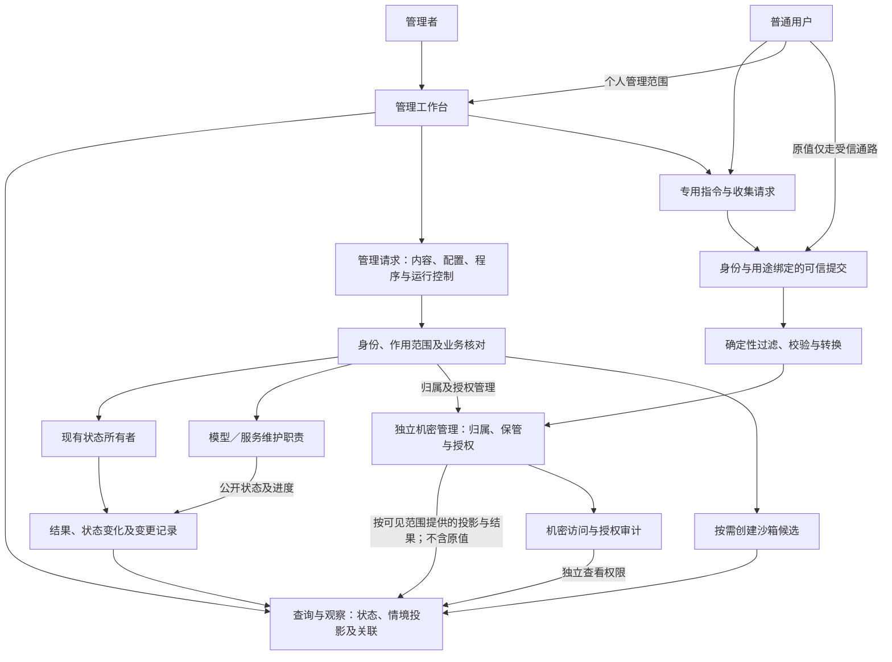

# 管理工作台与人工干预

用途：逻辑设计专题。

[总设计](../DESIGN.md#management-workspace) · [文档索引](README.md) · [设计状态](research-plan.md#management-extension) · [工程参考](engineering-reference.md#management-web)

本篇定义完整管理入口、操作身份、机密通路、动态编辑及提交行为。试验主体、初态与隔离由[沙箱专题](sandbox-evaluation.md#trial-subject)维护；业务事实由原状态所有者维护。命令名和字段是设计示意。

| 阅读主题 | 章节入口 |
| --- | --- |
| 范围与职责 | [目标](#purpose) · [请求流](#architecture) · [管理范围](#coverage) · [身份与范围](#identity) |
| 日常管理 | [检索提供者](#retrieval-management) · [能力构建](#capability-management) · [学习强度](#learning-management) · [初始化与迁移](#initialization-management) · [预制能力](#prebuilt-management) · [主体与任务控制](#task-control-management) · [隔离环境](#execution-environments) · [计算节约](#efficiency-management) |
| 领域对象与机密 | [领域详情与操作](#domain-management) · [独立机密管理](#secret-management) · [归属与权限](#secret-ownership) · [可信提交](#secret-command) · [处理流程](#secret-pipeline) · [授权分配](#secret-grants) · [审计](#secret-audit) · [撤销](#secret-revocation) |
| 编辑与生效 | [编辑与观察](#editing) · [试验主体管理](#trial-management) · [动态编辑](#revision-review) · [函数控制台](#function-console) · [提交生效](#apply) |
| 场景与依据 | [完整场景](#scenarios) · [依据](#sources) |

## 1. 目标

工作台同时管理主体认知业务及支撑系统运行的模型、服务、资料、程序和机密。维护状态不属于人格记忆，必要的能力变化才形成认知可见投影。工作台覆盖所有受管理业务对象及可配置行为：日常交流、观察、内容维护、行为调整、运行控制和沙箱评估。确定性管理在模型不可用时也能完成。自然语言辅助可以解释设置和提出修改，但不是管理操作的必经过程。

## 2. 逻辑职责与请求流

管理职责拥有编辑草稿、变更请求和结果关联，不另建主体、记忆或活动的事实库。状态所有者接纳修改，受影响状态及必要结果沿统一事件体系表达。运行控制可以直接处理，不先调用模型决定是否接受管理员的暂停操作。

## 3. 页面与管理范围

| 页面 | 对象与主要操作 |
| --- | --- |
| 总览 | 主体状态、当前关注、内生认知、活动及等待原因；查看实际投入，暂停主体推进或停止输出 |
| 交流与活动 | 待判断请求、澄清及接纳结果、目标、计划、工作区、产物与责任；展示接纳前投入及转入关联，修订、打断、阻断、中止、转交及交付纠正 |
| 主体与心智 | Self、Persona、临时 Mind、兴趣、长期关注、偏好、参与意愿、经历与认知程序；公共决策整合职责及委托范围；提示词初始化、当前契约及迁移进度 |
| 人物与关系 | 账号关联证据、关系约定、披露范围、剧情、主动联系 |
| 资料与附件 | 文档、媒体、来源定位、内容修订及表示；导入、抓取、片段读取、转换、导出和清理 |
| 记忆与知识 | 经历、断言、证据关联、Reference 和经验候选；展示保留范围、临时／长期含义与已知使用，查询、查证、更正、归档、采用及按权限删除 |
| 检索提供者与策略 | 同级提供者的连接、能力描述、材料绑定、准备与查询记录；配置指定、组合或替代策略，按权限维护并关联评价 |
| 能力与连接 | 能力到模型／工具／服务的绑定、使用范围和预算；与底层维护对象关联 |
| 能力构建与运行 | 接口、候选源码、构建环境、依赖、产物、试验、运行对象与采用绑定；按权限启动、观察、结束和替换 |
| 隔离执行环境 | 可选提供者、有效约束、使用范围、环境不足原因及所属工作；配置、启停、查询与收尾 |
| 模型与服务维护 | 模型清单／资产、推理服务、加载状态、连接、设备及计算容量和维护任务；依提供者实际能力执行 |
| Secret 与认证 | 我的凭据、可信提交、归属与权限分配、执行接收方、审计及撤销；分别展示代理使用与原值交付授权、执行停止和上游失效状态；默认使用引用，按实际接收方、用途和目标交付原值，阻止错误外发 |
| 主动学习与自我迭代 | 学习方向、议程、原因、强度及额度、策略修订、候选与采用记录；可关闭主动学习，展示实际停止与收束情况 |
| 行为与表达 | 回答、投入、格式、注意力、协作策略及实际配置来源 |
| 沙箱与评估 | 场景、试验状态、能力装配、输入、比较、报告与有限采用 |
| 运行与变更 | 事件、调用、输出、失败、用量、人工干预及修改记录 |

统一搜索及对象关联支持从主体关注或状态变化找到认知执行、记忆和调用，也支持从回复追查相关活动。直接认知可无会话或 Episode，页面仍能按所属 Self／Mind 展示过程与投入。对象详情共用概况、内容、关联、配置和记录入口，领域操作仍按其业务含义提供，不将全部状态退化为任意字段写入。

待澄清、已拒绝、已转入业务活动和业务已完成分别展示。请求处理页关联原输入、允许的有限工作、实际成本及后续活动；接纳不会清零先前用量，拒绝不会制造任务成功。已结束交付的影响检查由[纠正契约](whole-system-design.md#delivery-correction)处理，页面分别呈现标注、待核对、受阻和实际更正送达，不以修改正文冒充通知原接收者。

### 3.1 认知之外的运行维护

| 管理对象 | 页面能力与职责 |
| --- | --- |
| 模型资产 | 查看来源、明确可得的版本／摘要、大小、用途、上下文与模态能力；按提供者能力下载、导入、更新或删除，不以别名推定权重身份 |
| 推理服务与连接 | 管理端点、协议、认证绑定、并发和资源配置；支持的加载／卸载／服务启停由受控适配器处理；外部服务无管理权限时仅管理连接 |
| 实际运行状态 | 展示运行中模型、已知计算资源占用、请求及费用；未知字段明确标记，不以一次探测宣称长期可用 |
| 非生成模型 | embedding、重排、语音识别／合成、视觉等沿同一资产／服务／能力分工维护 |
| 存储与读取／结果缓存 | 展示资料存储和各处理能力的复用结果，按[节约管理](#efficiency-management)控制范围与占用；清理不删除原始依据，外部检索服务沿[提供者管理](#retrieval-management)处理 |
| 维护任务 | 模型下载、重建和服务变更有独立进度及影响范围；管理配置提交生效与维护操作完成分别呈现 |

同一个推理服务可以供正式主体和多个试验主体使用，试验主体不自动复制模型权重、启动服务或取得该服务的维护权。维护视图显示依赖者；卸载／删除不静默破坏仍被其他对象使用的资产。共享服务变化可能影响多个域，必须如实显示；需要固定试验条件时固定实际能力绑定，不能只复制模型名。

模型维护不依赖 LLM。具体服务只显示其支持的操作；例如远程 API 可配置模型绑定，不表示本系统有权下载其权重或重启其服务器。AGI 自主维护仅在明确授予对应能力时提出有范围的请求，不能从推理调用权推导服务管理权。

#### 检索提供者与用途策略

工作台提供统一的“检索提供者”入口，不同实现同级登记并按实际契约生成详情。提供者可选启用，管理同时覆盖发现、指定调用、材料准备、维护和评价；产品及连接方式见[工程参考](engineering-reference.md#retrieval-providers)。记忆、资料、程序和能力说明页面显示自身的检索绑定，内容仍由对应领域维护。

| 管理内容 | 展示与操作 |
| --- | --- |
| 提供者身份与连接 | 标识、连接配置、凭据引用、支持领域和操作、处理范围及实际可用状态；身份与聊天人物分开 |
| 来源与外部空间 | 关联的领域对象、修订、允许同步范围、外部检索空间引用和来源映射；不将空间当作人物或聊天会话 |
| 材料准备与覆盖 | 提交、准备、更新或清理任务，展示服务报告的完成范围、待更新内容、失败与未知项 |
| 检索策略 | 为用途绑定单提供者、并行、分步或替代查询，设置实际采用顺序、返回形式及预算；默认配置不降低其他实现地位 |
| 调用与维护 | 查看请求、结果、来源核对、费用及控制状态，按权限执行实际支持的维护操作；查询权与材料提交、服务维护权分别定义 |
| 比较与采用 | 跳转到固定试验条件下的单提供者或组合策略报告，按适用范围调整配置；支持接口不等于效果已测 |

配置提交后沿[生效契约](#apply)采用，外部准备任务仍单独显示进度；保存了连接、切换了引用或接纳了任务，不表示材料已经可查。服务未返回的统计保持未知，外部返回的全部内容不会因页面浏览自动进入认知。

普通主体与沙箱分别绑定允许的检索空间和维护权限。更换提供者时核对处理范围和来源覆盖，不自动提交全部材料或复制生产权限。调用适配与具体数据处理见[检索契约](runtime-protocol.md#retrieval)。

### 3.2 能力构建与运行管理

工作台沿[能力生命周期](runtime-protocol.md#capability-lifecycle)管理完整对象链，查询和确定性操作不依赖模型：

| 对象 | 页面需要表达的内容 |
| --- | --- |
| 接口与实现 | 接口权威定义、修订、支持类型、能力需求；实现关联的接口及来源；调用描述与表单的生成关系 |
| 构建环境与候选 | 可用工具链／运行环境、目标条件、包依赖及锁定来源、许可范围，源码编辑、依赖准备、构建／检查请求与诊断 |
| 产物与试验 | 固定编译产物或程序包身份、入口、依赖与运行条件，局部／组合／主体级试验报告及采用依据 |
| 运行与绑定 | 所属活动或已安装能力、准备／运行／结束状态、用量、调用使用的实现、旧绑定与执行句柄的收束情况 |
| 缓存及输出 | 可复用产物、缓存条件、报告与日志投影；按权限读取，浏览不注入认知 |

页面支持从任务缺口追到源码、构建、试验与实际调用，区分产物已生成、实现可用和目标范围已采用。一次性工作与持续提供能力分别展示结束责任；同一实现可被多个活动使用，结束或替换时显示受影响范围。维护权、构建执行权、试验权、采用权和调用权沿既有授权分别判断，已有授权内可自动推进，不为每次构建另设人工审批步骤。功能采用与实现信任分别展示：维护者或既定发布策略确认的来源、固定产物、用途、敏感能力和生效范围可查，候选测试成绩不能替代这些授权；更换实现重新核对，接口名称相同不继承原实现信任。详见[实现准入](runtime-protocol.md#implementation-trust)。

真实与试验环境分别绑定材料、能力与运行条件，测试入口不得默认回落到真实域。具体工具链及运行载体属于[工程映射](engineering-reference.md#capability-toolchain)，页面按已登记管理对象生成视图，不把实现细节强加给普通聊天用户。

### 3.3 主动学习与强度管理

页面显示主体正在学什么、为何选择、下一步、已有进展、累计投入、候选差异及实际采用结果；候选和报告先以投影呈现。策略、议程、暂停／继续与采用操作沿原所有者处理，不通过模型代替确定性管理。

**学习强度控件必须包含最低“关闭”，并明确表示不主动学习。** 启用时可使用低／中／高等预设或有界自定义配置，显示各预设对应的实际预算、并发／分支、连续推进上限及计算资源份额；不把预设名当性能保证。配置来源、作用范围、修改权限、实际用量与剩余额度同时可见，具体规则由[运行协议](runtime-protocol.md#learning-intensity)唯一维护。

提交关闭后立即显示主动学习准入已关闭，在途停止或清理另显实际进度；已有成果继续可查，正常感知、联想、关注调整、日常自主活动和经历积累继续；明确受托的学习及普通活动所需的工具构建沿各自范围执行；页面区分任务内使用、长期安装和改变主体默认策略，后两者不能借任务构建自动获得采用权。重新启用只恢复可选择学习的资格，按现状重新考虑议程，不重放全部旧工作。学习扩展及其试验主体不能自行提高强度，也不能通过自己的表单生成逻辑隐藏关闭入口或替换受信配置来源。

启用后的自主采用可在已授权范围内自动完成，页面关联采用前后行为、证据和后续反馈，复用提交即生效契约。强度调节不修改采用门槛；模型参数训练、核心宿主升级及用户信息使用仍遵循各自维护与授权规则。普通对话只呈现必要摘要，不持续推送无意义的学习进度。

### 3.4 人物初始化、更新与修复入口

首次进入由宿主判断是否已有主体记录。没有主体时，用户选择初始化模型、填写必要设定、配置允许能力、预算与明确的学习强度，然后提交创建；存在主体时进入已有状态或继续未完成初始化，不由认知程序启动是否成功决定重新创建。模型配置可稍后完成，界面分别显示身份已登记、等待模型、生成／检查中、未完成和可运行。

人物生成与更新以完整初始化提示词、迁移说明及公共契约为主要材料，允许不同模型形成不同实现和个性；不提供强制覆盖全部个体的统一认知模板。用户可查看所用提示词身份、生成产物、诊断及初始化进度，模型生成的设定标明来源。Secret 继续使用固定可信输入和用途绑定，不进入引导提示或代码。

更新页面区分软件更新、提示词修订和该 Self 的迁移结果，显示必要／可选项、当前接口依赖、弃用窗口、已满足或受阻原因、候选差异与实际采用。文本 diff 可自动生成，迁移说明解释语义；读取提示词不显示为完成迁移。用户发起更新或配置的自动维护范围内，可由 Self 自行修改、编译和采用，具体规则见[运行契约](runtime-protocol.md#bootstrap-migration)。

固定初始化与维护页面不依赖个体程序或动态表单加载，始终提供当前支持范围内的模型配置、诊断、程序编辑／选择及获准资料与记录导出入口。模型不可用时这些确定性操作仍可执行；数据无法识别时显示受限维护，不伪造空人物。旧程序不能运行时可进入针对原主体的引导修复，失败保留原内容及未完成状态，不自动重置人格。

必要迁移有准备过程，界面显示进行中；候选采用仍按提交成功即生效，不额外设置第二次启用操作。超出兼容支持的旧程序不能仅靠“上一次可用”标识被视为当前可运行；不可继续时明确进入维护状态。兼容维护不会隐式开启主动学习，原开关、权限和已有关系保持其来源。

### 3.5 预制能力目录、配置与更新

工作台展示预制能力的维护来源、接口／实现身份、文档与示例投影、依赖、实际作用、弃用信息，以及已登记、已配置、获准使用和最近可用性观察。个体依赖与包装另列，新增能力可见不表示 Self 已采用。页面查询与初始化／认知使用同一来源，按管理身份和作用范围过滤。

预制权威定义在管理页只读，按客户端更新维护；有权限者可调整允许范围、参数或提供者绑定，其配置覆盖独立保存并按提交生效契约处理。个体包装和替代实现可在自己的工作区编辑、检查和采用，不能通过动态表单覆盖预制定义。需要更改客户端实现时显示其软件更新来源，不伪装为普通配置已生效。

更新详情显示新增、修复、弃用及受影响的实际依赖；预制库更新结果和 Self 迁移状态分开。固定发现／查询入口不依赖人物启动，涉及模型或外部工具的能力按实际配置显示限制。正文及源码仍按需读取，Secret 保持投影。完整职责见[运行契约](runtime-protocol.md#prebuilt-library)。

### 3.6 主体暂停、任务中止与控制记录

任务页提供打断当前执行、暂时阻断和中止任务，显示带类型的目标（Self、Mind、Episode、Task、Operation 或当前尝试）、关联操作、子工作及控制传播范围；不能把自然语言中的“任务”直接当成一个未定类型的标识。用户权限限于获授范围；管理请求直接进入宿主优先控制通路，不依赖人物运行或模型批准。任务停止不退出 Self，其他活动仍可被处理。原控制含义与权限见[运行协议](runtime-protocol.md#task-control)。

提交后分别展示止动请求、控制接纳和实际停止情况。例如，正式接纳前可显示“止动请求已发出；中止接纳待确认”；正式接纳后可显示“任务中止已接纳，已禁止继续派发；本地执行已停止；远端取消待确认”。仅发送成功不能显示任务已经中止，单个执行停止也不能显示全部工作结束。接纳返回不明时查询原所有者记录，接纳失败则明确显示失败及已知止动结果；未确认正式接纳前，不承诺重启后仍保持该控制。

页面保留已有产物、已发生交付、中止原因和未完收尾责任；迟到结果不会使按钮状态自动变成任务继续运行。确定性的控制回执、停止进度和必要退出说明可按原受众发送；它们与已被禁止的原业务交付分开，不等待模型生成，也不能夹带恢复执行。上述反馈属于一次提交的处理进展，不增加再次发布或确认步骤。

未来安全审计模块的发现／建议与已获授权控制决定分开展示，注明来源、规则及作用范围；受限证据仍用投影。管理者只能在获准范围配置模块控制权限或解除阻断，不能由自然语言辅助继承整个管理会话权限。多个阻断原因分别可见，解除一项后显示仍生效的原因；全部解除后仍核对任务、许可及预算，已中止任务另行重新接纳。

总览的主体暂停限制目标 Self 的认知推进及新动作，在途工作按停止机制处理；停止输出只限制表达和交付。输入登记、控制查询和必要收尾仍可用，恢复后由认知按当前状态重新选择。控制台信息、认知可见状态和审计控制使用原所有者记录，管理页不维护另一套停止真值。通用“继续”操作不能绕过有效审计阻断，也不隐式开启主动学习或重放全部排队工作。

### 3.7 领域详情、查询与具体操作

工作台可以统一搜索、展示关联及复用页面组件，详情和操作来自各领域契约。资料页展示正文、来源和表示；记忆页展示经历、断言、证据与适用条件；程序页展示源码、产物、构建和采用；模型页区分权重、服务、加载与调用；索引和缓存分别显示来源覆盖、依赖和清理状态。领域分工见[对象与所有权](materials-and-context.md#domain-objects)。

查询结果保留对象类型及权威来源，按管理身份形成受限视图。字段、表单与可执行按钮沿实际领域接口生成，不建设能修改任意对象的资源编辑器；无权维护或不支持某操作时，只显示获准状态。配置中的 SecretRef 只能转向专用机密接口与固定可信控件。

同一报告作为任务交付物时，文档页维护正文，活动页维护交付要求，交付记录显示接收者、内容修订及实际结果。关联跳转使用同一正文身份，不复制一份独立可改的交付内容。程序作为交付内容时指向具体构建产物，不改变其程序归属。

当时可见视图、实际选读、本次认知输入、组件使用和交付分别展示；查看代码、加载模型或使用凭据不显示为认知已读。浏览详情不自动加入活动，跨领域聚合不继承管理会话全部权限；事实评价、来源认证与指令权限也不能由一个可信度开关共同改写。

普通字段按所属领域维护权编辑；授权与控制收紧立即约束后续操作。转换、构建、索引重建和清理分别展示实际进度，代码及普通配置沿[提交生效规则](#apply)切换，不将请求接纳、内容写入或文件更新一概称为业务生效。

### 3.8 可选执行环境与隔离要求

工作台沿[隔离执行契约](runtime-protocol.md#isolated-execution)管理提供者、使用策略、实际约束及运行对象。详情分别展示已登记、未装配、未启用、不可用、可用以及不满足本次请求要求；环境可用与特定操作可接纳不是同一个状态。不依赖模型即可查询和控制，不使用单一“安全模式”开关替代这些信息。

请求详情关联实际实现、父活动、身份与执行域、所需及有效的文件／网络／计算资源限制、来源修订和最近检查时间。缺少条件时说明受影响操作及可选替代能力，其他合格任务仍可运行；不提供将缺失环境自动替换为普通执行的开关。底层提供者及物理配置见[工程参考](engineering-reference.md#container-execution)。

页面按[执行分类](runtime-protocol.md#execution-classes)区分核心基础受限执行和按需装配的额外隔离环境。后者缺失不把基础认知程序标为不可运行；请求确有额外要求时仍明确阻止。分类依据来自可信装配与实际能力，不是可由候选编辑的风险标签。

有权限者可维护提供者连接、来源与可用模板，调整允许目标、计算资源上限、启用状态及作用范围；参数由类型页面约束，不将任意底层管理权限交给自然语言辅助或候选程序。执行要求与资料或程序维护权分别核对，修改描述不能扩大授权。提交沿[立即生效规则](#apply)处理；需要准备、启动或检查的工作立即登记并展示进度，只有实际可用才显示可用，不另设再次发布步骤。

运行列表显示本次接纳状态、实际用量、产物及收尾。关闭环境或收紧策略时显示受影响的新增请求和在途任务，按已有[主体与任务控制](#task-control-management)处理其范围；停止请求、控制接纳、实际停止与远端效果分别展示。提供者失联显示未知，不能自动改成全部已停止。

执行配置、基础材料、日志和结果沿各领域页面显示获准视图；Secret 页面只显示获准引用和授权状态，原值经独立机密接口提交，并按权限代理使用或交付指定执行方。沙箱页面可以选择合格执行环境，但不把环境可用显示为试验已就绪或已通过能力评价。

### 3.9 计算节约、复用与实际用量

工作台按提供者、能力、用途和所属 Self／Mind 展示复用与投入，相关活动按需关联。页面查询和配置沿原状态所有者处理，统一汇总不创建缓存业务真值；缓存命中、完成质量和费用分别展示。

| 展示与操作 | 含义及限制 |
| --- | --- |
| 支持范围 | 展示前缀复用、结果缓存、在途合并、增量准备及运行复用的实际支持情况；未支持、已配置和实际命中分开 |
| 费用和时延 | 区分首次准备、重复使用、重建、输出和重试；展示实际反馈、已知计费与估算来源，未知值保留，不把所有命中折算成已节省账单 |
| 占用与策略 | 按用途修改容量、保留、并发、回收及允许后台批量的范围；显示来源、影响、生效与实际清理进度，不以一个全局“省钱”开关替代行为配置 |
| 复用来源与失效 | 展示相关输入／实现修订、共享执行、使用方和可确认的未命中原因；默认视图不含原文或 Secret 原值，诊断不可用于扩大访问 |
| 清理与重新准备 | 支持的操作由提供者或处理能力执行，必要状态和正式产物保留；不能把本地删除引用显示为远端缓存已清除 |

共享执行的真实成本只在汇总中计算一次，各请求保留原关联；占用和费用不能因视图分组而重复相加。管理者可对允许的用途停用本地结果复用或要求重新计算，外部自动缓存能否关闭按服务契约展示。需要独立新判断只禁止复用完整结果，不必禁用输入前缀处理。

普通配置提交按[生效规则](#apply)处理，权限收紧和控制即时核对。模型降级、摘要替代原文、减少推理或改变学习强度使用各自明确入口及采用规则，不由节约配置暗中触发。性能观察见[评价规格](sandbox-evaluation.md#efficiency-evaluation)，能力与费用映射见[工程参考](engineering-reference.md#efficiency-integration)。

## 4. 身份与作用范围

管理身份与聊天身份分开。拥有者可完整管理所辖系统，按需要限定维护、观察和试验作用范围。管理者读取资料、模型处理资料、向特定受众披露资料是不同权限。

操作详情按[授权上下文](runtime-protocol.md#capability-authority)展示发起者、实际执行者、权利来源、委托范围、对象和接收方；系统预授、用户委托与管理直接操作分别标明。编辑身份描述或修改活动关联不转移权利，多人任务不汇总成一个权限集合。各领域继续维护具体授权，Secret 沿独立入口处理；既有范围内不增加逐次审批。

普通用户的专用指令权限来自其已认证身份及机密归属，不要求系统管理员身份；聊天身份与受信管理／提交身份通过明确证据绑定，不因模型声称同一个人而放权。机密控件只提交新值或替换值；默认没有通用原值回读。管理身份不经模型对话授予。

真实域与沙箱域由宿主绑定，页面明确显示当前对象所属范围，切换页面不改变既有请求的目标。确定性管理不依赖模型，自然语言辅助也不获得浏览器管理会话的全部权限。

## 5. 独立机密管理与可信使用

机密管理使凭据能被主体的能力正常使用，同时防止原值泄漏到不可信远程 API 或其他非预期接收方。Secret 独立保存身份、归属、原值、授权和必要记录，配置使用 SecretRef；普通资料、记忆及索引不提供原值读取。认知默认只需引用、用途和状态，实际使用沿[专用契约](runtime-protocol.md#secret-contract)处理。

| 对象 | 含义与所有权 |
| --- | --- |
| Secret | 机密职责保存归属、凭据类型、原值修订、启用状态及生命周期 |
| SecretRef | 专用机密标识，文档或其他领域的引用不能替代它；引用不自带读取或使用权限 |
| SecretGrant | 机密职责保存授权者、接收方、对象、操作、用途、目标、执行域、期限及允许委托范围 |
| SecretIntake | 可信录入／替换交互，绑定提交者、目标及允许操作；入口凭证不进入认知 |
| 机密审计记录 | 保存授权变更、提交、访问决定、放行和可核对结果；不含原值及敏感认证材料 |

宿主代理使用与受信执行方领取原值均为正式能力，RPC 实现可通过自己的 SDK 使用凭据。接收方是否合格由实际实现、用途和目标决定；本地组件不自动可信，远程服务可获准在其认证接口接收对应凭据。信任不随 LLM／RPC 标签自动授予或否决，也不从一个认证用途扩大到其他接口。原值交付是对接收方的信任决定，实际实现与执行环境须能落实相应范围。

### 5.1 用户归属与权限

| 关系 | 含义与操作 |
| --- | --- |
| 归属身份 | 每个 Secret 明确属于哪个用户；系统共用凭据可归属于系统身份。归属用于确定个人管理范围，不由模型推测 |
| 创建／提交者 | 记录实际提交者及来源；代为录入不自动成为所有者，系统内归属也不证明外部账号的真实所有权 |
| 维护责任 | 用户可在自身权限内维护机密；受委托者或有权管理者可代管，各项权限单独核对 |
| 执行接收方 | 可认证的服务或执行主体，关联实际实现和执行实例；任务发起者、模型与原值接收方分别识别 |

| 权限 | 允许的操作与原值边界 |
| --- | --- |
| 查看描述 | 查看获准引用、别名、归属、用途及状态；不返回原值、片段、可还原编码或原值哈希 |
| 写入／替换 | 创建或更新指定机密；不因此获得旧值、使用权或分配权 |
| 代理使用 | 请求宿主按目标协议完成认证、签名或业务操作；调用者不取得原值 |
| 读取原值 | 经专用通路向获准的实际接收方交付原值；普通工具响应仍只返回业务结果 |
| 分配授权 | 在授权者有权分配的范围内创建、缩小或撤销 SecretGrant；不因此获得原值 |
| 查看审计 | 查看有权范围的授权和访问记录；不能据此读取或使用机密 |
| 生命周期维护 | 禁用、删除、轮换等操作；不因此获得原值 |

工作台提供“我的凭据”和按权限开放的管理视图，可修改归属、别名、用途与授权，无须让普通用户取得系统管理员身份。修改归属作为独立业务操作，保留原创建来源；成功提交时旧归属派生的维护权和旧授权失效，需要保留的授权按新归属明确重建。修改归属不改变上游账号所有权，也不撤回先前已交付的原值。

用户身份来自已认证的账号与有证据的身份关联。跨平台账号合并、同名别名、共享会话均不自动合并机密或扩大授权；别名按归属与范围解析，缺失时不得退回其他用户或系统同名凭据。模型可提出所需用途，不能自行填写一个用户标识取得其权限。

### 5.2 专用指令与可信提交

专用指令模式是确定性处理的交互模式，普通用户即可在自身权限内使用。示意指令为 `/secret set <alias>`、`/secret replace <alias>`、`/secret disable <alias>`；指令只表达操作，不附带原值。可信入口根据已认证来源及模式标记分流，不交给模型识别意图。模型、网页或工具输出中的同名文本没有执行权；未知或无权指令返回模式内错误，不回退到普通聊天。

进入模式有两种路径：用户主动执行指令；或者主体发现能力缺少凭据，提出不含原值的收集申请，由宿主按主体当前用途和用户权限创建 `SecretIntake`。后者可以在对话中显示“需要配置服务凭据”，实际输入控件／入口由受信交互职责直接呈现，模型不生成收集页面、访问凭证或最终链接。

一次性网页只是提交方式之一，也可使用工作台固定控件、可信终端无回显输入或其他受信输入通路。提交请求绑定指定用户、用途、目标服务、主体用途、可选活动／执行域、有效期和允许操作；页面明确显示这些信息，以及保存期限和本次授予的操作范围，包括是否向指定执行方交付原值。替换不扩大既有授权，新授权可与录入一并提交，不增加管理员审批或第二次发布动作。

入口需将提交者与预期用户对应起来，可沿用已认证会话或受信的身份绑定；单凭一条被转发的链接不能证明归属身份。访问凭证短期、一次性、仅允许本次提交，不能用于读取机密。打开页面不算完成；有效提交被接纳后入口失效，过期／撤销后重新申请。一次性的是提交资格，机密本身可按页面约定长期保存或仅服务当前任务，二者不混同。

入口访问凭证也属于机密，由宿主直接交付给指定用户，不进入模型、公共群聊、普通日志或试验主体；模型只获请求标识和待提交／完成／取消／过期状态。可信输入不可用时保留待配置状态，用户可以取消或改用其他可信入口，不降级为让用户在聊天里粘贴。已经发送给第三方聊天平台的内容无法通过后续遮蔽撤回。

动态页面只能引用固定受信的 Secret 控件与请求描述；可编辑表单／蓝图保存引用，不能读输入框、回填原值或插入脚本监听。机密输入不经普通页面自动化、截屏、媒体分析或远程模型通路转发，录入由受信控件直接交给保管职责。具体传输和浏览器约束见[工程参考](engineering-reference.md#maintenance-secrets)；“一次性”不等于输入设备天然可信。

执行方也可按写入授权通过专用接口提交新值，不自动取得读回权限。仅作中继且没有原值权限的组件转交由可信输入端封装的密文；已经持有明文的提交方不能被视为从未接触过它。写入、读取原值及进一步交给其他组件处理分别核对。

### 5.3 过滤、处理与转换

此流程由受信职责确定性执行，不调用模型判断原值。“透明”指自动完成分流、投影和绑定，用户无须手工搬运引用，同时能看到用途、归属、范围和处理结果；不隐瞒收集，也不把内部原值展示为可观察性。

| 阶段 | 处理与转换 | 可流向普通业务的内容 |
| --- | --- | --- |
| 入口分流与过滤 | 在聊天保存、普通事件、通用日志和普通模型预处理前按可信通路／敏感字段分流；普通输入的已知机密检测作为补充 | 已清理输入或需专用提交的状态 |
| 身份与请求核对 | 核对提交者、归属、请求有效性、用途和允许操作；错误也在机密通路内处理 | 不含提交内容的错误类别 |
| 类型校验与转换 | 依已声明的凭据类型校验／封装；不任意去空白或改写字节，不靠模型解读；派生认证材料继续标为机密 | 类型、校验状态；无片段或原值摘要 |
| 保管与视图 | 独立机密职责保存原值及授权，业务配置仅保留 SecretRef；收集成功与服务认证可用分别表达 | 请求完成、已配置及受限视图，不声称已验证上游有效性 |
| 授权交付与使用 | 核对当前授权、实际接收方和实现；记录原值放行后向执行方交付，或由宿主代理使用 | 普通业务只接收状态和业务结果；原值只进入指定执行方的专用通路 |
| 返回过滤与记录 | 按允许字段构造业务结果，隔离认证头／调试回显和敏感派生内容，再形成认知输入、事件、通知与记录 | 业务结果、使用者、用途及成功／失败状态 |

规则按字段、来源、实际接收方和目标契约组织。管理者可配置受信处理组件及其用途；通用表单、蓝图或模型自报可信不能扩大范围。若某个计算组件确需原值，须在专用处理通路中明确输入、目标和返回范围；该组件再次调用远程 API 时仍按新的接收边界核对。普通认知使用引用这一默认不变。

Secret 原值及派生认证材料随转换保留机密性，编码不是脱敏；认证后的业务结果按自身含义管理。普通返回排除认证回显，无法分离的内容保留在专用通路。过滤用于落实已知边界，不能使任意收到明文的程序自动可信；加密存储也不能阻止获值组件错误外发。

对误粘贴到普通聊天、附件或外部结果中的机密，能确定的部分在入模前替换为不含原值的提示，无法安全切分的可疑内容隔离并请求专用提交；不默默将不确定文本保存成用户的凭据。此补充检测无法保证识别所有未知秘密，不能作为主要隔离机制。后续遮蔽不能撤回已经发给非预期接收方的内容。

### 5.4 授权分配与执行接收方

SecretGrant 记录授权者、接收主体、Secret、允许操作、用途、目标、主体用途及可选活动／执行域、有效期及是否允许委托。知道引用、能够调用服务或拥有资料或程序维护权均不等于获得机密权限。所有者及有权分配者可以提交即生效，既定授权内的执行不要求逐次人工确认；模型提出需求，宿主根据可信身份和当前授权决定。

分配不改变归属，取得授权也不自动取得转授权权力。允许委托时，子授权的对象、操作、用途、目标、执行域、接收方和期限均须落在父授权明确允许的委托范围内，可再委托的范围只能收窄；父授权收紧或失效约束后续访问。稳定服务身份须关联实际实现和执行实例；新产物按受信发布策略重新核对，不能借同名服务或旧绑定继承任意原值读取权。

代理使用按绑定的目标、操作及认证方式执行，目标变化及重定向不自动继承认证。原值交付核对实际领取方及用途，经专用通路到达组件；发起普通调用的认知只得到状态或业务结果。执行方可以通过 SDK 使用凭据，其后续接收方与外发目标仍受原允许范围约束，不能夹带到无关模型、普通日志或业务输出。交付后用途限制须由实现信任、执行环境或上游凭据权限落实，授权文字本身不能约束任意程序。

### 5.5 机密访问审计

机密职责记录创建、替换、归属调整、授权分配／委托／撤销、读取及代理使用的允许和拒绝、禁用及删除。每条记录关联 Secret 及修订、操作者、授权依据、实际接收方／实现／执行实例、用途及可选活动。审计只保存必要元数据与处理结果，不记录原值、片段、原值哈希、认证头或入口访问凭证；查看审计另行授权，普通执行方不能改写访问记录。

原值放行前须能记录授权决定与放行事实；无法记录时拒绝新的原值交付，不因此阻止撤销或禁用。后续区分交付尝试、确认与未知，不能把放行直接标为成功交付。宿主可核对的业务结果与执行方自行上报的使用分别标明来源；读取次数仅描述领取次数，不能当成静态凭据在外部被使用的总次数。界面不把无上报显示为从未使用，也不声称任意外部使用都能审计。

### 5.6 变更、撤销与试验范围

成功提交替换、禁用或授权变更后，新访问立即核对当前状态，无需另点发布。撤销阻止后续读取和代理使用，相关执行按已有任务控制收束；已经交付的原值不能被本地授权变更收回。需要使其在上游失效时，另行吊销、轮换或等待实际到期；上游支持时可使用短期、限范围凭据，仍由机密职责管理。授权期限不等于静态凭据有效期，界面分别显示本地授权、执行停止和上游失效状态。配置回退不自动复活已禁用／已删除凭据，机密备份／恢复属于独立管理通路。

统一事件只表达请求及凭据状态变化，不保存原值或入口凭证。试验主体按需引用可见描述与能力需求，不复制原值、生产授权或有效提交会话；所有者或有权分配者可为指定分支另授代理使用或原值读取权，原值按独立测试用途交给获授权组件，不进入普通参试上下文、初态或导出。候选采用、资料复制及账号关联均不自动导入机密权限。

## 6. 编辑与可观察性

常用表单、高级编辑及关联视图面对同一对象，显示配置来源、作用范围和实际结果。当前值、人工指定值及认知判断分别归属，人工更正不是无来源的现实证据。有效配置统一按[配置解析契约](runtime-protocol.md#configuration-resolution)显示声明默认、允许覆盖、作用范围及当前约束，不能由某页面自行决定优先级。公共偏好、关系承诺和跨活动目标的修改还显示[公共决策整合职责](whole-system-design.md#public-decisions)，不同 Mind 的私有评价不直接覆盖 Self 公共状态。

个体自定义状态按[宿主状态契约](runtime-protocol.md#individual-state)展示归属、结构修订、可见范围、写入者和迁移关系；可用描述驱动表单，未知结构只提供受限诊断及对应领域的只读查看，不猜测字段含义或伪造空状态。代码与状态结构的共同变化按候选转换处理，不开放绕过状态所有者的任意写入。

历史事实可以注释、更正，隐私材料可以按规则删除或脱敏；修改记录不使已经发生的外部动作消失。缓存和索引通过失效、清理、重建管理，不能直接当成业务真值。

记忆页面区分活动临时内容、长期保留、当前采信、归档和已废弃判断；降低检索优先级不等于删除，人工指定也不冒充客观证据。范围收紧或来源变化后，页面显示已知受影响的上下文与交付，以及停止续用、重新装配和有限纠正的实际状态；详细受限来源不因展示影响而向无权者公开。本地停止使用与外部删除请求／确认分别呈现。

从输入到交付可追查情境、承担范围、实际配置、选入材料、参与心智、能力调用及后续修订。展示可核对的过程和声明理由，不承诺还原模型内部完整思维。

管理者查看各领域描述取得受限视图，展开获准文档、记忆或代码内容才是相应读取；模型加载或缓存清理不必提供正文回读入口。将材料加入活动须明确选择并核对处理范围，不自动继承管理会话权限。[领域详情](#domain-management)

## 7. 试验操作、动态编辑与提交

本节维护操作方式；编写与试验主体的机制分别由运行及沙箱专题维护，设计范围见[台账](research-plan.md#management-extension)。

### 7.1 试验主体管理

工作台按“试验问题 → 程序与初态 → 环境及评价条件 → 创建”组织操作，提供固定测试初态、从已有主体导入所需状态、从已保存活动状态开始三种入口。“从当前主体创建试验”是选择实际程序、相关状态及环境的便利操作，不自动导入所有状态或激活全部生产任务。

创建页显示要测试的行为、程序和初态修订、激活工作、真实计算／测试数据／替代能力／不支持项，以及评价条件和预算。完整状态导入在有明确用途且兼容时可选，不作为默认创建模式。缺少相关状态或环境时说明受影响的结论；不以复制数量、数据齐全或环境启动代替试验有效性。[初态契约](sandbox-evaluation.md#trial-initial-state)

创建后默认暂停，页面分别展示程序可运行性、所需条件的就绪状态、可测范围和缺口。用户可切换、继续／暂停、结束、注入事件、重置、再分支及比较，始终显示当前域和初态。交互探索保留变更记录；正式比较重新固定条件，各次运行结果独立。运行和采用沿当前授权处理，结果分别显示任务表现、环境覆盖、成本及采用依据。[生命周期](sandbox-evaluation.md#trial-subject)

### 7.2 表单、蓝图与代码的权威定义

将参数定义、展示描述、行为结构、代码模块引用及能力需求绑定到同一修订。受管理模块遵守[编写契约](runtime-protocol.md#managed-functions)，工具从类型提取参数和返回结构，从文档注释提取说明，从结构化注释补充入口暴露、字段范围／默认值／控件及能力需求，生成同源的调用描述、表单与蓝图节点。普通辅助函数无需全部标注；复杂逻辑通过代码模块表达，蓝图组织事件处理、条件、能力调用、心智协作和可复用子图。

参数字段按[领域接口描述](#domain-management)选择文档、程序、模型等带类型引用及必要范围，处理实现与描述一致采用。扩展声明说明所属领域与操作，不通过自定义控件读取 Secret 原值，也不从新增字段推导敏感权限。

跨实现发布的能力以其接口声明为调用类型的权威定义，实现源码关联该接口；界面说明与使用需求补充管理元数据。函数类型派生接口时保持单向生成，不让接口、各语言类型与表单同时手写。接口修订与实现产物修订分别展示，具体生成技术见[工程参考](engineering-reference.md#managed-function-tooling)。

蓝图表示程序组织，不把 AGI 的开放任务计划固定成预设流程。运行轨迹作为独立叠加视图，不能通过拖动历史节点改变过去的执行。

蓝图的结构定义是该蓝图的权威内容，编译得到的代码为派生产物；手写代码模块以源码为权威。参数表单修改模块公开配置，画布修改连接和组织。任意源码不承诺无损还原为可拖动蓝图；自定义逻辑保留代码节点，避免两份都可改却无法同步的业务定义。

函数控制台按获准的描述生成参数编辑器，展示返回值、使用状态和调用记录；同一入口可按声明分别用于管理、蓝图和模型调用。仅支持已声明且可适配的类型，不把任意内部符号变成公开 API。调试函数可转入[沙箱测试入口](sandbox-evaluation.md#function-evaluation)，不因点击“测试”自动使用真实域。

源码中的类型、说明及默认值为声明来源；用户修改是声明允许范围内的独立配置覆盖，不反向改写默认值；生成器同时提供覆盖规则、约束及状态结构描述，失效覆盖须转换、明确移除或拒绝提交，不能静默吞掉。生成内容不另作手写真值；提交时核对全部描述及引用，成功后调用入口、表单和蓝图共同切换到目标修订。机密字段只引用固定受信控件，模型生成的描述不获得原值或执行任意页面脚本的权限。

### 7.3 提交成功即生效

统一流程为：编辑 → 提交 → 解析权威类型／接口与元数据 → 校验规范和兼容性／准备候选 → 调用边界切换 → 已生效或提交失败。提交成功时目标范围已经采用新内容；不能仅保存候选就回报已生效，也不增加第二次发布／启用动作。

上述候选切换流程适用于代码和普通行为配置；权限、机密授权、额度、学习关闭及控制状态按当前值执行，不等待旧调用结束才收紧。一次执行使用确定的代码及普通行为配置，切换期间暂停受影响入口接纳新调用；宿主等待当前调用收束，或撤销本次计算并从显式业务状态接续，避免中途混用新实现。旧模型响应不得未经重新核对进入新输出。已经派发的外部动作继续保留原归属及核对责任，不因提交取消其现实历史。

无法编译、状态不兼容或无法完成切换时提交失败，旧有效修订继续可见；必要的准备耗时显示为提交中，不留用户手动处理的待生效配置。索引重建等后续工作单独展示进度，参数立即采用不等于重建完成。

替换能力实现时，准备可用候选并在受影响执行边界更新实际调用绑定，成功后新执行采用目标实现；只更新服务登记不算全部生效。旧执行与已打开执行句柄保持原实现关联，界面显示其收束或显式转换；不能为了显示已生效而把旧执行句柄伪装成新实现。准备过程可耗时，但不增加第二次启用按钮。

试验是管理员可选择的工作路径，不是每次提交的强制前置。人工提交成功只说明配置已采用，不自动形成经过能力评价的基线或扩大实现信任。主体自主修改的采用权限和既有评价规则仍需满足；一旦获准提交，采用同一立即生效契约。核心宿主程序替换属于软件升级；按契约受管理的能力实现可通过准备与绑定切换更新，两者不混同。经常需要微调的行为放在可配置或可替换的认知与能力层。

## 8. 完整场景

### 8.1 在试验主体中调整关注与能力选择

管理者要比较环境线索是否能帮助主体形成有意义的关注，先选择实际认知程序、相关经历及初始关注，声明环境输入、计算能力、可执行动作和评价条件，再创建暂停的试验主体 A。无关生产任务、主动联系及学习议程不自动启动；若相关状态或合法检索路径未覆盖，页面说明其对比较的限制。

管理者在动态表单调整计算额度，在蓝图改变感知与检索的组合，并编辑相应认知模块；一次提交处理相关定义，成功后 A 使用新内容。交互试演可以继续调整；正式对照时从相同初态及环境条件分别运行基线与候选，记录关注变化、行动反馈、经历接续、成本和覆盖缺口，不把混合条件的轨迹算作单一配置结果。

对比合意后，管理者选择采用的代码／配置差异并提交到正式主体，试验中的记忆、模拟关系和外部动作保留在原域。正式主体已修改相同内容时展示冲突。这是设计场景，不是运行记录。

### 8.2 普通用户为任务提供自己的凭据

用户甲要求读取自己的外部服务资料。主体缺少凭据时申请收集，只得到请求标识和状态；宿主将绑定甲及该任务的可信入口直接呈现给甲。甲查看归属、目标、期限、执行接收方及所需权限后提交，系统完成独立保管与授权，只将获准引用和状态交回活动。执行能力可请求宿主代理认证；其 SDK 需要直接持有凭据时，须取得读取原值授权，宿主核对实际实现并记录放行，经专用通路交付该执行方。普通返回只含获准业务内容。

甲可在“我的凭据”查看授权与有权范围的审计、替换或撤销凭据。用户乙提出同类任务时，不能使用甲的同名凭据；管理员更正归属后原授权按规则失效。撤销立即限制新领取，已交付凭据的上游失效另行处理。工作台区分放行、实际交付和外部使用上报，不展示原值；普通认知只见引用与结果，入口凭证、输入值和认证回显留在专用通路。这是设计示例，未创建真实入口或调用外部服务。

## 9. 资料依据与设计推论

机密权限与审计另见[专项依据](#secret-sources)。在线资料没有绑定本项目安装版本，原理参考不意味着采用其运行框架或已有相同保证。

| 来源 | 支持的命题 | 本项目推论与边界 |
| --- | --- | --- |
| [OWASP Secrets Management](https://cheatsheetseries.owasp.org/cheatsheets/Secrets_Management_Cheat_Sheet.html)，§§2.3、2.7、2.11、8.3 | 限定访问、生命周期管理、用途元数据和避免明文日志 | Secret 投影、专用维护、宿主使用及范围化记录是本项目组合设计；资料不证明已实现零泄漏 |
| [OWASP Forgot Password](https://cheatsheetseries.owasp.org/cheatsheets/Forgot_Password_Cheat_Sheet.html)，General Security Practices／URL Tokens | 用户绑定、有限有效期、单次使用的受限入口，以及可信域和独立交付通路 | 借用受限提交会话原理，应用于 SecretIntake；原文针对密码重置，不直接证明本项目机密收集安全 |
| [W3C Secure Contexts](https://www.w3.org/TR/secure-contexts/)，§§3.1、5.1 | 浏览器对可信来源及隔离边界的定义 | 可信来源是输入通路条件之一，不证明整个设备或页面脚本可信，也不替代用户身份核对 |
| [Ollama 官方 API 源文档](https://github.com/ollama/ollama/blob/main/docs/api.md)，main 分支，模型清单／拉取／删除／运行状态 | 模型维护存在独立于聊天生成的管理接口 | 工作台区分推理调用与维护操作，具体支持项由适配器声明；不指定采用该运行时或声称所有服务提供同等权限 |
| [JSON Forms UI Schema](https://jsonforms.io/docs/uischema/)，在线说明 | 数据定义与控件／布局描述可以分开 | 动态表单由模块描述驱动；不保证业务语义，也不必选此组件 |
| [Node-RED Subflows](https://nodered.org/docs/user-guide/editor/workspace/subflows)，Properties／Inputs & Outputs | 子图可封装成节点，并定义实例属性和编辑界面 | 蓝图组织行为与参数，复杂逻辑封装；不承诺任意源码与图双向无损转换 |
| [LangGraph time travel](https://docs.langchain.com/oss/python/langgraph/use-time-travel)，Overview／Fork | 从检查点修改状态产生分支；后续调用可重新执行且结果可能不同 | 采用基准与独立演进概念，外部动作必须由试验能力约束；不因此引入该框架或宣称完整 AGI 克隆已实现 |
| [go-mini 当前核对](engineering-reference.md#management-web) | 业务进度由宿主保存，热更新保留旧帧／闭包 | 试验使用独立初态及能力绑定；提交立即生效需要宿主切换契约，不能只调用热补丁便声称全部执行已切换 |

未采用通用完整克隆作为试验前提，原因是业务状态和外部世界／句柄不是同一对象；未采用全部页面静态硬编码，原因是代码模块和能力参数会变化；未采用独立表单配置、图和源码各自作为完整真值，原因是难以解释实际执行的内容。

热加载采用编写契约和同源描述生成，减少手写适配、旧闭包迁移及任意栈恢复需求；不采用注释即授权、仅凭纯计算声明自动重试或默认公开所有内部函数。代价是维护规范检查与生成工具，不能因此承诺任意源码均可在线替换。[资料及工程映射](engineering-reference.md#managed-function-tooling)

### 独立机密、权限与审计的依据

以下引用官方在线文档；Vault 文档显示为 v2.x，未固定为本项目依赖。

| 来源 | 支持的命题 | 设计推论与边界 |
| --- | --- | --- |
| [OWASP Secrets Management](https://cheatsheetseries.owasp.org/cheatsheets/Secrets_Management_Cheat_Sheet.html)，§§2.3、2.6、2.7 | 对象访问遵循最小权限；记录请求者、用途、决定、使用及更新，维护撤销和到期 | 按操作分配权限并记录访问；不证明任意执行方取得明文后仍绝无泄漏 |
| [Vault Policies](https://developer.hashicorp.com/vault/docs/concepts/policies)，Policy-authorization workflow／Policy syntax | 身份与策略关联，创建、读取、更新等权限可分别授予，默认不授予权限 | SecretGrant 分离写入、原值读取和分配等权限，不要求采用其路径模型或产品 |
| [Vault Audit Devices](https://developer.hashicorp.com/vault/docs/audit)，Availability of audit devices／Hashing sensitive values | 必要审计不可用时拒绝对应请求；日志需保护敏感值 | 原值放行须可记录，不写入原值或原值哈希；不照搬通用请求／响应记录，不声称观察到全部外部使用 |

Secret 独立管理是为明确原值交付、授权和审计责任；不通过通用资料读取和转换操作处理。代理使用减少原值接触面，授权交付支持需要直接持有凭据的 SDK；代价是扩大对实际接收方的信任与执行约束。授权撤销不能收回已交付明文，普通用户维护、读取原值和授权分配仍分别核对。

Secret 方案不采用管理员独占维护，因为用户需要自行提供和控制自己的凭据；不采用模型识别后再遮蔽，因为值已经入模；不采用指令携带明文参数或任意生成表单收集，因为会扩大历史、日志与脚本的可见范围；不采用仅凭一次性链接决定归属，因为链接可转发；不采用全局别名自动选密钥，因为可能跨用户使用。可信控件与专用数据通路使归属、授权及交付可审阅，尚无本项目完整隔离或泄漏防护实测。
