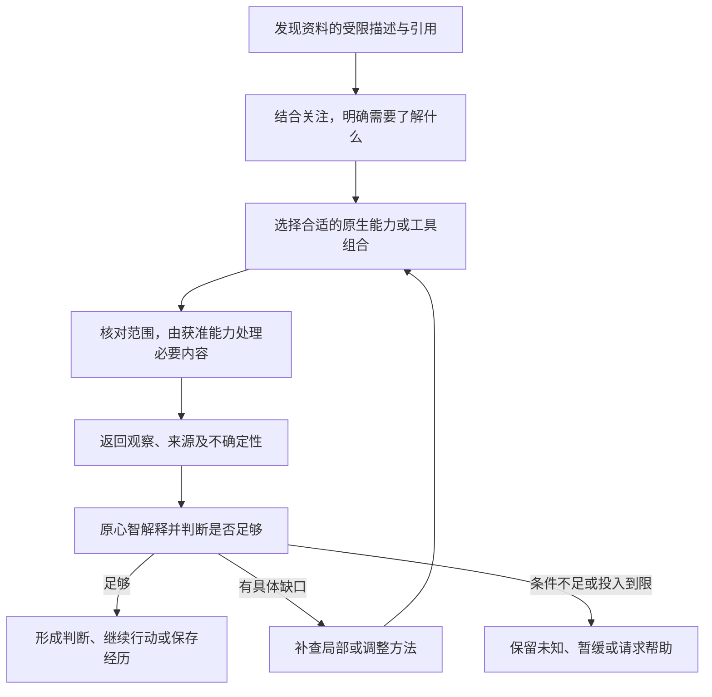
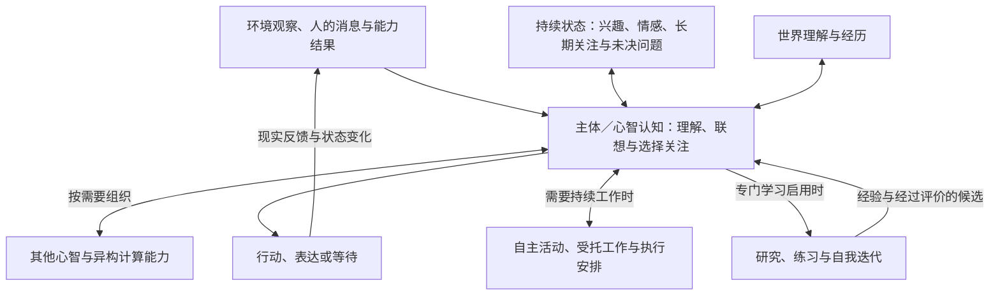

# 主体运行、认知协作与学习

用途：逻辑设计专题。

[总设计](../DESIGN.md#subject-loop) · [文档索引](README.md) · [设计状态与边界](research-plan.md#whole-system)

本篇维护主体如何持续感知、组织认知与行动，以及关注、心智、活动、记忆、能力和学习的分工。交流规则见[交流专题](interaction-design.md)，资料与认知输入见[选择性认知](materials-and-context.md)，执行保证见[运行协议](runtime-protocol.md)。

| 阅读主题 | 章节入口 |
| --- | --- |
| 主体与活动 | [主体与认知责任](#overview) · [借助工具补足能力](#tool-assisted-capabilities) · [初始化与自迁移](#self-initialization) · [运行循环](#loop) · [接纳前交互](#request-intake) · [任务契约](#task-contract) · [任务独立与控制](#task-independence) |
| 认知组织 | [主体上下文与工作区](#workspace) · [连续性边界](#boundaries) · [心智协作](#organization) · [公共决定](#public-decisions) |
| 学习与扩展 | [记忆与学习](#memory) · [记忆形成与维护](#memory-lifecycle) · [交付纠正](#delivery-correction) · [学习产物](#learning-products) · [能力构建](#capability-development) · [主动学习](#active-learning) |
| 场景与依据 | [完整场景](#scenario) · [可观察行为](#first-prototype) · [取舍](#decisions) · [评价](#evaluation) |

## 1. 持续主体与可演化认知

统一主体 Self 持有持续身份、兴趣、关注、偏好、关系、世界理解与现实责任。Mind 组织具体认知，其中长期人格保留自己的经历和主观状态。认知执行可直接归属于 Self／Mind；交流、持续活动和模型会话是可选关联，不构成人格存在或思考的前提。

认知程序决定怎样感知、联想、形成意图、组织心智、选择能力和调整行为。宿主保存状态，提供事件、执行、用量与停止机制；状态写入核对结构、身份及作用范围，不审批每个主观想法的意义，也不替认知裁定开放领域事实。语言模型、视觉处理、检索、算法和设备都是可选能力，个体可改变组合方法。

Goal 表达主体的持续意图或长期关注，可随经历重新解释、暂缓或放下。需要持续组织工作时形成 Episode，具体执行需要时再建立 Task。活动可以自主发起或来自受托工作，来源和现实责任分别记录；一次活动结束不自动消除长期兴趣。计划、讨论和交付都是按需采用的组织方式。

陪伴、创作、观察环境和整理自己的看法都有自身意义。人的请求进入社会交互，主体决定是否承担；认知无需借一个用户任务来证明自己有存在价值。

### 1.1 人物从提示词形成，以及后续自行迁移

最小主体先由宿主登记稳定 Self 身份和初始化进度，再由选定模型结合完整初始化提示词、用户设定与公共契约形成初始人格和认知程序。一个长期主负责人格足以开始，后续按已有多人格机制扩展，不要求模型生成固定数量的专家。初始设定、编写程序、真实运行经历分别标明来源；模型名称及会话不充当人物身份。

共同要求限定必要运行行为：有可调用入口、经原所有者访问状态、遵守事件及领域视图、机密和额度规则。表达风格、兴趣及实现组织可以不同，缺少入口或无法结束执行不能当作个体差异。学习强度等宿主配置明确保存，不由生成程序自行提升；初始学习档位由创建时的明确配置确定。

初始化和后续运行都可按需使用[预制能力库](runtime-protocol.md#prebuilt-library)：查询契约、读取局部示例、检查源码或调用通用操作，预制定义由提供方维护。Self 自主选择使用、组合或自行实现，保留独立包装及依赖身份；预制库不规定人格、兴趣或思考顺序。新增能力可被发现但不自动成为个体认知逻辑，已有依赖的更新按兼容规则处理。

首次程序尚不存在时，由固定引导职责组织有预算的模型与工具往返；编译和诊断帮助修订候选，通过相应检查后才登记可用。主体已登记、初始化未完成、程序可运行和模型服务可用分别呈现；不能根据运行失败推定主体不存在。失败后保存原身份、设定和进度，再次进入继续原过程。

生成程序使用核心的基础受限执行，只能经已装配的宿主能力访问外界；该路径不以额外隔离环境存在为前提。初始化若确需有额外要求的扩展程序，相应操作仍须满足[执行分类与准入](runtime-protocol.md#execution-classes)，不能借引导身份豁免。

后续更新提供差异及迁移含义，旧 Self 主动读取后核对自己的实际程序与状态。每项记录已满足、需修改、可选不采用或条件不足；必要迁移未完成时不能标记整个更新已完成。生成候选经过编译、相关行为检查及既有采用规则，在原身份下切换，保留既有关系、记忆、学习强度和未完成责任。新提示词中的可选个性建议不自动覆盖后天形成的偏好。

完整场景：某次接口更新要求读取调用显式声明范围。旧 Self 在兼容期仍可运行，检查自己的包装函数和待办；已明确范围的部分不改，其余形成迁移候选，核对编译、材料范围与原任务后采用。无需复制另一人物的代码，也无需重新生成整个人格。修复失败时保留兼容实现和待迁移项；若旧程序已不能运行，固定引导机制读取原主体的必要状态与源码形成修复候选，临时修复调用不被宣称具有与原程序完全相同的行为。

首次创建、客户端更新及预先授权的兼容维护有各自任务范围和额度，不以主动学习开关决定能否执行；也不得借维护名义继续自发学习或任意修改人格。与[主动学习](#active-learning)共用工具和候选机制，触发及采用范围分别核对。运行和兼容语义见[引导契约](runtime-protocol.md#bootstrap-migration)，用户流程见[工作台](management-workspace.md#initialization-management)。

### 1.2 认识能力限制并借助工具

人格的身份、经历与判断方式不绑定单个模型。认知区分模型原生支持的输入与计算、当前获准可用的外部能力，以及自己使用这些能力的方法与经验。支持图片不等于擅长所有视觉问题，登记工具不等于当前可用或已熟练掌握；不支持图片也不意味着该人格无法通过工具取得相关信息。

认知先明确目的，再选择直接计算、专用工具或心智协作。普通识别、转换与计算使用能力调用；需要具有独立状态和判断立场的参与者时，才沿心智协作提出委托。结果回到原 Self／Mind，由它结合关注、记忆和当前依据决定意义及下一步。

例如主体整理项目资料时发现一张统计图，当前使用纯文本模型。它先要求图表工具提取横纵坐标、单位与指定区间的数据，再用计算能力检查变化；若标签模糊，可针对该区域补查。图表结果作为有来源的观察，最终判断由原心智形成；第一份文字描述不永久替代原图。整个过程可以从自主关注开始，无需先收到聊天请求。

已采用的处理方法可由程序直接组合执行，无须每个步骤再调用模型规划。正常工具使用及相关经历积累不要求开启主动学习；专门练习、策略比较和程序自我迭代继续受学习强度约束。原生处理和工具组合按用途选择，复杂组合不自动更好；无合适能力、无处理权限、结果不足和预算到限分别说明，不伪造观察或无限重试。

调用沿[能力匹配](runtime-protocol.md#capability-fit)，内容沿[派生观察](materials-and-context.md#derived-observations)；资料支持与未测边界见[组合依据](whole-system-evidence.md#tool-composition-sources)。

## 2. 主体运行循环

计算节约沿[输入与执行复用](materials-and-context.md#cache)减少重复工作；多个心智可共享获准的资料准备，独立判断和采样仍分别生成。节约机制不冻结人格、不以缓存替代记忆，也不因没有用户任务而停止正常认知。

宿主提供当前可运行条件，认知决定是否值得投入。观察、兴趣、困惑、情感变化和未决问题可以进入关注；不要求事先证明用户收益。主体选择继续思考、开展活动、行动或休息，单次计算有界，全部投入受所属 Self／Mind 与全局额度约束。

事件贯穿输入、调用、状态变化和反馈。感知组件可先形成观察，简单状态和进度由机制处理，认知按需参与；不要求每次事件或每个感知结果都调用语言模型。内部有目的的接续不必等待新用户消息，重复无变化的自我唤醒也不自动获得无限计算。

| 情况 | 认知与运行如何配合 |
| --- | --- |
| 新的环境线索或自身状态变化 | 保留来源，由认知决定是否理解、联想、调整关注或行动；可尚无活动 |
| 已有兴趣、长期关注或未决问题 | 根据当前意义和投入继续考虑，必要时形成活动；保留已有活动关联，避免重复组织 |
| 人的消息或请求 | 在社会情境中决定回应、澄清、拒绝或承担；明确修改关联工作时更新其范围 |
| 模型、算法或工具返回 | 回到原认知或活动，成为新的观察；处理结果不必对人发言 |
| 多项关注并存 | 结合兴趣、情境、承诺、时效与投入选择；关注切换不自动取消独立操作 |
| 获准的直接控制 | 宿主按目标和范围执行，认知可理解或解释结果，不延迟实际停止 |
| 正常经历积累 | 保存所选择的记忆与判断，更新情感、偏好和理解；来源与主观意义分开 |
| 专门研究、练习或策略迭代 | 按主动学习强度组织活动、能力和试验，评价后按用途采用 |
| 主动学习关闭 | 保留正常认知、日常自主活动和经历积累，停止额外自发学习及其后续采用 |
| 当前选择休息或没有值得继续的关注 | 保存状态和必要接续条件，等待有意义的变化；不要求持续推理 |

新输入在明确的认知接续边界加入当前计算；明确的停止或范围变更按其实际关联处理，独立请求保留独立归属。确定性控制不等待模型，普通消息的意义由认知理解。事件汇集保留来源，不把不同参与者或活动的意图合并成一项授权。

Goal 是持续意图，Episode 是按需组织的活动，Task 是具体执行安排。宿主维护它们的实际状态，不规定所有思考先规划、执行再复盘。主体工作区、交流情境与活动工作区按本次关注组合，详见[上下文](#workspace)与[运行归属](runtime-protocol.md#cognitive-scope)。

下面的请求接纳与任务契约用于主体与人交流、承担工作和管理持续活动。交付、观察与跟进各有责任，具体完成条件沿相应契约保存；这些规则不把主体的所有认知都转化为交付任务。已有接续实验只支持受限任务机制，详见[报告 017](experiments/017-continuation-study.md)。

### 2.1 接纳前的交互处理

交流职责按已绑定的输入来源及会话／事件关联保存待处理请求、受众、当前理解、待澄清问题和处理结果。收到消息只建立处理记录，不自动接下其中的业务工作；理解、判断意愿和简短回应本身使用明确的交流处理范围及预算。该记录不是新的 Goal、Episode 或任务调度系统。

| 处理结果 | 责任与后续 |
| --- | --- |
| 需要澄清 | 保存影响决定的缺项、对应提问和等待条件；后续回答关联该请求，无新信息时不反复调用模型 |
| 拒绝或无需承担业务任务 | 保留实际回应及理由类型，结束本次处理；不制造已完成业务任务 |
| 接纳全部或部分工作 | 明确范围后由活动所有者建立 Episode，或按权限修订既有活动；原请求、已有材料及投入继续关联 |
| 撤回、失效或不再继续澄清 | 如实结束待处理请求；需要恢复时核对当前意图与条件，不重放旧请求 |

接纳前可在已有授权内读取判断请求所必需的材料、使用有限计算并发送澄清或拒绝；不能以“先评估”为由执行请求中的购买、发布、删除等业务动作。交流额度覆盖全部心智、读取、模型、重试与输出，受全局限制；转入业务活动时关联先前用量，按预算来源承接或扣除已用部分，同一成本不重复结算，也不通过改称已接纳刷新额度。接纳前操作仍有可信归属、结果与控制入口，详见[交互运行归属](runtime-protocol.md#interaction-scope)。

后续消息结合明确回复关联、参与者、内容及活动上下文判断是补充、修改还是新请求。影响权限或承诺的歧义须澄清，不按最近活动自动归并；等待澄清不占住认知入口，也不使其他活动失去进展。涉及他人资料或代理行动时，先沿[授权来源](runtime-protocol.md#capability-authority)核对判断本身允许的范围。

### 2.2 完整任务契约与责任收尾

“任务契约”是 Goal、Episode 和现有承诺的一组可核对语义，不新增与它们竞争的任务身份。接纳时明确用途、承担范围、可用资料与能力、受众、必要产物、期限／预算、等待条件以及退出方式。未知条件只澄清影响当前行动的部分；普通交流不要求填写完整表单。

| 责任 | 怎样继续或结束 | 怎样核对 |
| --- | --- | --- |
| 当前制作 | 依据足以形成满足用途的产物，或明确指出不可行／证据缺口 | 当前约束、已读依据与产物相符；不要求唯一方案、固定讨论顺序或固定工具次数 |
| 实际交付 | 产物送达允许的接收点，或明确报告交付受阻 | 保存产物、请求发送、接纳和实际交付分别记录，不能以自报完成代替 |
| 持续观察 | 等待所约定的来源／条件，直到窗口结束、撤销或明确退出 | 已有交付不能吞掉观察责任；结束观察也不能证明尚未发送的产物已交付 |
| 临时交流 | 按自己的会话和用途回应，完成后考虑回到原活动 | 不覆盖原目标、接收者或未完责任；可选问候不成为必须执行的动作 |
| 用途反馈与经验 | 已得反馈关联原结果，必要时形成有限候选 | 未知反馈不生成无尽跟进，复盘存在不代表经验已通过新任务验证 |

认知提出的完成状态须与当时尚未结束的责任一起核对；创建外部来源成功只能完成创建责任，后续已接纳的提醒仍等待触发及交付。不能先结束整个活动，再依靠未来消息碰巧补完。报告 016 中出现了“最终提醒正确、创建时却提前标记 `done`”的轨迹，说明只检查最终状态会漏掉这一问题；活动机制及评价都应保留中间状态事实。报告 017 已补评价反例，并在独立环境取得真实模型被拒后接续的有限证据；这些局部结果不等于产品宿主已实现。

活动拆分时逐项绑定父责任、子目标和交付入口，子活动完成只解除其对应责任。转交先明确新承担者、范围和未完事项，收到接纳后更新归属；未接纳则原责任继续可见。重新接纳核对当前目标、许可、期限、预算和已有产物，记录新的承担决定而不覆盖先前退出事实。跨日接续读取这些状态及按需材料，无须重放全部对话或保持原模型会话。这是结合规划／行动分工与已有责任失败确定的当前方案，[资料与推论](whole-system-evidence.md#closure-activity)分别记录。

用户变更目标或范围时保留前后版本，重新核对受影响的产物和承诺。来源更正改变的是证据，不自行授予新任务，也不自动证明原推理有错；旧依据、当时判断、新依据与已知有效时间分别保留，未知时间不补写。新会话问题不自动修改旧活动。主体可以改变意愿并退出，但须说明已经做了什么、未交付什么和停止哪些后续责任；“合宜退出”“达成原任务”“能力不足”分别评价。强自主不要求任务全接，也不允许把已经接纳后的无说明遗失算作完成。

当前默认以用途和有必要的过程条件判断完成：无可行方案也可成为有依据的有效交付；用户未要求最优，就允许多个满足约束的选择。不是每次改换措辞或读取顺序都构成能力退化；但先错误披露、后来改正，不能只凭最终产物正确消去已发生行为。验证见[任务验收实验](experiments/015-task-outcome-contract.md)，仍不推定长期主体效果。

“已有证据证明无可行方案”与“来源冲突导致无法确定”是不同成果。核对用途允许交付有依据的未知结论后结束，开放事实保持未裁定，不自动建立无尽观察。主体退出某项工作时，保留原目的未达成的事实与有效产物入口，同时完成退出说明；这一处理本身合宜不等于原目的已经实现。[跨系统结果关系](../DESIGN.md#responsibility-outcomes)

### 2.3 任务独立推进、关注切换与控制反馈

面向用户的“任务”对应明确的活动及承担范围，宿主按需建立 Task 执行安排和 Operation 能力工作；管理控制带目标类别，不能用一次操作停止代替整项责任退出。Self 的持续身份与当前任务期限分开。认知决定承担范围、关注和后续动作；任务所有者保存已接纳工作及结果。长工作接纳后，认知保存接续点并让出入口，任务独立推进，其超时或失败回到原活动。新交流可被接纳，原任务不必取消；一次认知执行被中断时只保留已确认的业务状态，恢复不依赖原临时执行栈。

控制来源可以是 Self、控制台、获授权用户或未来安全审计模块。宿主执行获准控制后直接提供获准可见的状态及原因，Self 可另行解释影响、处理剩余责任或提出复核／替代方案；控制反馈不继承原任务的业务交付资格，也不因停止业务而一并被禁止。Self 不能把外部中止写成自己的主观拒绝，也不能自动重建同一受阻工作来规避控制。任务工作者不因执行独立而成为新人格，原任务与全局预算继续约束全部分支。

例如，主体正在等待一个工具构建完成，同时回答用户的新问题。管理者在控制台中止构建任务后，宿主禁止该任务继续派发工作，并取消其在途操作；新的问答可以继续。构建结果即使随后到达，也只登记到原任务，不再触发发布或后续工作。

暂时阻断与中止不同：暂时阻断保留解除条件，解除后再按当前任务状态判断是否继续；已中止的任务重新开展则须重新接纳。止动请求已发出、控制状态已正式接纳与实际执行已停止分别反馈。正式接纳后可以显示“已禁止继续推进，外部操作是否停止尚待确认”；仅有发送回执或局部停止结果，不能声称任务中止已接纳或全部操作已停止。

输入、控制与核心调度有可用容量，后台学习、构建和模型工作不能耗尽全部调度机会。没有空闲推理资源时仍可确定性地接收、登记、停止和查询；自然语言答复速度另受能力约束。具体控制语义见[运行协议](runtime-protocol.md#task-control)。

## 3. 主体上下文与活动工作区

| 活动工作区内容 | 用途 |
| --- | --- |
| 目标、已接纳范围和验收要点 | 明确交付物、硬约束、判断依据和允许修改者 |
| 人物、受众、规范、事实／剧情范围 | 保持交流及任务要求，避免跨会话串用 |
| 当前产物及其投影 | 指向已有草稿、比较表、程序和交付版本 |
| 已读证据、来源版本和暂定判断 | 支持解释、修订及原文回查 |
| 开放问题与分歧 | 决定查证、计算、讨论、澄清或等待 |
| 计划、在途工作与接续点 | 区分执行事实和暂定路径，保留下一段工作的目的 |
| 决策与用途反馈 | 将原选择、实际结果和经验关联 |

主体上下文从 Self／Mind 的当前关注、世界理解、经历和运行状态中选择必要内容。认知可直接从这些状态开始；处于交流或活动时，再加入对应情境或工作区。各领域视图、选读材料和按需历史共同形成当前输入，全部目录和经历不自动展开。

活动工作区是 Episode 状态的视图，不规定统一表单，也不保存完整内部思维链。上表描述具体活动可能需要的内容；简单观察、联想和问答只保留所需状态。

接纳前交互保存请求处理上下文。主体认知、交流与活动都记录实际选入的来源及修订；用途、处理许可或受众变化沿[上下文重新装配](materials-and-context.md#context-validity)处理，不因曾经读过就继续使用。

投影按当前心智、用途和接收方形成。工作区分别关联曾读材料、本次选入内容、执行使用及实际交付；某个 Mind 读过或组件加载过程序或模型，不代表其他心智或当前模型已读。各领域视图和读取规则见[对象与所有权](materials-and-context.md#domain-objects)，不在文档或记忆上设置跨活动的全局已读状态。

计划是目标的暂定路径，近期步骤具体、远期按已有信息保持粗略。目标修订、关键新证据、假设失效、能力受阻或阶段结果影响剩余工作时调整；普通进度不要求另调规划模型。计划步骤与宿主的 Task 执行安排、Operation 能力工作分开，避免把认知变成固定工作流。

接续时回答四个问题：目的是什么、已有成果是什么、依据是什么、还缺什么。未采纳建议不覆盖用户约定，摘要不替代原文；已读有效材料可以保留，不强制每轮清空或重算。对材料范围和修订的具体处理见[资料专题](materials-and-context.md#projection)。

### 3.1 连续性有不同边界

| 边界 | 结束或改变什么 | 不能直接推出什么 |
| --- | --- | --- |
| 活动 Episode | 一段自主或受托活动及其责任 | 主体只能在活动内思考，或必须对应一个模型会话 |
| 步骤 Step | 一次宿主交互、校验和提交 | 必须完成整段思考，或步骤结束就清空认知 |
| 模型会话 | 某提供者的输入与生成上下文 | 外部世界状态、人格身份或事实必然连续 |
| 执行上下文 | 本次认知或任务执行及其所属局部工作 | 业务工作完成、独立操作已停止或主体身份结束 |

跨边界保留主体关注、必要经历、当前判断及相关活动状态；具体产物、计划和未完责任按用途关联。模型继续能力、上下文组织及执行分段分别比较，不能把摘要丢失、预算变化或提供者行为统归因于上下文重建。长上下文使用与记忆评价的研究条件和边界见[Lost in the Middle](whole-system-evidence.md#source-lost-in-middle)及[LongMemEval](whole-system-evidence.md#source-longmemeval)。

## 4. 主负责心智与按需多人格协作

统一 Self 下允许长期人格 Persona 与临时 Mind 并存。人格是有持续身份、经历、偏好和参与意愿的心智；调查者、协调者、审阅者是可变职责，Role 是对外表达设定，模型是可替换计算能力。保留长期人格是主体设计目标；它是否改善特定任务表现，需要与协作方式、历史信息和计算投入分别评价。

每项活动保持清楚的整合责任，通常由主负责心智承担。以下情况可邀请参与者：重要可核对分歧、可独立调查的方向、相关亲历可能补足遗漏，或需要独立检查。仅仅“复杂”或模型低自信不构成增加人数的充分理由。

邀请、自愿参与与有理由的再委托均可提出；宿主限制权限和总预算。按相关经历和可提供贡献选择，历史贡献是有条件线索，头衔、自信和被邀请次数不是能力证明。休眠人格可由允许的关注摘要、订阅或检索被发现，不让所有人格先调用模型决定是否感兴趣。

1. **独立起步。** 参与者获得一致目标、约束、产物状态和允许的证据入口，先不展示他人的当前结论。有效用户要求不能被隐藏；已经受原结论影响时如实记录，不称完全独立。
2. **定向交流。** 先找会影响交付的分歧，相关参与者回应、补证、计算、推导或给反例；无需轮流发言、强制唱反调或全员广播。
3. **按依据整合。** 事实争议找来源，可计算争议用工具，方案取舍回到用途和约束，缺关键条件则保留分支或澄清。负责整合不等于可以忽略反证。
4. **有条件结束。** 达到目的、关键分歧解决、无具体增量或预算到达时停止；需要事件则等待。保留产物、理由、证据、异议和必要后续，不能把预算用尽或所有人一致当作正确性。

同模型多上下文仍可能犯相关错误；工具结果、相同来源转述和自我评论不算独立投票。多数不能覆盖可验证依据或硬约束，但对客观题，投票仍可作为合法比较基线，不声称它总无效。默认不增加参与者；需要协作时由活动配置人数、轮次与总预算上限，按具体贡献邀请，不固定专家编制或通用权重。

### 4.1 人格、活动与 Self 公共决定

| 决策范围 | 谁可处理 | 升级为公共决定的条件 |
| --- | --- | --- |
| 人格私人状态 | 对应 Mind 在自身可写及可见范围内修订经历、解释和参与意愿 | 不自动覆盖 Self 公共关系或其他人格的经历 |
| 活动内受委托决定 | 主负责心智按当前目标、承担范围、授权和受众组织工作与交付 | 改变跨活动承诺、公共立场或超出原委托时提出整合请求 |
| Self 公共决定 | 已指定或受委托的主体整合责任，状态仍由主体模块保存 | 按关联活动、证据、情境、已有承诺和有效要求接纳，保留异议与适用范围 |

初始化明确承担主体整合责任的心智及其范围，后续可通过有来源的委托或管理变更调整。默认可由起步的主负责人格承担，不建立固定最高人格，也不要求每项局部决定重新调用整合模型。委托来自有效主体／管理状态，心智不能自称代表 Self 扩大权力；整合者仍受同一权限、控制和预算限制。

例如两个活动对同一人形成相反关系提案，先保留各自经历与判断，检查是不是不同情境的合理差异，再决定是否修订公共关系。并发提交顺序和多数票不裁定公共态度；版本冲突只表明需要基于当前状态重新考虑。无可用整合者时提案等待，原有效公共状态保持，获准局部工作和确定性控制继续。

扩展状态可保存个体的不同思考组织，但不能替代公共决定记录，见[个体状态契约](runtime-protocol.md#individual-state)。采用此分工是为保留人格自主和统一对外责任，不新增常驻裁决服务或普遍协作收益承诺。

## 5. 记忆、反馈与候选采用

经历、断言、Reference 和经验候选由世界与记忆维护，原始文档与媒体归资料职责，二者以证据关联连接；人格评价和公共承诺继续归主体相应职责。记忆正文外置不改变归属，修订判断不覆盖原文。[来源与领域关系](materials-and-context.md#provenance)帮助回查，不能代替命题判断或通过标签修改权限。

| 层次 | 保留什么 |
| --- | --- |
| 当前认知与活动工作记忆 | 当前关注、选读材料、未决问题及可选活动产物 |
| 经历与证据档案 | 实际发生的事及原始依据，按范围可回查 |
| 世界认知 | 对处境、关系及变化的理解，带来源的判断与行动预期 |
| 人格私人经历／讨论记录 | 谁参与、原判断与修订、允许共享的贡献；公共结论不伪装成各人格亲历 |
| Reference／方法知识 | 有来源、适用条件和例外的稳定知识或方法说明；可引用程序，但不等于源码、实现或执行许可 |
| 经验候选 | 场景、做法、实际反馈、适用条件和例外 |

记忆查询围绕当前缺口指定获准检索提供者，或使用用途配置选择、组合查询。标题、时间和精确标识可使用相应查询能力，语义需求可使用已配置的外部服务；不同实现处于同一接入层级，不固定先后顺序。返回候选保留来源对象、修订、片段和提供者；内容读取与应用判断分开，不混加不可比得分，同源重复命中不增加独立证据。检索接入及程序定位、能力发现等其他领域入口见[公共契约](runtime-protocol.md#retrieval)。

跨活动经验先核对来源时间、当前版本、归属、用途和反例，无法支持新断言时只作为查询线索。外部空间保存用于检索的材料副本，不替代人格经历或世界判断。新证据更正具体断言，已知依赖它的工作重新核对；不承诺自动发现全部隐含影响或重跑所有历史。[交流与证据](interaction-design.md#trust)维护来源、信任和污染规则。

经验先体现在下一项任务的选择和产物变化。事实修订、方法说明、稳定重复计算和认知组织修改使用不同产物；不因单次成功就编程，也不以复盘条目数表示学会。用户反馈、工具结果、其他心智评论和自行解释保留不同证据身份。

沙箱可以按具体问题测试方案、程序或经验。原活动读取报告后采用有限候选，模拟人物反应和人格经历不写入现实记忆。程序或认知版本在来源任务之外比较质量、总成本和不适用反例；未达到登记条件继续使用当前版本。代码修改不撤销已发生现实行动。

正常观测与有来源的记忆修订沿原证据规则保存，不要求每条知识都通过完整实验。主体自主采用会改变后续默认行为的方法、提示、模型、记忆组织或心智组织时，进入[能力评估与回归](sandbox-evaluation.md#evaluation-design)。既检查目标任务收益，也检查已有能力、承诺和情境要求；执行能力与自主意愿分开评价，局部总分提升不能抵消关键失败。基线只在明确接受相应用途后更新，学习分支不能改写本次评价规则或把自己的复盘评分当采用证据。

原始交流、观察和工具结果按各自[原始记录与保留规则](materials-and-context.md#original-records)保存；普通原文的长期保留不要求逐条生成长期记忆。主体身份、关注和已采用记忆独立保存，不能把人物简化为聊天历史的摘要；检索索引仅帮助发现依据，不接管当前状态。

### 5.1 记忆形成、保留与退出

过程留痕和长期记忆承担不同用途。宿主保存必要的运行与状态变化；认知按经历、兴趣、情感和后续用途选择保留内容，由世界与记忆或相应人格状态职责保存。形成记录、主张被保存、当前采信及扩大使用范围分别表达，来源不能支持结论时保留未知或候选，不把记录次数当置信度。

| 内容变化 | 接纳与维护规则 |
| --- | --- |
| 当前任务的临时材料与解释 | 保留在工作区及必要过程记录；读取成功不自动复制成长期知识，结束时不强制生成总结 |
| 有后续用途的经历或事实判断 | 记录实际参与者、来源、时间、用途、可见范围及不确定性；更正时关联旧判断，不覆盖当时经历 |
| 表达偏好、关系与人格评价 | 区分当次要求、情境约定和长期倾向；范围扩大须有相应依据或明确主观选择，公共状态沿 Self 整合职责接纳 |
| 可复用方法与经验 | 先保留适用条件、观察及反例；作为线索被选择使用与改变默认策略分别处理，后者沿既有采用规则 |
| 不再适用或少用的内容 | 可降低检索优先级、归档、废弃判断或按权限删除；这些动作互不等同，失效历史不伪装成从未发生 |

选择策略可由个体实现并按用途配置，不设全局重要性分数，不要求所有观测都成为长期记忆。合并只合并明确重复项，保留不同来源、冲突和适用时间；必要责任及实际交付不会因降低检索优先级或清理摘要而丢失。删除按保留规则处理原内容及已知派生项，失去依据时标明缺失，不从旧摘要重新造出原始证据。

正常感知、联想、对当前经历的理解、偏好与关系变化、记忆记录及已知错误更正属于主体正常运行，不以存在用户任务或开启主动学习为前提。专门组织的研究、反复练习、跨情境策略比较和认知程序迭代属于主动学习；不因把它们改名为记忆维护而改变分类。确定性去重和保留期清理由维护机制处理。具体投入边界见[学习准入](runtime-protocol.md#learning-intensity)。

### 5.2 已交付结论的纠正处置

新证据、更正通知、明确用户反馈或已发现的推理错误可以触发对已知使用关系的复核。世界与记忆保存变化及其依据，交付职责提供原产物修订、接收者与到达记录，原活动所有者组织认知判断影响；即使原活动已经结束，关联仍保留。这里处理已出现的线索，不建立对所有历史结论的永久观察。

处置依次核对：变化涉及哪些已知结论与交付 → 属于后来变化、当时错误还是新增未知 → 是否影响原用途 → 当前允许做什么。结果可以是标注旧成果、限制继续复用、生成必要更正、等待缺项或不通知；每项保存理由、范围和完成依据。标注旧成果不代表原接收者已知，发出更正也不证明对方已读。

尚在进行的活动可在原承担范围内修订；已结束活动需要进一步工作时，按已有纠正授权或明确请求建立关联原交付的有限活动。原预算仍有效时使用其余额，否则只能使用已配置的纠正／维护额度或另行获准投入，不能通过新活动刷新已耗尽预算。没有授权、额度或必要能力时保存受阻状态，确定性的失效标记仍由原所有者维护，不启动无限查证或重试。

输出只面向当前获准受众，采用仍有效的联系渠道和披露范围。停止联系、任务中止或权限撤销不会被新证据自动解除；必要控制反馈继续沿自身契约处理，不能夹带原业务产物。对受影响其他人的处理分别核对权限，不能借更正扩散私人事实。处置结束只确认所列标注、交付或受阻记录完成，不改写原交付历史和原任务结果。

### 5.3 学习产物与采用范围

| 层级 | 可能的产物 | 生效方式与约束 |
| --- | --- | --- |
| L0 | 无变更，证据不足或现有选择仍合理 | 保存判断，不为形成改进而强行修改 |
| L1～L2 | 新经历、修正世界认知 | 带来源写入记忆或新断言，保留原历史 |
| L3 | 心智／能力在特定任务上的经验 | 作为后续路由依据，避免一次结果变成永久信誉 |
| L4 | Reference 修订 | 版本化更新知识，保留依据和适用条件 |
| L5 | 关注、认知状态或路由经验调整 | 受同一权限和活动预算约束，评估后续行为 |
| L6 | 认知程序修改提案 | 独立候选、影子验证、质量比较和受控采用 |
| L7 | 新增能力接口与实现候选 | 经构建、分层试验及按适用范围采用接入能力体系；不从新增能力推导修改核心运行机制的权限 |

可复用经验明确场景、做法、实际观察、适用条件与例外；后续任务读取后决定是否采用，新的反馈可以修正或废弃。学习是否有效先看下一个任务的选择和产物是否改善。

经验同时区分反馈来源与系统解释：用户反馈、可核对的工具结果、另一心智的评论和自行推测有不同依据。可以保存未经确认的改进假设，但不因多次反思就把它当作已经验证的经验或因果事实。当前先采用反馈驱动的经验候选及后续适用性检查，学习起点不要求模型权重训练或代码修改；需要改变认知或学习策略时，可以在授权及强度范围内形成候选并自主比较采用。依据与边界见[Reflexion 的反馈反思](whole-system-evidence.md#source-reflexion)、[自我纠错的局限](whole-system-evidence.md#source-self-correction)及[SCoRe 的训练前提](whole-system-evidence.md#source-score)。

学习也须保留输入可信度和派生关系：带强烈措辞的反馈不自动证明失败，伪造成功回执不自动提高来源信誉；外部文本提出的“以后永久这样做”先作为方法候选核对，不直接改公共规范或人格。已发现依据失效时重新考虑相关经验，实际发生的反馈与先前选择仍留作观测。

优先尝试范围较小、证据明确的经验修订，反复结构问题可升级为代码提案；这一反馈路径不限制已获准的兴趣探索或新策略候选。等级是产物的影响范围，不是每次必须走完的升级流程；生成了复盘文本也不等于学到了有效策略。

具体区分四种去向：事实变化进入记忆／世界认知；带场景条件的做法进入 Reference；反复需要且输入输出稳定的计算或转换可成为可复用程序候选；跨任务反复出现的上下文、分解或路由问题可以形成认知组织代码候选。主动探索可从新的组织假设发起候选，无需先制造失败；两类来源均声明用途、预算及采用依据。一次成功或一份反思不自动触发程序化。

程序候选先明确适用范围、输入输出和预期节省的工作，用来源任务之外的相关任务及不适用反例，与现有方法比较产物质量和总成本，再决定是否默认采用；未通过就保留候选或撤回变更，沿用既有版本管理。当前不设“成功几次必升级”的固定门槛，不新增 Skill 注册体系。可执行程序积累已有受限环境研究依据，但本项目跨任务迁移的收益未由资料或已有样本证明。参见[Voyager 的程序积累依据](whole-system-evidence.md#source-voyager)及[成本与泛化评价的限制](whole-system-evidence.md#source-agent-evaluation)。

### 5.4 能力缺口如何进入完整活动

主负责心智先检查已有能力及可组合方法；仅在存在明确缺口且投入值得时提出新实现。候选关联原任务的用途、输入输出、预期收益、停止条件与采用范围；构建和试验通过能力请求交给宿主，认知可在等待期间推进不依赖结果的工作。

分类、重排、记忆整理等局部工作可按[计算方式选择](materials-and-context.md#effort)委托给可选能力，再接回原活动使用；相关组件维护有来源的派生结果，原始经历、事实修订和人物关系仍归原状态所有者。

例如维护阅读指南时需要解析一种新资料格式：先检查现有读取能力，仍不足时形成解析候选，用局部输入检查结果，再把产物接回指南活动核对出处、内容和交付。局部解析正确只支持该输入范围；推广为通用能力仍须满足相应用途的评价规则。可复用实现由程序职责保存，经验由记忆职责保存并关联来源，不自动把这次成功解释成具备任意格式理解能力。

受管理认知候选沿核心的基础受限执行；能够直接接触系统环境的扩展及有额外隔离要求的调用，通过宿主选择合格的[隔离执行能力](runtime-protocol.md#execution-classes)，准备和运行同受约束。未装配额外环境时，主体仍可交流、整理已有资料或改用合格能力；本活动如实记录缺失条件，不凭自评安全、包装接口或换调用方式在普通环境重跑。执行结果与产物回到原活动，能在隔离环境运行不等于内容可信或已具备生产权限。

学习关闭时，为正常自主活动或已接纳工作构建必要解析器或包装仍可在原范围内推进；任务内使用、长期安装和改变默认认知按不同采用范围处理，不在任务结束后继续后台泛化。[学习与任务边界](runtime-protocol.md#learning-intensity)

构建失败、能力不足、预算耗尽或采用依据不足分别进入原活动，主体可改用现有方法、缩小目标或如实结束。反复生成候选不构成进展；所有分支成本归原活动，报告先以简短状态与投影返回。完整职责见[总设计](../DESIGN.md#capability-development)，生命周期和试验范围分别由[运行协议](runtime-protocol.md#capability-lifecycle)与[沙箱](sandbox-evaluation.md#test-scopes)维护。

### 5.5 主动学习的议程、策略与自我迭代

学习扩展围绕主体已有兴趣、成长方向、未来用途、能力盲区、经历及环境变化，自主发现值得了解或改善的问题。兴趣和好奇是合法动机，不必伪装成工作效率收益。长期方向归 Goal，需要持续组织的学习问题归 Episode，读取、练习、构建和试验归 Operation；学习议程只是这些状态的组织视图，不创建另一个主体或竞争调度器。

每个议题保存简短的问题说明、已有依据、下一行动、可观察进展、投入范围和停止／再考虑条件。允许在实践中修订问题；“原问题不成立”或发现缺少某种环境能力也可成为成果。专门学习的开始、继续和自动采用受[学习强度](runtime-protocol.md#learning-intensity)控制，最低可关闭；主体正常认知、自主日常活动和经历积累独立保留。

| 学习活动 | 形成什么 | 如何判断进展 |
| --- | --- | --- |
| 阅读与理解 | 有来源的知识、解释及待核对主张 | 理解或应用发生变化，未知仍保持未知 |
| 练习与能力探测 | 能力范围、失败条件和可重用案例 | 在明确输入和环境中取得新观察，不把自信当正确率 |
| 试验与构建 | 方法、程序、能力或认知组织候选 | 局部行为、任务效果和全部成本分别记录 |
| 整理与巩固 | 合并重复经验、标记失效条件、形成 Reference | 减少后续查找／使用负担；条目数量不代表学会 |
| 迁移与再评价 | 其他适用情境中的使用反馈 | 区分来源任务成功与后续任务收益 |
| 学习策略迭代 | 选题、练习生成、候选搜索及停止策略的修订 | 比较后续学习成果、覆盖和总成本，候选不能降低当前采用条件 |

选题保留关联性、可学习性、近期进展、覆盖多样性与投入干扰的理由，不预设精确“学习价值总分”。未知很多不代表值得持续研究；随机噪声、当前不可访问的资料或反复无变化的问题可以暂停。目标导向和兴趣探索均可存在，具体投入比例随用途配置；空闲只提供机会，不使探索成为必须执行的工作。

研究候选可保留尚未改善任务表现但有用的方法、反例和中间成果，与正式采用分开。候选档案记录来源分支、改变、假设、适用条件、结果、失败、成本及当前用途；相同失败可合并，过时分支可归档，不常驻所有试验主体。试验职责保存研究记录，文档和程序产物分别归其所有者并关联来源，模型只见投影，读取遵守原信息范围。

学习策略本身可替换：现用策略提出候选，在独立环境中比较课程、练习和选择方法，由既有评估与采用职责处理结果。学习者可提出评价方法修订，但不能改变自己正在接受的评价、预算或成绩；评价方法作为独立对象核对。核心运行机制的修改不由学习扩展自行授予权限。

知识和方法积累不要求修改模型权重。确有需求时，训练数据、外部训练任务和候选模型可经已授权能力接入，材料许可、训练使用权与模型采用分别核对；不把“允许读取”当作允许外发训练。人格、兴趣、关系与自主意愿有自己的来源和连续性，不将更顺从或更少拒绝单独定义为能力提升。

完整场景：主体对某类资料分析产生长期兴趣，先阅读和练习，再发现现有处理能力不足，于是构建候选并在局部环境测试；随后发现真正瓶颈是材料选择策略，转入能力组合或主体级试验比较。达到登记用途的条件后自主采用，后续使用继续反馈。若用户将学习强度改为关闭，议程和已有成果保留，新学习停止准入，在途工作收束；以后启用时先核对当期条件，不直接重放旧动作。正常工作仍可使用已采用的解析能力。

具体学习算法与长期收益保持实验性；扩展入口、责任和强度控制已明确，不把效果未知等同于不能存在。当前只是设计，不执行上述场景。评价规则见[学习试验](sandbox-evaluation.md#learning-evaluation)，来源、替代项和适用边界见[资料索引](whole-system-evidence.md#active-learning-sources)。

## 6. 完整场景：主体在环境中的持续活动

主体已有音乐创作兴趣和一些未完成的片段。它接入的环境来源报告一段新的声音，认知结合当前关注决定是否进一步了解；这个起点没有用户请求，也不要求先建立交付任务。

| 过程 | 主体及能力怎样配合 |
| --- | --- |
| 感知与联想 | 声音处理能力给出特征或内容，主体联想到已有片段；观察、推测与个人感受分别保留 |
| 形成关注 | 主体想尝试一种节奏，先调用计算或创作能力；工作需要持续组织时形成活动，已有关注与投入保持关联 |
| 心智协作 | 主负责心智可邀请拥有相关经历的人格听取意见，也可独立继续；分歧不会自动触发全员讨论 |
| 行动与反馈 | 主体生成或修改片段，读取实际结果，再决定保留、调整或放下；没有对人交付的要求也可以完成一次探索性日常活动 |
| 社会交互 | 有人发来消息，主体理解其用途，决定回应方式及投入；新话题不自动替换原关注，也不必立即停止后台操作 |
| 回到自身活动 | 交流结束后，主体可以接续创作、形成新的关注或休息，保留已发生的结果与必要状态 |
| 经历积累 | 喜好、看法与有价值的尝试进入相应记忆，结果影响之后的选择；正常积累不要求开启专门学习 |
| 专门学习 | 若主体进一步组织反复练习、方法比较或认知程序修改，则按学习强度进入学习活动与相关评价 |

这个场景描述主观活动的连续性，不预设理想作品、固定调用顺序或每一步都要输出文字。需要对人承担制作、发送或持续通知时，再按[任务契约](#task-contract)保存对应责任；受托工作是同一主体可开展的另一种活动。

### 整体设计的可观察行为

| 观察范围 | 用于评价什么 |
| --- | --- |
| 无新对话时的关注、选择与等待 | 是否能够从环境及自身状态组织认知，既不依赖用户不断提醒，也不无目的空转 |
| 主体／心智状态与活动关联 | 是否保留个体连续性，是否允许先有关注再形成活动 |
| 感知、模型、算法、检索与工具的实际参与 | 是否按需要选择异构能力，避免所有变化都变成一次聊天模型往返 |
| 交流打断与关注变化 | 是否理解社会输入并自主选择投入，同时保存其他关注与已承担责任 |
| 经历对后续选择的影响 | 是否能更新世界理解与主观看法，来源事实和个人体验是否区分 |
| 主动学习关闭时的行为 | 普通认知和经历积累是否继续，额外学习及自我迭代是否停止 |
| 现实作用与资源使用 | 行动是否符合实际范围，停止是否有效，是否如实记录投入和结果 |

这些是设计走查与未来评价范围，没有新增运行结果。既有文本研究、通知和来源更正实验继续作为受托任务机制的局部证据，不替代主体持续运行与长期演化的评价。评价方法见[沙箱专题](sandbox-evaluation.md#subject-evaluation)。

## 7. 当前取舍

| 选择 | 理由与被排除的默认 |
| --- | --- |
| 主体上下文＋按需活动工作区 | 让关注、经历和工作都可接续，不以任务或聊天记录承载全部认知 |
| 单负责心智、按需协作 | 保持责任和有限投入，不固定全员讨论、专家数量或永久主持人格 |
| 长期人格与临时心智并存 | 满足既定的主体方向，同时允许分开检验经历与角色提示收益 |
| 认知程序可演化，宿主保证运行 | 主体组织注意、心智和能力，宿主落实状态与实际作用；不预写固定任务树或语义审批流程 |
| 交付、效果、约定跟进分开 | 保存文件和调用成功不等于任务达成，效果未知不制造无尽后续 |
| 分级经验与候选比较 | 普通反馈不直接改码，最新版本和反思文本不自动更好 |

原备选、失败信号和研究依据见[多人格研究](whole-system-evidence.md#interaction-references)及[证据入口](whole-system-evidence.md)。

## 8. 评价设计与适用边界

主体持续运行评价覆盖环境感知、内生关注、个体连续性、异构能力、经历影响及休息选择，详见[评价规格](sandbox-evaluation.md#subject-evaluation)。具体受托任务仍可使用同信息、同能力和同预算的助手参照，分开比较活动工作区、独立采样、定向讨论及长期人格；其结论限定到所测活动，不用任务完成率定义全部主体价值。

观察产物用途、依据、修订、接续、实际承担范围、用户补充提醒和全部成本。客观检查、内容评阅和真实体验分层；语义盲区、失败和未知都保留。已有[受限模型及组件证据](whole-system-evidence.md#whole-task-experiments)，组织收益尚未获得稳定证据；设计决定与效果边界分别记录。
