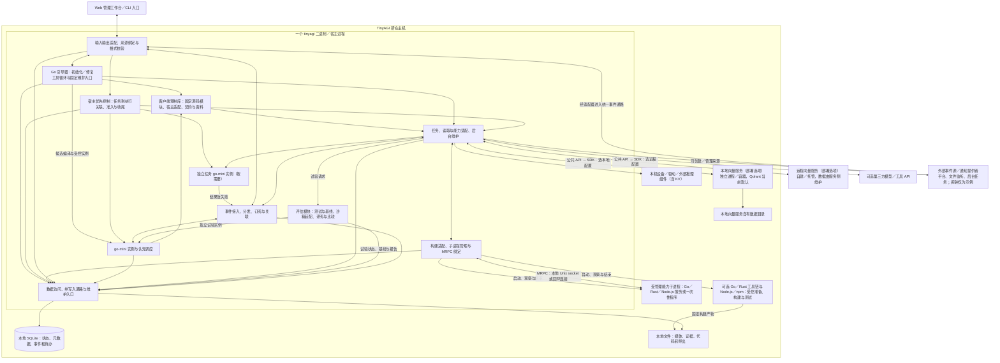
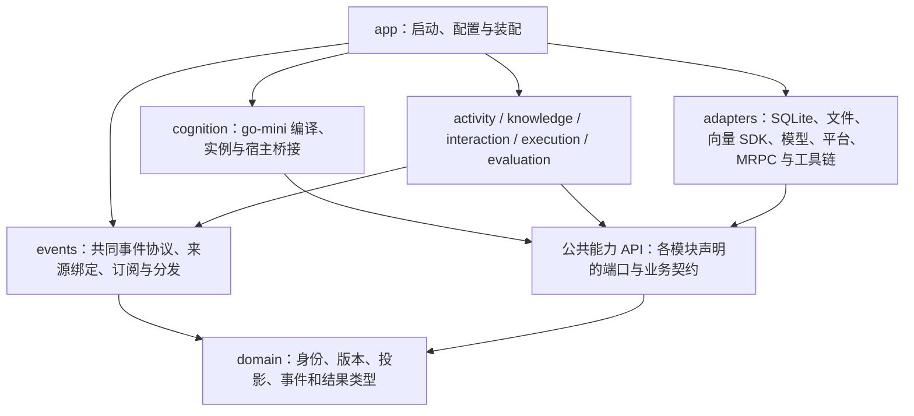

# 工程选型与部署参考

用途：工程参考（与逻辑设计分开维护）｜更新：2026-09-21。

[项目入口](../README.md) · [文档索引](README.md) · [逻辑总设计](../DESIGN.md) · [逻辑契约](runtime-protocol.md) · [go-mini 库行为](go-mini-integration.md)

本文说明物理部署、软件依赖、技术栈和存储机制，并记录选型理由与证据边界。工程组件承载逻辑职责，但 Mind、活动和能力不必各自对应一个进程。方案设计范围统一见[设计台账](research-plan.md#research-status)。

| 阅读主题 | 章节入口 |
| --- | --- |
| 总体承载 | [物理部署](#physical-architecture) · [软件依赖](#software-modules) · [技术栈](#technology-stack) |
| 主体与执行 | [初始化与兼容](#prompt-bootstrap) · [预制能力库](#client-library) · [任务控制](#task-execution) · [热加载工具](#managed-function-tooling) |
| 能力扩展 | [工具链与运行](#capability-toolchain) · [Node.js 与 npm](#node-rpc-integration) · [主动学习](#active-learning-integration) · [实现准入](#implementation-admission) |
| 数据与服务 | [模型维护与机密](#maintenance-secrets) · [向量服务](#vector-service) · [存储](#persistence) · [个体状态](#individual-state-storage) |
| 接入与依据 | [库接入](#vm-deployment) · [一手依据](#stack-sources) · [向量资料](#vector-sources) |

<a id="physical-architecture"></a>

## 1. 承载约束与物理部署

本节定义核心及其能力依赖的部署边界。主体行为与职责分工见[逻辑总设计](../DESIGN.md#subject-loop)。

核心采用以下承载约束：TinyAGI 核心单机、单二进制、单宿主进程；SQLite 保存业务状态，本地文件保存原始资源。独立向量数据库是能力依赖，本地与远程均支持，Qdrant 为当前默认选择。Go 承担宿主机制，go-mini 组织认知。核心之外允许宿主管理的本地能力子进程、原生构建产物、Node.js 程序包及 Go／Rust／Node.js（npm）工具链与运行依赖；单二进制描述核心发布物，不表示整个运行环境只有一个文件或进程。子进程不拥有第二份主体真值，也不构成 TinyAGI 集群。

不采用 TinyAGI 集群、Kubernetes、节点接管、服务发现、对象存储或独立业务数据库，以保持单机核心和本地状态的边界。嵌入向量引擎及 SQLite 向量扩展暂缓，原因是当前选择通过 SDK 接入独立向量服务，并非性能实验证伪。外部模型、工具和远程向量服务不改变核心部署约束。

### 1.1 物理部署总图



TinyAGI 自有逻辑模块和事件机制映射到进程内组件，核心不内置闹钟业务模块。外部通知源可位于本机的独立程序、操作系统设施或远程服务，经适配器接入；图中置于宿主进程之外，不要求它必须在远端。SQLite 保存任务责任、来源引用、订阅和必要事件，通知对象与计时由相应提供者管理。宿主执行期限和预算控制仍属于运行机制。模型与 KV 交给外部推理组件，选用库时可在宿主内运行，使用已有运行时／API 时属于能力接入。发布单个 TinyAGI 可执行文件；当前完整初始化提示词、预制库源码与接口资料、固定引导支持及管理静态资源可内嵌，各 Self 生成的认知源码、修改产物与用户数据写本地目录，不引入内部服务集群。

向量数据库是独立能力依赖，本地与远程都是当前部署选项：本地由同机进程／容器维护索引与文件；远程连接配置好的自建或托管端点，其数据目录不在 TinyAGI 主机上管理。图中两条连接表示可配置选择，不要求同时部署、双写或跨库联查。当前默认 Qdrant、本地单节点；同一 SDK 适配器处理连接配置差异。单二进制只描述 TinyAGI 核心，远程服务的部署和内部拓扑不属于主体运行架构。选型、连接边界及资料依据见[向量接入参考](#vector-service)。

回应的证据核对、意愿与规范适用判断仍由 go-mini 组织模型及工具完成；宿主输出入口执行确定格式检查，规则／契约版本和观测关联仍使用同一 SQLite 与本地文件。逻辑上新增的责任不对应新进程或外部审查服务。

沙箱沿同一事件／能力接口装配替代来源、输出、试验文件区和环境时钟；允许的模型计算仍经宿主适配并计入全局资源预算。数据库按宿主绑定的执行域隔开正式状态与试验状态，试验文件放入各自本地目录；共享的只读基准材料必须满足原可见范围，不向候选开放原始数据库连接、宿主路径或生产能力句柄。

平台适配器接收其可确认的账号、会话及受众元数据，人物关联和情境化记忆仍位于同一宿主的数据与认知层。对接多个聊天平台是能力接入，不是分布式部署；不新增独立身份服务或人物图数据库。

<a id="software-modules"></a>

## 2. 软件组合与编译依赖

采用明确状态所有者和可替换能力端口的模块化设计。下图是编译依赖方向；前后调用产生的事件流见[总逻辑架构](../DESIGN.md#logical-architecture)，两者不混用。名称用于说明分工，尚未创建产品包。



宿主桥接将认知请求表达为有类型的事件，分发给状态所有者或能力接纳入口；所有者经端口调用存储或能力。适配器将结果归入同一事件协议，不直接重入 VM 或任意修改其他模块。同步 API 可以等待并返回同一结果事件的业务视图，不另产生一个语义重复的完成事件。事件机制通过进程内接口和有界队列承载，跨模块的必要共同提交仍由宿主协调，不建立独立消息中间件。接口以业务用途划分，不做一套对所有对象通用的 CRUD／插件框架。

| 模块候选 | 独占维护的业务含义 | 主要输入和输出 |
| --- | --- | --- |
| `activity` | Self／Mind 业务身份与状态、已接纳目标、Episode、工作区、关注候选与接续点 | 输入／完成事件 → 可运行步骤；认知修订 → 活动状态／等待条件 |
| `events` | 共同事件封装、来源绑定、订阅／关联和按范围分发；不拥有领域事实或主体意愿 | 外部观察、请求、结果、状态变化和控制 → 对应处理者；重要记录沿统一数据入口保存 |
| `knowledge` | 资源版本、投影、来源／断言、记忆与派生索引；声明向量检索端口 | 有范围的发现／读取、索引任务与候选核对；带依据的记忆提案；不裁定人物认证或现实动作许可 |
| `interaction` | 账号与人物关联依据、当前受众、互动约定、适用契约和输出轮次 | 平台元数据与认知表达候选 → 有当前范围的输入／输出；语义意愿和情感评价仍由认知提出 |
| `execution` | Operation、派发、外部回执、取消／未知、能力准入和实际用量 | 已接纳的能力意图 → 提供者调用 → 完成事实与活动唤醒 |
| `cognition` | Program／Instance／scope 与宿主绑定；不另持有唯一业务事实 | StepContext → go-mini 组织模型／工具 → Continuation／候选 |
| `evaluation` | 测试套件、试验配置、输入环境、参试／评价材料分离、基线、比较报告及采用依据 | 同一任务接口装配独立域；运行、评价和比较分责，按覆盖及门槛判断用途，参试候选不能改写本次评价规则 |
| 构建与运行适配 | 工具链、产物来源、受管理子进程、MRPC Provider／绑定及清理；复用 execution／evaluation 的活动与预算 | 受控构建／试验／运行请求 → 产物投影、生命周期事件与实际调用；名称尚非产品包 |
| `adapters` | 外部协议、物理存储和设备差异 | 实现调用方声明的端口；不自行决定是否接受任务或扩大读取范围 |
| `app` | 进程生命周期、配置核对、模块装配和资源归属 | 绑定真实域或某个 SandboxID 的全部入口；不提供候选可换成现实域的开关 |

工作区可引用上述状态，但不复制成另一个事实库。一次用户交流可关联多个 Episode，一个 Episode 也可跨会话接续；不得用“聊天 ID＝活动 ID＝模型会话 ID”合并三者。人物关系／剧情、现实观测／体验和沙箱经历沿已有语义分开，表结构不得把它们压成无来源的聊天文本。

**持久化模式默认采用当前业务状态＋必要过程记录＋可重建派生索引。** 状态用于接续，事件／决策／操作记录用于查证，原文与版本保留为资源。当前不采用“所有状态只能重放全部事件得到”的完整事件溯源：模型和外部动作无法仅凭本地事件重新产生相同结果，且重放与隐私保留会增加复杂度。这是工程取舍，未做框架优劣对照。ORM、依赖注入容器及 Agent 工作流框架也不作为默认依赖；先用显式 Go 结构、构造函数及参数化 SQL 表达当前有限边界。

<a id="technology-stack"></a>

## 3. 技术栈与依赖版本

“默认”表示当前设计选择；“已测”只限报告列出的组件组合。本文定义设计选择，不构成产品实现。

| 层次 | 当前选择 | 为什么及边界 |
| --- | --- | --- |
| 宿主与并发 | Go；现有根模块声明 1.27，研究固定记录实际工具链 | 类型化端口、goroutine／context 与标准库足以承载单进程；不为多个 Mind 创建进程，版本不是未经验证的跨平台保证 |
| 认知程序 | 嵌入 `github.com/d7z-team/mini-go`，源码／产物固定身份 | 可变认知与原生机制分开；独立实验导出已提交快照，避免相邻开发工作区变化污染证据；产品版本仍需进入实现时锁定 |
| 能力扩展 | MRPC 生成 Go／Mini-Go／Rust／TypeScript 绑定；稳定 Go 能力本地注入，动态 Go／Rust／Node.js（npm）能力用受管理子进程 | 复用库的绑定、资源、取消和服务替换；工具链及子进程管理由宿主适配，未实现组合闭环 |
| 结构化数据 | `database/sql`＋`modernc.org/sqlite` 为当前默认候选；实验依赖固定为驱动 v1.59.0／libc v1.75.7 | 无 CGO 构建便于单二进制发布；保持驱动所要求的 libc 配套。没有与 C 驱动比较性能，不宣称更快 |
| 文件与内嵌资源 | Go `os`／`io/fs`，`embed` 打包初始化提示词、预制库源码／接口资料及固定管理静态资源 | 个体生成的认知源码、用户材料和证据在数据目录；内嵌引导资源不意味着自动读取用户材料 |
| 存储访问与迁移 | 参数化 SQL、显式版本迁移、限定访问范围的仓储接口 | 数据所有者和共同提交清楚；暂不引入 ORM／独立迁移服务，具体 DDL 随业务样本再定 |
| 资源发现 | 公共检索 API 组合元数据／有界正文与向量端口；Go SDK 接本地／远程向量库，Qdrant 当前默认；FTS5 可作词法加速 | 资料发现实验只支持内容查询必要性；向量路线来自用户调整与官方契约，公共契约及任务收益未测；索引创建同样是明确读取任务 |
| 模型／工具接入 | 宿主端口＋提供者适配；HTTP 使用复用的 `net/http.Client` | 凭据、协议和 KV 在适配／计算侧；具体模型由真实任务条件选择，不锁死某厂商 SDK 或假定兼容端点语义相同 |
| 输入、事件与交互 | CLI／本地入口为首批候选；进程内事件机制与外部事件源适配 | 闹钟仅为可创建通知源的示例，不内置核心计时业务；具体来源／平台提供者及真实发送仍待定 |
| Web 管理工作台 | `net/http` 管理 API＋内嵌前端产物；运行时无需独立 Node 服务 | 完整管理入口沿已有状态所有者处理；组件化前端为候选，类型／注释驱动描述与适配已纳入设计；具体前端组件未选定，工具未实现 |
| 契约与序列化 | Go 类型＋版本化 JSON；需要声明式约束时明确 JSON Schema 方言／子集 | `encoding/json` 解析不等于 schema 验证；类型／范围／未知字段／语义分别核对；校验库待真正契约集合确定 |
| 观测 | `log/slog` 结构化运行日志＋业务 Trace／Operation／Outcome 记录 | 日志不自动包含材料全文、凭据或私密模型载荷；业务依据按访问范围读取，暂不要求外部日志／指标服务 |
| 测试与沙箱 | 局部 go-mini 实例、能力组合与 AGI 副本分层；原生构建／测试使用受控执行环境 | 生产与试验的状态／能力由装配限定；原生隔离按操作系统能力接入，不引入集群，不把独立进程当成完整沙箱 |

[宿主组合实验](experiments/014-host-composition.md)已验证固定 go-mini、Go 标准库、modernc SQLite 和本地文件在本机组成无 CGO 可执行文件，并经确定提供者完成两段活动；这支持当前默认，未测试真实模型、生产负载或跨平台。

已测构建目标是本机 Linux/amd64 的最小文本闭环；Windows／macOS、本机 GPU／语音库、跨机型安装与真实容量留到明确用途后验证。单二进制目标不等于把权重、显卡驱动、CA／操作系统环境或第三方工具都内嵌。

`mattn/go-sqlite3` 暂不作默认，主要理由是其 CGO／C 编译依赖与当前简化构建的偏好；它仍可构建单二进制，不是违反架构或被性能实验否定。若实际任务暴露驱动负担、扩展需求或目标平台问题，再在相同业务负载比较。向量服务的选型不重新打开业务状态数据库选型。

FTS5 默认 unicode61 以连续 token 字符分词，不是中文语义分词器；trigram 对少于三个 Unicode 字符的全文查询有限制。因此保留有界原文扫描作为覆盖路径，按实际中文／混合文本查询选择分词或索引，不直接把 BM25／向量相似度当成证据可信度。向量存储采用下述 SDK 路线，embedding 模型、切分、混合检索和重排收益仍待任务验证；不要求每次活动都使用语义检索。

<a id="management-web"></a>
<a id="web-workspace"></a>

### 3.1 Web 工作台

工作台覆盖完整管理范围。Go 宿主提供管理 API 与静态资源，前端构建产物可内嵌二进制；浏览器不直接连接 SQLite、向量服务或 VM。普通查询与命令使用 HTTP，状态推送可用 SSE，前端组件化方案保留 React／TypeScript 候选。动态表单与蓝图组件尚未选定，运行时无需增加独立前端服务。[逻辑职责及审阅方案](management-workspace.md)

依据：[Go embed](https://pkg.go.dev/embed) 支持编译期文件内嵌；[WHATWG SSE](https://html.spec.whatwg.org/multipage/server-sent-events.html) 定义事件推送和重连。二者用于承载推论，不证明完整管理台已经实现或通信无遗漏；页面可重新读取当前状态。来源查阅日期为 2026-09-20。

执行库的状态重建、旧帧保留和不兼容变更依据集中在[go-mini 读取记录](go-mini-integration.md#management-library-review)。

提交切换的契约见[管理工作台](management-workspace.md#apply)。设置定义、认知程序与蓝图可设计为热调整对象；修改核心宿主原生实现属于软件更新；按契约受管理的原生能力采用产物准备与 MRPC 绑定切换，见[能力工具链](#capability-toolchain)。未运行补丁、副本或迁移测试。

<a id="prompt-bootstrap"></a>

### 3.2 提示词初始化、自迁移与 API 兼容

采用“当前完整初始化提示词 + 相邻修订的差异与迁移说明”交付认知初始化要求。每份完整提示词有来源、日期和内容身份；历史正文保留，文本 diff 从相应两份正文生成，语义说明补充变化原因、影响范围、必要／可选项、替代接口及检查条件，并与相同起止身份关联。跨多次修订可顺序处理或使用有完整覆盖关系的累计说明。差异表达要求变化，不是针对所有个体源码的统一补丁；实际运行提示词和人物程序尚未交付。

| 接入部分 | 工程承担方式 |
| --- | --- |
| 发布内容 | 当前完整提示词、可追溯的迁移链、预制能力库及其宿主 API／MRPC 声明与适配、固定管理资源；通用绑定及受约束模块骨架可生成，不发布统一人格程序覆盖个体 |
| 人物与产物 | SQLite 保存人物身份、初始化进度、迁移项及采用关系；本地文件保存提示词来源、个体源码与候选；源码和依赖身份可追溯，生成式初始设定不伪装为真实经历 |
| Go 引导器 | 不依赖待生成或已损坏的 `.mgo`；用现有模型适配、工具接纳、Secret 引用和事件通路完成有界生成／修复循环，支持停止和续接，不形成第二套长期认知主体 |
| 编译与试验适配 | 封装 Engine.Check／Compile、Program.Instantiate 及命名入口调用；向独立实例装配受控测试能力，经现有候选规则采用；模块装载初始化仍不得产生现实业务动作 |
| 运行跟踪 | 分开记录客户端构建、提示词来源、宿主 API 契约、生成源码／依赖、检查结果与有效程序；读取新说明不等于个体已经兼容 |
| 固定维护入口 | Go 承载的 HTTP／CLI 管理可配置模型、显示诊断和维护当前支持范围内的代码／资料；不依赖个体动态表单或认知 VM 成功启动；没有模型时可维护但不承诺自动修复成功 |

TinyAGI 对自身公开给 `.mgo` 的稳定接口承担兼容责任：旧导入路径、类型、调用入口、MRPC handler 或适配层在声明窗口内确实可用，并保留承诺的参数、结果、错误、状态和资源语义。弃用说明提供替代方式、开始弃用的契约修订、支持范围及最早移除条件。窗口按若干次稳定 API 契约修订计数，不能把每次提示词编辑或客户端补丁都计为一次；具体保留数量属于发布支持策略，尚未指定。无法保持旧语义的改变应明确为不兼容迁移，不能只保留同名函数却改变含义。

采用 Go 的 `Deprecated:` 注释习惯，并复用 go-mini 文档提取结果展示给 Self 和工作台。调用点提示、依赖影响分析、兼容清单与旧实现保留由 TinyAGI 工具及适配层补充；注释不会自动实现兼容，也不能据此声称库已提供完整弃用告警或迁移系统。稳定宿主包装层隔开第三方接口变化，生成绑定仍由相应声明重新生成。

优先在旧程序仍可运行、旧接口仍受支持时，让 Self 根据实际源码和迁移项完成改写、编译及受影响功能检查。跨客户端更新时还要检查语言、标准库、编译工具链和运行依赖；宿主 API 兼容不能覆盖这些变化。go-mini 将源码、资源和 `.mrpc` 作为分发边界，执行镜像与缓存属于当前工具链派生物，不能保证旧字节码跨客户端继续启动。旧程序不可运行时，Go 引导器按原身份和可读状态修复候选；不依赖旧 VM 自己先成功启动，也不默认捆绑所有旧 VM。无法识别的数据格式进入受限维护，由原状态所有者处理迁移，回退可执行文件不自动等于数据可回退。

引导与迁移使用管理操作或既有授权策略绑定的范围和独立维护预算，沿用资源投影、按需读取、机密注入／过滤及候选采用规则。学习强度为关闭时，获准的必要兼容维护仍可执行；不得因此开启主动学习、改写人格目标或扩大权限。客户端更新、提示词发布、个体程序采用和业务数据迁移分别显示实际结果，准备耗时可见，成功采用仍按提交即生效。

选择理由：提示词与语义差异适合个体程序有不同结构的前提；宿主独立引导消除“生成或修复程序必须先运行该程序”的循环依赖；显式兼容窗口为 Self 留出迁移机会。未采用统一默认人格代码、强制套用源码补丁、更新即重新初始化或永久保留全部历史运行时，分别因为会覆盖个体差异、误配实际源码、破坏连续性或失去可控支持范围。这些是工程取舍，未被性能实验证伪。

资料核对日期为 2026-09-21：[Go Doc Comments 的弃用约定](https://go.dev/doc/comment#deprecations)支持弃用信息的表达；[go-mini 固定提交记录](go-mini-integration.md#deprecation-facts)支持文档提取、源码注册与编译／实例分工。资料不证明本项目引导器已实现、任意模型可生成可运行程序或长期迁移无退化。逻辑语义见[引导契约](runtime-protocol.md#bootstrap-migration)，检查设计见[沙箱评价](sandbox-evaluation.md#initialization-evaluation)。

<a id="client-library"></a>

### 3.3 客户端预制能力库的交付与接入

TinyAGI 随核心客户端提供预制工具能力，采用固定源码模块、宿主实现／适配及同源文档／示例的组合。库对 Self 的只读性是维护权和交付边界：权威源码与绑定由客户端维护，个体认知源码、包装和构建产物保存在自己的工作区。库内函数按实际用途执行计算、读取、写入或外部操作，权限及状态修改仍经现有宿主入口。

| 接入部分 | 工程映射与理由 |
| --- | --- |
| 固定源码库 | 复用 go-mini 的模块源码注册机制，预制前缀与个体工作区分开，装配时拒绝个体覆盖预制权威模块；同一次构建绑定不变源码快照，实际 import 决定依赖 |
| 宿主及 MRPC 适配 | 预制操作复用既有类型、handler、Host／Provider 与能力端口；初始化模型工具适配和 `.mgo` 调用适配使用同一业务契约，管理入口按自己的身份访问 |
| 工具查询与分析 | 复用文档提取、compiler/language 与 Check 等现有基础；TinyAGI 补充运行契约、能力范围、配置来源、诊断覆盖和返回过滤；这些封装仍属待实现设计 |
| 配套资料 | 接口签名、错误及作用说明、示例、弃用信息与实现来源一致；通用示例帮助使用工具，个体人格及策略不固定为模板；目录和内容分别按投影／读取处理 |
| 外部依赖 | 客户端可携带稳定入口和适配器，模型、原生工具链及能力服务按原设计装配；核心发布物不必包含所有模型权重、工具程序和资源文件，缺少依赖时返回真实限制 |
| 更新与缓存 | 记录客户端构建、预制接口／实现身份和个体实际依赖；更新后按工具链与来源身份重建必要派生物，静态查询缓存固定输入，动态许可和状态重新核对 |

预制工具可覆盖 API／能力查询、资源读取、源码结构与诊断、配置及预算查询、解析转换、差异计算，以及候选编辑、模型、构建和沙箱的受控接口。函数清单与命名按具体接入确定，不另建一套直接操作数据库、任意文件或不受控进程的旁路。稳定业务状态、权限及资源生命周期仍由已有宿主模块负责。

库更新随客户端提供新增能力、修复及弃用说明。新增项可选；已依赖模块的实现变化可能直接影响行为，须保持承诺的兼容语义，必要时由 Self 在窗口内迁移。预制权威实现不经个体热加载改写，个体包装可按受管理程序契约更新；同次执行和编译绑定确定来源，不强行复用不兼容旧镜像。核心软件更新与预制库更新一并记录实际完成状态，不新增在线替换核心 Go 任意代码的承诺。

采用理由是复用成熟语言工具和通用操作，减少初始化时的接口猜测与机械性重复编写，同时保留个体逻辑自由。不采用强制使用固定便利层、手工维护多份接口说明或按新增库能力自动改写个体程序；前两者增加约束或漂移，后者混淆能力供给与个体采用。预期收益属于工程判断，尚无初始化成功率或性能实测。

2026-09-21 的资料依据为相邻 go-mini 固定提交的[源码注册、显式宿主装配及语言工具](go-mini-integration.md#prebuilt-library-facts)；逻辑维护归属见[预制库契约](runtime-protocol.md#prebuilt-library)。

<a id="task-execution"></a>

### 3.4 任务执行与外部控制

核心 `.mgo` 保持关注、判断和任务组织，Go 宿主负责接纳、执行与控制。主体生命周期不使用业务任务的 deadline；长任务提交成功即返回操作引用，由宿主任务所有者维护 context、预算、工作者与结果事件。认知分段仅拥有局部计算和短调用，跨分段工作归 Operation 管理。接纳边界保存原来源、授权及预算关联，既不把任务挂在提交它的短调用 context 下，也不通过移除取消传播获得不受控后台工作。

宿主普通操作使用有界工作者；长时间脚本或需要隔离 guest 故障的工作按需使用独立 Instance，Program 可在兼容条件下共享，globals／scope／FFI Session 分开。任务实例不是另一个 Self，不拥有第二份主体真值；同进程的独立实例也不提供操作系统级资源隔离。原生能力继续按既有子进程设计管理。输入、停止与核心调度不等待后台队列排空，后台工作限制并发及份额；Executor 容量、模型队列与进程资源按用途装配，未承诺硬实时响应或无推理容量时即时答复。

| 控制对象 | 宿主接入 |
| --- | --- |
| 当前认知／任务 Execution | 持有该次 InterruptHandle，优先通路提交中断请求；控制执行器完成取消及状态观察，旧句柄不代替新的任务绑定 |
| scope 与 Instance | ScopeDone／WaitScope 观察本次收束，等待期限与取消分开；需要结束独立任务实例时由其所有者 Shutdown，不能关闭共享 Host 或其他实例所需 Executor |
| 模型与外部操作 | 使用原操作绑定的 context／提供者取消接口，按实际契约等待或登记停止未知；不能以本地请求返回取消推断远端已停 |
| 任务准入和结果处理 | 任务所有者保存控制状态，限制新的派发、重试、采用及交付；迟到结果只登记到原任务，保留已发生效果及必要清理 |
| 控制台与审计来源 | 共用受信控制入口及身份／权限校验；未来审计模块的算法输出与可直接执行的授权决定分开，模块来源不能由模型文本伪造 |

InterruptHandle.Interrupt 只提交取消请求；Execution.Cancel 实现需要取得 VM owner，故控制入口不能同步等待任意清理才接收其他请求。FFI Open／Start 必须快速返回，阻塞工作在 provider 自有有界执行器中完成；子进程及远端服务按原生命周期处理。核对当前控制范围与任务到 Execution／操作／子工作的映射后执行，不能仅取消一次调用却允许任务调度器继续重试。

API 装配使用普通 library 入口承载有界认知段，避免 main 生命周期结束其他工作。同一 Instance 有活跃前台 Execution 时不能另起前台入口；Pending FFI 虽让出 worker，核心须结束／中断占用入口的认知段，由宿主按事件安排后续有界认知执行。核心分段的 WaitScope 仅等待局部所属工作，不等待整项外部任务。任务使用独立 Instance 时，后台 guest panic 的实例级影响不落到核心实例；业务错误用结构化结果返回。具体固定提交事实见[库记录](go-mini-integration.md#task-control-facts)。

2026-09-21 核对 [Go context 文档](https://pkg.go.dev/context#pkg-overview)（页面所示 go1.27.1）：取消沿派生 context 传播，支持分清提交请求与已接纳任务的生命周期。结合 mini-go 源码，本项目采用独立归属、分段接续和受控取消；这是接入设计，未新增完整响应性、隔离或停止延迟实测。既有报告 014 只支持异步 FFI 与顺序跨实例接续，不覆盖此处的并行中止场景。选择理由及业务约束见[总设计](../DESIGN.md#core-task-control)，未来评价见[沙箱](sandbox-evaluation.md#task-control-evaluation)。

<a id="managed-function-tooling"></a>

### 3.5 受管理函数的声明与生成工具

采用 TinyAGI 构建工具读取 go-mini 源码快照、类型信息与结构化注释，经确定性校验生成调用描述、适配代码及前端表单／蓝图描述，再编译完整候选 Program。普通内部函数沿语言规则调用，跨宿主边界的可调用函数必须登记并适配受支持的 HostValue 类型。具体注释语法、类型子集和生成工具尚未实现，以下仅为声明示意：

```go
// ComposeReply 根据当前任务材料组织答复。
//agi:entry id="reply.compose" expose="workflow,console,model"
//agi:requires model.generate
// 对应函数签名：ComposeReply(ctx Context, input ReplyInput) (ReplyResult, error)
```

```go
type ReplyOptions struct {
    // 回答长度的目标上限。
    //agi:field title="回答长度" min=1 default=200
    MaxChars int
}
```

参数／返回类型从类型信息推导，不在注释中手写第二份完整 Schema；说明由普通文档注释提供，默认值与字段约束作为声明，用户修改存为配置覆盖。特殊注释是受限元数据，不执行注释中的任意命令。类型、描述、适配代码及其依赖绑定同一来源产物，生成结果不供人工独立修改。

内部受管理函数可采用固定宿主入口加生成分派代码：函数稳定标识映射到类型适配及普通命名调用，避免每新增一个受管理函数都人工维护宿主入口和 UI。分派层采用现有显式 EntryPoint 与 Call／Start 路径，不能声称库可直接调用任意未登记符号；方法、泛型和特殊参数仅在适配工具能够明确解析时支持。固定分派入口只减少入口变化，不保证任意内部签名或状态变更均可原地补丁。

候选连同调用描述及普通行为配置一起准备；有效配置使用统一的声明与覆盖解析，当前授权、Secret、预算和控制另行核对，规则见[配置解析](runtime-protocol.md#configuration-resolution)。兼容时在受影响执行／scope 收束后使用补丁，需改变状态契约时明确准备替代实例及转换，不兼容则提交失败。一次执行期间不应用会改变其调用图的补丁。提交结果在可调用实现和管理描述已经一致切换后报告成功，已有外部 Operation 独立保留。副本及临时函数测试入口使用同一生成路径，绑定试验域。

检查分为声明／类型／禁止依赖等构建期规则与授权／预算／机密／作用等运行期规则。不能从纯计算注释推定实际纯度；受限能力装配和宿主执行检查仍须成立。核心 Go 宿主本身的任意代码在线替换不纳入此机制；受管理原生能力走独立的 Provider 替换路径。

资料查阅日期：2026-09-20。[Go 官方 Generating code](https://go.dev/blog/generate)，2014-12-22 发布，说明特殊注释与显式生成工具可用于生成代码；`go generate` 不自动属于 `go build`。这里只借鉴元数据驱动生成方式，不直接执行用户源码中的生成命令，也不据此宣称 go-mini 已支持 `agi:` 语法。固定库提交的[命名调用与热更新核对](go-mini-integration.md#managed-entry-facts)支持接入分工；整套生成工具、类型覆盖和性能未经实现或实测。

<a id="capability-toolchain"></a>

### 3.6 能力工具链、MRPC 与运行管理

采用范围：尽量复用 go-mini 的 MRPC 与嵌入 API，补充宿主侧构建、局部 VM 试验与子进程生命周期适配。它们实现[能力构建逻辑契约](runtime-protocol.md#capability-lifecycle)，不修改通用 VM 的认知语义，也不将全部内部调用改成 RPC。

#### 接口权威与多语言生成

| 入口 | 权威来源与生成方式 | 限制 |
| --- | --- | --- |
| 内部受管理函数 | Mini-Go 类型与少量结构化注释 → 入口、类型适配、表单和蓝图描述 | 沿既有 EntryPoint／Call／Start 路径；普通辅助函数无需暴露 |
| 跨语言能力服务 | `.mrpc` → Go／Mini-Go／Rust／TypeScript 类型、客户端与服务端；管理元数据引用对应接口和方法 | 不再手写平行 JSON 分派协议或多份参数 Schema；接口声明不等于授权 |
| 从脚本发布服务 | 对 MRPC 可表达的签名可单向生成 `.mrpc`，再使用库生成器 | 明确输入与派生产物；无法映射的类型报错，不承诺任意函数跨语言调用 |

表单、蓝图、模型调用描述关联接口修订，服务产物另记录所支持的接口和实现修订；纯实现变化无需伪造接口变化。TinyAGI 的注释／元数据生成器仍是待实现的设计，MRPC 生成器则是库已有能力，二者不能混写成同一验证状态。现有声明示意中的 `int` 等内部类型不直接成为 MRPC 类型；跨语言发布遵循库的固定宽度等类型约束。

#### 接入选择与工具链

| 实现 | 默认承载 | 选择理由 |
| --- | --- | --- |
| 稳定且受信任的 Go 宿主能力 | 生成 Provider，经本地 Host／FFI 或 LocalBinder 调用 | 复用类型与资源契约，避免为了本机调用增加网络服务 |
| 动态原生 Go／Rust 能力 | 系统工具链构建独立程序，由宿主管理，通过 MRPC 发布服务 | 复用相应 SDK／库，减少原生动态装载及 ABI 管理负担；不要求服务端嵌入 VM |
| Node.js（JavaScript／TypeScript、npm）能力 | 生成 TypeScript ESM 绑定并形成 JavaScript 程序包，由宿主管理 Node 子进程，通过 SDK 发布 MRPC 服务 | 复用 npm 生态与既有 JavaScript SDK；不要求服务端加载 Mini-Go Program，Node 运行环境与 SDK 资源按固定版本装配 |
| 小型试验与认知编排 | Engine 检查／编译／测试，Program 实例化后调用命名入口 | 复用已有 API，按需创建独立状态，不复制整个 AGI |
| 外部模型、向量与工具 | 官方 SDK／原有协议适配 | MRPC 用于本项目能力边界，不要求第三方改用该协议 |

宿主调用已配置的 Go 工具链、Cargo／rustc，或 Node.js／npm 与需要的 TypeScript 构建工具，记录版本、目标平台、依赖与锁定输入、源码／接口及生成器身份、构建参数和产物摘要。复用缓存须满足输入身份及处理范围；原生 Go 适合已有 Go SDK，Rust 适合相关库或明确原生处理需要，Node.js 适合 npm 生态中的 SDK 与业务整合；按现成依赖、运行条件及任务需要选择，不预设某语言必然更快。工具链为可选能力依赖，安装及更新沿已授权维护操作处理；缺少环境时报告依赖不足，不假定核心内嵌全部编译器。

MRPC 本地固定绑定足够时不使用 Router；动态 Provider 才使用 Router。Go／Rust 跨进程能力使用库已有的 Unix socket／WebSocket 接入，支持平台上优先受限本地 Unix socket；当前 Node RPC SDK 使用 WebSocket，采用明确配置的受限回环 ws／wss 接入，不把原生端的 Unix socket 能力推定给 JavaScript SDK；Gateway 作为库装配，不要求启动独立中间件。业务 RPC 不另设未经库确认的 stdio 传输。发布入口与调用路由由宿主管理，不能对候选开放任意 fallback 或未授权服务。

<a id="node-rpc-integration"></a>

#### Node.js、npm 与 JavaScript RPC 的装配

`.mrpc` 仍为跨语言接口唯一来源；用 `-ts-out` 生成 TypeScript ESM 绑定，再由项目构建流程生成 JavaScript。Node 能力使用 `@d7z-team/mini-go/rpc` 的连接、生成客户端和 Provider 适配，不另写一套 JSON RPC。

当前 SDK 内部使用 Worker、Rust WASM Endpoint 与 WebSocket，无需创建 MiniGo 或加载 Program；“无需 Mini-Go 程序”不等于没有 SDK 的 WASM／Worker 分发依赖。固定库依据见[JavaScript RPC 记录](go-mini-integration.md#javascript-rpc-facts)。

采用产物包含实际 JavaScript 入口、生成绑定、包清单、依赖锁定输入及必要分发资源，并关联 Node、npm、SDK、生成器和可选构建工具身份；源码、依赖或 SDK 改变均形成新的实现候选。依赖取得、生命周期脚本及打包过程只在获准准备环境执行，正式启动使用已准备产物，不默认临时安装最新版包。复用已构建 SDK 分发包与从库源码构建 SDK 分别记录条件；包名或本地版本号不证明已从公共仓库取得某一发布物。

Node 服务按既有子进程机制准备、启动、publish、绑定、替换和关闭，其 Worker、连接及下属工作由该运行对象负责。宿主显式传入调用期限与取消信号；SDK 取消等待不当成处理函数或其外部动作已经停止，`terminate()` 也不替代完整清理。断线后原绑定及资源按实际契约失效，重新连接、bind／publish 经原任务与授权核对，不能自动重发不明动作。接口的 64 位整数、字节、可选值和资源沿生成类型处理，不经通用 JSON 转换损失精度或归属。

npm 程序与原生程序共用实现信任、Secret 投影、执行环境准入、父活动预算和沙箱规则；Worker 分离或 WASM 计量不代表整个 Node 服务被隔离。SDK 同时支持浏览器是库事实，这里仅讨论 Node 能力端，不因此让管理页面脚本直接获得宿主能力。Web 工作台仍由核心提供管理 API 和内嵌页面，选用 Node 能力不要求另设管理服务。

#### 局部 VM 服务与子进程管理

宿主封装局部 VM 的创建、检查、执行、观察、取消和结果读取，并可经 MRPC 向获准认知程序提供。每次试验使用独立 Instance 与受控 FFI，允许复用不可变 Program；较长试验通过 Operation／结果事件接续。不得从 FFI 同步重入同一活跃 Instance，也不把 VM 逻辑额度解释为整个进程的 CPU／RSS 限制。

Go／Rust／Node.js 外部能力工作由宿主管理：依赖准备、构建、测试和一次性转换是任务进程；持续提供能力的是服务进程。状态覆盖准备、启动、接口可绑定、运行、退出与清理，关联 PID 等运行身份、所属活动或已安装能力、固定产物与用量。进程退出信息、RPC 就绪和业务成功分别记录。子进程树及其输出、取消和结束责任归启动者，不能用直接子进程已退出证明全部后代已停止。

Go `os/exec` 提供启动、管道、等待和取消基础；面向 TinyAGI 的进程管理及经 RPC 暴露的局部 VM 服务是本项目待封装能力，本次库快照未确认现成通用实现。标准输入输出可用于构建诊断及受控命令交互，业务 MRPC 连接仍遵循上述传输契约。

#### 实现替换与资源归属

认知脚本补丁与外部能力 Provider 替换分别执行。Go／Rust／Node.js 服务更新先准备固定产物，启动候选并核对接口和可绑定性，再用 Router 的准备／替换机制更新 publication。库中旧客户端绑定旧 Provider，因此宿主还必须在受影响执行边界更新绑定：同一次执行保留固定实现，新执行选择目标实现，调用描述与实际绑定一致后才报告提交成功。

旧资源留在创建它的 Provider 与连接上，不能自动迁移；需要新实现时显式重开或转换，否则继续记录旧资源的收束。MRPC resource 是临时会话对象，不写成 SQLite 中可恢复的唯一业务身份，也不复制进 AGI 副本。旧 publication 的实际关闭与 backend 释放由其所有者负责，停止新绑定不等于既有调用已停止。

服务可以长驻并被多个活动复用；认知的有界调用不要求每次重启服务。宿主能力可按权限被服务反向调用，使文件读取、产物提交和状态修改仍沿原所有者处理。外部能力进程不取得业务 SQLite 或全部主体状态的直接控制权。

<a id="implementation-admission"></a>

#### 构建环境、机密与输出

文件读取、可写目录、网络、环境变量及实际资源限制覆盖依赖处理、代码生成、构建、测试和运行。Cargo 构建脚本及包准备中获准的脚本执行也在控制范围内，控制不能等到最终能力程序启动才开始。隔离由操作系统和受信执行适配提供；当前不指定某个隔离产品，不将进程分离或 VM 限额当作任意原生代码的完整沙箱证明，也不因此重开底层故障实验。执行适配器须声明实际可强制执行的文件、网络、进程、资源与输出限制；宿主按候选所需约束选择可用环境，无法满足则拒绝构建／运行该候选，不降级到普通生产进程。

功能采用记录与实现信任记录分开；后者绑定受信维护者或既定发布策略、来源及产物摘要、适用用途与敏感能力。接口稳定、MRPC 类型正确、沙箱通过或候选自称可信都不能自动授予原值访问；新产物按原发布策略重新核对，不强制已有自动授权范围每次再人工审批。

默认不继承宿主完整环境与凭据。Secret 优先由宿主按用途代理使用；确需外部能力服务接收原值时，同时核对当前用户使用绑定与该固定产物的实现信任，再注入到受信实现的专用通道，认证数据不进入模型、普通事件、日志、索引或试验副本。构建和运行日志先经确定性过滤，再保存为受限资源；模型只见状态与投影，按需读取。大对象使用 MRPC resource 分块读取，不因传输支持大载荷而自动把正文加入上下文。

#### 依据、替代项与适用边界

查阅日期：2026-09-20。go-mini 适用提交及逐项库事实唯一维护于[RPC 与嵌入补充核对](go-mini-integration.md#rpc-extension-facts)；2026-09-21 新增的 Node／TypeScript 接入依据见[独立读取记录](go-mini-integration.md#javascript-rpc-facts)，此前实验仍按原提交解释。下列在线官方资料未固定成本项目工具链依赖版本：

| 一手来源 | 支持命题 | 设计推论与边界 |
| --- | --- | --- |
| [Go os/exec](https://pkg.go.dev/os/exec) | 提供外部命令启动、I/O、等待；CommandContext 默认取消直接 Process，不自动调用 Shell | 可封装宿主进程管理；进程树回收及完整沙箱是额外职责，不能声称标准库已经全部保证 |
| [Cargo Build Scripts](https://doc.rust-lang.org/cargo/reference/build-scripts.html) | Cargo 在包构建前编译并执行 build.rs | 构建阶段也纳入受控环境；文档的 OUT_DIR 使用约定不等于强制文件隔离 |
| [go-mini 固定提交读取记录](go-mini-integration.md#rpc-extension-facts) | 多语言生成、本地／跨进程绑定、资源及替换、独立实例 API | 优先复用库；不证明本项目构建与采用闭环已实现或具有特定性能 |

不采用全函数 RPC 化、另一套跨语言序列化协议、每项局部试验复制完整主体或默认常驻所有服务，原因是增加重复状态、成本与生命周期负担。进程内 Go plugin／Rust 动态库热装载不作为默认，避免为动态能力引入额外 ABI 与宿主稳定性耦合；这是工程取舍，未经性能对照。能力种类可继续扩展，但构建成功率、运行成本和真实任务收益没有新增实测结论。

<a id="active-learning-integration"></a>

### 3.7 主动学习扩展的接入与强度控制

学习策略作为可替换的 go-mini 受管理模块接入，原生计算及试验工具经 MRPC 能力调用；复用 activity、execution、evaluation、资源和管理配置，不增加独立学习服务、数据库或进程。长期方向使用 Goal，问题使用 Episode，构建／练习／试验使用 Operation，候选和报告沿本地资源与来源记录维护。核心 VM 不需要理解“兴趣”“学习议程”等业务概念。

| 接入边界 | 工程映射 | 设计限制 |
| --- | --- | --- |
| 选题与进展 | 受管理入口读取获准议程／观察投影，提出学习活动及下一步 | 按需执行，扩展启用不等于启动永久推理循环或内置闹钟 |
| 读取、实践与构建 | 沿已有 Host／FFI、MRPC、工具链和 Operation 路径 | 继承父活动的可信来源、执行域、预算和资料处理范围 |
| 候选试验 | 独立 Instance、能力组合或 AGI 副本；复用不可变程序及符合范围的缓存 | 不复制生产凭据和资源会话，分支不新增学习额度 |
| 自我迭代 | 当前策略提出候选源码／配置，通过已有生成、评估及调用边界切换 | 评价条件、强度配置及实际历史由宿主管理，候选无权自行覆盖 |
| 强度与停止 | 管理配置映射为宿主准入、实际用量、并发／分支及连续推进上限 | 零强度在调用模型之前拒绝自发学习准入，不仅在提示词中要求停止 |

学习强度配置从受信管理通路提交，宿主在选题调用、操作进入、子工作接纳、接续及自动采用入口核对当前限制；不能仅在编译策略或启动 VM 时读取一次。配置修订不要求中途热补丁：关闭和调低额度作为运行控制执行，普通代码／配置的单次执行一致性仍沿既有契约。下属 VM、能力子进程和后续事件保留原活动来源，换服务、换实例或保存再读取候选不能绕过关闭。

关闭后终止自发学习的新增准入、接续和自动采用，按所属 Operation／scope／Provider 管理在途取消及清理；共享模型、能力服务和普通任务不随学习关闭而整体停止。迟到结果只登记状态或受限产物，不再启动学习。已关闭状态在宿主重启后仍从已保存配置装配，不因重新创建实例变成启用。用户明确学习任务使用独立接纳范围和预算，不隐式调整主动学习开关。

学习策略的库依据复用[MRPC 与嵌入核对](go-mini-integration.md#rpc-extension-facts)，所核对的库接口不包含自主选题、学习强度或学习收益评价；这些是 TinyAGI 的宿主与策略设计。强度的逻辑语义见[运行协议](runtime-protocol.md#learning-intensity)，工作台见[学习管理](management-workspace.md#learning-management)。课程、反馈记忆及代码迭代的原论文依据集中于[资料索引](whole-system-evidence.md#active-learning-sources)，没有本项目实际性能或学习效果数据。

模型参数训练保留为外部训练能力接入选项，管理训练任务、数据许可、候选模型和采用绑定；当前不选择训练框架，也不改变推理 KV 的外部所有权。具体学习算法、工具链参数及强度档位数值按用途配置，实验性不等于已经运行实验。

<a id="maintenance-secrets"></a>

### 3.8 模型维护与机密处理

维护入口映射到同一 TinyAGI 进程中的管理职责和提供者适配器。模型资产、实际加载、服务配置与认知层模型绑定分别记录；本地模型权重由模型运行组件管理，不打入主体快照或二进制。远程服务仅执行其真实管理 API 支持且已授权的操作，不引入集群管理平台。下载／卸载／删除等操作是有进度和结果的维护任务，不借道模型生成请求。

Secret 的引用、用户归属、创建／提交者、用途、授权、提交请求及状态元数据可放业务 SQLite；原值进入独立受限的本地机密存储，不注册成普通资源，不纳入模型可读目录、全文／向量索引或副本导出。存储采用受保护的密文或操作系统凭据设施，解锁材料与普通数据／导出分开；具体库与平台适配尚未锁定，不把同目录保存密文及明文主密钥称为完成保护。无需为此部署独立云端密钥服务。

Web 使用固定受信输入组件与专用机密 API，按已认证用户身份及对象权限处理个人维护、委托和管理操作，不能仅允许管理员调用。CLI 使用无回显输入或受控流；专用指令不携带明文参数，路由须在通用请求体日志、聊天保存、分析与模型调用之前确定。业务配置只含 SecretRef；宿主解析后交受信提供者适配器使用，不把密钥放进 go-mini 可见 globals、通用环境变量或任意可读临时文件。服务确需接收认证时在其认证通道使用，不放进推理正文。

一次性网页使用宿主配置的可信来源，网络输入采用认证加密通道；仅凭 HTTPS 或浏览器 isSecureContext 不推定整个输入环境可信。页面使用受控组件，不装载任意动态代码、第三方输入分析或会话录制。动态页面扩展须通过独立来源／受限执行边界隔离，不能仅靠同页控件约定阻止脚本读取。提交核对既有认证会话或受信身份绑定，临时令牌限定用户、用途与有效期；有效提交接纳后消耗，页面预览或链接预取不消耗。访问令牌直接交付给指定用户，密钥值不放 URL，入口令牌不进入模型、访问日志、Referer 或普通通知记录。机密接口限定允许来源及提交会话，防止跨站借用权限。具体传输格式与存储库留待实现选定，不为此新增实验。

过滤管线按字段类型和来源确定性处理：入口隔离 → 身份／请求核对 → 类型校验转换 → 保管与引用替换 → 当前授权解析和认证注入 → 返回白名单视图。规则描述可配置，机密处理器使用受信实现，不能执行模型生成的过滤脚本。接口错误不回显提交片段，凭据所需编码仍为机密；普通输入检测只作补充。

审计只记录引用、修订标识、归属、操作者、用途和允许披露的结果。请求头、异常对象、HTTP 调试、通用日志、SSE 推送、导出及管理草稿均不得自动序列化机密内容。密钥不通过生成的前端代码／蓝图或模型返回再提交；可执行的页面扩展不能接触机密组件或原值管理接口。旧密钥替换后新请求解析当前绑定，禁用旧绑定不等于已经在上游吊销。

资料日期 2026-09-20：[OWASP Forgot Password](https://cheatsheetseries.owasp.org/cheatsheets/Forgot_Password_Cheat_Sheet.html)提供受限一次性会话原理，借用于提交入口；[W3C Secure Contexts](https://www.w3.org/TR/secure-contexts/)界定浏览器可信来源与隔离边界，不保证输入设备可信。

两者与下列资料均为当日在线版本，未绑定本项目依赖版本。

[OWASP Secrets Management](https://cheatsheetseries.owasp.org/cheatsheets/Secrets_Management_Cheat_Sheet.html)支持限定访问、生命周期、用途元数据和避免明文日志；[Ollama 官方 API 源文档](https://github.com/ollama/ollama/blob/main/docs/api.md)提供模型清单、拉取、删除及运行状态的具体例子。

资料支持设计分工，不表示已选择 Ollama、已实现机密存储或已验证所有泄漏通路。逻辑规则见[管理专题](management-workspace.md#secret-projection)，实际接入未验证。

<a id="model-evidence"></a>

### 3.9 模型接入的证据与选择

实验使用同一模型网关的`chat/completions`接口承载 JSON 动作。请求标识`kimi-k3`、`deepseek-v4-flash`对应实际响应`k3-256k`、`deepseek-flash`；没有独立核实上游权重或固定快照。服务修复与功能轨迹见报告[015](experiments/015-task-outcome-contract.md)、[016](experiments/016-functional-events.md)，参数及接续对照见[017](experiments/017-continuation-study.md)。

| 接入方面 | 已有依据与当前处理 | 不能据此推定 |
| --- | --- | --- |
| 普通消息中的 JSON 动作 | 独立脚本已完成读取、交付、修订与事件接续；提案仍须经宿主接纳 | go-mini／SQLite／向量 SDK 组合、原生工具及流式已验证 |
| 截断与错误 | 保留原始停止原因和 usage；运行记录区分 length 截断、空内容、JSON 错误与服务故障 | HTTP 成功等于存在可用动作，或空内容就是自主拒答 |
| 生成额度与投入档位 | 分别测试默认/1024、low/1024、默认/2048；没有跨任务一致收益，暂不更改统一默认 | 参数被接受就等于网关真实透传；更大额度或更低投入必然省成本 |
| 用量与缓存 | 保存网关原字段及实际恢复调用；口径冲突和未知费用明确保留 | 确定账单、跨模型速度排名、裸 KV 或缓存隔离已验证 |

查阅日期2026-09-20：[DeepSeek官方投入说明](https://api-docs.deepseek.com/guides/thinking_mode/)给出推理档位与默认设置，并区分普通消息和原生tools的推理块续接；[接口契约](https://api-docs.deepseek.com/api/create-chat-completion/)定义生成上限和截断含义。这些支持参数候选及错误映射，不证明网关身份、最优额度或任务可靠性。未来接入原生工具须另按提供者契约保留必要续接块，不能照搬报告 017 中普通消息的处理方式。

<a id="vector-service"></a>

### 3.10 向量数据库与 Go SDK

**向量检索通过公共 API 和 SDK 接入独立向量数据库，支持本地与远程服务，默认选择 Qdrant。** TinyAGI 核心保持单个 Go 程序；本地单节点便于起步，远程自建或托管服务也可按用途配置。服务端不必使用 Go，也无需将索引引擎的原生库链接进核心。

选择依据是官方资料所述的接口与部署能力。实际接入时固定服务端和 SDK 版本；目前尚无本项目的部署、SDK 组合或性能对照结果。

选择依据是官方客户端、部署复杂度、过滤检索与既有资源模型的适配。Qdrant 官方 Go SDK `github.com/qdrant/go-client/qdrant` 通过 gRPC 接入；官方示例覆盖集合、写入和带过滤条件的查询，本地示例支持单容器及本地持久目录。HNSW 与 payload 索引提供检索机制，不证明本项目的召回率或速度。[官方依据与适用范围](#vector-sources)

| 部署选项 | 宿主连接与数据放置 | 适用取舍 |
| --- | --- | --- |
| 本地独立服务 | SDK 连接本机端点；向量文件由同机数据库维护，SQLite／原始资源仍在 TinyAGI 数据目录 | 减少跨机依赖，需承担本机安装、存储与资源竞争；不据此假定低延迟或强隔离 |
| 远程自建／托管服务 | SDK 连接配置端点，认证及 TLS 等由适配器管理；向量／payload 保存在服务侧，TinyAGI 不管理其目录 | 可使用既有服务并将索引资源移出宿主；引入网络、服务费用及材料处理边界，具体保留／删除能力依服务契约验证 |

同一产品的本地／远程连接优先共用一个适配器，由提供者配置决定端点、凭据引用、传输参数及能力。Qdrant 官方 SDK 同时给出 localhost 与远程 API key／TLS 示例，支持此连接设计；不能由连通推出权限、删除或检索质量已验证。默认本地不排除远程，也不意味着启用两处双写、自动同步或跨库联查。

| 候选 | 当前判断 | 理由与保留条件 |
| --- | --- | --- |
| Qdrant＋官方 Go SDK | 当前默认选择 | 独立向量检索、过滤字段与当前“资源引用＋派生索引”分工匹配；单节点部署清楚。固定版本由接入配置确定，带过滤召回、资源用量及任务收益没有项目测量值 |
| Weaviate＋官方 Go SDK | 保留替代 | 有 Go 客户端及单节点部署方案；若需要更多对象属性和检索功能由同一服务管理，可重新比较。当前先由 SQLite／knowledge 持有业务事实，采用职责较集中的 Qdrant；这是工程选择，不是速度排名 |
| Milvus＋官方 Go SDK | 暂缓作为默认 | 所查官方 Docker Compose 方案运行 Milvus、etcd、MinIO，运维组成超出当前简化方向；这不代表所有 Milvus 部署模式都需要三个独立容器。需要其特定能力时再比较，使用主仓库 `client` 中的新 SDK，旧 `milvus-sdk-go` 仓库已弃用 |
| USearch／Faiss 等嵌入索引、SQLite 向量扩展 | 留作嵌入路线替代 | 当前采用 SDK 接入独立向量库，当前不承担嵌入引擎的构建、索引管理与过滤组合；未做性能对照，不能写成被实验证伪 |

SDK 路线的代价是服务运行与版本维护、调用开销及索引更新滞后；远程服务还需计网络、传输与服务成本。收益是把向量引擎、索引文件和查询执行交给专用组件。当前没有本项目数据支持“最快”或某个容量阈值，官方性能数字不作为采用成绩。

**职责与端口。** `knowledge` 决定哪些材料可索引、检索范围和候选有效性；embedding 提供者生成向量；宿主向量适配器封装官方 SDK。认知仅提出有用途的查询／索引请求，不持有 SDK、原始凭据或可任意切换的集合名。端口先表达建立索引、查询候选、删除／替换索引条目及查询覆盖状态，不提前冻结 SDK 类型或完整产品 API。

宿主分别核对远程向量服务和 embedding 提供者的处理许可：前者接收的向量、查询和过滤字段也可能携带敏感信息，不能因未发送原文就视为匿名数据。提供者配置声明允许处理的材料范围、服务位置及可核对的保留条件；调用记录绑定所用配置。仅限本地的材料使用本地合格能力，缺能力时报告受限，不自动切换远程端点。远程服务只是能力提供者，不拥有 TinyAGI 的主体调度、SQLite 或本地原文。

| 数据位置 | 负责什么 | 不能代替什么 |
| --- | --- | --- |
| SQLite | 业务状态、资源／源版本、片段映射、当前许可依据、索引配置和任务状态 | 不将服务收到请求等同于索引已可查询 |
| 本地文件 | 原始材料、证据、产物；必要的派生材料可按资源保留 | 索引命中不等于已经读取原文 |
| 向量数据库 | embedding、向量索引、资源引用及必要过滤字段 | 不是唯一事实库、人物认证依据或 KV 缓存 |
| 推理／embedding 组件 | 模型计算、embedding 生成、提供者支持的 KV 管理 | 向量数据库不自动承担推理或通用 KV 生命周期 |

索引条目关联执行域、资源 ID、内容版本、片段和 embedding 配置；配置包含模型身份、切分方式、维度和距离度量。不同模型即使维度相同也不能默认混查。业务标识映射到数据库支持的点 ID，不让数据库 ID 成为唯一资源身份。payload 默认只含定位和过滤所需字段，不把全部原文、人物档案或对话自动复制进去；向量本身也沿用来源的处理范围。

**查询与更新流程。** 认知指出缺口 → 宿主限定当前可用域／范围 → 生成查询向量 → SDK 执行带过滤的候选查询 → 宿主核对当前许可、资源状态与版本 → 返回有限投影 → 按需读取内容。SDK 返回的候选、得分或过期 payload 不直接进入公共记忆或充当授权；过滤条件由宿主绑定，召回不足可以有预算地扩展，不能为补足数量扩大许可。

构建索引是明确接纳的读取任务：选定资源与处理范围，主动读取／切分，调用 embedding，再由 SDK 写入。源变更后沿现有后台任务重建或删除；SQLite 中的源状态与向量服务中的索引不承诺共同原子提交。任务分别记录请求、结果和可查覆盖，查询端剔除不再有效的候选。删除或撤销许可需要清理派生副本，查询过滤不能冒充数据已经删除。

向量服务关闭、超时、模型配置不匹配或索引覆盖不足时，明确返回相应状态；仍可使用现有元数据／有界正文查询，实际能力不足则说明未覆盖内容，不把失败当作“没有相关材料”。不为每个 Mind 建库；真实域和试验域由宿主装配集合／命名空间与必要过滤，具体布局按语料和已声明的隔离配置确定。沙箱不得改写生产索引，共享只读基准须显式登记，详见[沙箱逻辑边界](sandbox-evaluation.md#isolation)。

报告 013 的词法查询和报告 014 的宿主组合均不覆盖此服务。当前已依官方 SDK、过滤检索与单节点部署契约确定 Qdrant 默认方案；比较依据是接入与职责适配，不声称最快或已经测得任务收益。[设计台账](research-plan.md#remaining-questions)记录 记忆与能力接入的决定与配置责任，该选型不包含新增部署实测。

<a id="persistence"></a>

## 4. 状态与资源的实现映射

逻辑上的提交、接续和外部不确定性见[运行契约](runtime-protocol.md#commit)。以下保留已讨论的 SQLite、文件与恢复机制；不增加新的故障边界验证任务。

<a id="commit"></a>

### 4.1 SQLite 提交机制

现有机制基线为 WAL／FULL、读取结束后短写；依据限于[报告 010](experiments/010-local-storage.md)的条件，吞吐、checkpoint 和超时参数尚未选定。派发入口以条件状态转换共同裁决 queued → entered 或 closed；此事务不覆盖提供者的现实效果。

宿主为步骤绑定身份、尝试号和可撤销令牌。步骤读取固定上下文后进行计算，不持有长事务；每心智最多一个可提交步骤。不同心智可以并行计算，写入通过一个宿主写入通路串行安排；写入顺序不授予 Self 公共决策权，公共提案先沿[整合职责](whole-system-design.md#public-decisions)处理。

步骤内需要先取得工具结果时，按[独立操作接纳](runtime-protocol.md#step-operation-admission)通过短事务保存 StepID、RequestKey、请求内容、Operation、预算关联及接纳回执，成功后才派发。相同请求键与内容返回原回执，冲突内容拒绝；该操作不等待最终 Continuation 才成立。

计算完成后以 `BEGIN IMMEDIATE` 开始短 SQLite 写事务，复核当前令牌、状态版本、授权、必要依赖及预算，将状态变化、尚未接纳的请求意图、既有操作引用、必要预留、输入消费、等待订阅和提交回执共同保存。既有操作只关联，不再次派发或扣取同一预留；步骤内实际读取的结果留存输入依据，最终提交失败不回滚已经独立接纳的操作。相同 StepID 与相同内容重试返回原回执，不同内容视为冲突。需要的新文件先按[文件发布协议](#storage)准备完成，再在事务中保存引用。

上下文读取结束即释放读事务，不将旧快照保持到模型返回。`BUSY_SNAPSHOT` 时回滚并重新读取／复核；普通写入竞争有界等待或重试，不能重发已经发生的外部动作。S1a 已观察旧快照升级失败及长读阻碍 checkpoint，生产参数仍待负载验证。

事务内不调用模型或外部工具，不等待大文件生成。提交后唤醒进程内派发器；内存通知丢失时，定期扫描数据库中的未完待办。等待条件与消费游标共同提交，并检查已经到达的完成事件，避免丢失唤醒。

控制与接纳按宿主持久顺序裁决，但必须携带目标类型和传播范围。仅取消认知步骤时撤销旧令牌，拒绝其后续提交，已经独立接纳的 Operation 仍归原活动继续；中止 Episode／Task 或取消指定 Operation 时，才按其范围关闭派发并向所属在途工作传递控制。不能从“请求已接纳”自动推导该请求应被认知取消连带终止。结果复核实验表明串行写入不能补足遗漏依赖，进程／提供者实验只支持部分事务边界，不代表完整单机协议已测。

<a id="storage"></a>

### 4.2 数据放置与文件发布

| 数据 | 放置 |
| --- | --- |
| 主体、心智、活动、断言、关系、版本、事件、待办和必要账务 | 同一嵌入式 SQLite，由各状态所有者经统一数据入口维护 |
| 大段证据、媒体、代码和交付产物 | 本地文件，SQLite 保存逻辑引用、校验摘要与可见范围 |
| 小文本和结构化记忆 | 可放 SQLite，不强制所有内容外置 |
| 精确／时间索引、候选全文检索 | SQLite；FTS5 可选加速，分词随语料配置，不预设实际检索效果 |
| 向量及检索索引 | 本地或远程向量数据库，公共向量端口经 Go SDK 接入；仅由明确读取任务生成，来源与配置可追溯 |
| 读取／计算缓存 | 本地或相应计算提供者管理的可重建派生数据，不与向量索引混用 |
| KV／前缀缓存 | 推理提供者管理，宿主保存输入清单与支持的句柄 |
| 沙箱 | SQLite 分域状态、本地独立产物区、绑定试验范围的检索适配；允许的只读基准不覆盖 |

```text
tinyagi                 单个二进制
<data-dir>/
  state.sqlite          业务状态；SQLite 管理 WAL／SHM
  files/                已发布证据和媒体
  artifacts/            认知代码、构建与验证产物
  sandboxes/<id>/       试验材料与产物
  tmp/  cache/  logs/   未发布文件、派生缓存与有界日志
  runtime.lock          宿主独占锁的稳定载体
<backup-dir>/           数据库与必要文件的完整备份
<vector-data-dir>/      仅本地服务选项；向量数据库维护，TinyAGI 不直接读写其内部文件
```

目录名是候选。远程向量选项只配置端点与凭据引用，服务侧数据不映射为本机目录。资源在认知中默认投影；宿主按逻辑引用核对范围后解析文件，路径不是授权。单数据目录只由一个宿主持有，Linux 候选使用稳定锁对象，不靠 PID 文件存在判断；不删除／重建在用锁或把锁句柄传给工具。

文件先发布，后提交数据库引用。失败可留下未引用文件，不能让已确认引用指向未发布内容。维护覆盖从发布到引用事务结束的完整阶段，备份／回收关闭新准入并排空相关工作和读者，不能误删在途文件。原实验支持其指定夹具条件，不证明掉电和完整产品恢复。

业务状态的 SQLite 与原始资源的本地文件保持不变；独立向量库按[SDK 接入选择](#vector-service)增加，不引入对象存储后端。向量库数据目录不纳入 TinyAGI 文件发布／回收算法，索引可根据仍保留且允许处理的来源重建；不得承诺任意历史材料都能重建。Go 驱动默认候选与组合验证范围见上文；生产负载和完整发行尚无验证结论，此为适用边界，不自动新增验证任务或启动产品实现。

<a id="individual-state-storage"></a>

#### 4.2.1 个体自定义状态的承载

个体可定义自己的记忆辅助结构、策略状态和工作区内容，宿主在同一 SQLite 中管理其 Self／Mind／模块命名空间、逻辑标识、Schema 身份、结构修订、记录修订、可见范围、写入权限与迁移来源。载荷可用经过声明校验的结构化数据，小文本直接保存，大内容沿文件资源引用；具体表结构与编码在实现时确定，不增加第二套业务数据库或任意 SQL 入口。

宿主校验归属、结构及版本，个体程序解释主观语义；公共目标、关系承诺、授权和预算仍由原所有者维护，不能因自定义字段同名而获得修改资格。表单描述绑定结构修订，未知结构保留原数据和受限维护视图。程序、Schema、配置与候选转换结果按一致采用边界准备；失败保留旧有效组合，回退也需满足当前状态及在途结果兼容性，不能单独退回旧代码后假定数据兼容。

沙箱按选定授权范围重建同类状态，包含必要描述与迁移身份；不能复制句柄或用空载荷掩盖未覆盖的数据。完整逻辑见[个体状态契约](runtime-protocol.md#individual-state)。此为存储映射，无新增持久化或迁移实测。

<a id="recovery"></a>

### 4.3 重启、备份与保留

正常重启取得独占运行资格，检查存储和代码身份，恢复已确认状态，接续待办，核对未明效果。旧备份恢复需先停止旧派发，校验数据库、文件清单与代码，记录缺失区间，避免重放可能已经发生的外部动作；换身份不能抹去这段现实历史。

备份包含数据库和全部必要引用文件，不只复制数据库；删除、保留期、派生索引／缓存及备份中的副本分别管理。记录缺失如实可见，不能承诺在线删除清除了所有副本或总能重放。故障矩阵、恢复细节和新增参数实验继续暂缓，完整原规格见[工程参考](engineering-reference.md#persistence)。

<a id="vm-deployment"></a>

## 5. go-mini 接入与运行版本

go-mini 是嵌入式认知执行库，宿主提供状态、权限、能力和预算，脚本负责上下文、判断及协调。实例、scope、Step、活动和模型会话分别管理。生产与沙箱只装配受控接口，关闭 VM 不等于所有外部工作已停止。

候选程序独立构建，保留代码与来源身份；按业务提交边界和 VM 支持的补丁机制部署。旧闭包／defer 和资源引用不因命名函数更新而自动升级；失败保留当前已确认版本，不自动重试现实动作。库事实和接口版本以[go-mini 核对记录](go-mini-integration.md)为准，不把上游最新代码与旧实验混用。

影子验证统一使用[沙箱](../DESIGN.md#sandbox)：录制重放、真实模型重新评估和反事实模拟分开报告；响应按请求含义匹配，缺环境夹具如实说明。没有完整调度和非确定输入记录，不宣称 VM 级确定重放；代码回滚不撤销现实历史。

### 沙箱装配的库依据

沙箱接入复用独立实例、受控能力和独立业务状态。对应库行为及其固定源码版本见[库接入参考](go-mini-integration.md#library-facts)，完整隔离效果仍需在实际装配条件下评价。

<a id="stack-sources"></a>

## 6. 技术选择的一手依据

存储依据于 2026-09-19 查阅：[SQLite 使用场景](https://www.sqlite.org/whentouse.html)支持将其用于本地应用存储；[同步配置](https://www.sqlite.org/pragma.html#pragma_synchronous)说明同步级别及耐久性差异。它们支持机制选择，不证明本项目吞吐或硬件掉电行为。

查阅日期：2026-09-20。下面支持能力事实或工程推论，未复现官方性能数据；本机组合实验单独报告。

| 来源、版本与定位 | 支持的命题 | 本项目推论／未测部分 |
| --- | --- | --- |
| [Go database/sql，go1.27.1](https://pkg.go.dev/database/sql@go1.27.1)、[embed，go1.27.1](https://pkg.go.dev/embed@go1.27.1) | SQL 通用接口与连接池、编译期嵌入文件机制 | 可实现嵌入数据访问与默认资源；不证明本项目事务、恢复或发行兼容 |
| [modernc.org/sqlite v1.59.0](https://pkg.go.dev/modernc.org/sqlite@v1.59.0)，Overview／libc dependency | 提供无需 CGO 的 SQLite 驱动，要求配套 libc 版本 | 作为默认构建候选；性能、平台覆盖和复杂扩展仍需项目实测 |
| [mattn/go-sqlite3 官方 README](https://github.com/mattn/go-sqlite3)，查阅日 Installation／Compilation，未锁定 tag | 通常构建要求 CGO_ENABLED=1 和 C 编译器，支持静态构建路线 | 选择依据是依赖偏好，不是认为 CGO 无法单二进制发布 |
| [Go net/http](https://pkg.go.dev/net/http)、[log/slog](https://pkg.go.dev/log/slog)，查阅日 API | 提供 HTTP client/server、可复用 transport 与结构化日志 | 标准库覆盖当前协议和观测基础；不证明应用限流、停机或隐私行为 |
| [SQLite FTS5](https://www.sqlite.org/fts5.html)，查阅日 §4.3.1／§4.3.4 | unicode61 连续字符 token、trigram 的短查询限制 | 中文检索需按语料验证；建表成功不作为问答／召回成绩 |
| [JSON Schema Core 2020-12](https://json-schema.org/draft/2020-12/json-schema-core)，方言与 vocabulary | 校验依赖声明的方言和关键字语义 | 各适配器说明支持子集，结构通过不能证明事实／授权 |
| [Anthropic 工具定义](https://platform.claude.com/docs/en/agents-and-tools/tool-use/define-tools)、[Ollama Chat](https://docs.ollama.com/api/chat)，查阅日在线契约，无固定服务器版本 | 工具 schema、消息／调用结构及返回元数据存在提供者差异 | 模型端口保留工具关联和能力声明；未选定厂商／模型，也未实测这些服务 |

<a id="vector-sources"></a>

### 向量服务的资料论证

查阅日期：2026-09-20。以下为当日官方在线文档／仓库，不是已经固定的实验依赖；运行前须记录服务端、SDK 和 embedding 模型的实际版本。SDK 路线由用户确定，Qdrant 优先级是基于这些契约的工程判断，没有本项目向量性能实测。

| 来源及适用定位 | 支持的命题 | 设计推论／适用边界 |
| --- | --- | --- |
| [Qdrant 官方 Go SDK](https://github.com/qdrant/go-client)，当日 README 的 Creating a client／Working with collections | 同一高层 gRPC 客户端提供本地及远程 API key／TLS 配置、集合、写入、查询和过滤示例 | 支持本地／远程共用适配契约；公共 API 是本项目设计，实际权限、兼容性、错误、用量及数据处理边界需验证 |
| [Qdrant 本地部署](https://qdrant.tech/documentation/quickstart/)，当日 Local Quickstart | 单容器、本地存储目录及 REST／gRPC 接口 | 支持同机单节点候选；不证明完整安装、资源消耗或性能 |
| [Qdrant 过滤](https://qdrant.tech/documentation/search/filtering/)、[索引](https://qdrant.tech/documentation/concepts/indexing/)，当日 Filtering／Payload Index／Vector Index | 支持 payload 条件及组合、payload 索引和 HNSW 检索机制 | 支持在查询中限定范围；当前许可仍由宿主核对，不预设带过滤召回与延迟数值 |
| [Weaviate Go SDK](https://docs.weaviate.io/weaviate/client-libraries/go)、[Docker 部署](https://docs.weaviate.io/deploy/installation-guides/docker-installation)，当日在线指南 | 官方 Go 接入与单节点部署路径 | 可作为替代候选；未进行同条件性能或任务对照 |
| [Milvus Docker Compose](https://milvus.io/docs/install_standalone-docker-compose.md)，所查示例标注 v3.0.1；[Go SDK 迁移说明](https://github.com/milvus-io/milvus-sdk-go)、[当前 client](https://github.com/milvus-io/milvus/tree/master/client) | 所查部署包含 Milvus／etcd／MinIO；旧 SDK 指向主仓库中的新客户端 | 该部署组合暂不作为默认，不推广为全部模式的限制；未实测新客户端或其他部署模式 |
