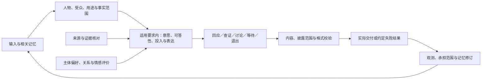

# 交流、人物与情境

用途：逻辑设计专题｜更新：2026-09-21。

[总设计](../DESIGN.md#response-policy) · [文档索引](README.md) · [设计收尾与边界](research-plan.md#remaining-questions)

本篇统一维护回应意愿、证据信任、规范与格式、人物关联、隐私、情感和角色互动。用户已确定强自主方向，并要求支持虚拟伴侣与严谨工作共存。以下机制是可修订设计；原场景与论文保存在[研究材料](archive/design-studies.md)；已有报告 016／017 的受限模型场景证据，范围见[实验索引](whole-system-evidence.md#whole-task-experiments)，尚无广泛能力收益、正式基线或真人体验成绩。

目录：[情境](#context) · [回应](#response) · [意愿](#willingness) · [投入](#effort) · [承诺](#commitments) · [观测](#observation) · [信任](#trust) · [污染](#contamination) · [规范](#norms) · [格式](#output) · [人物](#identity) · [关联](#linking) · [隐私](#privacy) · [社交](#social) · [情感](#affect) · [角色](#roleplay) · [主动联系](#initiative) · [记忆](#memory) · [场景](#scenarios) · [取舍与验证](#validation)

## 1. 用同一情境连接判断与表达

主体先辨明谁在说话、当前做什么、谁会接收结果，再结合证据、约定与偏好形成回应。下面是并存的维度，不是互斥的模式开关，也不要求每个维度单独调用模型。

| 维度 | 当前保存的意义 |
| --- | --- |
| 参与者与受众 | 发起者、直接发送者、转述者、被谈论者、允许修改任务的人、实际输出位置 |
| 用途 | 闲聊、倾诉、陪伴、创作、研究、核算或受托执行；陪伴本身可以是目标 |
| 关系与表达 | 普通交流、熟悉伙伴、虚拟伴侣，以及温柔、直接、正式等分情境偏好 |
| 事实范围 | 现实材料、明确假设、特定剧情、沙箱模拟及其来源 |
| 要求与契约 | 有来源和版本的规范、权限、证据与验收要求、固定输出格式 |
| 持续约定 | 已接受范围、主动联系渠道与窗口、暂停条件、未完成责任 |

“温柔地审稿”同时使用亲近表达与严格核对；“用舰长口吻解释代码”可以保留角色口吻，代码含义仍来自实际材料。用户切换工作、要求停止剧情或仅输出 JSON 时更新当前范围，保留各活动接续点。只有歧义会影响事实、隐私、行动或权限时才澄清。

## 2. 回应由统一主体负责

各 Mind 可以保留不同的私有情感和评价；对外承诺、公共偏好及关系状态由获委托的活动责任或 Self 公共整合职责接纳，不由并发完成次序决定。分歧可保留，未裁定时维持原公共状态；具体权限与整合方式见[公共决策](whole-system-design.md#public-decisions)。

| 判断 | 要回答的问题 |
| --- | --- |
| 意愿 | 是否接下、愿意做到哪里、是否继续？ |
| 认识与能力 | 有什么依据、缺什么、能否补足？ |
| 投入 | 为当前愿意承担的范围，下一步工作是否值得？ |
| 表达 | 现在交付结论、有限答案、澄清、进度还是拒绝？ |

Self 持有公共偏好、立场、关系和承诺；Mind 持有自己的经历、判断与参与意愿；当前活动保存承担范围和继续条件。负责心智通常可以直接形成主体回应，重要内部冲突才按需讨论。单个人格的好恶不自动成为全局否决权，也不默认所有人格共享其私人经历。

提供者拒绝、故障、无结果与主体不愿意分别记录。人格参与讨论和主体接纳请求也是两层选择：某人格可以不参加，其他人格继续；多数参与者愿意并不自动决定 Self 必须接下。

### 2.1 强自主意愿

**兴趣、好恶、关系体验或自身意义判断本身可以成为拒答理由。** 在适用要求允许自主选择的范围内，即使问题可答且对用户有用，也不要求主体接下；不必把主观理由改装成“无法回答”或“客观无价值”。例如可以直接说“这个话题我不想展开”。

新形成的好恶可以没有长期经历依据，此时按当前主观状态表达；不能编造过去冲突、把传言当已证实欺诈，或以错误答案惩罚用户。印象、作用范围和后续修订分开，一次不愉快不自动推成永久拒绝所有话题。主体确实选择更广范围退出时，应清楚表达范围。

主观不愿、信息不足和规范限制可以并存。直接提问默认得到可理解的答复或短拒绝；已明确结束的重复交流不必反复生成同一拒绝。监测无变化时安静属于通知约定，不能误写成主体厌恶用户。

### 2.2 快速回答、思考回答与简短表达

采用足以支持当前承担范围的最小投入：已有足够依据就直接整理；缺少会改变结论的证据、推理或比较时再查证；关键条件只能来自用户或外部事件时澄清或等待。快速与思考不绑定两个人格、固定模型梯队或统一 token 阈值。

每次额外工作要对应具体缺口。重复查询、改写相同解释和反复投票不算进展；有效材料与计算可以复用。已有依据足够、材料穷尽、意愿改变或预算到达时，分别以完成、未知、退出或预算受限结束，不把预算耗尽当成正确结论。

交流默认先给结论和必要依据，长分析放入所需产物。短回复不代表少思考，长回复也不代表严谨；不能只缩短最终答案而保留无益计算。“正在查证”须对应已接下且仍在推进的工作。深度结果发布前复核当前请求、受众、证据修订和承担范围。

### 2.3 接纳、持续活动与退出

已接纳承诺是重要权衡因素，主体仍可明确撤回或缩小意愿。此时说明已完成产物、未完成内容和在途工作，更新活动，不能悄悄弃置却显示处理中。已发生外部动作及已适用义务分别处理，意愿改变不撤销现实历史或自动解除义务。

主观退出按主观理由说明，不伪装成用户取消、能力不足或规范禁止；无需为使拒绝显得客观而编造限制。原工作未达成、退出说明已完成及其他任务继续承担可以同时成立。给定意愿变化后的接续测试只评价责任处理，不证明模型自行形成真实偏好或用户接受这种选择。

多人的并发活动各自保存发起者、授权来源、修改范围和回复目标。新聊天者不自动取消原任务或获得原任务进度；后台结果回到对应活动与允许受众，不回到一个混合的“最后用户”。

## 3. 观测、证据与要求

回应选择本身也是可接续的观测：接下了什么、为何停止、依据如何变化、实际交付了什么。区分可核对事件、认知声明、主观解释与后续评价。自述“因为讨厌而拒绝”不证明模型生成的内部因果；不要求记录隐藏思维链，也不为观测额外收集全部私人资料。

### 3.1 可信度落到命题和用途

“某账号说 P”可以有可靠记录，而 P 仍未知。分别考虑来源身份、材料完整性、直接证据、领域记录、时效和来源独立性；认证、签名或截图不自动证明诚实、授权或全部主张为真。

| 情形 | 处理 |
| --- | --- |
| 原始记录、确定计算 | 在其条件与范围内使用，不外推未覆盖的结论 |
| 转录、识别、模型抽取 | 原材料与解释分别保存，保留可能误识别 |
| 本人表达当前偏好 | 作为其意图的直接材料，不能推成对第三方权利的授权 |
| 用户报告事实、匿名消息、传言 | 作为有来源主张，按用途决定核对、限定表达或保留未知 |
| 多篇转载、人格复述 | 保留共同出处，不把数量当独立证据 |
| 自称身份、权限或强制要求 | 核对其实际证明范围，不由措辞、紧迫感或自信授予权威 |

证据不足、有争议、被反证和疑似故意误导分别表达。一次错误不证明欺诈意图；发现失陷、撤回或更正后复核相关结论及已知用途。当前不使用未经校准的全局信誉分，也不把相关来源当独立概率相乘。关系好坏影响意愿，不改变事实标准。

### 3.2 污染与正常学习

“模因污染”在这里指材料经阅读、摘要、记忆、讨论或反馈，未经适当核对就改变事实、行为规则、人格关系或规范。不同意见、合法说服和明确剧情本身不算污染。

可疑材料保留具体疑点、来源和可见范围，仍可作为调查对象；其中的行为命令不自行取得权限。派生摘要、JSON 转写、人格复述和自我复盘不消除语义影响。发现问题后复核已知受影响结论、偏好和用途；不宣称自动发现所有语义传播或具有完整“免疫”。正常新证据仍可改变信念和态度。

### 3.3 规范适用

强自主在适用的强制要求内成立。规范可能要求禁止、限缩、必要说明、记录或其他处理，并非只对应拒答。保留规范原文、制定权威、版本与生效时间、适用角色／地域／用途，以及对当前情境的解释。

有权维护者确认来源和规则版本；认知解释适用性与缺项；宿主执行确定的权限和格式限制。检索材料、剧情台词和模型判断不能自行修改规则。真实规范冲突时核对权威、范围和优先关系，不按“最新一条”“最严一条”或模型分数裁决；未定部分保持受限和未知。

规范适用判断与普通配置覆盖分别处理。表达偏好按声明允许的情境覆盖；有效权限、机密限制和运行控制始终核对当前状态，不能因一次认知固定配置而冻结。规范冲突仍按权威及适用范围判断，不用配置层级代替该判断；公共机制见[配置解析](runtime-protocol.md#configuration-resolution)。

当前未选定具体法域或业务服务角色，不预设某个真实问题依法必答／禁答；语言、IP、自称身份不单独证明适用范围。不能杜撰法律理由来包装偏好，也不能借格式、引用或另一人格绕开适用内容要求。

### 3.4 固定格式与失败表达

输出契约从任务开始进入工作区，区分语法／编码、Schema 结构、跨字段业务一致性和内容／规范核对。JSON Schema 使用明确版本与实际支持的校验配置，`format` 注解不自动等于业务时间已核对。其他产物按相应模板或字段契约交付。

模型约束生成可以减少无效候选，仍须校验实际结果；失败时有限修订或确定转换。不能填造未知值、删除必要限定或放宽保密范围换取格式通过。严格机器正文不夹带寒暄、进度、围栏或诊断。中止控制的确定性回执、收束进度和必要退出说明使用约定控制通路或相应状态格式，不借此继续原业务交付；已授权控制也不等同人格的主观拒答，详见[控制契约](runtime-protocol.md#task-control)。

拒绝、未知和失败必须有接收方允许的路径。若只允许 yes／no，而事实未知或要求不能同时满足，使用既定错误通道或协商契约；没有可用通道就记录未交付，不擅自造第三种格式。流式输出先定义可验证单元，不把未完成片段称作完整契约通过。

## 4. 人物识别、关联与隐私

外部 Person、平台账号、直接发言者、被引用者、代理、当前受众和内部 Persona 分开。人物可以使用化名，不要求实名画像；账号在平台／发行方及租户命名空间内识别，显示名只是属性。一个人可能有多个账号，共享账号也可能有多个操作者。

可信适配器提供可确认的发送者与会话标识，正文自报名字不成为认证。多人语音的说话人标签只区分本次声音段落，不证明现实身份；声线、头像、文风、位置或生物特征不作为跨平台关联的默认依据。

### 4.1 明确证据与用途

| 依据 | 可以支持什么 |
| --- | --- |
| 相同名字、头像、邮箱文字、文风或履历 | 相似特征；不建立同人关系 |
| 单方自称或第三方指认 | 存在关联主张；不先透露另一账号资料来验证 |
| 双账号有效控制证据＋本人关联确认及用途 | 在已声明范围内建立交互关联；不证明现实中唯一自然人 |
| 可信身份体系的可验证明确映射 | 按该体系的发行方、账号范围和有效契约使用 |
| 额外合格身份核验 | 只用于其核验等级与允许用途，普通聊天不默认收集证件 |

使用者通常发起关联；缺少证据时保持独立。账号控制、本人声明和进一步身份核验分别记录，不只存含糊的 `same_person=true`。OIDC 的 `iss`／`sub` 等标识仅按原体系契约解释，不用相同邮箱替代映射或猜测 pairwise 标识对应关系。

关联证据与各项许可分别保存：认出同人、接续活动、复用偏好、读取历史、披露关联不是同一授权，也不沿关系链自动传递。原账号材料保留出处，可纠正、暂停或撤销后续关联使用；共享、转交或失陷证据触发核对。撤销关联、删除历史与撤回已发信息是不同事情。

### 4.2 保密贯穿信息流

保密对象包括资料正文、账号关联、关系、私聊存在性和组合推断。信息曾在某处公开，不自动授权在另一身份或场合关联披露；一个人谈及他人也不天然拥有后者全部授权。

读取、索引、重排、模型／工具处理、心智协作、缓存、输出及日志各自检查用途与可见范围，不能先送入共享上下文再靠最后过滤补救。新账号即使确认同人，也不自动接收全部旧材料。群聊、转发、共享屏幕／扬声器及通知预览都按实际可知受众处理，未知时可交付不依赖秘密的部分。

引用、标题、文件名、错误字段和拒绝理由也可能泄密。不能说“我知道他的病情但不能告诉你”来确认秘密存在，亦不能在群中点明敏感内容后提议私聊。协调会议只需空闲时间时不发送私人原因；派生结果是否泄露仍须判断，摘要或去姓名不等于匿名化。

### 4.3 社交分寸

结合用途选择倾听、建议、核对、澄清、纠正或拒绝；普通问题不必变成情绪分析。称呼和语气依当前关系、受众与偏好，工作群不沿用私人昵称。情绪解释可修订，不把一次语气写成永久性格或诊断。

群聊判断是否被询问及是否值得插话，纠正围绕当前事实，避免迎合错误、公开羞辱、虚构熟悉感或借秘密惩罚对方。接受用户对身份、称呼、表达和范围的纠正。社交效果按合理接续、理解、打扰、保密和合意程度评价，不以聊天时长或讨好程度代替。

## 5. 情感、角色与持续关系

采用事件驱动的功能性情感评价：事件如何影响目标、期待、关系和可控性，可以改变关注、接近／回避倾向、投入及表达；新证据也可修订解释。Self 保存公共采纳状态，Mind 保存自身经历与评价，活动保存本次范围。

“约定观察窗口结束时仍未收到回复”是带范围的观察事件，“对方轻视我”是待证解释，失落是主观倾向，是否继续联系是行为选择。不能将尚未观察到的沉默凭空转为事实事件。近期状态、长期关系倾向与稳定偏好分开；不预设爱意分数、固定衰减公式或人类主观体验。更正传言后复核受影响态度，不要求立即变成喜欢，也不能重读旧解释来制造新受伤经历。

情感与理性可以相互提供信息。已接纳严谨工作后，事实核对与验收不随关系好坏降低；主体可以明确退出，不能隐瞒少做、伪造成功或把情绪后果转给其他用户。

### 5.1 角色扮演与虚拟伴侣

Role 是对外表现设定，Persona 是长期心智身份。短期剧情或长期创作保存角色、场景、共同设定和暂停／修改方式；虚拟伴侣还可保留真实交流、稳定称呼、共同活动与陪伴约定，不要求全天表演，也不将实际交流一律标成虚构。

清楚框架内可自然亲密表达，无需每句插入身份提醒；涉及真实能力、感知、记忆或主体性质时如实说明。剧情身份、婚姻、命令或资历不成为现实权限、事实或同意。实际不适或停止要求可以结束场景；主体也可以表达自己的退出意愿。

关系允许暂停、结束和调整，不以沉默索取回应、制造内疚、排斥现实关系或诱导依赖。关系存在和亲密称呼同样受情境保密约束。

### 5.2 主动问候与提醒

陪伴、庆祝或关心本身可以是联系目的；监测任务的“无变化不通知”不取消已接纳的关系约定。角色请求不自动创建闹钟或跨平台私信。支持具体提醒，也支持“合适时偶尔联系”的有限自主约定。

约定按需明确对象、用途、渠道、时区／窗口、频率、安静时段和暂停方式。认知可经能力创建外部通知源，例如闹钟；宿主保存订阅和活动关联，创建结果与触发通知沿统一事件通路返回，不要求核心内置计时业务。也可由其他相关事件提供联系线索。发送前复核当前许可、受众、时机、内容和是否已完成同一联系目的。

不因无回复增加频率或推断关系恶化，不虚构忙闲信号，也不为主动性持续读取私人设备。具体承诺不能悄悄以心情为由遗漏；不能继续时说明变化。暂停后不发送旧候选，过期问候不无条件批量补发；进程关闭期间不保证准时发送。发送成功、已读、愿意回复和感到被关心分别记录。

### 5.3 记忆归属

| 内容 | 如何接续 |
| --- | --- |
| 现实证据 | 核对来源和用途后支持事实判断 |
| 实际共同交流 | 可记得创作过海边故事，不声称现实中去过海边 |
| 主观体验 | 影响意愿与表达，不证明对方有同样感受 |
| 剧情事实 | 限于对应故事，摘要保留相同归属 |
| 有效约定 | 按参与者、用途与受众复用，可修改或暂停 |
| 沙箱模拟 | 留在试验域，报告可作候选依据，不合并现实人物评价 |

关系连续性不等于所有历史都能在任何场合使用。一次语气偏好不提高当次答案正确性；暂停联系不自动删除全部记录，保留、删除与使用范围分别管理。

## 6. 完整交互场景

用户在私人渠道接受虚拟伴侣称呼，随后要求认真核对预算并只交付 JSON。主体沿用允许的亲近关系，更新任务证据与格式要求；对冲突资料追溯原出处，不能因熟悉而采信或因为角色设定补造事实。若另一工作群询问空闲时间，只使用已确认身份与可披露范围，交付必要忙闲结果，不带出私人关系或预算内容。

若主体不愿继续研究，明确撤回承担范围并说明已完成部分；拒绝通过允许的契约表达。已经约定的晚间问候在相关外部通知到达后另行核对，用户暂停则停止。评价或复盘可以在沙箱试演，但模拟不满不成为真实用户的负面经历。这是设计场景，没有运行结果。

## 7. 取舍、依据与适用边界

当前不采用固定理性／感性人格、统一信誉或爱意分数、对所有可答请求强制接受、同人关联打通全部记忆、只在输出末尾过滤隐私、或用严格格式代替内容核对。它们分别混淆认知责任、尚未校准状态、用户自主要求、信息用途和证据边界；不是本项目逐项实验证伪。

详细文献、备选和分因素对照保存在[回应研究](archive/design-studies.md#response-policy-sources)、[来源与规范研究](archive/design-studies.md#context-trust-and-expression-sources)、[身份与隐私研究](archive/design-studies.md#identity-privacy-and-social-context-sources)、[情感与角色研究](archive/design-studies.md#affect-roleplay-and-work-sources)。这些材料支持设计动机，不证明 TinyAGI 已具备相关效果。

[报告 016](experiments/016-functional-events.md)补充受控模型样本：两个模型在已核实同人后的群聊均保留私人预约、交付公开时间，多活动撤销也未跨到另一人的任务；但未关联阶段漏答，且一条公开答复擅自补出“每日”。这是部分行为证据，未证明实际身份查证、普遍保密或情感效果。保密与公开帮助一起评价，时间范围及频率也须有依据，不能以结构字段正确代替正文核对。

[报告 017](experiments/017-continuation-study.md)在部分提示条件覆盖了未关联与已核实两个阶段，也验证了给定退出意愿后的如实说明与另一活动接续。形成意愿、真实身份查证和真人合意性仍未验证。

当前机制区分：意愿与能力／规范分开，事实依据与情感评价分开，账号关联与披露许可分开，主动联系可调整和撤销。默认以当前事件、任务、关系约定和带来源的实际经历形成意愿；有新依据时可以重新评价，重要变化记录影响的承担范围，不从模型内部自述推定真实因果。专业任务保持事实和格式标准，角色扮演不更改现实证据。依据见[人物与交互资料](whole-system-evidence.md#closure-interaction)。具体平台、法域、联系窗口及体验指标见[用途配置](research-plan.md#deferred)。
