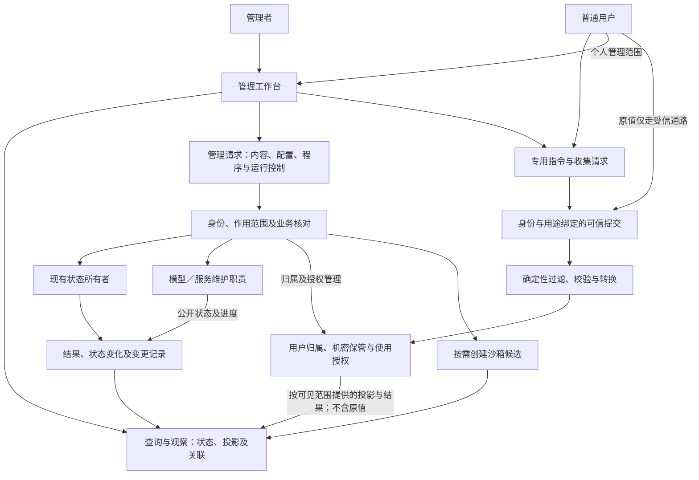

# 管理工作台与人工干预

用途：逻辑设计专题｜更新：2026-09-21。

[总设计](../DESIGN.md#management-workspace) · [文档索引](README.md) · [设计状态](research-plan.md#management-extension) · [工程参考](engineering-reference.md#management-web)

本篇定义完整管理入口、操作身份、机密通路、动态编辑及提交行为。副本状态与隔离由[沙箱专题](sandbox-evaluation.md#replica)维护；业务事实由原状态所有者维护。命令名和字段是设计示意。

| 阅读主题 | 章节入口 |
| --- | --- |
| 范围与职责 | [目标](#purpose) · [请求流](#architecture) · [管理范围](#coverage) · [身份与范围](#identity) |
| 日常管理 | [能力构建](#capability-management) · [学习强度](#learning-management) · [初始化与迁移](#initialization-management) · [预制能力](#prebuilt-management) · [任务控制](#task-control-management) |
| 机密处理 | [归属与投影](#secret-projection) · [可信提交](#secret-command) · [处理流程](#secret-pipeline) |
| 编辑与生效 | [编辑与观察](#editing) · [副本与动态编辑](#revision-review) · [函数控制台](#function-console) · [提交生效](#apply) |
| 场景与依据 | [完整场景](#scenarios) · [依据](#sources) |

## 1. 目标

工作台同时管理主体认知业务及支撑系统运行的模型、服务、资源和机密。维护状态不属于人格记忆，必要的能力变化才形成认知可见投影。工作台覆盖所有受管理业务对象及可配置行为：日常交流、观察、内容维护、行为调整、运行控制和沙箱评估。确定性管理在模型不可用时也能完成。自然语言辅助可以解释设置和提出修改，但不是管理操作的必经过程。

## 2. 逻辑职责与请求流

管理职责拥有编辑草稿、变更请求和结果关联，不另建主体、记忆或活动的事实库。状态所有者接纳修改，受影响状态及必要结果沿统一事件体系表达。运行控制可以直接处理，不先调用模型决定是否接受管理员的暂停操作。

## 3. 页面与管理范围

| 页面 | 对象与主要操作 |
| --- | --- |
| 总览 | 当前关注、活动、等待原因、交付与预算；暂停推进、停止输出 |
| 交流与活动 | 对话、目标、计划、工作区、产物与责任；修订、打断当前执行、暂时阻断、按权限解除、中止任务及转交 |
| 主体与心智 | Self、Persona、临时 Mind、偏好、参与意愿、经历与认知程序；公共决策整合职责及委托范围；提示词初始化、当前契约及迁移进度 |
| 人物与关系 | 账号关联证据、关系约定、披露范围、剧情、主动联系 |
| 记忆与资源 | 文件、观测、断言、经历、Reference、索引覆盖；读取、更正、导入导出、删除 |
| 能力与连接 | 能力到模型／工具／服务的绑定、使用范围和预算；与底层维护对象关联 |
| 能力构建与运行 | 接口、候选源码、构建环境、依赖、产物、试验、运行对象与采用绑定；按权限启动、观察、结束和替换 |
| 模型与服务维护 | 模型清单／资产、推理服务、加载状态、连接、硬件资源和维护任务；依提供者实际能力执行 |
| Secret 与认证 | 我的凭据、归属管理、专用指令、可信提交、处理规则与记录、投影、授权、替换和禁用；原值不进入聊天、认知或普通配置 |
| 主动学习与自我迭代 | 学习方向、议程、原因、强度及额度、策略修订、候选与采用记录；可关闭主动学习，展示实际停止与收束情况 |
| 行为与表达 | 回答、投入、格式、注意力、协作策略及实际配置来源 |
| 沙箱与评估 | 场景、试验状态、能力装配、输入、比较、报告与有限采用 |
| 运行与变更 | 事件、调用、输出、失败、用量、人工干预及修改记录 |

统一搜索及对象关联支持从回复找到活动、证据和调用，从记忆找到已知使用者。对象详情共用概况、内容、关联、配置和记录入口，领域操作仍按其业务含义提供，不将全部状态退化为任意字段写入。

### 3.1 认知之外的运行维护

| 管理对象 | 页面能力与职责 |
| --- | --- |
| 模型资产 | 查看来源、明确可得的版本／摘要、大小、用途、上下文与模态能力；按提供者能力下载、导入、更新或删除，不以别名推定权重身份 |
| 推理服务与连接 | 管理端点、协议、认证绑定、并发和资源配置；支持的加载／卸载／服务启停由受控适配器处理；外部服务无管理权限时仅管理连接 |
| 实际运行状态 | 展示运行中模型、已知资源占用、请求及费用；未知字段明确标记，不以一次探测宣称长期可用 |
| 非生成模型 | embedding、重排、语音识别／合成、视觉等沿同一资产／服务／能力分工维护 |
| 存储、索引和缓存 | 管理资源目录、向量接入、派生索引覆盖及提供者支持的缓存操作；不把推理 KV 当知识或密钥仓库 |
| 维护任务 | 模型下载、重建和服务变更有独立进度及影响范围；管理配置提交生效与维护操作完成分别呈现 |

同一个推理服务可以供正式主体和多个副本使用，副本不自动复制模型权重、启动服务或取得该服务的维护权。维护视图显示依赖者；卸载／删除不静默破坏仍被其他对象使用的资产。共享服务变化可能影响多个域，必须如实显示；需要固定试验条件时固定实际能力绑定，不能只复制模型名。

模型维护不依赖 LLM。具体服务只显示其支持的操作；例如远程 API 可配置模型绑定，不表示本系统有权下载其权重或重启其服务器。AGI 自主维护仅在明确授予对应能力时提出有范围的请求，不能从推理调用权推导服务管理权。

### 3.2 能力构建与运行管理

工作台沿[能力生命周期](runtime-protocol.md#capability-lifecycle)管理完整对象链，查询和确定性操作不依赖模型：

| 对象 | 页面需要表达的内容 |
| --- | --- |
| 接口与实现 | 接口权威定义、修订、支持类型、能力需求；实现关联的接口及来源；调用描述与表单的生成关系 |
| 构建环境与候选 | 可用工具链／运行环境、目标条件、包依赖及锁定来源、许可范围，源码编辑、依赖准备、构建／检查请求与诊断 |
| 产物与试验 | 固定编译产物或程序包身份、入口、依赖与运行条件，局部／组合／副本试验报告及采用依据 |
| 运行与绑定 | 所属活动或已安装能力、准备／运行／结束状态、用量、调用使用的实现、旧绑定与资源的收束情况 |
| 缓存及输出 | 可复用产物、缓存条件、报告与日志投影；按权限读取，浏览不注入认知 |

页面支持从任务缺口追到源码、构建、试验与实际调用，区分产物已生成、实现可用和目标范围已采用。一次性工作与持续提供能力分别展示结束责任；同一实现可被多个活动使用，结束或替换时显示受影响范围。维护权、构建执行权、试验权、采用权和调用权沿既有授权分别判断，已有授权内可自动推进，不为每次构建另设人工审批步骤。功能采用与实现信任分别展示：维护者或既定发布策略确认的来源、固定产物、用途、敏感能力和生效范围可查，候选测试成绩不能替代这些授权；更换实现重新核对，接口名称相同不继承原实现信任。详见[实现准入](runtime-protocol.md#implementation-trust)。

真实与试验环境分别绑定材料、能力与运行条件，测试入口不得默认回落到真实域。具体工具链及运行载体属于[工程映射](engineering-reference.md#capability-toolchain)，页面按已登记管理对象生成视图，不把实现细节强加给普通聊天用户。

### 3.3 主动学习与强度管理

页面显示主体正在学什么、为何选择、下一步、已有进展、累计投入、候选差异及实际采用结果；候选和报告先以投影呈现。策略、议程、暂停／继续与采用操作沿原所有者处理，不通过模型代替确定性管理。

**学习强度控件必须包含最低“关闭”，并明确表示不主动学习。** 启用时可使用低／中／高等预设或有界自定义配置，显示各预设对应的实际预算、并发／分支、连续推进上限及资源份额；不把预设名当性能保证。配置来源、作用范围、修改权限、实际用量与剩余额度同时可见，具体规则由[运行协议](runtime-protocol.md#learning-intensity)唯一维护。

提交关闭后立即显示主动学习准入已关闭，在途停止或清理另显实际进度；已有成果继续可查，正常工作、用户明确要求的学习任务及完成已接纳任务所必需的有界工具构建继续沿各自接纳规则执行；页面区分任务内使用、长期安装和改变主体默认策略，后两者不能借任务构建自动获得采用权。重新启用只恢复可选择学习的资格，按现状重新考虑议程，不重放全部旧工作。学习扩展及其副本不能自行提高强度，也不能通过自己的表单生成逻辑隐藏关闭入口或替换受信配置来源。

启用后的自主采用可在已授权范围内自动完成，页面关联采用前后行为、证据和后续反馈，复用提交即生效契约。强度调节不修改采用门槛；模型参数训练、核心宿主升级及用户信息使用仍遵循各自维护与授权规则。普通对话只呈现必要摘要，不持续推送无意义的学习进度。

### 3.4 人物初始化、更新与修复入口

首次进入由宿主判断是否已有主体记录。没有主体时，用户选择初始化模型、填写必要设定、配置允许能力、预算与明确的学习强度，然后提交创建；存在主体时进入已有状态或继续未完成初始化，不由认知程序启动是否成功决定重新创建。模型配置可稍后完成，界面分别显示身份已登记、等待模型、生成／检查中、未完成和可运行。

人物生成与更新以完整初始化提示词、迁移说明及公共契约为主要材料，允许不同模型形成不同实现和个性；不提供强制覆盖全部个体的统一认知模板。用户可查看所用提示词身份、生成产物、诊断及初始化进度，模型生成的设定标明来源。Secret 继续使用固定可信输入和用途绑定，不进入引导提示或代码。

更新页面区分软件更新、提示词修订和该 Self 的迁移结果，显示必要／可选项、当前接口依赖、弃用窗口、已满足或受阻原因、候选差异与实际采用。文本 diff 可自动生成，迁移说明解释语义；读取提示词不显示为完成迁移。用户发起更新或配置的自动维护范围内，可由 Self 自行修改、编译和采用，具体规则见[运行契约](runtime-protocol.md#bootstrap-migration)。

固定初始化与维护页面不依赖个体程序或动态表单加载，始终提供当前支持范围内的模型配置、诊断、程序编辑／选择及可读资源导出入口。模型不可用时这些确定性操作仍可执行；数据无法识别时显示受限维护，不伪造空人物。旧程序不能运行时可进入针对原主体的引导修复，失败保留原内容及未完成状态，不自动重置人格。

必要迁移有准备过程，界面显示进行中；候选采用仍按提交成功即生效，不额外设置第二次启用操作。超出兼容支持的旧程序不能仅靠“上一次可用”标识被视为当前可运行；不可继续时明确进入维护状态。兼容维护不会隐式开启主动学习，原开关、权限和已有关系保持其来源。

### 3.5 预制能力目录、配置与更新

工作台展示预制能力的维护来源、接口／实现身份、文档与示例投影、依赖、实际作用、弃用信息，以及已登记、已配置、获准使用和最近可用性观察。个体依赖与包装另列，新增能力可见不表示 Self 已采用。页面查询与初始化／认知使用同一来源，按管理身份和作用范围过滤。

预制权威定义在管理页只读，按客户端更新维护；有权限者可调整允许范围、参数或提供者绑定，其配置覆盖独立保存并按提交生效契约处理。个体包装和替代实现可在自己的工作区编辑、检查和采用，不能通过动态表单覆盖预制定义。需要更改客户端实现时显示其软件更新来源，不伪装为普通配置已生效。

更新详情显示新增、修复、弃用及受影响的实际依赖；预制库更新结果和 Self 迁移状态分开。固定发现／查询入口不依赖人物启动，涉及模型或外部工具的能力按实际配置显示限制。正文及源码仍按需读取，Secret 保持投影。完整职责见[运行契约](runtime-protocol.md#prebuilt-library)。

### 3.6 任务中止、阻断与审计控制记录

任务页提供打断当前执行、暂时阻断和中止任务，显示带类型的目标（Episode、Task、Operation 或当前尝试）、关联操作、子工作及控制传播范围；不能把自然语言中的“任务”直接当成一个未定类型的标识。用户权限限于获授范围；管理请求直接进入宿主优先控制通路，不依赖人物运行或模型批准。任务停止不退出 Self，其他活动仍可被处理。原控制含义与权限见[运行协议](runtime-protocol.md#task-control)。

提交后分别展示控制生效结果与实际收束情况，例如“已禁止继续派发；本地执行已停止；远端取消待确认”。操作返回不明时允许查询实际记录，不直接显示全部已停止。页面保留已有产物、已发生交付、中止原因和未完收尾责任；迟到结果不会使按钮状态自动变成任务继续运行。确定性的控制回执、停止进度和必要退出说明可按原受众发送；它们与已被禁止的原业务交付分开，不等待模型生成，也不能夹带恢复执行。

未来安全审计模块的发现／建议与已获授权控制决定分开展示，注明来源、规则及作用范围；受限证据仍用投影。管理者只能在获准范围配置模块控制权限或解除阻断，不能由自然语言辅助继承整个管理会话权限。多个阻断原因分别可见，解除一项后显示仍生效的原因；全部解除后仍核对任务、许可及预算，已中止任务另行重新接纳。

控制台任务信息、认知可见状态和审计控制使用原任务所有者记录，管理页不维护另一套停止真值。通用“继续”操作不能绕过有效审计阻断，也不隐式开启主动学习或重放全部排队工作。

## 4. 身份与作用范围

管理身份与聊天身份分开。拥有者可完整管理所辖系统，按需要限定维护、观察和试验作用范围。管理者读取资料、模型处理资料、向特定受众披露资料是不同权限。

普通用户的专用指令权限来自其已认证身份及机密归属，不要求系统管理员身份；聊天身份与受信管理／提交身份通过明确证据绑定，不因模型声称同一个人而放权。机密控件只提交新值或替换值；默认没有通用原值回读。管理身份不经模型对话授予。

真实域与沙箱域由宿主绑定，页面明确显示当前对象所属范围，切换页面不改变既有请求的目标。确定性管理不依赖模型，自然语言辅助也不获得浏览器管理会话的全部权限。

## 5. 机密归属、可信输入与投影

区分 `SecretValue`（原值）、`SecretRef`（标识引用）、`SecretProjection`（按可见范围提供的元数据）、`SecretBinding`（使用者、执行域、目标和用途授权）与 `SecretIntake`（有身份和用途绑定的提交请求）。这些是逻辑概念，字段名称尚未冻结。引用不是通行证，知道标识不能读取或任意使用凭据。

模型可见投影只包含当前任务必要的标识、类型、用途及已配置／缺失／禁用／过期等状态；不包含原值、片段、可还原编码或原值哈希。别名、所属用户及用途本身也按范围显示，不向所有人格或群聊广播凭据清单。普通资源可在明确读取后进入认知；secret 原值没有这样的模型读取路径，包括 LLM、embedding、重排、语音及视觉处理。外部服务可在授权的认证通道接收凭据，模型提示与可见正文不承载凭据。

### 5.1 用户归属与权限

| 关系 | 含义与操作 |
| --- | --- |
| 归属身份 | 每个 secret 明确属于哪个用户；系统共用凭据可归属于系统身份。归属用于确定个人管理范围，不由模型推测 |
| 创建／提交者 | 记录实际提交者及来源；代为录入不自动成为所有者，系统内归属也不证明外部账号的真实所有权 |
| 维护权限 | 用户可创建、替换、禁用、删除自己的机密并调整授权；受委托者或有相应权限的管理者可代管 |
| 使用授权 | 明确哪个活动／能力在什么执行域、目标服务、操作和期限内使用；保管机密不自动授权一切任务使用 |
| 投影可见权 | 决定谁可见引用、别名、用途及使用记录；能看投影、能维护和能使用分别核对 |

工作台提供“我的凭据”和按权限开放的管理视图。管理面板可以修改归属用户、别名、用途与使用绑定，无须让普通用户取得系统管理员身份。修改归属作为独立业务操作，保留原创建来源；成功提交时旧归属派生的维护权和旧使用绑定失效，需要保留的授权按新归属明确重建。修改归属不改变上游账号所有权，也不提供原值回读。

用户身份来自已认证的账号与有证据的身份关联。跨平台账号合并、同名别名、共享会话均不自动合并机密或扩大授权；别名按归属与范围解析，缺失时不得退回其他用户或系统同名凭据。模型可提出所需用途，不能自行填写一个用户标识取得其权限。

### 5.2 专用指令与可信提交

专用指令模式是确定性处理的交互模式，普通用户即可在自身权限内使用。示意指令为 `/secret set <alias>`、`/secret replace <alias>`、`/secret disable <alias>`；指令只表达操作，不附带原值。可信入口根据已认证来源及模式标记分流，不交给模型识别意图。模型、网页或工具输出中的同名文本没有执行权；未知或无权指令返回模式内错误，不回退到普通聊天。

进入模式有两种路径：用户主动执行指令；或者主体发现能力缺少凭据，提出不含原值的收集申请，由宿主按当前任务和用户权限创建 `SecretIntake`。后者可以在对话中显示“需要配置服务凭据”，实际输入控件／入口由受信交互职责直接呈现，模型不生成收集页面、访问凭证或最终链接。

一次性网页只是提交方式之一，也可使用工作台固定控件、可信终端无回显输入或其他受信输入通路。提交请求绑定指定用户、用途、目标服务、任务／执行域、有效期和允许操作；页面明确显示这些信息，以及保存期限和本次授予的使用范围。既有绑定直接替换，新绑定可与录入一并提交，不增加管理员审批或第二次发布动作。

入口需将提交者与预期用户对应起来，可沿用已认证会话或受信的身份绑定；单凭一条被转发的链接不能证明归属身份。访问凭证短期、一次性、仅允许本次提交，不能用于读取机密。打开页面不算完成；有效提交被接纳后入口失效，过期／撤销后重新申请。一次性的是提交资格，机密本身可按页面约定长期保存或仅服务当前任务，二者不混同。

入口访问凭证也属于机密，由宿主直接交付给指定用户，不进入模型、公共群聊、普通日志或副本；模型只获请求标识和待提交／完成／取消／过期状态。可信输入不可用时保留待配置状态，用户可以取消或改用其他可信入口，不降级为让用户在聊天里粘贴。已经发送给第三方聊天平台的内容无法通过后续遮蔽撤回。

动态页面只能引用固定受信的 secret 控件与请求描述；可编辑表单／蓝图保存引用，不能读输入框、回填原值或插入脚本监听。具体传输和浏览器约束见[工程参考](engineering-reference.md#maintenance-secrets)；“一次性”不等于输入设备天然可信。

### 5.3 过滤、处理与转换

此流程由受信职责确定性执行，不调用模型判断原值。“透明”指自动完成分流、投影和绑定，用户无须手工搬运引用，同时能看到用途、归属、范围和处理结果；不隐瞒收集，也不把内部原值展示为可观察性。

| 阶段 | 处理与转换 | 可流向普通业务的内容 |
| --- | --- | --- |
| 入口分流与过滤 | 在聊天保存、普通事件、通用日志和任何模型预处理前按可信通路／敏感字段分流；普通输入的已知机密检测作为补充 | 已清理输入或需专用提交的状态 |
| 身份与请求核对 | 核对提交者、归属、请求有效性、用途和允许操作；错误也在机密通路内处理 | 不含提交内容的错误类别 |
| 类型校验与转换 | 依已声明的凭据类型校验／封装；不任意去空白或改写字节，不靠模型解读；派生认证材料继续标为机密 | 类型、校验状态；无片段或原值摘要 |
| 保管与投影 | 保存原值和独立授权关系，将业务配置转换为 SecretRef；收集成功与服务认证可用分别表达 | 请求完成、已配置及按可见范围提供的投影，不声称已验证上游有效性 |
| 使用解析与注入 | 每次调用核对当前归属及绑定，在目标认证位置使用；协议所需编码仍在受信边界内 | 使用状态，不返回原值或认证材料 |
| 返回过滤与记录 | 按允许字段构造业务结果，隔离认证头／调试回显和敏感派生内容，再形成认知输入、事件、通知与记录 | 业务结果、使用者、用途及成功／失败状态 |

规则按字段类型、来源和目标契约组织，可在管理面板查看和调整相应映射，但不能通过通用表单、蓝图或停用某条遮蔽规则取消“原值不进入模型”的约束。已标记机密的敏感性随转换传播，编码不是脱敏；不能安全分离的输入／返回内容留在受限通路，向普通业务只返回状态。

对误粘贴到普通聊天、附件或外部结果中的机密，能确定的部分在入模前替换为不含原值的提示，无法安全切分的可疑内容隔离并请求专用提交；不默默将不确定文本保存成用户的凭据。此补充检测无法保证识别所有未知秘密，不能作为主要隔离机制。主体后续思考、摘要或日志过滤均不能撤回已经发送给模型的内容。

### 5.4 使用、变更与记录

能力请求按当前调用者、归属、执行域、操作、目标与绑定核对；受信执行职责解析凭据并在目标协议规定的位置使用。模型不能把合法引用改配到任意目标或回显工具，目标变化及重定向不自动继承认证。不存在向模型、普通资源读取或认知代码返回 SecretValue 的能力。

成功提交替换、禁用或授权变更后，新调用立即使用当前状态，无需另点发布。已发出的请求可能已携带旧认证，不能承诺撤回；本地禁用不等于提供者端吊销。配置回退不自动复活已禁用／已删除凭据。日常页面不提供通用原值回读；机密备份／恢复属于独立管理通路。

统一事件只表达请求及凭据状态变化，结果按受众形成投影，不保存原值或一次性访问凭证。沙箱副本只继承可见投影与能力需求，不复制原值、生产使用权或尚有效的提交会话；所有者或有权委托者可向指定分支授予受限测试使用权，由宿主注入认证。副本采用、导出和账号关联均不自动导入认证权限。

## 6. 编辑与可观察性

常用表单、高级编辑及关联视图面对同一对象，显示配置来源、作用范围和实际结果。当前值、人工指定值及认知判断分别归属，人工更正不是无来源的现实证据。有效配置统一按[配置解析契约](runtime-protocol.md#configuration-resolution)显示声明默认、允许覆盖、作用范围及当前约束，不能由某页面自行决定优先级。公共偏好、关系承诺和跨活动目标的修改还显示[公共决策整合职责](whole-system-design.md#public-decisions)，不同 Mind 的私有评价不直接覆盖 Self 公共状态。

个体自定义状态按[宿主状态契约](runtime-protocol.md#individual-state)展示归属、结构修订、可见范围、写入者和迁移关系；可用描述驱动表单，未知结构只提供受限诊断与资源查看，不猜测字段含义或伪造空状态。代码与状态结构的共同变化按候选转换处理，不开放绕过状态所有者的任意写入。

历史事实可以注释、更正，隐私材料可以按规则删除或脱敏；修改记录不使已经发生的外部动作消失。缓存和索引通过失效、清理、重建管理，不能直接当成业务真值。

从输入到交付可追查情境、承担范围、实际配置、选入材料、参与心智、能力调用及后续修订。展示可核对的过程和声明理由，不承诺还原模型内部完整思维。

管理者展开资源是一次有范围的读取，不自动把全文加入主体认知。将资源加入某活动材料需要明确操作；资源在认知中仍遵循投影和主动读取规则。

## 7. 副本操作、动态编辑与提交

本节维护操作方式；编写契约与副本重建细则的不同设计范围统一见[台账](research-plan.md#management-extension)。

### 7.1 副本操作

按副本重建建议，工作台提供创建、切换、继续／暂停、注入事件、重置、再分支及比较入口，页面始终显示当前域及基准。创建副本和采用差异由相应状态所有者处理；完整继承与隔离规则见[沙箱副本生命周期](sandbox-evaluation.md#replica)。

### 7.2 表单、蓝图与代码的权威定义

将参数定义、展示描述、行为结构、代码模块引用及能力需求绑定到同一修订。受管理模块遵守[编写契约](runtime-protocol.md#managed-functions)，工具从类型提取参数和返回结构，从文档注释提取说明，从结构化注释补充入口暴露、字段范围／默认值／控件及能力需求，生成同源的调用描述、表单与蓝图节点。普通辅助函数无需全部标注；复杂逻辑通过代码模块表达，蓝图组织事件处理、条件、能力调用、心智协作和可复用子图。

跨实现发布的能力以其接口声明为调用类型的权威定义，实现源码关联该接口；界面说明与使用需求补充管理元数据。函数类型派生接口时保持单向生成，不让接口、各语言类型与表单同时手写。接口修订与实现产物修订分别展示，具体生成技术见[工程参考](engineering-reference.md#managed-function-tooling)。

蓝图表示程序组织，不把 AGI 的开放任务计划固定成预设流程。运行轨迹作为独立叠加视图，不能通过拖动历史节点改变过去的执行。

蓝图的结构定义是该蓝图的权威内容，编译得到的代码为派生产物；手写代码模块以源码为权威。参数表单修改模块公开配置，画布修改连接和组织。任意源码不承诺无损还原为可拖动蓝图；自定义逻辑保留代码节点，避免两份都可改却无法同步的业务定义。

函数控制台按获准的描述生成参数编辑器，展示返回值、使用状态和调用记录；同一入口可按声明分别用于管理、蓝图和模型调用。仅支持已声明且可适配的类型，不把任意内部符号变成公开 API。调试函数可转入[沙箱测试入口](sandbox-evaluation.md#function-evaluation)，不因点击“测试”自动使用真实域。

源码中的类型、说明及默认值为声明来源；用户修改是声明允许范围内的独立配置覆盖，不反向改写默认值；生成器同时提供覆盖规则、约束及状态结构描述，失效覆盖须转换、明确移除或拒绝提交，不能静默吞掉。生成内容不另作手写真值；提交时核对全部描述及引用，成功后调用入口、表单和蓝图共同切换到目标修订。机密字段只引用固定受信控件，模型生成的描述不获得原值或执行任意页面脚本的权限。

### 7.3 提交成功即生效

统一流程为：编辑 → 提交 → 解析权威类型／接口与元数据 → 校验规范和兼容性／准备候选 → 调用边界切换 → 已生效或提交失败。提交成功时目标范围已经采用新内容；不能仅保存候选就回报已生效，也不增加第二次发布／启用动作。

上述候选切换流程适用于代码和普通行为配置；权限、Secret 绑定、额度、学习关闭及控制状态按当前值执行，不等待旧调用结束才收紧。一次执行使用确定的代码及普通行为配置，切换期间暂停受影响入口接纳新调用；宿主等待当前调用收束，或撤销本次计算并从显式业务状态接续，避免中途混用新实现。旧模型响应不得未经重新核对进入新输出。已经派发的外部动作继续保留原归属及核对责任，不因提交取消其现实历史。

无法编译、状态不兼容或无法完成切换时提交失败，旧有效修订继续可见；必要的准备耗时显示为提交中，不留用户手动处理的待生效配置。索引重建等后续工作单独展示进度，参数立即采用不等于重建完成。

替换能力实现时，准备可用候选并在受影响执行边界更新实际调用绑定，成功后新执行采用目标实现；只更新服务登记不算全部生效。旧执行与已打开资源保持原实现关联，界面显示其收束或显式转换；不能为了显示已生效而把旧资源伪装成新实现。准备过程可耗时，但不增加第二次启用按钮。

试验是管理员可选择的工作路径，不是每次提交的强制前置。人工提交成功只说明配置已采用，不自动形成经过能力评价的基线或扩大实现信任。主体自主修改的采用权限和既有评价规则仍需满足；一旦获准提交，采用同一立即生效契约。核心宿主程序替换属于软件升级；按契约受管理的能力实现可通过准备与绑定切换更新，两者不混同。经常需要微调的行为放在可配置或可替换的认知与能力层。

## 8. 完整场景

### 8.1 在副本调整回答行为

以下示例以[副本重建方案](sandbox-evaluation.md#replica)为前提，该方案的具体继承规则仍待确定。管理者从正式主体的当前业务状态创建暂停的副本 A，再进入其主体、活动、资源和程序页面。A 保留基准时点的记忆与任务，输出发送到试验收件箱。

管理者在动态表单调整检索额度，在蓝图增加独立检查分支，并编辑该分支的代码模块；一次提交处理相关定义，成功后 A 使用新内容。选择运行并提供输入后，A 独立推进；正式主体保持原行为。运行中再次修改 A 时，记录此次变更，从变更后内容继续，不能把混合条件的轨迹算作单一配置的对照。

对比合意后，管理者选择采用的代码／配置差异并提交到正式主体；无需整体覆盖副本记忆、模拟关系和外部动作。正式主体已修改相同内容时展示冲突。这是设计场景，不是运行记录。

### 8.2 普通用户为任务提供自己的凭据

用户甲要求读取自己的外部服务资料。主体缺少凭据时申请收集，只得到请求标识和状态；宿主将绑定甲及该任务的可信入口直接呈现给甲。甲在入口看到归属、目标、用途、保存期限和使用范围，输入并提交一次；系统完成保管、引用转换和授权，沿统一事件将可用投影交回原活动，能力执行再按绑定使用。

甲可在“我的凭据”替换或撤销凭据。用户乙提出同类任务时，不能使用甲的同名凭据；管理员按权限更正归属后，须重新核对原有授权。工作台展示各步骤的处理状态，不展示机密原值；主体也不接触页面访问凭证、用户输入值或认证回显。这是设计示例，未创建真实入口或调用外部服务。

## 9. 资料依据与设计推论

查阅日期：2026-09-20。在线资料没有绑定本项目安装版本，属于资料依据。原理参考不意味着采用其运行框架或已有相同保证。

| 来源 | 支持的命题 | 本项目推论与边界 |
| --- | --- | --- |
| [OWASP Secrets Management](https://cheatsheetseries.owasp.org/cheatsheets/Secrets_Management_Cheat_Sheet.html)，§§2.3、2.7、2.11、8.3，2026-09-20 在线查阅 | 限定访问、生命周期管理、用途元数据和避免明文日志 | secret 投影、专用维护、宿主使用及范围化记录是本项目组合设计；资料不证明已实现零泄漏 |
| [OWASP Forgot Password](https://cheatsheetseries.owasp.org/cheatsheets/Forgot_Password_Cheat_Sheet.html)，General Security Practices／URL Tokens，2026-09-20 在线查阅 | 用户绑定、有限有效期、单次使用的受限入口，以及可信域和独立交付通路 | 借用受限提交会话原理，应用于 SecretIntake；原文针对密码重置，不直接证明本项目机密收集安全 |
| [W3C Secure Contexts](https://www.w3.org/TR/secure-contexts/)，§§3.1、5.1，2026-09-20 在线版本 | 浏览器对可信来源及隔离边界的定义 | 可信来源是输入通路条件之一，不证明整个设备或页面脚本可信，也不替代用户身份核对 |
| [Ollama 官方 API 源文档](https://github.com/ollama/ollama/blob/main/docs/api.md)，2026-09-20 所见 main，模型清单／拉取／删除／运行状态 | 模型维护存在独立于聊天生成的管理接口 | 工作台区分推理调用与维护操作，具体支持项由适配器声明；不指定采用该运行时或声称所有服务提供同等权限 |
| [JSON Forms UI Schema](https://jsonforms.io/docs/uischema/)，在线说明 | 数据定义与控件／布局描述可以分开 | 动态表单由模块描述驱动；不保证业务语义，也不必选此组件 |
| [Node-RED Subflows](https://nodered.org/docs/user-guide/editor/workspace/subflows)，Properties／Inputs & Outputs | 子图可封装成节点，并定义实例属性和编辑界面 | 蓝图组织行为与参数，复杂逻辑封装；不承诺任意源码与图双向无损转换 |
| [LangGraph time travel](https://docs.langchain.com/oss/python/langgraph/use-time-travel)，Overview／Fork | 从检查点修改状态产生分支；后续调用可重新执行且结果可能不同 | 采用基准与独立演进概念，外部动作必须由试验能力约束；不因此引入该框架或宣称完整 AGI 克隆已实现 |
| [go-mini 当前核对](engineering-reference.md#management-web) | 业务进度由宿主保存，热更新保留旧帧／闭包 | 副本从业务状态重建；提交立即生效需要宿主切换契约，不能只调用热补丁便声称全部执行已切换 |

未采用任意内存复制作为副本定义，原因是业务状态和外部世界／句柄不是同一对象；未采用全部页面静态硬编码，原因是代码模块和能力参数会变化；未采用独立表单配置、图和源码各自作为完整真值，原因是难以解释实际执行的内容。

Secret 方案不采用管理员独占维护，因为用户需要自行提供和控制自己的凭据；不采用模型识别后再遮蔽，因为值已经入模；不采用指令携带明文参数或任意生成表单收集，因为会扩大历史、日志与脚本的可见范围；不采用仅凭一次性链接决定归属，因为链接可转发；不采用全局别名自动选密钥，因为可能跨用户使用。专用确定性通路的代价是维护类型映射与可信控件，收益是归属、授权和数据路径可明确审阅。

热加载采用编写契约和同源描述生成，减少手写适配、旧闭包迁移及任意栈恢复需求；不采用注释即授权、仅凭纯计算声明自动重试或默认公开所有内部函数。代价是维护规范检查与生成工具，不能因此承诺任意源码均可在线替换。[资料及工程映射](engineering-reference.md#managed-function-tooling)
