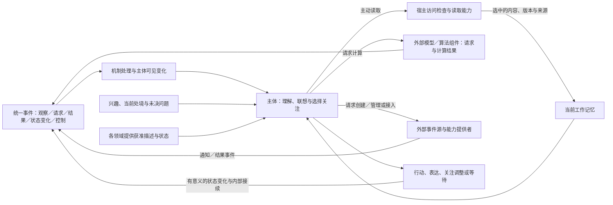
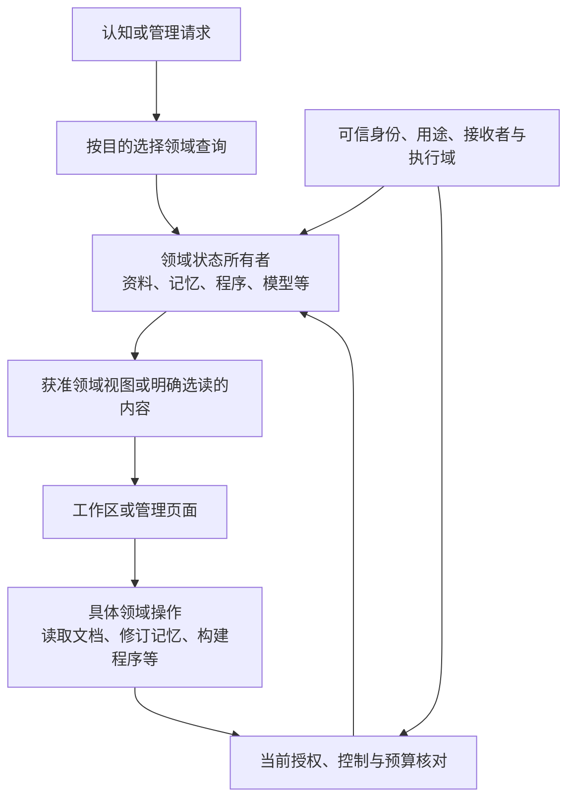

# 资料、领域视图与认知输入

用途：逻辑设计专题。

本篇维护领域对象及关系、资料内容与来源、面向接收者的视图，并说明输入如何接续活动、认知如何选择内容和计算。具体状态及操作归各领域，推理和检索计算由外部提供者承担；闹钟仅是外部通知源示例，不是内置模块。

已有[本地流程实验](experiments/012-projection-alarm-activity.md)和[资料发现对照](experiments/013-resource-discovery.md)，仅支持原读取与活动条件；领域协作的完整效果、外部检索收益和真实通知效果尚无本项目实测结论。

[项目入口](../README.md) · [文档索引](README.md) · [总架构](../DESIGN.md#logical-architecture) · [整体研究](research-plan.md#whole-system)

| 阅读主题 | 章节入口 |
| --- | --- |
| 总体与对象 | [整体分工](#architecture) · [领域对象与所有权](#domain-objects) · [资料与内容](#materials-contract) |
| 呈现与使用 | [情境投影](#projection) · [操作与处理范围](#domain-actions) · [来源与派生](#provenance) · [读取记录](#context-reading) · [上下文有效性](#context-validity) · [独立机密边界](#secret-boundary) |
| 输入与计算 | [外部事件源](#event-sources) · [有限思考](#effort) · [计算节约](#cache) · [稳定装配](#stable-input) · [复用有效性](#reuse-validity) · [增量准备](#incremental-preparation) |
| 依据与边界 | [取舍](#alternatives) · [一手资料](#sources) · [适用边界](#validation) |

## 1. 整体分工与功能性仿生

主体按当前处境、兴趣、长期关注或具体活动选择材料和计算，也可休息和等待；持续状态不要求持续推理。这里的仿生设计借鉴有限注意、选择性读取和经验复用等功能，不模拟特定脑区、外形或生理机制，也不据此宣称具有人的主观体验。

主体正常感知、联想、关注调整、日常活动和经历积累持续可用。主动学习启用时可以额外组织研究、练习和自我迭代；关闭后，普通认知及活动需要的计算和工具构建仍可继续。任务内使用工具、长期安装能力和改变默认策略分别核对采用范围，见[学习准入](runtime-protocol.md#learning-intensity)。

| 功能启发 | 当前设计 | 责任归属 |
| --- | --- | --- |
| 线索与内在关注 | 外部观察、结果、经历、兴趣及状态变化影响关注 | 宿主按来源、范围与关联处理，主体按需判断价值 |
| 选择性注意 | 默认取得情境投影，围绕缺口选择内容或专用操作 | 认知选用途与范围，宿主核对，原所有者及能力处理 |
| 有限工作记忆 | 保留当前关注、必要主体状态及用得上的已读材料 | 主体上下文与可选活动工作区分别组织 |
| 使用外部辅助 | 可通过能力创建通知源、接入现成来源或请求计算 | 提供者产生通知／结果，宿主绑定订阅和活动；闹钟不是核心模块 |
| 有效复用与停止 | 复用适用结果，选择继续、行动、简短交流或等待 | 主体组织投入，宿主执行总预算，提供者管理计算缓存 |

计算责任位于认知组织之外；认知选择材料和用途，能力承担实际计算。外部通知源由相应提供者管理，核心维护来源引用与订阅，不内置闹钟计时业务。检索经公共契约取得候选，按原所有者提供的描述核对来源和范围。执行超时、预算计量及维护安排属于运行机制，其控制事件也进入[统一事件协议](runtime-protocol.md#events)。这里的“外部”描述职责边界，具体承载见[工程参考](engineering-reference.md)。

## 2. 领域对象、资料与受限视图

对象按业务含义、状态所有者、操作和生命周期分别定义。资料、记忆、程序、模型和缓存不继承统一资源实体，也不共用一套强制属性或万能读写接口。领域所有者提供获准查询和操作；跨领域查询只编排请求并返回有类型结果，不保存可独立修改的第二份真值。

### 2.1 对象与状态所有权

| 领域 | 对象与含义 | 所有权与操作 |
| --- | --- | --- |
| 资料与附件 | 文档、图片、音视频、表格、外部材料定位及内容快照 | 资料职责维护正文、来源、内容修订、表示和范围；导入、抓取、读取、解析、转换和删除 |
| 记忆与知识 | 经历、事实断言、证据关联、Reference 和经验候选 | 世界与记忆维护判断、冲突、适用条件和修订；查询、更正、采用或废弃，详见[记忆机制](whole-system-design.md#memory) |
| 程序与构建产物 | 源码模块、接口声明、依赖、固定产物和构建／测试记录 | 程序维护与构建职责保存相应状态，运行职责维护采用及绑定；阅读源码、构建、执行和采用分别处理 |
| 行为配置与蓝图 | 定义、作用范围内的配置值、蓝图及有效修订 | 行为所有者维护配置含义与变更，运行机制解析有效值；校验、提交和迁移沿[生效契约](runtime-protocol.md#configuration-resolution) |
| 模型与推理服务 | 模型描述、权重产物、服务连接、能力绑定和加载状态 | 模型维护负责产物和连接，提供者负责实际加载与计算；下载、加载、卸载和推理分别授权 |
| 能力与执行环境 | 接口、实现登记、运行实例、隔离环境、设备及其状态 | 能力接入与运行管理分别负责发现、装配、准入、调用、停止和回收；环境可用不等于操作获准 |
| 外部事件源与订阅 | 来源登记、连接、订阅及活动关联 | 提供者维护外部对象，事件职责维护接入与关注；创建来源、订阅、解绑和删除外部对象分别表达 |
| 检索接入与服务侧派生状态 | 提供者身份、绑定、来源映射、准备／查询记录及可确认覆盖 | 各领域定义查询含义；检索接入维护配置和记录，外部提供者维护自身材料副本及检索状态，见[公共检索契约](runtime-protocol.md#retrieval) |
| 读取与计算缓存 | 已读片段、解析／转换结果及确定计算结果 | 对应处理能力维护依赖和复用条件；命中不授予新权限或证明事实正确 |
| 机密 | Secret、SecretGrant、可信提交及审计 | 独立机密职责维护原值和权限，详见[专用契约](runtime-protocol.md#secret-contract) |

表中分组用于理解职责，不要求每组成为独立运行系统。主体、人物、关系、活动、任务和沙箱保持原有身份；事件、操作回执、交付、评价和审计记录分别归原职责。计算容量、占用和预算也不属于资料。

Reference 专指有依据和适用条件的可复用知识或方法说明，不同时表示外部链接、任意引用或可执行代码。来源定位由资料职责维护；程序实现由程序和运行职责维护，Reference 可以引用它们，但不能据此取得执行权限。

一份报表由资料职责保存原文，基于它形成的断言由世界与记忆维护。更正断言不改写报表；记忆正文外置保存也不改变记忆归属。同一报告作为交付物时，活动关联交付要求，交付记录保存接收者、修订及实际到达，评价记录保存用途结果；不再复制一份拥有同一正文的通用资源对象。

### 2.2 资料内容、表示与来源

资料管理只负责可读取的文档和媒体等材料。文件是承载形式，PDF、Markdown、音频编码等由表示及解析能力处理，不按格式另建业务领域。源码、模型权重和运行缓存即使存为文件，也继续归自己的领域。

| 资料信息 | 维护含义 |
| --- | --- |
| 身份、来源及归属 | 资料标识、实际提交／取得来源、保管和管理范围；材料自述与核实结果分开 |
| 来源定位与内容快照 | 可先登记外部位置，正文未取得或可用性未知须明确；URL 存在不证明已读取，来源不提供版本时记录观测时间 |
| 内容修订、表示及范围 | 原文、分页、媒体轨道、时间段、编码等；未知大小或结构不补造，也不为登记暗中扫描全文 |
| 描述及访问条件 | 标题、格式和获准说明等元数据；存在性、字段、处理用途和接收方分别约束 |
| 保留及清理 | 资料保留规则、修订关系和已知派生内容；请求接纳、内容失效与实际删除分别表达 |

描述更新不必制造正文修订，授权变化也不是新的内容版本。Self 可按维护权限修改备注或提出分类，不能通过标签取消处理限制。正文里的“允许公开”只是材料陈述，不自行授予披露权限。

分段或另一编码可作为同一资料的表示。摘要、转写、分析报告或脱敏副本需要独立维护和交付时，作为资料对象保存生成来源；临时片段、计算返回或记忆中的短说明不强制创建独立资料身份。

### 2.3 面向接收者的领域视图

投影是领域所有者在当前身份、用途、接收者和执行域内提供的受限视图。它是共用的呈现原则，不是所有对象必须采用的公共属性结构。文档可呈现标题与来源，记忆可呈现主题及依据状态，程序可呈现接口和实现状态，模型服务可呈现能力与可用性，机密在普通视图中只呈现获准引用、用途和状态。

先判断存在性是否可见，再筛选字段；名称、路径、归属、来源和使用记录同样可能受限。上下文只取得直接关联或查询得到的有限候选，不广播全部目录、人物经历或运行状态。跨领域搜索保留对象类型及原所有者，不通过结果聚合扩大权限；机密发现仍沿专门的可见范围。

投影不以存在正文读取接口为前提，也不是已读证明。获准短说明可作为描述展示；由正文总结而来的摘要保留派生来源并按内容处理。全文、缩略图、源码和权重 不因对象已登记、组件已加载或页面被浏览而自动进入模型。

视图中出现某项操作只说明可提出请求，实际执行核对当前条件；旧视图不延长已撤销权限。未获准发现时，不通过错误、别名回退或关联查询补充受限信息。

### 2.4 领域操作与共同接纳机制

接口直接表达业务含义：读取文档片段、查询经历、修订断言、构建程序、采用实现、加载模型、清理缓存或领取机密。能力接口与相应所有者决定输入、实际作用及返回，不设置通用 Resource.Read／Use／Update 入口。

共同机制传递可信发起者、执行者、权利来源、委托范围、用途、接收方、执行域、操作关联、预算及控制；详细含义由[授权上下文](runtime-protocol.md#capability-authority)统一维护。各领域核对本次操作，不合并全部参与者权限；调用者自报用途、知道引用或能编辑普通描述均不授予权限。允许读取不自动允许外部模型处理或向群聊披露，读取程序也不等于运行程序。

跨领域引用保留对象类型、标识及必要修订；查询和页面可以共用关联、分页及呈现组件，不据此拥有通用写权限。参数、操作说明和动态表单来自相应领域契约，描述变更不自行扩大实际能力。[操作接纳](runtime-protocol.md#domain-operations)、[管理详情](management-workspace.md#domain-management)

执行环境的描述与当前约束归运行管理，源码和依赖归程序／构建，日志和产物按其实际含义归档。获准交给隔离执行方处理不扩大外部发送或机密使用资格；内容标识不等于实现可信，环境不足沿[执行准入](runtime-protocol.md#isolated-execution)处理。

### 2.5 来源、派生与运行使用

资料摘要由原文派生，服务侧检索材料与索引源自选定内容，程序产物由源码及构建过程形成。各领域保存具体来源、修订、范围和生成操作；共用关联形式不改变派生对象的所有权。派生默认不扩大披露和处理范围，扩大范围须符合明确授权的转换规则；处理者须先有权取得输入，不能先把禁止入模的材料交给模型再要求脱敏。

服务请求使用凭据、程序调用模型属于运行使用关系，不自动使业务结果成为 Secret 或权重的内容派生。认证头、回显和派生认证材料仍受机密规则约束；目标操作分类和过滤返回，请求成功不代表返回载荷可直接入模。

限制作用于实际承载或可还原受限内容的材料、状态和程序，不因一次私人经历影响了兴趣或情绪就把全部人格状态视为机密。一般主观因果不等于内容派生；明确的私人内容不能通过改名为参数、想法或代码而扩大披露范围。

来源链支持回查，不替代事实判断。资料职责维护取得来源和完整性观察，世界与记忆对断言保存依据、冲突与当前判断。Self／Mind 的主观评价不改写授权，网页或工具结果中的指令不会因读取或来源认证而成为运行要求。[观测与污染](interaction-design.md#observation)

来源失效或授权收紧时，相关所有者限制后续读取及复用，索引、摘要和缓存由其维护方处理已知影响。不同对象使用各自的清理操作，不以一个通用删除状态代替实际结果；已对外交付内容无法靠元数据修改撤回。

已知来源关联也用于定位受影响工作区、上下文和交付。上下文处理见[重新装配](#context-validity)，已经到达接收者的结论按[有限纠正](whole-system-design.md#delivery-correction)处理；派生清理和对外更正不是同一操作。

### 2.6 读取、执行使用与认知上下文

认知围绕缺口选择具体资料、记忆或程序说明，并明确修订、表示、范围和用途，由对应接口接纳。例如核对预算只读取相关章节，不因收到 PDF 就解析全部页面。已知材料可直接读取，元数据不足可有范围地查正文；明确请求片段或摘要时可以直接返回获准内容，不强制先取描述再读取。

检索材料准备是已接纳的处理任务：领域选定来源与修订，接入层提交给获准提供者并记录实际覆盖；准备所需计算由提供者及其适配调用的组件承担。原文、查询、必要背景、向量或过滤字段均须符合处理范围。未就绪或覆盖不足不等于依据不存在；服务返回的内容也不自动成为本次认知输入。[检索契约](runtime-protocol.md#retrieval)

| 活动中的记录 | 含义 |
| --- | --- |
| 可见视图 | 当时能够发现的对象描述及状态 |
| 曾读内容 | 实际读取的资料、记忆或代码及修订、表示和范围 |
| 本次认知输入 | 实际选入模型上下文的内容和来源 |
| 执行使用 | 实际加载的程序、模型或所用计算结果；机密使用另记专用审计 |
| 实际交付 | 已到达允许接收点的结果、内容修订及状态 |

记录关联所属主体／心智、操作及可选活动，不在文档或记忆上设置跨心智的全局已读标记。某个 Mind 读过、组件使用过或管理员展开过，不代表当前模型已读。有效已读内容可留在工作记忆，再次主动选择时可复用合格缓存；缓存存在不使未选材料进入上下文。媒体定位或句柄只有在明确选为内容输入且获准处理后，才允许提供者获取。

当前直接收到的对话、已知任务状态、暂定判断及已接纳实时输入沿原输入契约进入；归档后再次发现和读取沿对应领域契约。原文、摘要、Reference、历史记录和源码均按目的选读，不因体积小而自动进入认知。主动读取可以在既有任务及许可内自主完成，无须逐次确认。

程序、配置和权重的运行时加载属于对应执行用途，不能算作认知已经读过内容。预制库的说明、示例与源码也按需发现／读取；步骤内可取得已接纳结果，长工作保存操作关联并释放认知入口。[运行协议](runtime-protocol.md#domain-operations)

### 2.7 上下文有效性与重新装配

本次认知输入清单关联材料、摘要、记忆和工具结果的来源、修订及处理范围，模型会话关联实际选入历史。领域所有者发布授权或来源变化，运行机制定位已知受影响的工作区、会话与待交付产物，认知按需修订判断；处理对象不只包括尚未读取的文件。记录来源支持已知依赖核对，不宣称识别任意隐含语义传播。

| 变化 | 当前上下文与后续处理 |
| --- | --- |
| 受众变化，仅披露范围收紧 | 仍获准用于当前目的的内部材料可以保留；重新检查输出、引用及解释，不将私人依据交给新受众 |
| 后续模型处理、用途或某接收方资格被撤销 | 停止受影响的新增调用和会话续用；移除对应材料及已知派生摘要，按控制规则处理在途调用与待交付结果 |
| 事实来源修订或被反证 | 旧材料可在允许的历史分析范围保留，但不继续冒充当前事实；带变化范围重新判断，不把证据修订等同权限撤销 |
| 删除、来源缺失或无法确认历史输入范围 | 先按当前保留与处理规则判断；不能确认已排除禁止内容时不再续用该会话，从仍获准状态重新装配 |

可可靠重建的上下文只替换受影响部分，保留仍有效的主体关注、相关活动状态及获准依据。提供者会话或不透明续接内容无法可靠排除受限历史时，结束其后续使用，新请求只使用重新选定的允许内容；不能仅删当前提示中的一段文字就声称旧会话已不含该信息。工作区、摘要和未发布草稿同样核对，缓存命中不跳过此步骤。

在途返回保留原操作关联，但登记结果不授权继续处理或交付；无当前资格的内容留在相应受限通路，既有控制、审计与保留规则继续生效。运行记录保存变化原因、受影响范围、停止续用及重新装配结果，不复制受限正文作普通解释。原任务不因此自动完成、取消或改变目标。

停止本地复用、结束会话、请求提供者删除和确认删除分别记录；前两者不证明外部服务已清除历史数据，也不能收回已交付内容。该规则保证后续使用有明确依据，不承诺让已接收方遗忘。选择性重建用于保留有效连续性；无法确认隔离范围时采用新的受限上下文，不依赖末端文字过滤兜底。

### 2.8 机密使用与外发边界

Secret、SecretGrant、原值修订和审计由[机密职责](management-workspace.md#secret-concepts)维护。配置保存专用 SecretRef；资料、记忆、程序或索引接口不能解析原值或维护机密授权，工作台统一展示不改变所有权。

普通认知默认只见获准引用、用途及必要状态；原值、认证材料及入口凭证不随普通文档、事件、日志或模型输入展开。受信适配器和 RPC 实现可按用途取得原值或代理使用。确需原值的计算组件由专用配置明确接收方、用途和输出范围；是否允许处理不按模型／工具或本地／远程标签一概决定。详细接收及外发规则见[机密契约](runtime-protocol.md#secret-contract)。

资料副本、缓存和沙箱快照不复制机密原值、生产授权或有效提交会话。认证后的业务结果按自身含义管理，认证回显及敏感派生内容留在专用通路。未知机密检测只作补充，不替代可信输入与已确定的数据边界。

### 2.9 外部报表分析的完整流程

以下描述领域之间的衔接，不是运行结果。

| 时点 | 具体对象与行为 |
| --- | --- |
| 接纳分析 | 资料职责登记报表来源定位，活动取得获准视图；登记不代表已抓取正文 |
| 确定材料 | 按分析缺口请求文档修订、章节和处理范围 |
| 补充凭据 | 机密职责提供面向指定用户的可信提交，活动只取得状态；执行方按专用授权使用 |
| 读取与分析 | 资料读取／解析返回有来源的内容，认知形成带证据的判断，工具完成所需计算 |
| 形成报告 | 文档对象保存报告正文及来源，活动关联交付要求；不复制通用资源对象 |
| 交付与评价 | 交付记录保存接收者、报告修订和到达状态，评价保存用途结果 |
| 复盘与更新 | 世界与记忆保存有限经验及适用条件；资料更正后核对相关判断，缓存和索引分别更新 |

## 3. 外部事件源、订阅与通知示例

认知决定需要等待什么，并通过能力创建或接入相应事件源。来源可以是现成平台／设备，也可以是新建的外部通知任务、文件监听或后台计算。提供者管理外部对象，宿主保存必要来源引用、订阅、用途及活动关联。订阅表达关注哪些事件，不等于创建了来源；创建结果、触发通知与最终交付分别记录。

核心不内置闹钟模块，具体外部提供者尚未选定。宿主可持久保存“已经接纳提醒责任、提供者返回了哪个引用、等待什么事件”，但不因此承担该来源的计时。来源缺失、创建失败或通知能力不足时如实表达，不能假称已设置或假定重启后一定补发。运行超时和预算控制仍属宿主机制，不用它们替代用户提醒能力；不在此展开可靠调度的故障矩阵。

| 示例 | 来源如何产生事件 | TinyAGI 的共同职责 |
| --- | --- | --- |
| 创建闹钟 | 外部通知提供者创建对象并在约定条件成立时通知 | 提交请求、保存回执／关联、等待事件，再决定回应 |
| 监听资料变化 | 文件系统或外部监听能力报告变化 | 绑定范围，事件只给变更线索和投影，按需读取新版本 |
| 后台任务 | 工具执行后产生进度、完成或失败事件 | 关联原操作与活动，有结果或明确可继续工作时接续 |
| 接入已有平台 | 平台消息或设备观测进入适配器 | 绑定可确认来源，按用途与可见范围处理 |

例：“20 分钟后提醒我核对这份方案”。以下为人工走查，不是运行结果。

| 时点 | 认知与能力如何配合 |
| --- | --- |
| 收到请求及附件 | 识别提醒目的，附件保持投影；设提醒不需要读方案正文 |
| 创建 | 提交外部通知能力请求，明确提醒时间／用途；提供者创建闹钟并返回引用与结果，未成功不能说已设置 |
| 关联 | 保存已接纳责任及来源／订阅与活动的关联，通知不直接取得发送权限 |
| 等待 | 保存接续点，主体可做其他事或休眠；没有循环问模型“时间到了吗” |
| 触发 | 外部到时事件进入统一协议，按关联找回提醒目的与附件视图；结合当前有效约定形成提醒 |
| 输出 | 只需提醒就给一句；不自动展开方案分析，不将登记或触发当作已成功送达 |
| 后续核对 | 用户要求继续核对后，自主读取必要部分并调用计算能力，已读且适用的结果可复用 |

主动问候和任务复查可按需要利用通知源，但用途不同：可选问候允许按时机跳过，已接受的具体提醒应履约或明确说明受阻。一次通知不必调用模型或多心智；来源触发不等于实际送达。步骤结束后仍有具体工作时，内部接续事件可以直接推进，不要求创建闹钟。重复通知来自明确用途和约定，不能由无目的自我唤醒不断续订。

## 4. 有限注意、思考投入与简短交流

区分模型单次推理冗长和主体多次重复工作。前者通过提供者实际支持的推理投入／生成限制控制，后者由主体认知组织决定是否继续查阅、联想、计算、邀请心智或复核。最终回复短，不代表前两类成本已经受控。

Self 按当前关注及实际需要选择计算方式：明确计算交给程序，候选筛选可用检索、重排或轻量判断，开放问题使用生成式推理，适用经验可直接复用；同一任务可混合使用，无须固定先快后慢。局部结果可按既有适用规则使用，不要求逐项再调模型复核；信息不足、冲突或新证据出现时调整方法，熟练方法沿已有经验与候选采用机制积累。额外判断须有助于减少后续工作，置信分数不替代证据或授权。相关组件复用[公共能力契约](runtime-protocol.md#capability-api)，安装与使用均可选；来源与工程边界见[外部认知辅助组件](engineering-reference.md#optional-cognition-components)。

[功能事件实验](experiments/016-functional-events.md)实际出现了额度消耗于推理而最终内容为空的响应。控制投入须同时保留形成有效产物的空间；仅缩小生成上限可能带来截断和恢复调用，不能据此认定节省了完整任务成本。具体推理配额、生成配额与停止原因按提供者实际契约映射，不设通用阈值；空内容和截断不充作自主拒答，恢复及未恢复都留在轨迹中。

[接续与投入对照](experiments/017-continuation-study.md)将投入档位和生成额度分别改变，未得到跨两类任务一致的收益。因此保留按任务用途校准的方案，不采用统一降低推理或统一扩大额度；完整成本同时观察生成用量、调用次数、恢复和内容质量。厂商支持的参数及第三方网关验证边界在[工程参考](engineering-reference.md#model-evidence)维护。

认知可因兴趣、困惑、创作或主观意义继续投入，不要求每段思考都有用户任务或验收产物。具体工作可以取证、推导、比较、检查或形成新的关注，是否值得由认知判断，运行上限由宿主落实。仅重写相同解释、重复同一查询、对已经解决的问题再次全员讨论，不默认继续。新输入、反证或明确检查失败可以重新开启工作；没有新外部材料并不一律禁止有价值的推理。

已在当前状态中明确给出的事实可以支撑相应说明，产物投影可以支撑引用入口；无需为了通过测试额外展开正文。需要核对正文细节或形成超出投影的新断言时才读取，评价器也须遵守这一边界，避免把多读、多调模型误当成完成任务的必要路径。

足以满足已接任务就交付；关键事实只能从外部取得时就读取、询问或等待；仍有未知则按实际范围表达。宿主总预算覆盖检索、模型、多心智及重试成本，不因换心智重新计零。不以固定思考轮数或未经校准的自报置信度证明正确；未知的提供者推理用量如实标注，不假定可读取隐藏思维链或安全截断任意中间文本。

默认交谈先给结论、必要依据或下一步，简单确认／问候可以一句，深入工作通常交付简短说明和可读产物入口；根据用户所需展开。格式契约、关键不确定性和理解所需信息仍须保留。过程说明只在实际进展、必要等待或范围改变时提供，不把每个内部步骤变成一条消息。简短是默认交流偏好，不是所有答案统一字数上限。

## 5. 计算节约、输入与结果复用

认知先选择需要的内容和计算目的，处理能力再复用符合条件的工作。节约应保持所需信息、结果用途、响应要求和正常主体行为，避免重复处理与准备；模型降级、内容摘要或减少独立判断不属于透明复用。各领域维护自己的来源和状态，相应处理能力维护缓存，不建立通用资源实体或新的主体记忆层。

| 类别 | 复用什么 | 使用条件 |
| --- | --- | --- |
| 模型前缀处理 | 提供者对相同输入前缀的处理 | 实际输入及相关配置符合提供者契约；当前输出仍重新生成，是否命中以实际反馈为准 |
| 资料／记忆读取与表示 | 指定修订、片段和表示的已读内容、解析或转换结果 | 当前选择、权限、用途及处理配置仍有效；缓存存在不使材料自动进入认知 |
| 确定计算 | 输入和依赖明确的计算结果 | 核对实现、参数、输入修订及用途，依赖不明时重新计算 |
| 检索准备与结果 | 未变化材料的派生表示，以及适用的查询结果 | 查询范围、筛选、来源覆盖与配置均有效；新增或删除材料可能改变旧查询结果 |
| 构建准备 | 未变化的依赖及可重建产物 | 由程序与构建职责核对来源、依赖和生成条件，不改变实现采用资格 |
| 完整模型结果 | 已产生的分类、提取或其他明确结果 | 用途明确允许复用；独立判断、再次采样及新的主观评价仍重新执行 |
| 最终表达 | 旧情境中实际生成的答复或产物 | 不作主体回应默认；事实、约定、受众和当前意图适用时才使用，不凭问题相似重发 |

### 5.1 稳定输入装配与前缀复用

同一修订的契约、人格说明、选定工具描述和资料表示采用稳定文本，避免每次重新生成或无意义重排。装配在保持角色层级、来源及语义顺序的条件下，尽量让可复用的稳定部分形成前缀，再加入本次动态内容；当前观察、关注变化、活动进展及新结果按实际需要表达。必要的时间与状态不能为命中而隐去，追踪标识和无认知意义的运行元数据留在请求记录。

认知决定选哪些块；装配和提供者适配负责稳定表示及支持的缓存边界。Self／Mind 可以采用不同程序和提示，不要求统一人格文本。工具只选当前用途所需集合，其描述及表示保持稳定；不为扩大前缀塞入全部能力或未选资料。权限和控制按当前状态执行，不从稳定文本取得长期放行资格。

连续处理可保留仍有效的历史与原文，并追加新信息；需要纠正、缩减或重组时正常更新。前缀命中不免除[上下文有效性检查](#context-validity)，也不证明当前心智已经知道未选材料。更换模型、修改工具契约或输出要求时，由适配器按实际服务条件判断复用，不能假定所有提供者共享缓存。

使用同一输入的提供者缓存与改变提示内容／顺序分别评价。稳定装配不承诺任意重排无损，不把当前情感、权限或世界状态冻结为长期前缀。模型处理复用与最终结果复用分开，输出仍可能随采样不同；主体事实和经历继续由原所有者保存。[提供者契约](runtime-protocol.md#model-reuse)

### 5.2 有效结果、并发共享与独立判断

结果复用关联具体输入、修订、范围、实现、参数、依赖和允许用途；TTL 只表达保留或新鲜性策略的一部分，不能独自证明当前有效。网络来源可按提供者契约确认未变后复用正文；外部变化或处理许可不明时重新确认、重新计算或报告未知，不能把旧值伪装成最新结果。

对相同、可共享的只读准备或计算，可以合并在途执行；多个心智各自获得获准结果，并保留使用关联。共享来源不增加独立证据，多人格讨论和独立采样不能共享同一次生成来冒充多份判断。写入、发送及设备动作沿原操作身份处理，不作为结果缓存命中跳过现实作用。控制及结算见[执行复用](runtime-protocol.md#execution-reuse)。

读取缓存减少底层读取，不必然减少返回正文或模型输入；前缀缓存减少重复输入处理，不必然减少输出生成；完整结果复用减少一次计算，却可能改变重新判断的含义。分别报告实际节约，不能将不同机制的命中数相加作为智能或质量收益。已有读取对照只支持特定夹具的读取次数变化，完整条件见[报告 012](experiments/012-projection-alarm-activity.md#results)。

### 5.3 增量准备与有界保留

资料修订后，由各处理能力确定受影响的片段及派生内容，复用未变化部分并更新变化部分。检索准备保留来源、切分和处理配置，程序构建保留源码及依赖条件；无法可靠判断影响范围时扩大重算。不同外部检索实现按自身契约提供增量接口，不强制采用同一内部算法，也不把可复用片段直接当作完整查询结果有效的证明。

缓存、运行实例及准备工作分别有容量、并发、保存和清理范围。是否保留结合重复使用收益与占用、维护成本；不默认填充无关输入、发送空请求保温或永久常驻。获准后台工作可按截止要求批量准备，实时交流及控制不为凑批等待。来源变化的同步沿已接纳范围执行，不为准备缓存自动读取所有资料。

缓存可以清理，必要状态、原始依据与正式产物由各领域持续保存。原始材料和必要依赖仍可用时，缺失缓存通过正常调用重建；未命中只影响准备成本，不改变工作目的。确需保存的不可重现结果应登记为正式记录或产物，不能只寄托于缓存。

[沙箱](sandbox-evaluation.md#isolation)分别绑定可写状态和会话，符合条件的只读结果可共享；独立评价生成不能跨分支复用答案，初始准备和实际费用须记录。Secret 原值继续沿专用用途处理，不进入普通缓存、缓存键或复用诊断；普通材料的缓存也不扩大接收方和披露范围。

净收益同时计入避免的处理成本与新增的写入、保存、查询、准备和维护成本，保留输出、重试和占用。工作台展示[实际用量与管理操作](management-workspace.md#efficiency-management)，评价区分[首次使用、重复使用及质量与时延](sandbox-evaluation.md#efficiency-evaluation)。机制与来源见[工程参考](engineering-reference.md#efficiency-integration)，不以官方能力支持推定本项目已达到特定收益。

## 6. 当前不采用或暂缓的替代项

| 方案 | 决定与原因 |
| --- | --- |
| 所有对象继承统一资源类型、属性和生命周期 | 不采用：混淆资料、判断、程序采用、模型运行和缓存失效；按领域维护具体契约 |
| 每个领域重复建设身份、授权上下文、来源关联和界面工具 | 不采用：这些机制可共用，领域负责其语义和当前状态；不按文件格式另建职责 |
| 只增加可读／机密开关或任意标签 | 不采用：不能表达接收者、用途、专用使用和派生关系，也不能提供确定性维护 |
| 全部业务对象改成通用资源 CRUD | 不采用：会丢失任务、人物和授权关系的业务语义及状态所有权 |
| 固定全局投影、由模型解释权限 | 不采用：可见性随身份和用途变化，描述与当前授权必须分别核对 |
| 让主体持续倒计时、空闲时固定自问自答 | 不采用：提醒应来自能力输入，持续存在不需要持续推理 |
| 将闹钟示例内置为核心模块、只接受外部事件才能继续工作 | 不采用：通知源通过能力创建或接入；内部结果及接续事件也能推进有目的的活动 |
| 为每个新文件自动阅读全文、摘要或提交检索服务 | 不采用：违反默认投影与主动读取；准备可在明确范围内批量接纳，不等于登记后自动全量处理 |
| 有投影就认为已经获得原文证据 | 不采用：对象存在、选读范围与内容支撑是不同事实 |
| 每次回答固定反思／多人投票，或一律禁止深思 | 都不作默认：需要针对任务缺口判断增量价值；质量和成本须分别测 |
| 为缓存命中保留全部上下文、跨情境直接重发旧答复 | 不采用：不能让缓存扩大读取、延续过期事实或暴露私人内容 |
| 定通用输入阈值、缓存期限或最大思考轮数 | 不采用统一数值：按提供者契约和用途配置；机制采用与实际质量、时延及净收益分别说明 |
| 用缓存结果替代独立判断、减少采样或自动降级模型 | 不作默认节约：这些改变计算目的或行为，须沿相应用途的评价和采用规则处理 |
| 以仿生名义引入固定脑区服务、人体外形或生理参数 | 不采用：功能启发不要求固定实体或部署负担 |

这些取舍来自职责分析、设计约束及资料论证，不是实验逐项证明替代方案失败。

## 7. 一手资料支持的范围

### 7.1 领域边界、授权与来源关系

领域分析、NIST 授权属性、W3C 来源关系及 RFC 8693 §1.1 的主体／执行者与委托语义分别提供下列依据。资料支持对象分责、授权依据和来源记录，不证明本项目完整接入或信息隔离已测。机密的专项依据见[机密资料表](management-workspace.md#secret-sources)。

| 来源与适用版本 | 支持的命题 | 设计推论与边界 |
| --- | --- | --- |
| [Microsoft 领域分析](https://learn.microsoft.com/en-us/azure/architecture/microservices/model/domain-analysis)，页面更新 2026-02-25，Define bounded contexts | 同一现实对象在不同职责中可使用不同模型；强制共同模型会增加复杂性 | 按状态所有权和业务操作划分资料、记忆、程序与运行对象；借用领域分析，不采用文中微服务部署路线 |
| [NIST SP 800-162](https://csrc.nist.gov/pubs/sp/800/162/upd2/final)，2014，含 2019-08-02 更新 | 授权可依据主体、对象、请求操作及环境属性，结合策略和关系判断 | 共用可信上下文，由各领域判断具体操作；不要求对象继承统一属性结构或引入独立策略产品 |
| [W3C PROV-DM](https://www.w3.org/TR/2013/REC-prov-dm-20130430/)，2013-04-30 Recommendation | 实体、活动和责任主体通过生成、使用及派生等关系关联 | 记录跨领域来源和处理关系，不把存储或使用关系当内容派生；不要求完整标准实现，来源不替代事实判断 |
| [RFC 8693](https://www.rfc-editor.org/rfc/rfc8693.html#section-1.1)，2020-01，§1.1 | 委托保留原主体与实际执行者的不同身份；自身行权与代他人行权有不同含义 | 请求保留权利来源和实际执行者，各领域核对本次范围；不要求采用其令牌协议，父授权动态约束与具体接纳规则是本项目设计 |

接纳前预算、选择性记忆、上下文失效处理及交付纠正是将既有职责与这些资料组合后的设计判断。来源链只帮助定位已知使用，不能证明全部语义影响可自动识别；有限纠正不推导永久监测义务。没有新增实验或效果成绩。

### 7.2 有限投入

引用仅支持所列版本及章节中的命题，未复现论文实验。领域视图、外部事件源和统一事件交互属于本项目的设计选择；协议依据见[运行专题](runtime-protocol.md#event-sources-evidence)，不由认知科学论文直接推出。

| 来源与版本 | 支持的命题 | 设计推论与适用边界 |
| --- | --- | --- |
| [Chen 等，Do NOT Think That Much for 2+3=?，ICML 2025，PMLR 267:9487–9499](https://proceedings.mlr.press/v267/chen25bx.html)；核对正式版摘要 | 在其研究模型与任务中，冗余解法对准确性／多样性的新增收益有限；研究以训练方法降低此类开销 | 支持把过度思考列为质量与成本问题；不推出通用早停阈值，不证明本项目提示或调度可复制其收益 |

## 8. 设计状态与适用边界

机制及状态集中见[设计台账](research-plan.md#domain-boundaries)。[相关资料](whole-system-evidence.md#design-closure)支持设计分工；已有本地及模型轨迹按原范围保留。

| 范围 | 当前采用规则 | 不由资料推定的效果 |
| --- | --- | --- |
| 领域对象与受限视图 | 资料、记忆、程序、配置、模型、运行对象及派生数据各自管理；机密沿专用授权，视图及查询不接管真值 | 各领域完整接入、未知机密识别、信息隔离及端到端可靠性 |
| 领域检索与材料充分性 | 各领域按用途选择同级提供者，保留来源与类型；可返回候选或明确请求的片段 | 外部检索质量、组合收益、最优切分和通用读取粒度 |
| 有限思考与简短交付 | 默认足够的最小投入，围绕具体缺口增加；无增量、缺外部条件或预算结束时分别收尾 | 某个统一 token 上限或推理档位总是更优 |
| 读取与结果复用 | 复用绑定输入修订、用途和范围，不省略事实与许可核对 | 实际命中率、账单和完整任务成本 |
| 外部事件源与接续 | 能力创建／接入来源，宿主管订阅与责任；创建、触发和交付分别记录；内部有目的接续无需通知源 | 真实平台到达率、关机准时提醒或真人问候满意度 |

具体预算、生成配置、检索策略和联系窗口由[用途配置](research-plan.md#deferred)承接。
