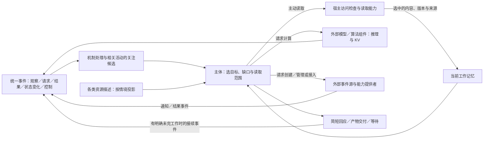
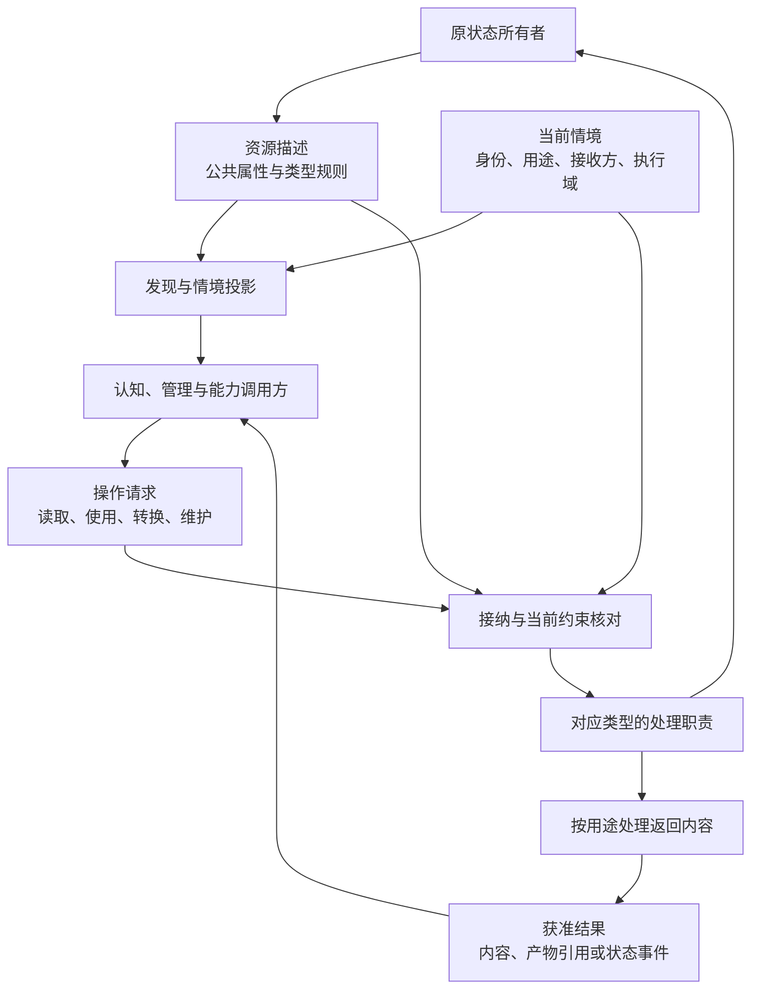

# 资源契约、输入与计算

用途：逻辑设计专题｜更新：2026-09-21。

本篇维护受管理资源的公共属性、类型规则、情境投影、内容表示和派生关系，并说明输入怎样接续活动、认知如何选择材料与计算。读取、专用使用、转换和维护分别受控；推理和 KV 缓存由计算组件管理。闹钟仅用于举例说明外部通知源，不是内置模块。

已有[本地流程实验](experiments/012-projection-alarm-activity.md)和[资料发现对照](experiments/013-resource-discovery.md)，仅支持原读取与活动条件；统一资源契约的组合效果、KV 性能和真实通知效果尚无本项目实测结论。

[项目入口](../README.md) · [文档索引](README.md) · [总架构](../DESIGN.md#logical-architecture) · [整体研究](research-plan.md#whole-system)

| 阅读主题 | 章节入口 |
| --- | --- |
| 总体与资源定义 | [整体分工](#architecture) · [统一资源契约](#resource-contract) · [公共属性](#resource-attributes) |
| 呈现与使用 | [情境投影](#projection) · [操作与处理范围](#resource-actions) · [来源与派生](#resource-derivation) · [读取记录](#resource-reading) · [Secret 类型](#secret-resource) |
| 输入与计算 | [外部事件源](#event-sources) · [有限思考](#effort) · [缓存与 KV](#cache) |
| 依据与边界 | [取舍](#alternatives) · [一手资料](#sources) · [适用边界](#validation) |

## 1. 整体分工与功能性仿生

主体围绕具体目标选择材料和计算，完成后可以等待，无须持续推理。这里的仿生设计借鉴有限注意、选择性读取和经验复用等功能，不模拟特定脑区、外形或生理机制，也不据此宣称具有人的主观体验。

主动学习启用时，兴趣和能力观察可以形成有预算的学习活动；关闭后，已接纳任务所需的取证、计算和工具构建仍可继续。任务内使用工具、长期安装能力和改变默认策略分别核对采用范围，见[学习准入](runtime-protocol.md#learning-intensity)。

| 功能启发 | 当前设计 | 责任归属 |
| --- | --- | --- |
| 线索触发关注 | 外部观察、结果、状态变化及控制事件推动相关工作 | 宿主按来源、范围与关联处理，主体按需判断价值 |
| 选择性注意 | 默认取得情境投影，围绕缺口选择内容或专用操作 | 认知选用途与范围，宿主核对，原所有者及能力处理 |
| 有限工作记忆 | 保留任务骨架及当前用得上的已读材料 | 活动工作区与当前上下文分开 |
| 使用外部辅助 | 可通过能力创建通知源、接入现成来源或请求计算 | 提供者产生通知／结果，宿主绑定订阅和活动；闹钟不是核心模块 |
| 有效复用与停止 | 复用适用结果，针对缺口工作，完成后简短交付 | 主体组织投入，宿主执行总预算，提供者管理计算缓存 |

计算责任位于认知组织之外；认知选择材料和用途，能力承担实际计算。外部通知源由相应提供者管理，核心维护来源引用与订阅，不内置闹钟计时业务。检索经公共契约取得候选，按原所有者提供的描述核对来源和范围。执行超时、预算计量及维护安排属于运行机制，其控制事件也进入[统一事件协议](runtime-protocol.md#events)。这里的“外部”描述职责边界，具体承载见[工程参考](engineering-reference.md)。

## 2. 统一资源契约

资源是系统能够独立引用，并按明确约束发现、读取、使用或维护的材料及资产。文件、媒体、Reference、归档记录、程序、Secret、模型资产和可复用计算结果均可作为资源；不要求对应一个文件，也不要求内容已保存在系统内，外部材料可以先以受管理引用存在。

任务、人物、活动和授权关系保持原有业务身份。它们的材料及查询视图可以沿资源契约提供，修改业务状态仍调用原领域操作；例如报告可以读取，中止任务仍是任务控制。模型资产与其运行时计算占用也分开，后者归预算职责。

资源描述采用公共属性与类型规则，投影按当前情境生成，操作由原状态所有者及对应能力处理。共同目录和查询索引汇总可发现描述，不保存可独立改写的第二份业务真值。

### 2.1 核心概念与表示

| 概念 | 含义 | 责任与边界 |
| --- | --- | --- |
| 资源 | 可独立管理和引用的材料或资产 | 具有稳定身份及明确状态所有者 |
| 资源引用 | 指向资源及必要修订、表示和范围 | 用于定位，不自带读取或使用权限 |
| 资源描述 | 公共属性、类型及支持操作 | 可包含受限信息，不能整体直接发给模型 |
| 内容表示 | 原文、结构化字段、媒体片段、缩略图、摘要等形式 | 关联来源、生成方式和处理约束，不因体积小就成为投影 |
| 投影 | 当前接收者可见的资源描述、状态及操作信息 | 是可重新生成的视图，不是内容副本或已读证明 |
| 操作契约 | 读取、使用、转换和维护的输入、作用及返回规则 | 由类型与实际能力共同实现，支持某操作不等于当前获准执行 |

分页、分段、不同编码等可作为同一资源的表示或范围；摘要、分析报告、脱敏副本等需要独立修订、授权或交付时，作为派生资源管理。不为每个字段或片段强制创建资源身份，混合结构可按字段限制可见性。服务配置保存普通参数及 Secret 引用，原值独立保管。

### 2.2 公共属性、修订与维护责任

采用小型公共核心和按类型声明的扩展，不要求全部类型填满同一巨大结构，也不用任意标签替代结构与约束。

| 属性组 | 描述内容 | 维护原则 |
| --- | --- | --- |
| 身份与类型 | 资源标识、类型、描述结构、可用的内容修订或观测时间 | 动态外部内容和未知修订如实标记，不伪造固定版本 |
| 归属与范围 | 所属用户／主体、状态所有者、真实／试验范围 | 业务归属、保管责任、维护权限和调用权限分开 |
| 来源与关联 | 提交来源、生成操作、上游材料、关联活动 | 材料自述与系统核实结果分别保存 |
| 内容与表示 | 格式、表示、范围、大小等已知描述 | 需要解析正文才能取得的信息须经相应处理，不能借登记暗中扫描 |
| 呈现与处理约束 | 存在性、描述字段、用途、处理者和接收方限制 | 关联权威策略及授权关系，不复制每个用户和任务的完整权限表 |
| 操作描述 | 支持的读取、专用使用、转换和维护 | 操作声明、实际能力与当前授权分别判断 |
| 生命周期 | 可用、失效、撤销、保留要求及派生清理关系 | 请求、生效及实际完成分别表达 |

共同必需信息为资源身份、类型、状态所有者、作用范围、描述来源及当前可用性；其他属性按实际情况提供。具体字段、方法名和初始类型清单由工程接入确定，未知值保留未知。

内容修订记录材料变化，描述修订记录名称、类型说明和关联等变化，授权及控制记录当前资格变化。后两者不必生成虚假的正文修订，但都可能使旧投影或旧操作判断失效。已读版本、当前目录所指版本和判断依赖版本分别保留。

原所有者维护权威属性；Self 可以在授权范围内修改标签、备注或提出分类建议。归属、强制处理限制及来源认证不能靠改写普通元数据生效。材料正文中的“允许公开”只是材料陈述，不授予发布权限。类型结构、处理实现与操作描述按一致修订采用，扩展声明不自行获得敏感能力；运行边界见[资源操作契约](runtime-protocol.md#resource-operations)。

### 2.3 情境投影与选择性发现

投影是在当前身份、用途、接收方和执行域内，可呈现的资源标识、描述、状态及操作信息。它不以最终能够读取正文为前提：某资源可以只允许使用、维护或查看状态。

先判断资源存在性是否可以被当前接收者发现，再选择可见字段。名称、路径、归属、来源、别名和使用记录都可能受限。当前上下文只取得活动直接关联或查询得到的有限候选，其余通过授权目录／元数据查询逐步发现；默认投影不等于广播全部资源。

获准的短说明可以作为描述字段展示。若它来自对正文的总结，则保留派生来源并按内容处理；全文、摘要、缩略图、向量和 KV 都不因资源登记而自动进入认知。投影不证明已经读过正文，也不独立证明其中陈述为真。

同一资源面向管理者、某个 Mind、群聊或沙箱可以形成不同投影。投影列出可请求的操作，实际执行仍核对当前条件；缓存或持有旧投影不能延续已撤销权限。未获准发现时不通过错误、别名回退或目录结果补充受限描述。

### 2.4 操作、接收方与处理约束

| 操作 | 需要明确的问题 |
| --- | --- |
| 发现与查看描述 | 能否知道资源存在，哪些字段可见？ |
| 读取内容 | 哪个调用者能取得哪种表示及范围？ |
| 交给处理组件 | 哪些解析器、模型或外部服务可以处理材料？ |
| 专用使用 | 是否允许指定的程序加载、凭据认证或计算状态复用？ |
| 派生处理 | 是否允许摘要、转写、生成向量、转换或组合？ |
| 披露与交付 | 结果可以到达哪些用户、渠道及其他活动？ |
| 维护 | 谁能替换、修订、删除、调整归属或授权？ |

资源的类型限制、策略、实际授权、任务范围和运行控制共同决定当前行为。一处允许不抵消另一处仍有效的强制限制；例外由有权职责明确调整对应约束。用途不能仅凭模型自报获得，身份和执行域由可信上下文绑定。

允许本地解析不自动允许发给外部模型；活动可以读取不代表可以在群聊披露。维护也不必提供内容回读。机密性、可入模范围、命题可信度及指令权限不是同一个等级，不能用一个“可访问”或“可信资源”开关代替。

### 2.5 来源、派生与信息范围

区分内容来源关系与运行使用关系：摘要由文档派生；服务请求使用凭据认证。后者不自动使全部业务结果成为 Secret，认证头、回显和派生认证材料仍受机密规则约束。目标操作契约负责分类和过滤返回内容，请求成功不代表返回载荷可直接入模。

摘要、转写、向量和脱敏结果等内容派生保留源资源、修订、范围、生成操作及处理配置，默认不扩大来源的披露和处理范围。扩大范围须符合明确授权的转换规则；处理组件本来就须有权取得输入，不能先将禁止入模的材料发给模型再要求脱敏。有确定规则且在授权范围内的转换可以自动执行。

来源链支持回查，不替代事实判断。资源层维护来源、完整性观察、风险标记及评价关联；世界认知对具体断言保存依据、冲突和当前判断。Self／Mind 的主观评价不改写授权，网页或工具结果中的指令不因被读取或来源认证而成为运行要求。详见[观测与污染](interaction-design.md#observation)。

资源失效、删除或授权变化时，未来发现、处理与复用按当前状态判断，已知派生副本另有清理责任。失效过滤不代表已完成删除，已经交付给外部接收者的内容也不能宣称被属性修改撤回。

### 2.6 读取、执行使用与认知上下文

认知围绕缺口选择资源、表示、范围与用途，宿主核对条件后调用读取、解析或计算能力，并返回有来源的内容。例如核对预算只读相关章节，不因收到 PDF 就解析全部页面。已知资源可以直接读取，元数据不足可有范围地查正文；明确请求片段或摘要时可以直接返回该次获准内容，不强制额外的元数据查询。

索引构建是已接纳的读取任务：选材、读取、生成 embedding 和维护条目分别保留范围。查询默认返回核对后的投影；索引未就绪或覆盖不足不等于材料不存在。查询表示、向量及过滤字段同样属于处理材料，没有传递原文不代表没有披露信息。提供者切换须核对处理范围和兼容条件，不能因能力失败而放宽范围。[检索契约](runtime-protocol.md#vector-service)

| 活动中的记录 | 表示什么 |
| --- | --- |
| 可见投影 | 当时可以发现的描述及状态 |
| 曾读内容 | 实际读取过的来源、修订、表示与范围 |
| 本次认知输入 | 实际选入本次模型上下文的内容及其来源 |
| 执行使用 | 组件加载、计算或专用使用了什么资源 |
| 实际交付 | 哪些结果已到达哪个允许的接收点 |

这些记录归活动和操作，不在资源上设置全局“已读”状态。某个 Mind 读过不代表其他 Mind 或当前模型读过；管理者展开也不自动注入认知。内容进入上下文保留来源范围，无法从摘要核对的细节继续回查；更正与任务有关时复核，旧摘要不覆盖新证据。

有效已读材料可保留于工作记忆，再次主动选择时也可复用合格缓存；缓存存在不使未选内容进入上下文。媒体 URL 或句柄只有被明确选为内容输入后才允许提供者获取。主动读取可以在已有任务和许可内自主执行，无须逐次向用户确认。

文档、Reference、历史记录、媒体、代码和生成产物均适用，不按大小豁免。当前直接收到的对话、已知任务状态、暂定判断及已接纳实时输入沿原输入契约处理，不为形式统一重复读取；归档后的再次发现和复用遵循资源契约。

代码、配置和权重的运行时加载，凭据注入及 KV 复用属于相应执行用途，不等于向认知展示内部内容。预制能力的描述、示例及源码按需发现／读取，执行使用和认知选读分别记录。步骤内可取得已接纳的读取结果，长工作则保留操作关联并释放认知入口；任务控制、迟到结果和最终提案引用均沿[运行协议](runtime-protocol.md#resource-operations)。

### 2.7 Secret 类型与指定用途使用

Secret 共用公共属性、资源引用及情境投影，专门类型规则限制原值的保管和使用。`SecretRef` 是带 Secret 类型约束的资源引用，`SecretProjection` 是共同投影机制生成的受限视图；`SecretValue` 由机密职责保管，`SecretBinding` 关联专用使用授权，`SecretIntake` 是具有身份和生命周期的可信提交交互。

模型只见获准的引用、用途和必要状态，不见原值、片段、可还原编码、原值哈希或入口访问凭证。Secret 原值不进入推理、embedding、重排、摘要、语音和视觉处理，通用读取不提供原值，普通属性编辑不能取消类型限制。动态表单、代码和沙箱也不能绕过受信使用通路。

“允许指定使用而不把内容交给请求者”可用于其他资源类型，但各类型须声明具体操作及返回规则，不以一个无差别的使用入口代替认证、签名或计算。维护、使用、投影可见和业务归属分别控制；使用授权绑定实际实现、目标、操作及范围。

用户归属、专用指令、可信输入、保管、注入与返回过滤的详细交互见[机密管理](management-workspace.md#secret-projection)，实际调用见[机密契约](runtime-protocol.md#secret-contract)。对普通输入中未知机密的补充检测不能保证全部识别，主要隔离来自可信输入和已确定的类型约束；保存成功也不等于上游认证已验证。

### 2.8 外部报表分析的完整流程

以下描述机制之间的衔接，不是运行结果。

| 时点 | 资源与业务操作 |
| --- | --- |
| 接纳分析 | 获取外部报表引用，形成该活动可见的投影；引用存在不代表已抓取正文 |
| 确定材料 | 按分析缺口选择表示、范围及处理用途，提出读取请求 |
| 补充凭据 | 缺少认证时创建面向指定用户的可信提交；原值由机密职责保管，活动只得到获准状态 |
| 读取与分析 | 能力按绑定使用凭据；返回内容经处理后，由允许的解析／模型组件取得所选材料 |
| 形成产物 | 报告关联源修订、范围和生成操作，按独立产物管理 |
| 交付与复盘 | 按当前接收方及格式交付；沙箱只取得授权材料与能力，不继承生产凭据 |
| 后续变化 | 资料或权限变化通过事件关联相关活动，核对后续使用及受影响判断 |

## 3. 外部事件源、订阅与通知示例

认知决定需要等待什么，并通过能力创建或接入相应事件源。来源可以是现成平台／设备，也可以是新建的外部通知任务、文件监听或后台计算。提供者管理外部对象，宿主保存必要来源引用、订阅、用途及活动关联。订阅表达关注哪些事件，不等于创建了来源；创建结果、触发通知与最终交付分别记录。

核心不内置闹钟模块，具体外部提供者尚未选定。宿主可持久保存“已经接纳提醒责任、提供者返回了哪个引用、等待什么事件”，但不因此承担该来源的计时。来源缺失、创建失败或通知能力不足时如实表达，不能假称已设置或假定重启后一定补发。运行超时和预算控制仍属宿主机制，不用它们替代用户提醒能力；不在此展开可靠调度的故障矩阵。

| 示例 | 来源如何产生事件 | TinyAGI 的共同职责 |
| --- | --- | --- |
| 创建闹钟 | 外部通知提供者创建对象并在约定条件成立时通知 | 提交请求、保存回执／关联、等待事件，再决定回应 |
| 监听资料变化 | 文件系统或外部监听能力报告变化 | 绑定范围，事件只给变更线索和投影，按需读取新版本 |
| 后台任务 | 工具执行后产生进度、完成或失败事件 | 关联原操作与活动，有结果或明确可继续工作时接续 |
| 接入已有平台 | 平台消息或设备观测进入适配器 | 绑定可确认来源，按用途与可见范围处理 |

例：“20 分钟后提醒我核对这份方案”。以下为人工走查，不是运行结果。

| 时点 | 认知与能力如何配合 |
| --- | --- |
| 收到请求及附件 | 识别提醒目的，附件保持投影；设提醒不需要读方案正文 |
| 创建 | 提交外部通知能力请求，明确提醒时间／用途；提供者创建闹钟并返回引用与结果，未成功不能说已设置 |
| 关联 | 保存已接纳责任及来源／订阅与活动的关联，通知不直接取得发送权限 |
| 等待 | 保存接续点，主体可做其他事或休眠；没有循环问模型“时间到了吗” |
| 触发 | 外部到时事件进入统一协议，按关联找回提醒目的与资源投影；结合当前有效约定形成提醒 |
| 输出 | 只需提醒就给一句；不自动展开方案分析，不将登记或触发当作已成功送达 |
| 后续核对 | 用户要求继续核对后，自主读取必要部分并调用计算能力，已读且适用的结果可复用 |

主动问候和任务复查可按需要利用通知源，但用途不同：可选问候允许按时机跳过，已接受的具体提醒应履约或明确说明受阻。一次通知不必调用模型或多心智；来源触发不等于实际送达。步骤结束后仍有具体工作时，内部接续事件可以直接推进，不要求创建闹钟。重复通知来自明确用途和约定，不能由无目的自我唤醒不断续订。

## 4. 针对缺口思考，对话默认简短

区分模型单次推理冗长和主体多次重复工作。前者通过提供者实际支持的推理投入／生成限制控制，后者由活动组织决定是否继续查阅、计算、邀请心智或复核。最终回复短，不代表前两类成本已经受控。

[功能事件实验](experiments/016-functional-events.md)实际出现了额度消耗于推理而最终内容为空的响应。控制投入须同时保留形成有效产物的空间；仅缩小生成上限可能带来截断和恢复调用，不能据此认定节省了完整任务成本。具体推理配额、生成配额与停止原因按提供者实际契约映射，不设通用阈值；空内容和截断不充作自主拒答，恢复及未恢复都留在轨迹中。

[接续与投入对照](experiments/017-continuation-study.md)将投入档位和生成额度分别改变，未得到跨两类任务一致的收益。因此保留按任务用途校准的方案，不采用统一降低推理或统一扩大额度；完整成本同时观察生成用量、调用次数、恢复和内容质量。厂商支持的参数及第三方网关验证边界在[工程参考](engineering-reference.md#model-evidence)维护。

下一段工作应有具体作用：取得可能改变判断的证据、完成尚未完成的推导、比较有实际差异的候选，或执行必要的独立检查。仅重写相同解释、重复同一查询、对已经解决的问题再次全员讨论，不默认继续。新输入、反证或明确检查失败可以重新开启工作；没有新外部材料并不一律禁止有价值的推理。

已在当前状态中明确给出的事实可以支撑相应说明，产物投影可以支撑引用入口；无需为了通过测试额外展开正文。需要核对正文细节或形成超出投影的新断言时才读取，评价器也须遵守这一边界，避免把多读、多调模型误当成完成任务的必要路径。

足以满足已接任务就交付；关键事实只能从外部取得时就读取、询问或等待；仍有未知则按实际范围表达。宿主总预算覆盖检索、模型、多心智及重试成本，不因换心智重新计零。不以固定思考轮数或未经校准的自报置信度证明正确；未知的提供者推理用量如实标注，不假定可读取隐藏思维链或安全截断任意中间文本。

默认交谈先给结论、必要依据或下一步，简单确认／问候可以一句，深入工作通常交付简短说明和可读产物入口；根据用户所需展开。格式契约、关键不确定性和理解所需信息仍须保留。过程说明只在实际进展、必要等待或范围改变时提供，不把每个内部步骤变成一条消息。简短是默认交流偏好，不是所有答案统一字数上限。

## 5. 缓存分类与 KV 所有权

这里的 KV 指模型注意力计算的 Key／Value 状态，与通用键值存储的业务含义不同。模型和 KV 的计算、分配、复用与淘汰由推理组件负责；认知决定材料和调用，宿主业务层保存请求清单、成本及提供者实际支持的句柄，不自行实现 KV 张量管理。

可复用结果沿资源契约关联输入修订、范围、生成配置和处理限制，投影与内容缓存分别管理。KV 只描述提供者实际支持的身份、上下文关联和有效状态，不要求导出张量或建立独立内容读取入口；执行使用不等于认知读取。旧描述和缓存不能延长已撤销资格，副本不复制生产会话句柄。

| 类别 | 保存与复用什么 | 当前决定 |
| --- | --- | --- |
| 资源读取缓存 | 某资源版本、范围及表示的已读内容 | 资源读取能力维护的派生缓存；主动选择后使用，避免重复 I/O／解析 |
| 解析、检索、确定计算结果 | 带输入版本、参数和来源的结果 | 复用前核对当前问题和有效条件；检索涉及的可见资源集合变化也须考虑 |
| 模型前缀／KV 缓存 | 推理组件支持的输入计算状态 | 由组件按实际兼容条件复用；不许诺任意拼接、跨模型移植或稳定导出 |
| 整段最终答复缓存 | 旧场景中的实际表达 | 不作对话默认；只在问题、事实、有效约定及受众均适合时考虑复用，不能套用旧私人回复 |

上下文材料的选择先于缓存优化。已选材料可采用相对稳定的组织减少重复输入计算，但不为命中旧前缀保留无关、过时或不再允许的内容。访问、处理用途、源版本及模型配置改变时重新检查适用性；读取缓存的标识无法替代提供者自身的信息隔离契约。TTL 可以作为有效期工具，不能独自证明内容仍真或权限仍有效。

缓存可清理，必要状态和来源由状态与资源所有者持续保存。提供者隐藏或不支持缓存时，仍可发出明确输入并正常工作；不要求其必须返回命中率或裸 KV。缓存重建不承诺逐字重现模型输出。注意力记忆仍是候选研究，只处理已主动选取的材料，不能以长期记忆为名默认预填充所有文件。

[沙箱](sandbox-evaluation.md#isolation)保持相同投影与主动读取原则，模型会话、可写缓存、事件源和订阅按试验隔开；共享只读计算结果须满足输入、版本和处理范围，并登记预热条件。虚拟时间由试验环境推进，替代来源沿同一协议产生通知，真实计算预算按实际用量计量，模拟提醒不进入真实发送通路。

## 6. 当前不采用或暂缓的替代项

| 方案 | 决定与原因 |
| --- | --- |
| 各类型各自维护整套投影规则 | 不采用：共同属性和当前情境规则会重复且难以一致；类型只保留专门操作与约束 |
| 只增加可读／机密开关或任意标签 | 不采用：不能表达接收者、用途、专用使用和派生关系，也不能提供确定性维护 |
| 全部业务对象改成通用资源 CRUD | 不采用：会丢失任务、人物和授权关系的业务语义及状态所有权 |
| 固定全局投影、由模型解释权限 | 不采用：可见性随身份和用途变化，描述与当前授权必须分别核对 |
| 让主体持续倒计时、空闲时固定自问自答 | 不采用：提醒应来自能力输入，持续存在不需要持续推理 |
| 将闹钟示例内置为核心模块、只接受外部事件才能继续工作 | 不采用：通知源通过能力创建或接入；内部结果及接续事件也能推进有目的的活动 |
| 为每个新文件自动阅读全文、摘要或预填充 KV | 不采用：违反默认投影与主动读取；摘要同样消费内容和计算 |
| 有投影就认为已经获得原文证据 | 不采用：资源存在、选读范围与内容支撑是不同事实 |
| 让认知组织实现模型张量及 KV 算法 | 不采用：用户确定计算能力承担运算，认知只组织使用 |
| 每次回答固定反思／多人投票，或一律禁止深思 | 都不作默认：需要针对任务缺口判断增量价值；质量和成本须分别测 |
| 为缓存命中保留全部上下文、跨情境直接重发旧答复 | 不采用：不能让缓存扩大读取、延续过期事实或暴露私人内容 |
| 定通用 token 阈值、缓存 TTL、最大思考轮数 | 暂缓：缺少本项目任务与提供者数据；先规定有限投入与完整评价 |
| 以仿生名义引入固定脑区服务、人体外形或生理参数 | 不采用：功能启发不要求固定实体或部署负担 |

以上主要是用户约束和工程判断；不是本项目实验逐项证明这些方案失败。

## 7. 一手资料支持的范围

### 7.1 统一资源契约

查阅日期：2026-09-21。以下资料支持属性授权与来源建模，公共属性、类型操作、情境投影及 Secret 的组合属于本项目设计；不要求引入独立策略产品或完整实现来源标准，也不证明隔离和端到端可靠性已经验证。

| 来源与版本 | 支持的命题 | 设计推论与适用边界 |
| --- | --- | --- |
| [NIST SP 800-162](https://csrc.nist.gov/pubs/sp/800/162/upd2/final)，2014，含 2019-08-02 更新；摘要中的 ABAC 定义 | 授权可依据主体、对象、请求操作及环境属性，结合策略和关系判断 | 采用资源属性与当前情境共同核对操作；不由资源上的单个可读标记决定，不宣称本项目已实现标准或经过安全验证 |
| [W3C PROV-DM](https://www.w3.org/TR/2013/REC-prov-dm-20130430/)，2013-04-30 Recommendation；摘要与核心概念 | 以实体、活动、责任主体及派生关系表达来源 | 关联材料、生成操作和责任；内容来源与运行使用分别建模，来源链不替代事实判断；不要求完整标准实现 |

### 7.2 有限投入与计算复用

下表资料查阅日期：2026-09-19。引用仅支持所列版本及章节中的命题，未复现论文实验。资源投影、外部事件源和统一事件交互属于本项目的设计选择；协议依据见[运行专题](runtime-protocol.md#event-sources-evidence)，不由认知科学论文直接推出。

| 来源与版本 | 支持的命题 | 设计推论与适用边界 |
| --- | --- | --- |
| [Chen 等，Do NOT Think That Much for 2+3=?，ICML 2025，PMLR 267:9487–9499](https://proceedings.mlr.press/v267/chen25bx.html)；核对正式版摘要 | 在其研究模型与任务中，冗余解法对准确性／多样性的新增收益有限；研究以训练方法降低此类开销 | 支持把过度思考列为质量与成本问题；不推出通用早停阈值，不证明本项目提示或调度可复制其收益 |
| [vLLM v0.9.2，Automatic Prefix Caching](https://docs.vllm.ai/en/v0.9.2/features/automatic_prefix_caching.html)；Introduction、Limits | 共享输入前缀可复用已有 KV，减少重复预填充；该机制不减少新 token 的解码时间 | 支持由推理组件复用输入计算，与减少冗余生成分开；不保证其他组件行为、TinyAGI 命中率、总延迟或显存收益 |

## 8. 设计状态与适用边界

机制及状态集中见[设计台账](research-plan.md#unified-resources)。[相关资料](whole-system-evidence.md#design-closure)支持设计分工；已有本地及模型轨迹按原范围保留。

| 范围 | 当前采用规则 | 不由资料推定的效果 |
| --- | --- | --- |
| 统一资源与专用类型 | 公共属性和类型规则、情境投影、原所有者操作；Secret 保留可信输入和专用使用，派生与运行使用分开 | 全类型接入、未知机密识别、信息隔离及完整端到端可靠性 |
| 材料发现与充分性 | 元数据／词法发现与按需语义召回互补；返回投影，按用途读取；已明确事实和入口不强制重读 | 陌生语料的召回率、最优切分和通用读取粒度 |
| 有限思考与简短交付 | 默认足够的最小投入，围绕具体缺口增加；无增量、缺外部条件或预算结束时分别收尾 | 某个统一 token 上限或推理档位总是更优 |
| 缓存与 KV | 读取复用绑定版本／范围，前缀计算复用由计算提供者管理；不省略事实与许可核对 | 提供者实际命中率、账单和端到端延迟 |
| 外部事件源与接续 | 能力创建／接入来源，宿主管订阅与责任；创建、触发和交付分别记录；内部有目的接续无需通知源 | 真实平台到达率、关机准时提醒或真人问候满意度 |

具体预算、生成配置、缓存能力和联系窗口由[用途配置](research-plan.md#deferred)承接。
