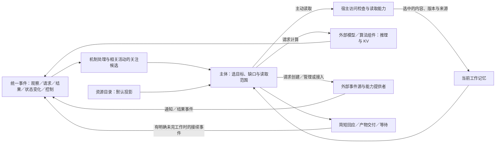

# 资源投影、输入与计算

用途：逻辑设计专题｜更新：2026-09-21。

方案与验证范围：资源默认投影、统一事件交互、能力可创建或接入外部事件源、外部组件计算模型与 KV、默认简短交流来自用户要求；闹钟只作通知源示例。有限注意、按需读取、缓存及停止策略是可修订组织。已有 [012](experiments/012-projection-alarm-activity.md) 本地流程和 [013](experiments/013-resource-discovery.md) 资料发现对照，不证明必须内置闹钟；完整事件主线与计算分工现已按资料定案，KV 性能和真实通知效果没有新的实测结论。

[项目入口](../README.md) · [文档索引](README.md) · [总架构](../DESIGN.md#logical-architecture) · [整体研究](research-plan.md#whole-system)

目录：[整体分工](#architecture) · [投影与读取](#projection) · [外部事件源与通知示例](#event-sources) · [思考与简短交流](#effort) · [缓存与 KV](#cache) · [取舍](#alternatives) · [资料范围](#sources) · [收尾与边界](#validation)

## 1. 整体分工与功能性仿生

主体不需要始终在想。启用的主动学习可由兴趣、成长方向和能力观察形成有界活动，最低强度可关闭；强度与普通回答投入分别控制，关闭学习不禁止已接纳任务内必要的取证、计算或有界工具构建；构建的长期安装和默认策略改变仍须独立采用范围，见[学习准入](runtime-protocol.md#learning-intensity)。输入使事情值得关注，认知选择目标和所需材料，计算组件完成具体工作；形成有用回应后，可以等待下一个输入。仿生取功能启发，不模拟特定脑区、外形或生理机制，也不由此宣称具有人的主观体验。

| 功能启发 | 当前设计 | 责任归属 |
| --- | --- | --- |
| 线索触发关注 | 外部观察、结果、状态变化及控制事件推动相关工作 | 宿主按来源、范围与关联处理，主体按需判断价值 |
| 选择性注意 | 先看资源投影，再主动选择读取 | 认知选范围，宿主执行读取与访问约束 |
| 有限工作记忆 | 保留任务骨架及当前用得上的已读材料 | 活动工作区与当前上下文分开 |
| 使用外部辅助 | 可通过能力创建通知源、接入现成来源或请求计算 | 提供者产生通知／结果，宿主绑定订阅和活动；闹钟不是核心模块 |
| 有效复用与停止 | 复用适用结果，针对缺口工作，完成后简短交付 | 主体组织投入，宿主执行总预算，提供者管理计算缓存 |

计算责任位于认知组织之外；认知选择材料和用途，能力承担实际计算。外部通知源由相应提供者管理，核心维护来源引用与订阅，不内置闹钟计时业务。检索经公共契约取得候选，资源与记忆模块核对来源和范围。执行超时、预算计量及维护安排属于运行机制，其控制事件也进入[统一事件协议](runtime-protocol.md#events)。这里的“外部”描述职责边界，具体承载见[工程参考](engineering-reference.md)。

## 2. 所有资源文件先以投影存在

投影是**可发现、可定位、可选择读取的资源描述**。当前上下文只带活动直接关联或当前查询得到的有限候选，其余通过授权目录／元数据查询逐步发现；默认投影不等于自动展示所有文件名。最小内容为资源 ID、类型、版本／观测时间、允许展示的名称及元数据、可用读取操作；具体字段按资源类型和用途声明。它不是原文、自动摘要、向量或 KV，也不是已读证明。路径、名称与资源存在性本身也可能需要保密。

文档、Reference、归档对话、图片、音频、视频、代码、附件及生成产物均适用，不按文件大小豁免。接收到文件或工具写出产物，只使其投影可用；成功写入也不代表认知已经读懂结果。当前直接收到的对话、已知任务状态和认知自己形成的暂定判断可以留在工作记忆，不因落盘就强制立即遗忘，也不能据此将其他文件自动注入。

读取过程为“指出缺口 → 选择资源及范围 → 宿主核对访问和处理用途 → 读取／解析 → 返回有来源的内容”。例如先选择方案的预算章节，必要时再读其他章节；不能因收到 PDF 就默认解析全部页面并送入模型。查询索引也是主动的信息请求：默认结果为投影；元数据不足时可主动查正文，要求片段或摘要时该结果明确算作内容读取，不强制先做无用的元数据查询。已知用途可限制范围，结果不足时允许扩展；用途未知保留未知，命中得分不代表证据可信。索引构建须作为已接纳的读取任务执行，不能借生成投影暗中扫描文件。

需要在同一步骤取得读取结果时，走[步骤内操作接纳](runtime-protocol.md#step-operation-admission)，实际读入的版本及范围追加为本步骤依据；长读取或计算则保留操作引用并释放认知入口。最终状态提交只引用已接纳操作，不重复读取或派发。

派生索引保持同一原则：已接纳的任务主动读取并生成 embedding，索引能力保存向量和必要定位／过滤信息；命中经宿主核对后返回投影，不自动带入原文。向量索引与 KV 分属检索和推理用途。索引未就绪或覆盖不足是可见状态，不等于原始资料不存在。

同一查询可以使用不同提供者，但处理范围分别检查：embedding 输入、查询与索引向量及过滤字段都属于实际处理材料。没有传递原文不代表没有披露信息；缺少合格能力时不能自动扩大处理范围。切换提供者不意味着索引已同步或兼容，公共语义由[能力契约](runtime-protocol.md#capability-api)维护。

既有摘要是有来源的派生资源，默认仍给其投影；主动选择后可以读摘要或原文，不要求每次重新生成。当前目录版本、实际读过的版本及判断所依赖的版本分别保留；更正与当前任务有关时主动重读，旧缓存不自动成为新证据。内容进入上下文时保留源版本与读取范围，无法从摘要核对的细节继续回查。旧摘要不覆盖新证据，模型先前说过什么也不自动成为事实。

主动读取不等于逐次向用户确认。主体可以在已有任务和许可范围内自主读取；再次需要同一版本和范围时，可从有效工作记忆或读取缓存取得。缓存中存在但未选择的内容仍不进入上下文。上下文清单区分投影和实读内容，媒体 URL／文件句柄只有被明确选作内容输入后才允许提供者获取相应资源。

已接纳的实时语音／传感通路可以持续产生输入；把这些输入归档成文件，不会使归档正文自动重新进入认知。预制能力的目录、文档、示例和源码同样作为资源发现，按需读取后才进入模型上下文；声明及分析结果标明来源修订，动态状态标明观测时间，执行时继续核对当前许可。预制库的维护归属与调用作用见[能力契约](runtime-protocol.md#prebuilt-library)。代码、配置和模型权重的运行时加载是执行组件为完成既定操作进行的读取，不等于向模型认知上下文展示源码、配置正文或权重。这里约束资源如何进入认知及其派生处理，不要求操作系统和推理组件把所有字节都替换为描述符。

### Secret 投影的特殊规则

普通资源在明确读取后可以进入认知；secret 原值不提供这种读取能力。模型只取得当前用途需要的引用、类型和可用状态，使用由受信宿主按绑定完成；引用本身不授予权限。Secret 原值不参与模型推理、embedding、重排、摘要、语音或视觉处理，也不通过索引、缓存、调试记录或副本间接进入认知。

用户通过专用指令和可信输入维护自己的机密，管理面板可按权限修改归属及绑定；主体可申请收集，运行机制直接向指定用户呈现一次性入口。配置、动态表单和蓝图只保存引用，原值及入口访问凭证不经过普通消息或模型辅助编辑。独立流程完成输入分流、身份核对、类型转换、投影、调用注入及返回过滤；敏感性不因编码而消失。系统可以给主体“凭据已配置”的投影事件，不包含原值，不因此宣称上游认证已验证。普通输入的未知机密无法保证全被检测，主要隔离依赖可信通路。完整逻辑由[管理专题](management-workspace.md#secret-projection)唯一维护。

## 3. 外部事件源、订阅与通知示例

认知决定需要等待什么，并通过能力创建或接入相应事件源。来源可以是现成平台／设备，也可以是新建的外部通知任务、文件监听或后台计算。提供者管理外部对象，宿主保存必要来源引用、订阅、用途及活动关联。订阅表达关注哪些事件，不等于创建了来源；创建结果、触发通知与最终交付分别记录。

核心不内置闹钟模块，具体外部提供者尚未选定。宿主可持久保存“已经接纳提醒责任、提供者返回了哪个引用、等待什么事件”，但不因此承担该来源的计时。来源缺失、创建失败或通知能力不足时如实表达，不能假称已设置或假定重启后一定补发。运行超时和预算控制仍属宿主机制，不用它们替代用户提醒能力；不在此展开可靠调度的故障矩阵。

| 示例 | 来源如何产生事件 | TinyAGI 的共同职责 |
| --- | --- | --- |
| 创建闹钟 | 外部通知提供者创建对象并在约定条件成立时通知 | 提交请求、保存回执／关联、等待事件，再决定回应 |
| 监听资料变化 | 文件系统或外部监听能力报告变化 | 绑定范围，事件只给变更线索和投影，按需读取新版本 |
| 后台任务 | 工具执行后产生进度、完成或失败事件 | 关联原操作与活动，有结果或明确可继续工作时接续 |
| 接入已有平台 | 平台消息或设备观测进入适配器 | 绑定可确认来源，按用途与可见范围处理 |

例：“20 分钟后提醒我核对这份方案”。以下为人工走查，不是运行结果。

| 时点 | 认知与能力如何配合 |
| --- | --- |
| 收到请求及附件 | 识别提醒目的，附件保持投影；设提醒不需要读方案正文 |
| 创建 | 提交外部通知能力请求，明确提醒时间／用途；提供者创建闹钟并返回引用与结果，未成功不能说已设置 |
| 关联 | 保存已接纳责任及来源／订阅与活动的关联，通知不直接取得发送权限 |
| 等待 | 保存接续点，主体可做其他事或休眠；没有循环问模型“时间到了吗” |
| 触发 | 外部到时事件进入统一协议，按关联找回提醒目的与资源投影；结合当前有效约定形成提醒 |
| 输出 | 只需提醒就给一句；不自动展开方案分析，不将登记或触发当作已成功送达 |
| 后续核对 | 用户要求继续核对后，自主读取必要部分并调用计算能力，已读且适用的结果可复用 |

主动问候和任务复查可按需要利用通知源，但用途不同：可选问候允许按时机跳过，已接受的具体提醒应履约或明确说明受阻。一次通知不必调用模型或多心智；来源触发不等于实际送达。步骤结束后仍有具体工作时，内部接续事件可以直接推进，不要求创建闹钟。重复通知来自明确用途和约定，不能由无目的自我唤醒不断续订。

## 4. 针对缺口思考，对话默认简短

区分模型单次推理冗长和主体多次重复工作。前者通过提供者实际支持的推理投入／生成限制控制，后者由活动组织决定是否继续查阅、计算、邀请心智或复核。最终回复短，不代表前两类成本已经受控。

[功能事件实验](experiments/016-functional-events.md)实际出现了额度消耗于推理而最终内容为空的响应。控制投入须同时保留形成有效产物的空间；仅缩小生成上限可能带来截断和恢复调用，不能据此认定节省了完整任务成本。具体推理配额、生成配额与停止原因按提供者实际契约映射，不设通用阈值；空内容和截断不充作自主拒答，恢复及未恢复都留在轨迹中。

[接续与投入对照](experiments/017-continuation-study.md)将投入档位和生成额度分别改变，未得到跨两类任务一致的收益。因此保留按任务用途校准的方案，不采用统一降低推理或统一扩大额度；完整成本同时观察生成用量、调用次数、恢复和内容质量。厂商支持的参数及第三方网关验证边界在[工程参考](engineering-reference.md#model-evidence)维护。

下一段工作应有具体作用：取得可能改变判断的证据、完成尚未完成的推导、比较有实际差异的候选，或执行必要的独立检查。仅重写相同解释、重复同一查询、对已经解决的问题再次全员讨论，不默认继续。新输入、反证或明确检查失败可以重新开启工作；没有新外部材料并不一律禁止有价值的推理。

已在当前状态中明确给出的事实可以支撑相应说明，产物投影可以支撑引用入口；无需为了通过测试额外展开正文。需要核对正文细节或形成超出投影的新断言时才读取，评价器也须遵守这一边界，避免把多读、多调模型误当成完成任务的必要路径。

足以满足已接任务就交付；关键事实只能从外部取得时就读取、询问或等待；仍有未知则按实际范围表达。宿主总预算覆盖检索、模型、多心智及重试成本，不因换心智重新计零。不以固定思考轮数或未经校准的自报置信度证明正确；未知的提供者推理用量如实标注，不假定可读取隐藏思维链或安全截断任意中间文本。

默认交谈先给结论、必要依据或下一步，简单确认／问候可以一句，深入工作通常交付简短说明和可读产物入口；根据用户所需展开。格式契约、关键不确定性和理解所需信息仍须保留。过程说明只在实际进展、必要等待或范围改变时提供，不把每个内部步骤变成一条消息。简短是默认交流偏好，不是所有答案统一字数上限。

## 5. 缓存分类与 KV 所有权

这里的 KV 指模型注意力计算的 Key／Value 状态，与通用键值存储的业务含义不同。模型和 KV 的计算、分配、复用与淘汰由推理组件负责；认知决定材料和调用，宿主业务层保存请求清单、成本及提供者实际支持的句柄，不自行实现 KV 张量管理。

| 类别 | 保存与复用什么 | 当前决定 |
| --- | --- | --- |
| 资源读取缓存 | 某资源版本、范围及表示的已读内容 | 资源读取能力维护的派生缓存；主动选择后使用，避免重复 I/O／解析 |
| 解析、检索、确定计算结果 | 带输入版本、参数和来源的结果 | 复用前核对当前问题和有效条件；检索涉及的可见资源集合变化也须考虑 |
| 模型前缀／KV 缓存 | 推理组件支持的输入计算状态 | 由组件按实际兼容条件复用；不许诺任意拼接、跨模型移植或稳定导出 |
| 整段最终答复缓存 | 旧场景中的实际表达 | 不作对话默认；只在问题、事实、有效约定及受众均适合时考虑复用，不能套用旧私人回复 |

上下文材料的选择先于缓存优化。已选材料可采用相对稳定的组织减少重复输入计算，但不为命中旧前缀保留无关、过时或不再允许的内容。访问、处理用途、源版本及模型配置改变时重新检查适用性；读取缓存的标识无法替代提供者自身的信息隔离契约。TTL 可以作为有效期工具，不能独自证明内容仍真或权限仍有效。

缓存可清理，必要状态和来源由状态与资源所有者持续保存。提供者隐藏或不支持缓存时，仍可发出明确输入并正常工作；不要求其必须返回命中率或裸 KV。缓存重建不承诺逐字重现模型输出。注意力记忆仍是候选研究，只处理已主动选取的材料，不能以长期记忆为名默认预填充所有文件。

[沙箱](sandbox-evaluation.md#isolation)保持相同投影与主动读取原则，模型会话、可写缓存、事件源和订阅按试验隔开；共享只读计算结果须满足输入、版本和处理范围，并登记预热条件。虚拟时间由试验环境推进，替代来源沿同一协议产生通知，真实计算预算按实际用量计量，模拟提醒不进入真实发送通路。

## 6. 当前不采用或暂缓的替代项

| 方案 | 决定与原因 |
| --- | --- |
| 让主体持续倒计时、空闲时固定自问自答 | 不采用：提醒应来自能力输入，持续存在不需要持续推理 |
| 将闹钟示例内置为核心模块、只接受外部事件才能继续工作 | 不采用：通知源通过能力创建或接入；内部结果及接续事件也能推进有目的的活动 |
| 为每个新文件自动阅读全文、摘要或预填充 KV | 不采用：违反默认投影与主动读取；摘要同样消费内容和计算 |
| 有投影就认为已经获得原文证据 | 不采用：资源存在、选读范围与内容支撑是不同事实 |
| 让认知组织实现模型张量及 KV 算法 | 不采用：用户确定计算能力承担运算，认知只组织使用 |
| 每次回答固定反思／多人投票，或一律禁止深思 | 都不作默认：需要针对任务缺口判断增量价值；质量和成本须分别测 |
| 为缓存命中保留全部上下文、跨情境直接重发旧答复 | 不采用：不能让缓存扩大读取、延续过期事实或暴露私人内容 |
| 定通用 token 阈值、缓存 TTL、最大思考轮数 | 暂缓：缺少本项目任务与提供者数据；先规定有限投入与完整评价 |
| 以仿生名义引入固定脑区服务、人体外形或生理参数 | 不采用：此轮采用功能启发，不增设未经验证的实体和部署负担 |

以上主要是用户约束和工程判断；不是本项目实验逐项证明这些方案失败。

## 7. 一手资料支持的范围

下表资料查阅日期：2026-09-19。仅使用所列版本正文／摘要支持的命题；未选定推理引擎，也未复现论文实验。投影及外部事件源方向由用户确定；统一事件交互于 2026-09-20 获认可，其协议依据见[运行专题](runtime-protocol.md#event-sources-evidence)，不由认知科学论文证明。

| 来源与版本 | 支持的命题 | 设计推论与适用边界 |
| --- | --- | --- |
| [Chen 等，Do NOT Think That Much for 2+3=?，ICML 2025，PMLR 267:9487–9499](https://proceedings.mlr.press/v267/chen25bx.html)；核对正式版摘要 | 在其研究模型与任务中，冗余解法对准确性／多样性的新增收益有限；研究以训练方法降低此类开销 | 支持把过度思考列为质量与成本问题；不推出通用早停阈值，不证明本项目提示或调度可复制其收益 |
| [vLLM v0.9.2，Automatic Prefix Caching](https://docs.vllm.ai/en/v0.9.2/features/automatic_prefix_caching.html)；Introduction、Limits | 共享输入前缀可复用已有 KV，减少重复预填充；该机制不减少新 token 的解码时间 | 支持由推理组件复用输入计算，与减少冗余生成分开；不保证其他组件行为、TinyAGI 命中率、总延迟或显存收益 |

## 8. 设计收尾与适用边界

读取、投入、缓存和外部事件源的分工已定。[相关资料](whole-system-evidence.md#design-closure)支持采用这些机制；已有本地及模型轨迹按原范围保留。

| 范围 | 当前采用规则 | 不由资料推定的效果 |
| --- | --- | --- |
| 材料发现与充分性 | 元数据／词法发现与按需语义召回互补；返回投影，按用途读取；已明确事实和入口不强制重读 | 陌生语料的召回率、最优切分和通用读取粒度 |
| 有限思考与简短交付 | 默认足够的最小投入，围绕具体缺口增加；无增量、缺外部条件或预算结束时分别收尾 | 某个统一 token 上限或推理档位总是更优 |
| 缓存与 KV | 读取复用绑定版本／范围，前缀计算复用由计算提供者管理；不省略事实与许可核对 | 提供者实际命中率、账单和端到端延迟 |
| 外部事件源与接续 | 能力创建／接入来源，宿主管订阅与责任；创建、触发和交付分别记录；内部有目的接续无需通知源 | 真实平台到达率、关机准时提醒或真人问候满意度 |

具体预算、生成配置、缓存能力和联系窗口由[用途配置](research-plan.md#deferred)承接。
