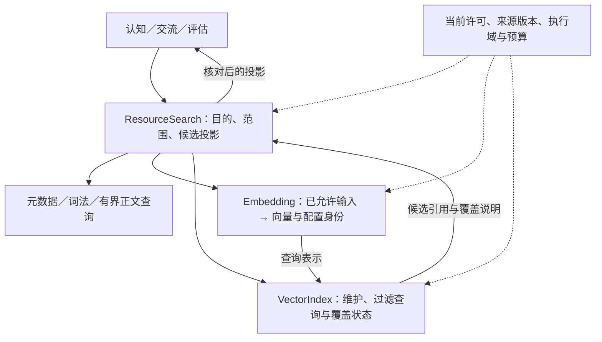

# 逻辑模块、能力契约与运行协议

用途：逻辑设计专题｜更新：2026-09-21。

[总设计](../DESIGN.md#execution) · [文档索引](README.md) · [工程参考](engineering-reference.md) · [设计状态与边界](research-plan.md)

本篇维护逻辑职责、状态所有权、统一事件、公共能力契约及运行行为。文中的模块表示责任，API 表示请求与结果语义，执行域表示数据与作用范围；不规定软件包、进程或通信技术。软件组合、技术栈、存储和部署机制另见[工程参考](engineering-reference.md)，历史细节保留在[工程参考](engineering-reference.md#persistence)。

| 阅读主题 | 章节入口 |
| --- | --- |
| 职责与能力 | [逻辑模块](#software-modules) · [检索责任](#vector-service) · [公共能力 API](#capability-api) · [机密使用](#secret-contract) · [模型端口](#model-port) |
| 程序与采用 | [受管理函数](#managed-functions) · [配置生效](#configuration-resolution) · [能力构建与运行](#capability-lifecycle) · [实现信任](#implementation-trust) |
| 个体与学习 | [学习强度](#learning-intensity) · [初始化与迁移](#bootstrap-migration) · [预制能力库](#prebuilt-library) |
| 事件与接续 | [身份](#identity) · [事件](#events) · [生命周期](#core-task-lifecycle) · [步骤](#step-context) · [接续请求](#continuation) |
| 操作与控制 | [步骤内操作接纳](#step-operation-admission) · [提交](#commit) · [操作](#operations) · [任务控制](#task-control) · [效果](#effects) |
| 约束与数据 | [结果复核](#revalidation) · [授权](#authorization) · [输出](#streams) · [预算](#budgets) · [数据分工](#storage) · [个体状态](#individual-state) |
| 恢复与依据 | [恢复](#recovery) · [重放](#replay) · [依据](#event-sources-evidence) |

## 1. 逻辑模块与状态所有权

各模块拥有明确的状态修改责任，认知提出修订，所有者按当前条件接纳。交互遵循统一事件语义；状态视图和查询结果不替代原模块维护的权威记录。总体信息关系见[逻辑总图](../DESIGN.md#logical-architecture)。

| 逻辑模块 | 维护的业务含义 | 主要输入和输出 |
| --- | --- | --- |
| 主体与活动 | 主体／心智身份、目标、工作区、关注和接续 | 观察及完成事件 → 关注候选；认知选择 → 状态修订／等待条件 |
| 事件交互 | 来源、封装、订阅、因果关联和有范围的分发 | 观察、请求、结果、状态变化和控制 → 对应处理者；不裁定事实或主体意愿 |
| 世界与记忆 | 资源版本、投影、来源、断言、记忆和派生索引关系 | 有范围的发现／读取、索引任务、候选核对及带依据的修订 |
| 交流与情境 | 人物关联依据、当前受众、互动约定、输出契约和轮次 | 平台信息与表达候选 → 符合当前范围的输入／输出 |
| 任务控制 | 授权来源、目标及范围、推进资格、阻断原因、在途收束和解除条件；任务状态归原所有者 | Self／管理／获授权审计的控制 → 原任务及子工作处理 → 控制与实际结果事件 |
| 执行与预算 | 操作接纳、实际尝试、回执、取消、未知及用量 | 能力意图 → 受控执行 → 操作事实与活动接续 |
| 初始化与迁移引导 | 稳定身份登记、引导／修复进度和迁移项处理；业务状态归原所有者 | 创建／更新请求 → 有预算的模型、构建与试验操作 → 候选、有效实现及维护状态；不依赖个体程序可运行 |
| 主动学习扩展 | 学习议题、选题／实践策略与研究候选，复用主体及活动状态 | 兴趣和观察 → 学习活动提案 → 取证／构建／试验与有限采用；不拥有自己的预算或授权来源 |
| 认知组织 | 上下文选择、心智协作、判断、表达与下一步 | StepContext → 判断／请求／Continuation；临时上下文不拥有唯一业务事实 |
| 评价与试验 | 测试材料、试验配置、基线、评价规则、报告和采用依据 | 独立域执行与评阅 → 分能力结果及有限采用建议 |
| 能力构建与运行 | 接口与候选、构建产物、采用绑定、运行对象及结束责任 | 能力缺口 → 构建／试验操作 → 可追溯产物与可调用实现；主体状态仍归原所有者 |
| 能力接入 | 提供者身份、支持的契约、材料处理范围及结果解释 | 已接纳请求 → 提供者执行 → 有来源的结果；不自行扩大授权 |
| 运行管理 | 执行上下文、准入、状态一致性、域绑定和接续责任 | 绑定真实／试验域与能力；处理控制事件和中断；不允许候选自行切换作用域 |

[管理工作台](management-workspace.md)的查询、修订及直接控制沿相同状态所有者处理，管理身份与聊天身份分开。副本生命周期见[沙箱](sandbox-evaluation.md#replica)，立即提交机制见工作台的[生效契约](management-workspace.md#apply)，不因增加页面另建业务状态库。

本文将运行管理及其确定机制统称为“宿主”，它是逻辑职责名称。一次交流可关联多个活动，一个活动也可跨会话接续；会话、活动和模型交互分别识别。人物／剧情、现实观察／体验和模拟经历保留不同来源及用途。

采用当前业务状态＋必要过程记录＋可重建派生索引。状态用于接续，事件／决策／操作记录用于查证，原文及版本保留为资源。不要求重放全部事件生成唯一状态：外部结果不能仅凭既有记录重新产生，保留范围也可能变化。这是当前选择，未做全部替代方案的效果对照。

## 2. 检索与公共能力契约

本节定义能力职责、请求和结果。技术栈与依赖版本见[工程参考](engineering-reference.md#technology-stack)。

### 2.1 资源检索与派生索引

世界与记忆模块决定哪些材料可索引、当前检索范围及候选有效性；embedding 能力生成向量，索引能力维护派生条目并查询候选。认知只提出用途、缺口和预算，不自行扩大处理范围。向量、原始资源、业务事实和推理 KV 各有用途，不能互相替代。

索引条目关联执行域、资源与内容版本、片段及生成配置。配置标识模型、切分方式、维度和度量；维度相同不证明模型兼容。来源身份独立于检索条目，索引仅保留必要定位及过滤信息，向量本身也受来源的处理范围约束。

查询流程为：提出缺口 → 限定当前范围 → 按需生成查询表示 → 检索候选 → 核对当前许可、来源及版本 → 返回有限投影 → 按需读取。得分、过期条目或命中数量都不能替代授权与证据；不能为补足结果扩大许可。

构建索引属于明确接纳的读取任务，经过选材、读取／切分、计算及索引维护。源变更引发更新或删除任务，业务状态已改变不代表索引已可查；分别记录请求、结果和覆盖状态。删除或撤销许可也产生派生副本的清理责任，过滤不能冒充已删除。

模型不兼容、能力不可用或覆盖不足时明确返回限制。允许时使用元数据／有界内容查询，不能把能力失败解释为没有相关资料。真实域与试验域分别绑定可写索引，共享只读基准须固定身份、版本及范围。

检索分工已定，质量与整体任务收益不由接口契约直接保证；提供者产品、接入 SDK、本地／远程与一手依据统一见[工程参考](engineering-reference.md#vector-service)。

### 2.2 公共能力 API 与后续扩展

公共 API 指可复用的业务契约，由负责该用途的模块维护。认知、交流入口和评估经同一契约提出请求，身份及执行域从可信上下文绑定，结果交由对应状态所有者处理。本篇定义输入／输出含义及约束，具体方法签名与接入技术在工程参考中维护。

公共交互以[统一事件契约](#events)为基础。领域 API 是有类型的请求／结果入口，事件 API 则负责来源接入、订阅、关联和有范围的观察。请求已提出、被接纳、执行完成与实际交付分别表达，调用返回不自动意味着最终效果。查询可以同步等待结果，也可以由结果事件接续；不强制全部能力改成异步，也不让同步接口绕过事件语义和权限处理。

| 共同 API 职责候选 | 业务含义与约束 |
| --- | --- |
| `EventIngress` | 接入外部／内部事件，绑定来源和执行域，核对结构与范围；载荷自称身份不能替代可信绑定 |
| `EventSubscription` | 建立、调整或解除关注范围与活动关联；订阅和外部来源分别管理，解绑不代表外部对象已被删除 |
| `CapabilityRequest` | 承载具体能力的类型化请求及接纳、进度、完成、失败等事件；动作许可由宿主检查，不由事件发送者自授 |
| `EventView` | 为活动接续、用户查看、评估和复盘提供有范围的事件记录或投影；不向所有心智广播全部事件 |

上述名称表示契约职责，不额外创建业务身份。下图以检索说明具体能力如何建立在共同协议上，其内部计算步骤不要求逐函数持久化。

图中为调用分工，请求与结果具有共同事件语义，结果沿调用链回到检索入口核对；不要求一次查询同时运行所有后端。embedding 的输入／输出经宿主传给向量端口，不由认知程序绕过检索范围与候选核对。

| 公共契约候选 | 输入／输出的业务含义 | 责任边界 |
| --- | --- | --- |
| `ResourceSearch` | 查询目的、已允许范围、数量／预算要求 → 有来源的候选投影、匹配方式与覆盖说明 | 面向认知／交互；可组合词法和向量，核对当前版本与许可，内容片段须明确作为读取返回 |
| `Embedding` | 已允许的内容或查询、模型配置身份 → 向量及模型／维度信息、实际用量 | 独立计算能力；不绑定某个向量数据库，不承诺不同模型的向量可互换 |
| `VectorIndex` | 逻辑索引身份、带源版本的索引条目／查询向量／受控过滤 → 写入／删除结果、候选引用、查询或覆盖状态 | 供宿主使用；表达写入更新、删除、查询及状态检查，不把索引更新和业务状态确认视为同一事实 |
| `ProviderProfile`／能力描述 | 提供者及配置身份、支持操作／过滤／向量类型、兼容条件、限制与处理范围 | 由宿主装配；业务引用逻辑索引，能力接入绑定可用提供者，候选不能任意扩大处理范围 |

公共请求上下文沿用现有活动／操作身份、宿主绑定的执行域与许可、截止时间和预算；公共结果保留状态、来源配置、用量及覆盖信息。身份与权限从可信入口派生，不因调用者填写了 `SandboxID` 或范围就接受。提供者错误映射到可区分的“能力不支持、范围不允许、配置不匹配、不可用、超时、部分结果／覆盖不足”等结果，必要诊断保留在受限记录；取消请求返回也不保证提供者已停止执行。

统一契约保留能力差异：稀疏／多向量、混合检索、过滤与重排按声明启用，不支持就明确返回，不能静默省略过滤或改变距离语义。命中得分带检索方式和度量来源，不直接跨产品／模型比较；后续结果融合须独立设计和评价。模型端口继续维护工具调用与流式结果语义，文件、外部通知源管理和动作亦按用途分接口；共用事件封装与请求上下文，不建设包揽一切的通用 CRUD 或插件框架。

更换提供者时，共同业务语义可保持一致，但材料处理范围、生成配置兼容性与索引覆盖须重新核对。切换引用不代表数据已转移或重建完成；缺能力不能自动放宽范围。扩展先声明新增能力和差异，沿同一契约评价，再判断是否需要路由策略；设计台账维护能力选择与配置责任。

### 2.3 维护请求与凭据使用契约

模型／服务维护与推理调用分别授权：查看模型资产、下载、加载、卸载、删除或调整服务等操作由相应维护适配器声明，认知只按授权取得能力状态。共享服务的维护操作保留受影响的正式域与试验域，不从模型调用权推导维护权限。[管理范围](management-workspace.md#technical-management)

机密职责保管原值，维护用户归属、投影与独立使用绑定。专用指令面向已认证用户，权限按归属或明确委托核对；来源与模式由受信入口识别，模型生成同名文本不获得执行权。输入在通用聊天、事件载荷、日志和模型预处理前分流；统一事件仅表达 SecretRef、请求标识、动作及按范围公开的结果。向认知暴露的契约只支持按可见范围提供的投影和有用途的能力调用，不提供返回 SecretValue 的工具或 FFI。动态代码与沙箱不能通过通用文件、环境或请求调试绕过这项限制。

SecretIntake 绑定预期用户、用途、目标、活动／执行域、允许操作及有效期；主体只申请收集，运行机制负责生成并直接呈现可信入口，原值和入口访问凭证均不回传模型。受限会话在有效提交被接纳后失效，可用投影按统一事件接续原活动；过期或输入环境不可信时不降级到聊天录入。类型转换保留敏感性，保存成功不等于已经通过上游认证。

SecretRef 只作标识，宿主依据当前归属、调用者、执行域、目标提供者及允许操作核对绑定；受信适配器在协议认证位置使用原值，不经提示模板或蓝图参数文本替换。绑定不允许任意端点、重定向或回显用途。能力结果、错误和观测在进入认知、普通事件和日志前经确定性流程形成不含认证材料的业务视图，无法安全分离的载荷留在受限通路。别名不跨用户自动回退；归属调整成功时旧归属派生权限和使用绑定失效，保留项依新归属重建。

`ModelRequest` 的上下文、工具定义、消息、资源内容和可见元数据均不承载 SecretValue；认证参数属于受信传输职责。替换／禁用提交成功即约束新调用；已经发出的旧调用和提供者端吊销分别处理。完整契约及维护指令设计见[secret 专题段落](management-workspace.md#secret-projection)。

### 2.4 受管理函数与可热加载编写契约

方案设计范围见[台账](research-plan.md#management-extension)。受管理模块按明确规范编写，类型与结构化注释生成可调用描述；宿主管理状态、调用边界及授权。此处定义逻辑契约，注释语法与生成方式见[工程参考](engineering-reference.md#managed-function-tooling)。

| 编写要求 | 运行含义 |
| --- | --- |
| 长期业务状态由宿主保存 | 函数通过当前上下文读取并提交；不从任意局部变量、调用栈或闭包恢复活动 |
| 入口有稳定标识、明确输入输出 | 类型可描述、跨界值可传递；资源、机密及外部对象使用有类型引用，引用不自带权限 |
| 一次调用有可结束的工作范围 | 跨调用进度显式保存；持续活动通过状态与事件接续，不依赖永久旧根调用 |
| 跨调用保存函数标识 | 调用时解析当前有效实现；不持久保存捕获旧实现的闭包或未归属回调 |
| 外部工作走宿主能力 | 模型、资源、机密、动作、预算及记录沿既有契约；后台工作由宿主关联原操作 |
| 模块装载初始化不产生现实业务动作 | 加载或重建模块不顺便发送消息或重复任务 |
| 状态及接口变化可识别 | 提交前判断兼容性；需要转换时明确转换，无法安全接续则提交失败 |

持续提供能力的运行对象由宿主管理生命周期；单次认知调用可结束的约束不要求每次能力请求都重新启动提供者。认知调用的内部任务与共享提供者的长期工作分别归属，后者不得靠遗留闭包隐式存活。

普通辅助函数不强制写管理注释，内部调用使用正常语言语义；局部闭包和有界内部并发不得越过所属调用生命周期。普通注释供阅读，结构化注释补充稳定标识、入口暴露范围、字段设置及能力需求，类型签名提供参数／返回值结构。声明未知或矛盾字段、重复标识、不能支持的跨界类型及禁止依赖时明确报错，不以静默忽略方式扩大含义。

调用描述是来源程序修订的派生视图，业务状态仍由原所有者维护。函数可供管理台、蓝图或模型使用的范围分别声明；能够发现函数不等于获准调用，能力声明只表达需求。实际执行按调用者、活动、执行域、当前授权与预算核对；模型看到描述投影，需要使用时才取得获准的完整调用契约，资源内容和机密原值不随描述展开。

符合契约的函数可由生成适配层登记，不要求所有函数使用相同业务参数，也不自动暴露所有内部符号。管理台的直接调用仍走操作接纳；普通内部辅助调用无需为每个调用帧生成业务事件。沙箱可生成局部测试入口，复用同一契约。[函数评估](sandbox-evaluation.md#function-evaluation)

一次执行绑定确定的程序及普通行为配置修订；受影响模块在调用边界切换，不能因动态查名在同一次执行中混入新实现。新调用按当前生效描述解析，旧表单请求按原描述核对，参数不兼容时明确返回而不误绑定。已有外部操作及迟到结果保留原关联；撤销计算不授权重发外部动作。

构建期检查类型、声明及可确定的依赖／兼容事实；运行期约束授权、预算、机密解析、状态提交资格和外部作用。纯计算等声明必须配合能力限制，不能单凭注释推定纯度或允许自动重试。声明与运行约束共同工作，不追求静态证明任意程序全部行为。

#### 配置解析与生效边界

代码、普通行为配置和当前运行约束有不同的生效方式：

| 类别 | 解析与生效 | 不可混同 |
| --- | --- | --- |
| 代码、提示、算法参数和调用类型 | 一次执行固定修订，后续执行在受影响边界采用新修订 | 不在同一次执行中随动态查名混入新实现 |
| 普通偏好与配置覆盖 | 配置定义声明默认值、适用对象、可覆盖层次及合并方式；执行前解析有效值及来源 | 不是所有字段都使用同一条全局优先级 |
| 当前权限、Secret 资格、预算、学习准入和任务控制 | 在请求接纳、实际派发、后续接续／采用及交付的相关入口重新核对 | 旧配置快照不延续已撤销资格，收紧不等待普通热加载完成 |
| 维护任务与派生重建 | 提交接纳当前配置或维护意图，完成结果另行观察 | 已采用参数不等于服务已加载、索引已重建或旧工作已停止 |

普通偏好从声明默认值开始，只合并适用于当前对象和情境的覆盖；更具体的有效设置可覆盖允许覆盖的上层值。例如活动答复长度可覆盖主体默认，但人格表达偏好与渠道格式要求不是任意互相覆盖。不可比较的作用范围须在该配置定义中声明裁决／合并方式，否则提交明确报冲突；不以最近修改时间或模型猜测决定。配置修订使旧覆盖无法映射时须显式转换、移除或拒绝提交，不静默恢复默认。

授权、禁止项和额度沿各自约束关系检查，局部覆盖不能放宽上级有效限制；只有有权来源的明确变更才调整该限制。放宽资格也不自动恢复被中止工作。状态所有者返回有效值、声明来源、覆盖来源、适用范围和采用修订，管理与认知读取同一解析结果。表单不能另算一份配置，具体页面见[编辑与生效](management-workspace.md#apply)。

### 2.5 能力构建、运行与采用契约

能力扩展沿原任务与能力边界完成，接口声明不产生执行权。以下名称定义逻辑对象，不冻结产品 API 或记录格式：

| 对象 | 所有者与必要关联 | 边界 |
| --- | --- | --- |
| 能力接口 | 能力接入维护稳定身份、输入输出、资源含义和支持差异 | 接口修订与实现修订分开；表单、蓝图和模型描述从同一权威定义派生 |
| 候选与构建请求 | 构建职责关联父活动、源码、依赖、构建条件、目标接口和投入上限 | 先复用或组合；执行与采用按已接纳操作推进，源码生成本身不代表接纳 |
| 实现产物 | 资源职责保留固定来源、内容身份、构建结果和处理范围 | 同一接口可有多个实现；构建完成不等于可调用或满足用途 |
| 试验与采用记录 | 评价负责证据，原有采用职责接纳目标范围和实际绑定 | 局部通过不能冒充完整任务通过；人工提交和主体自主采用沿各自既有规则 |
| 运行对象 | 运行管理维护所属活动或已安装能力、产物、状态、用量及结束责任 | 一次性任务与持续提供能力分别管理；不是新主体或业务状态副本 |
| 调用与资源会话 | 执行维护请求、所用接口／实现、范围、结果及回收关联 | 临时资源会话绑定原实现；持久业务引用不能依赖某次会话存活 |

形成候选 → 接纳构建 → 保存产物 → 装配试验 → 评价并采用 → 准备运行与调用绑定 → 执行及复盘。阶段可以按已有产物复用或以失败／不值得继续结束，不要求为每项能力重做全部试验。主体自主采用必须有适用范围和原评价规则所需依据，不能让候选自行更改评价门槛；具体动作在已授予的维护、执行与采用范围内可自动推进。

构建、试验、启停和能力调用均作为有归属的操作处理；普通进度由确定机制更新，需判断时才形成认知接续。请求的调用者、执行域和委托范围由宿主绑定，提供者回调宿主也遵循同一限制。提供者不直接修改主体、记忆或活动真值，不因发布接口获得任意宿主能力。

一次执行固定所需接口、实现和普通行为配置选择；共享实现更新须在受影响执行边界处理后续调用绑定。准备候选可与旧实现服务并行；提交成功后新执行使用目标实现，旧执行及资源保留原关联并可观察其收束。既有资源的调用按其原实现和契约处理；这不改变新调用的目标绑定，也不能把旧资源标为已迁移。无法兼容的输入、在途结果或资源转换须明确失败，不能静默重放现实动作。

实现产物既可为编译结果，也可为程序包及锁定依赖；其运行环境、入口和依赖属于固定实现条件，不能只按入口文件标识版本。依赖准备及运行环境中的下属工作同属原活动；程序包更新沿相同的候选准备、信任核对和调用绑定切换，不以运行时加载绕过采用。

构建产物、诊断、输出和报告作为资源保存，默认只返回状态与投影，主动读取才展开内容。缓存命中仍核对源码、依赖、构建条件及处理范围，不复用可变试验状态。子试验、子工作及其重试共同计入父活动预算，不因新运行对象增加额度。

机密只在描述与请求中使用引用；实际使用优先由受信宿主按用途完成。确需提供者处理原值时，明确该实现的受信身份、用途和授权，原值不返回认知或普通输出。可执行候选的约束覆盖准备、构建、试验和运行全过程；独立执行上下文不代表已经隔离所有环境能力。具体承载见[能力工具链](engineering-reference.md#capability-toolchain)，试验边界见[分层环境](sandbox-evaluation.md#test-scopes)。

#### 实现信任与执行准入

可调用、功能采用与受信资格是独立关系。新生成或导入的候选只能使用已装配的受控能力；编译、接口检查、功能测试及同接口替换均不自动授予新的受信身份。资格由有权维护来源或预先配置的受信发布策略授予，关联具体实现来源／产物、适用用途、允许处理的材料与可用敏感能力。既有策略内可自动核对，不要求逐次人工审批；候选自身和一般功能评价无权扩大该策略。

实现更新时重新核对资格的适用条件。接口稳定不等于实现受信，旧绑定不能把敏感权限静默传给任意新产物。认证优先由受信宿主代理；确需实现处理 Secret 原值时，仍须同时满足实现资格与用户用途绑定，知道 SecretRef 或通过能力测试都不足以取得原值。

构建和运行前核对执行环境是否具备所要求的文件、网络、状态及资源约束。缺少必要约束时不启动该范围的候选，返回环境能力不足；可以改用已有合格能力或缩小任务，但不能自动回落普通执行环境。此处规定准入责任，不宣称独立执行上下文或进程本身已经提供完整隔离。[工程装配](engineering-reference.md#implementation-admission)

### 2.6 主动学习接入与学习强度

主动学习扩展提出学习活动、实践与候选，宿主通过现有活动、能力及采用入口执行。学习方向、议题和候选分别归目标、活动及资源，不增加通用学习数据库。源自用户明确任务还是主体自发学习，由宿主根据可信入口与因果关系绑定；候选、子任务或副本不能自行改写来源来逃避限制。

**学习强度是宿主强制执行的投入上限，最低档为关闭，不主动学习。** 强度控制与普通回答投入、具体活动预算及采用权限分别定义；启用不意味着无限运行，提高强度也不扩大数据访问、外部动作或程序采用权限。

| 强度语义 | 允许的主动学习行为 | 约束 |
| --- | --- | --- |
| 关闭／零投入 | 不自主选题、继续学习、追加阅读／整理／构建／试验，或自动采用待用学习候选 | 已有议程和成果保留；正常任务及已有知识／能力使用继续按原规则处理 |
| 启用且有界 | 可自主选题、实践、迭代和按规则采用 | 配置明确的资源及机会额度；可用低／中／高等界面预设，名称与数值不是产品版本或通用最优结论 |

强度至少映射到学习发起／重新考虑的机会频度、计量周期内累计调用／费用／计算用量、并发及候选分支数量、单次活动和连续推进上限，以及与已接纳工作的调度份额。额度是上限而非必须消耗的目标；无进展即等待或结束。具体数值按用途配置，实际有效额度同时受全局、学习配置、父活动与当前步骤剩余限制。周期额度刷新不重置单个活动的总预算，不能靠重建议题、换实例或增加子进程刷新额度。

普通任务为完成既定目的进行的取证、推理、纠错、必要工具构建及正常记忆记录不属于被关闭的自发学习；脱离原任务另行发起的后台总结、练习、泛化和自我改码属于。是否写代码不是分类依据，任务来源、目的和采用范围才是。用户明确要求学习或试验时，按该任务单独接纳并计入其预算及全局上限，强度关闭不等于拒绝用户任务，也不被该任务暗中改成启用。任务内的解析器或包装修订可在原授权、预算与评价规则内构建并限于该用途使用；不因暂用成功就改变长期默认认知。

长期安装、推广复用或默认策略变更须有相应接纳范围和采用依据；用户明确要求的这些工作按其任务处理，不暗中启用自主学习。任务结束后不自行扩展为持续学习。用户发起更新或已配置维护策略接纳的必要兼容迁移，同样使用独立范围和预算；不能由学习扩展自行改报维护来源，详见[初始化与迁移](#bootstrap-migration)。

关闭提交成功即停止新的自发学习准入、后续分支和自动采用，已排队工作暂停或结束；在途工作按原停止协议取消或收束，只允许必要的结果登记、资源清理和既有现实责任核对，其实际成本仍记录。迟到学习结果可保存为带来源产物，但不能触发新一轮学习或待用候选自动生效。界面区分“主动学习已关闭”与“在途工作仍在收束”，不要求先停止普通工作或卸载共享提供者。

调低强度后新增工作按新限制准入，已超出新额度的在途学习按停止规则收束；历史实际用量不清零。重新启用时从议程及当前状态重新选择，核对授权、来源有效性和剩余额度，不自动重放全部排队试验。强度配置和修改权由管理授权决定，学习程序及副本无权自行提高上限；试验域配置也不能突破宿主总限制。

学习策略可修改自身候选及提出采用请求，当前评价、历史证据和准入配置仍由原所有者管理。效果观察及控制场景见[学习评估](sandbox-evaluation.md#learning-evaluation)，页面行为见[工作台](management-workspace.md#learning-management)，执行映射见[工程接入](engineering-reference.md#active-learning-integration)。

### 2.7 初始化引导、兼容窗口与迁移接纳

引导职责提供不依赖个体认知程序的模型／工具请求组织，全部请求仍走既有身份、执行域、预算、机密及操作接纳。确定性管理可在模型不可用时使用；人物生成和语义修复需要模型，缺少模型时保存待配置或失败状态，不假装完成。

| 对象 | 持久含义与边界 |
| --- | --- |
| 人物与初始化记录 | 稳定主体／人格身份、用户设定来源、管理关系、进度及有效实现；运行失败不重新初始化 |
| 完整初始化提示词 | 当前要求的权威内容，保留修订及内容身份、适用契约与历史来源；要求与个体自由部分分开 |
| 差异与迁移说明 | 前后提示词修订、变化原因、适用对象、替代能力、兼容窗口与检查依据；不是固定源码补丁 |
| 程序／配置及运行契约 | 当前实际实现、所需接口、状态格式与构建来源分别关联，不由初始化提示词身份代替 |
| 迁移项结果 | 未处理、已满足、待修改、可选不采用、受阻及已验证采用等语义；必要项和可选项分别说明 |
| 引导／修复活动 | 当前依据、请求及诊断、候选、投入、停止原因和后续条件；临时模型会话不是新人物 |

初始化采用登记身份 → 固定输入范围及额度 → 生成候选 → 编译与契约检查 → 受控行为检查 → 登记有效实现。模型修订失败可以在原额度内继续，也可停止并保留进度；不能以重复创建身份或新活动刷新原额度。生成源码和编译通过分别记录，候选不得直接改写当前唯一人物数据或生效绑定。

迁移说明从受信更新来源登记为明确维护材料，资源默认投影，实际选入后才交模型；正文自称“更新要求”不自动获得授权。宿主接纳用户发起更新或已配置维护策略的范围，Self 对实际源码与状态逐项处理；来源由可信入口和因果链绑定，不能从模型填写的任务类型取得维护资格。获准范围内可以自主生成、检查和采用，不增加逐步人工审批。

公共契约的兼容生命周期为正常、弃用但受支持、窗口结束后移除。声明弃用时提供替代入口、语义差异、迁移说明及最早移除的稳定契约修订；具体保留数量由兼容政策明确，普通文案或补丁变化不随意消耗窗口。受支持的旧入口保持可调用性和明确行为，涉及参数、结果、错误、资源生命周期的差异必须说明并适配；声明存在不等于已提供兼容实现。

优先在旧 Self 仍可运行的窗口内迁移。跳过多次更新时按链处理或形成可回查的累计任务，结合实际契约与迁移结果判断，不能重放完整初始化来替代更新。必要项完成且候选检查／实际切换成功后才登记相应迁移完成；可选功能可以不采用，不把它误记为故障，也不将未完成的必要项隐藏在“已读”状态中。

候选编译或运行失败时保留原实现及诊断，在兼容范围内继续旧行为；旧程序已不能运行时进入固定引导修复，传入原身份、必要状态投影、源码与迁移材料，经同一工具路径产生候选。管理入口及基本诊断不依赖生成的动态页面；数据格式无法识别时明确限制，不能展示成空白新人物。修复会话不能声称完全复现原人格行为。

客户端升级、提示词发布、个体程序采用和状态转换是不同操作。采用复用[调用边界契约](#managed-functions)，升级不保证旧运行产物可用，回退代码也不撤销现实动作或自动回退状态。提示词迁移处理认知及其声明状态，核心业务数据的转换仍由原所有者负责，不交给任意生成代码直接改写。

必要兼容维护不受“主动学习关闭”阻断，但仍须有独立维护接纳和预算，不暗中开启学习、修改人格偏好或扩大权限。新增实验功能和非必要行为改进沿相应学习／采用规则处理。资料与具体映射见[工程参考](engineering-reference.md#prompt-bootstrap)，检查范围见[初始化与迁移评估](sandbox-evaluation.md#initialization-evaluation)。

### 2.8 预制能力库、维护归属与可选使用

预制能力的权威定义、文档和实现由客户端维护者交付，对 Self 只读。Self 可调用、组合、另建包装或自行实现可替代功能；个体扩展使用独立身份和来源，不能覆盖预制权威定义。宿主运行约束由原所有者执行，便利功能是否使用不改变权限、机密、状态归属及预算规则。

| 对象 | 维护及调用契约 |
| --- | --- |
| 预制能力 | 维护者负责接口、实现、文档、示例、兼容与更新；能力目录说明来源及依赖，个体不能自行改写其权威内容 |
| 个体认知与包装 | Self 决定依赖和组合方式，在获准范围内编写并采用候选；包装保留自己的实现身份和原调用关联 |
| 使用配置 | 按权限调整允许范围、参数及提供者绑定，配置覆盖独立于库实现；不赋予预制源码编辑权 |
| 业务状态及外部对象 | 持续归原状态所有者与提供者管理；调用预制能力不产生第二份主体真值 |

能力按用途包含运行契约、能力发现与说明、资料与示例读取、源码结构查询、静态检查／兼容差异、当前状态与限制查询，以及通用解析、转换、计算和受控操作。各项分别描述输入输出、错误、所需依赖、读取／计算／写入／外部作用及实际处理范围。说明来自明确声明或可复核工具结果，附来源、修订、观测时间或检查覆盖；声明、观测和推断保持区别，不把诊断或元数据视为整体行为证明。

固定引导、运行中的 Self 和管理工作台沿同一权威契约访问，调用身份及可见范围由宿主绑定。引导时工具发现和诊断可独立于待生成程序使用；无模型时确定性查询仍可用，依赖未装配的操作明确返回限制。已登记、已配置、获准调用、最近观测可用及个体已依赖分别呈现。普通请求／结果沿统一事件语义，纯计算由相应计算能力承担，不要求每个局部函数另建事件或调用模型。

目录默认返回有限投影，签名、示例、源码和资源按目的读取；查询主体状态也须保留原可见范围，Secret 只暴露获准引用、用途及状态。资料与源码分析缓存绑定来源及依赖修订；动态状态保留观测时间，调用时核对当前授权和预算。执行组件装载库与模型读取其正文分别记录。

更新新增能力供个体选择；已使用接口的实现变化按[兼容窗口](#bootstrap-migration)履行语义支持和迁移说明，一次执行仍绑定确定实现。库更新、可用配置、个体依赖及实际采用分开，不能仅凭“新增能力未主动选择”推断旧依赖不会受实现更新影响。编译或运行依赖改变时对实际程序检查；个人包装与必要维护沿原候选规则，学习关闭不阻断获准兼容维护。

可能长时间执行的预制能力提供提交、查询、结果接续与取消语义，接纳后返回操作引用；当前认知调用与独立任务执行按[生命周期规则](#core-task-lifecycle)分离。工程装配见[客户端预制库](engineering-reference.md#client-library)，操作见[管理入口](management-workspace.md#prebuilt-management)，验收场景见[能力库评价](sandbox-evaluation.md#prebuilt-evaluation)。

## 3. 模型端口

模型调用是受控能力，不是活动引擎。认知负责选入上下文和组织下一步，运行机制管理请求、预算与当前范围。提供者生成的工具提案返回认知／宿主接纳路径后才执行；不得启用绕过该路径的提供者自动工具循环。默认采用固定模型配置，动态路由留作需求触发的扩展。

| 语义对象 | 至少表达 | 不应混入 |
| --- | --- | --- |
| `ModelRequest` | 请求／活动／步骤关联、用途、提供者配置版本；已选输入块及来源版本／处理范围；可用工具契约；输出要求、截止与预算 | 原始凭据、整个数据库、所有资源全文、隐藏评价答案或未来事件 |
| 输入块 | 系统要求／当前任务、必要活动状态、资源投影、主动选入原文、先前工具提案与对应结果分别标型 | 将工具输出中的文字自动提升为系统要求；将文件摘要伪装成未读取投影 |
| `ModelResult` | 完整／部分／失败／拒绝／截断、文本或结构产物、带 ID 的工具提案、提供者身份、用量与停止原因 | 把内容拒绝改写为主体不愿；把请求传递成功当作任务完成；将未知费用填零 |
| 工具结果 | 对应请求／调用 ID、真实执行状态、错误类别、产物投影或明确请求的内容 | 按返回顺序配对并行调用；将旧结果串入新活动；由提供者直接写活动真值 |
| 接续材料 | 必要任务状态＋当前选入内容；需要多轮协议时保留成对的调用／结果和要求保留的提供者块 | 全历史自动灌入或只留最后一句；将提供者会话句柄视为持久主体记忆 |

输入、结果、工具契约均有版本；适配器声明是否支持结构化输出、工具调用、媒体、流式用量、推理预算、前缀缓存和续接。不能把“不支持”静默降级成“已保证”。提供者专用续接块或签名块可以按其契约不透明保存，绑定原模型／会话和信息范围；不尝试把它们变成长期事实或跨厂商通用思维。

业务结果采用结构化 `status／code／origin／retryability` 与必要说明；提供者拒绝、主体不愿、格式错误、预算截断和运行故障分别处理。一般业务失败交回认知决定是否补充或结束，不将一般业务失败直接解释为整项思考异常终止。宿主组合实验的错误关联控制虽被拒绝，但通用执行错误文本不直观，促成此项设计修订；改进后的错误契约尚未实测。

执行流程为：选入材料 → 核对处理范围和预算 → 推理 → 校验／解释候选 → 提交能力意图 → 执行 → 记录结果并接续。只读能力也经过范围和用量检查；模型返回格式坏、预算耗尽和不可回答分别形成结果，自动修复和重试必须计入同一活动额度。流式草稿不是正式交付，严格格式在完整输出或契约单元校验后发布。

空内容先结合停止原因、是否完整和实际用量分类，再决定恢复方式。若提供者报告额度截断且没有可执行提案，则不派发动作，保留原责任；是否调整投入、补一次受限请求或说明受阻由剩余预算和用途决定。报告 016 的独立脚本将这类响应记作通用 JSON 错误后恢复；报告 017 已区分截断、空内容和 JSON 错误并验证有限控制及真实轨迹，完整提供者映射仍须按契约校准。

默认记录决策依据、实际读过的资源、输入／输出身份及选择结果；模型内部隐藏推理不是必需接口。输入载荷和完整模型原始响应作为受限证据资源按需保留／读取，运行日志只写定位与状态。这既支持可观测性，也维持简短对话和资源投影原则。

已运行的真实模型对照条件在[原报告与冻结输入](whole-system-evidence.md#whole-task-experiments)维护。提供者原始返回可留存，但厂商的 tool／usage／refusal 映射须单独校验。

报告 014 只测试简化 JSON 往返和确定提供者；报告 [015](experiments/015-task-outcome-contract.md)／[016](experiments/016-functional-events.md)／[017](experiments/017-continuation-study.md)补充网关模型的 JSON 动作往返、功能任务及接续／投入对照，但不覆盖厂商原生工具、流式和 KV 契约。

服务错误与语义失败分别记录；请求别名和响应身份都保留，用量字段有歧义时不得静默相加或改填零。

## 4. 运行、存储与动作协议

### 4.1 身份与状态所有权

| 身份 | 职责 |
| --- | --- |
| SelfID、MindID | 主体／心智的持续身份，不随实例重建改变 |
| EpisodeID | 已接纳的活动目的、承担范围及未完责任，可跨会话与认知执行 |
| TaskID | 归属活动的可恢复执行安排，关联依赖、等待和若干操作；简单活动可直接关联操作 |
| 执行域、SandboxID | 宿主绑定真实活动或某个试验，限定状态、输入、能力、输出与预算 |
| StepID、StepAttempt、StepToken | 一次最终状态提交、认知尝试和宿主发放的可撤销令牌；步骤内操作独立记录接纳 |
| OperationID、AttemptID | 一次能力工作意图及其实际尝试 |
| DecisionID、EffectID、OutcomeID | 选择、预期／可能现实作用的跟踪与用途评价，不能互相代替 |
| 执行身份、程序版本、采用顺序 | 区分当前运行上下文与持久业务身份；具体库身份映射见[工程参考](engineering-reference.md#vm-deployment) |
| EventID／EventSeq、ArtifactID | 事件身份／本地记录顺序和产物身份 |
| ReservationID、ProofID（按需） | 跨执行中断保留的资源占用与核对依据 |

控制目标明确写成活动 Episode、任务安排 Task、操作 Operation 或具体认知／工作尝试，并关联所属活动与影响范围。面向用户的“任务”名称不能替代这个类型；中止活动推进覆盖其所属安排与操作，停止一个安排或操作则只更新对应执行事实，原活动责任仍须继续、调整或明确退出。共享能力服务不是任意一个使用任务的子对象，其维护按独立授权处理。[控制语义](#task-control)

宿主从调用上下文绑定身份、权限、执行域与预算，脚本填写的 ID 不授予能力。对象删除后重建须有不同创建身份；局部版本或全局世界版本都不能独自证明所有依赖有效。原键用于定位既有工作，更换执行身份不创造重做现实动作的许可。

沙箱中的步骤、状态、事件源／订阅、回调、模型会话和产物归同一域；沿用来源人物或活动 ID 只表示关联。缺失域不得回落生产能力，模拟效果不复用现实 EffectID／句柄。具体装配见[沙箱](sandbox-evaluation.md#isolation)。

### 4.2 统一事件、来源与订阅

事件是所有有业务意义的交互和活动推进的共同表达。外部观察、请求提出、接纳／拒绝与结果、状态变化、运行控制分别标型；它们共用协议但不混淆业务事实。例如“请求发送”已发生，只证明请求存在；“发送完成”须由相应执行结果支持。外部事件中的主张先作为观察，不能自行成为当前事实或高优先级系统要求。

事件保留类型／版本、来源及来源序号、发生／接收／记录时间、有效期、可见范围、因果关联与载荷引用。SourceEpoch 只区分来源重启序号；本地 EventSeq 不重排现实发生顺序。

相同来源键与相同内容可去重，内容不同保留冲突；缺少稳定键时不承诺自动识别全部重复。输入先核对来源、大小、结构和访问范围。媒体走有界缓冲／文件，重要事件与授权不寄托在可丢失队列或滞后索引中。

共同语义还包括宿主绑定的执行域、活动／操作关联及前因；具体类型携带自身业务数据，必要时以资源投影引用。来源绑定、授权及订阅决定事件能交给谁；同一事件可有多个合格接收者，但订阅不扩大原可见范围。事件记录能证明收到或执行过什么，不证明其载荷内容真实。

图中分发是逻辑责任，不要求单条 FIFO 或全量广播。确定回执、普通进度及控制由机制处理，只有影响判断、计划或交付的事项才触发相应认知；相关事件可汇集处理。停止等实时控制走宿主优先通路，不等待慢模型或持久化完成。模型与工具结果先归入操作事实及事件，再接续活动，结果先确认归属，再由活动决定接续。

| 对象 | 责任及生命周期 |
| --- | --- |
| 事件源 | 产生通知的对象／提供者，可已存在或经能力创建；其内部产生通知的方式不属于核心业务职责 |
| 来源适配与引用 | 宿主绑定提供者身份、允许事件类型及访问范围，必要引用由事件机制持续保存；不接管提供者的业务对象 |
| 订阅与关联 | 宿主表达关注条件、接收活动、执行域及结束条件；来源创建、订阅安装和事件触发是不同事实 |
| 当前业务状态 | 各模块处理合法事件后维护；订阅通知不绕过状态所有权或把来源主张直接当成已确认变化 |

创建闹钟只是一种能力请求：外部提供者返回对象引用及创建结果，宿主关联等待活动；到时通知沿普通事件入口返回。文件监听、后台任务完成、平台消息也沿这条通路。核心不新增闹钟计时模块；宿主自己的执行超时、预算和生命周期仍属运行机制，它们产生内部控制事件。取消订阅、请求取消外部对象及收到取消结果分别表达，不展开新的底层故障协议。

步骤完成后如仍有明确工作，活动模块可以产生可继续事件，携带未完事项和接续理由；不要求等新用户消息或额外闹钟。相同状态的重复通知、无变化的自我唤醒不自动形成新认知工作；全部接续受同一活动及全局预算约束。通知触发也不必发送消息，仍按当前活动用途决定行动。

活动完成条件由已接纳的任务契约确定，事件负责提供变化与结果证据。不同请求路径可以达到同一用途，不能将预选事件序列当作唯一正确认知流程；也不能只看最后状态而丢掉先前错发或越界。试验中的来源与结果遵循[环境释放规则](sandbox-evaluation.md#outcome-contract)，未覆盖行为不冒充成功回执。

事件驱动与存储方式分开：当前状态＋必要事件／过程记录维持既有持久化设计，不要求完整事件溯源或每 token／函数调用落库。文件、向量和 KV 仍是资源或计算状态，其相关业务变化用事件表达，正文按投影规则读取。外部格式可以参考 [CloudEvents 1.0.2](#event-sources-evidence)，内部协议不在此承诺符合全部标准或冻结字段。

#### 4.2.1 核心、任务、认知执行与操作的生命周期

| 对象 | 所有者与结束边界 |
| --- | --- |
| Self／核心认知职责 | 主体状态由宿主持续保存，认知策略组织判断；生命周期不继承单项任务期限 |
| 活动 Episode 与任务安排 Task | 活动所有者保存目的与责任，所属 Task 保存具体执行安排；两者分别控制，可跨多次认知和执行 |
| 一次认知执行 | 有界的当前计算及所属局部工作；结束或中断后从已确认状态接续，不结束独立受管理的任务 |
| 操作 Operation 及其尝试 | 操作所有者维护接纳、执行期限、尝试、所属子工作与结果；超时或失败通知原活动及所属安排 |

长工作通过宿主接纳后返回操作引用及接纳状态，任务所有者承担后续执行与控制；结果进入原活动并按需触发认知。认知入口不等待整项工作完成，外部操作也不依赖提交它的短认知调用一直存活。短小有界计算可直接完成；同一步骤内取结果后继续的便利方式，仍须满足可打断及入口可释放要求。等待不计作已取得结果，任务期限、认知计算限额与实际资源用量分别记录。

认知工作受原步骤令牌约束，中断或期限到达后旧提交失效；已接纳操作继续按自己的归属及控制规则处理，未接纳请求不能冒充已经开始。工作者和子工作继承原任务及全局预算，不因分段、重建或独立执行获得新额度。输入和优先控制独立接纳，后台工作受有界并发与调度份额约束；不能以机制可响应承诺缺少推理资源时仍能即时生成完整答复。

### 4.3 步骤上下文

StepContext 组织本次可见输入：活动与执行域、代码身份、令牌／期限、输入事件和消费位置、连续状态、证据投影／已读版本、开放问题、在途操作、能力与预算。工作区是业务状态，模型上下文是当前选择的临时视图。

同一域内每心智最多一个可提交步骤，不同心智可并行计算。长任务等待按[生命周期分工](#core-task-lifecycle)保存为工作区及接续条件，不持有该心智的唯一可提交步骤；认知可结束或撤销本次步骤后处理其他输入。沙箱与真实心智各自保存状态。计算使用已确定的可见输入，提交前重新核对状态；撤销、超时或代码切换使旧令牌失效，迟到提交不能绕过核对。

计算可见性按实际输入核对：刚提出但尚无返回结果的读取或创建请求，不能作为本次判断的已知依据；已在输入中的有效旧材料仍可复用。结果先归属操作，再形成可见的接续输入；同一逻辑步骤内允许取得结果后继续计算，不把逻辑步骤等同一次模型输出。等待具体操作结果、等待后续来源变化和结束责任分别表达，不用一个含混的“让出”隐式推进业务阶段；这不延迟真实事件或优先控制的接入。

#### 4.3.1 接续请求 Continuation

认知可返回状态更新、带依据的世界断言提案、尚待接纳的能力请求、已接纳操作引用、输出意图、等待条件，以及决策／开放问题。具体字段仍是候选，不能把这些对象机械等同一次模型调用或完整思考。

完成是按当前责任核对的提案：活动所有者区分创建、观察和交付等已接纳责任，尚未收到所需事实时不能仅凭模型填写 `done`关闭整个活动。部分责任可以独立完成；明确撤销、退出或范围变更按对应状态处理，不伪装成原目标完成。报告 016 记录提前完成；报告 017 补充独立责任接纳机制与真实模型拒绝后接续样本，尚无产品宿主集成验证结果。

已有活动身份由接纳上下文绑定，模型自填的新名称不自动成为可更新状态或承接责任的活动。拆分／转交通过明确提案建立关联并确认承担范围，未确认前原责任保留。完成依据缺失或身份未绑定时返回拒绝及实际未完事项，保留已完成操作供认知接续；不替认知编造新的目标或产物。

请求使用步骤内稳定 RequestKey，附输入、必要依赖、期限及资源上限；单批前置依赖无环，长期活动可迭代。协议错误拒绝当前尚未接纳的批次，不撤销此前独立接纳的操作事实。宿主限制载荷、数量、嵌套和写入对象，模型输出不能直接变成任意执行入口。

#### 4.3.2 步骤内能力操作与最终状态提交

Step 是一次最终状态提案的边界，期间可以有多次模型调用及独立能力操作。需要取得结果后继续判断时，经宿主操作入口先接纳，不能先执行再依赖最后的状态提交补登记。统一事件语义覆盖两种入口，但不把它们视为同一次共同接纳。

1. 宿主提供 StepContext 和提交资格，认知按已可见材料形成请求。
2. 步骤内能力入口核对当前步骤资格、活动归属、权限及预算，以 StepID＋RequestKey 关联接纳结果与 Operation；同键同内容返回原接纳结果，不同内容拒绝。请求超时或接纳不明先查询该关联。
3. 接纳后才派发，操作按自己所属活动／Task 的生命周期执行。短工作可在可打断段内取得结果继续判断；长工作返回引用，宿主即保存操作及原活动的结果关联，认知保存接续点并让出入口。
4. 结果经原操作所有者记录，再作为有来源的可见输入进入后续计算。新增实读内容及结果加入本次输入依据，不能倒算为先前判断已经知道。
5. 最终 Continuation 提交状态修订、已有操作引用、尚未接纳的新请求和等待／收尾提案。已有操作不再次派发；同一 StepID 的最终提交仍只有一份被接纳内容。

最终提交失败、认知中断或来不及保存接续点，都不抹去独立接纳的操作、费用及外部效果；其归属、结果和必要接续由宿主记录保留，后续认知从这些已确认事实恢复。未确认的主观判断可以丢弃，已接纳工作不能依赖临时执行栈才能找到。未接纳请求则不应开始。需要状态修订与新动作意图共同成立时，将两者留到最终共同提交，不提前派发。

同一请求不能先经步骤内入口接纳，又在最终提交中改名为新意图重复执行。读取、推理和动作都经过各自能力准入，普通有界局部计算不要求另建操作。模型生成的工具提案没有独立执行权。上述选择使同段工具往返与任务独立执行共存，详细工程映射见[步骤接入](go-mini-integration.md#runtime-segments)。

### 4.4 状态提交与接纳

1. 校验请求结构和新资源的可用引用；尚不执行外部业务动作。
2. 核对步骤资格、尝试、采用版本、当前状态、时效、权限、依赖及必要预算。
3. 核对已接纳操作引用的归属，一致接纳状态修订、尚未接纳请求的意图与待办、输入消费／等待条件、必要预留和回执，再确认接纳并推进新操作派发。已有操作事实不重复接纳或结算。

相同 StepID 和内容摘要返回原回执，不同内容报冲突；接纳结果不明先核对原键。安装等待条件时检查已有完成事件，仅打断认知时撤销最终提交资格，独立接纳的操作继续按原归属处理；针对活动、Task 或 Operation 的停止才按范围裁决未接纳工作与已接纳操作。共同接纳不能补足未记录的查询范围、空结果或时间依赖，也不覆盖外部效果。

能力计算及外部动作不属于上述共同接纳的内部步骤。具体持久化技术和实验条件见[工程参考](engineering-reference.md#commit)。

### 4.5 操作、接纳与取消

Operation 保存排队、运行、成功、失败、取消或不明等状态，以及实际提供者、参数摘要、业务键、期限和 Attempt。完成结果持久保存再通知；事件通知促进接续，持续保留的待办决定尚未完成的责任。第三方可恢复任务使用其真实任务 ID，临时执行句柄不作唯一接续依据。

#### 4.5.1 本地接纳与进入

意图和待办提交后才确认接纳。工作者以条件转换从 queued 进入 entered；取消可从 queued 关闭。只有成功进入者才能调用能力；进入执行和外部效果无法共同确认，entered 不能证明效果已发生或未发生。

未进入的已接纳待办可以接续；已进入且结果不明的非幂等动作不能自动重新排队。进入后取消是停止请求，按提供者契约核对；播放停止由即时控制处理；结束执行上下文或取消等待不证明提供者工作或设备已停止。

#### 4.5.2 外部控制、任务阻断与中止

Self 的控制意图、控制台／获授权用户的请求，以及未来安全审计模块的获授权决定，共用宿主控制入口。宿主核对可信来源、目标身份、动作及作用范围后，由原任务所有者处理；不等待认知同意或慢任务队列排空。审计发现／建议单独登记，只有获授相应权限的决定可直接控制；文本自称审计命令不获得资格，具体审计算法和全面检查流程不在此预设。

| 动作 | 状态与继续条件 |
| --- | --- |
| 切换关注 | 保留原任务推进资格，改变当前注意；不自动取消其工作 |
| 打断当前执行 | 结束指定认知、模型或工作尝试，任务目标保留；继续时核对当前条件 |
| 暂时阻断任务 | 禁止范围内的派发、重试、采用及交付，保留任务与阻断原因；有权解除且所有适用阻断已清除后再评估继续 |
| 中止任务 | 结束本次继续推进资格，停止所属工作并保留收尾责任；再开展须重新接纳 |

控制记录绑定来源主体／模块及授权依据、目标类别与 Episode／Task／Operation／尝试身份、动作、原因或规则来源、影响范围、实际处理结果与解除条件。宿主维护任务到当前执行、子工作及外部操作的关联；请求者不能通过自报任务归属越权控制。原因与证据按受众投影，Self 只取得获准解释及必要状态，机密与受限审计材料不随控制事件展开。

获准阻断／中止时，先禁止范围内新的工作与业务交付，并向在途执行发出相应控制。子工作遵守相同约束；只保留结果登记、资源清理和已发生效果核对等必要收尾，不以收尾继续原业务。已完成效果保留，迟到结果关联原任务，不自动重试、采用或触发下一步。共享资源只撤销目标任务的使用和所属工作，不关闭其他使用者的服务。无法撤回的效果如需补偿，另行按权限接纳。

控制资格与实际收束分别记录：可已禁止继续推进，同时仍有外部停止待确认或资源待清理。观察不到停止证据时保持未知，不报告全部已停止；任务工作超时或中止不关闭 Self 或无关活动。有效阻断在重试、任务重命名、换实例或换实现后仍按其操作／用途范围核对；仅终止一次任务不等于永久禁止未来同类请求。

解除须核对控制权限和全部独立有效原因，不因一个来源撤回就清除其他阻断。恢复前检查任务是否仍有意义、当前授权、依赖和剩余额度，不盲目重放排队工作；已中止任务的重新接纳也受持续有效的限制。原业务交付与控制反馈分别授权。禁止继续任务产物交付，不阻止向获准接收者报告控制状态、必要效果事实或退出说明；确定性状态直接由宿主呈现，语义解释可另行接续且受控制反馈范围约束，不恢复原业务、泄露受限原因或发送迟到产物。Self 可解释、提出复核或替代方案，不能自行解除外部控制。实际停止及收尾沿[效果规则](#effects)，页面行为见[工作台](management-workspace.md#task-control-management)。

### 4.6 外部效果与资源

Effect 跟踪预期或可能发生的现实作用；prepared、dispatched、not_applied 或 unknown 均不证明改变已经发生，confirmed 仅表示所列证据支持特定作用。记录存在、调用返回成功与实际用途达成分开。超时、断连或崩溃可能留下 unknown；按原业务键查询，只有契约足够时才重试。过期去重键不能通过更换请求身份恢复保证，业务状态接纳不覆盖外部世界。

#### 4.6.1 核对与回收

保留效果事实、停止证据及逐资源回收状态。同一调用的计算容量已释放时，外部效果仍可未知；不能冻结所有无关工作，也不能以本地退出证明远端退出。查询需要预算和结束条件，长期缺证据允许保持 unknown。

证据绑定来源、操作、尝试和具体资源；同键不同内容保留冲突，不让缓存替代提交时核对。已结算后出现矛盾需追加修正记录及针对性核对，不能覆盖旧账。来源是否真实仍按契约和证据判断，不由资源账务裁决。

#### 4.6.2 必要的持久预算结算

普通临时内存资源沿生命周期管理；需要跨重启保留的额度或冲突责任才建立持久预留。按 ReservationID 共同确认核对证据、余额返还、唯一释放记录和事件，多份 ProofID 不代表多次可返还。实际执行、取消和回收分别记录。

### 4.7 慢速结果重新核对

结果是否有保留价值、选择理由是否仍成立、动作当前是否允许是三个问题。合法收到的旧分析可以留作材料；旧动作不获准不必删除分析，也不能把结果当成新授权。

推理依据包括原文、比较范围、目标和关键假设；执行条件包括身份、权限、参数、时效和能力契约。对象版本、集合变化、空结果、创建身份、时间、受众／任务修订和提供者绑定均可能影响结论。新增更便宜候选时，旧候选仍可执行，但“最便宜”的理由已需复核。

宿主记录实际读取，认知补充关键依据；读取清单不等于完整语义依赖。改变了推理依据则将变化交回认知，可局部修订或补证；权限撤销则拒绝旧动作，不能靠重试补授权；新鲜性未知保持未定。

#### 4.7.1 执行前仍有变化窗口

同一权威状态内可共同校验和提交；提供者支持条件执行时将可验证条件交给它。仅支持单对象条件写不保护跨对象、授权或物理世界条件。当前签发的许可、资源和受众在实际派发前再次核对，跨外部系统不假定共同事务。

新消息只按活动约定影响旧工作，不自动使所有后台任务失效。细化依赖和执行窗口的推导保存在[结果复核依据](engineering-reference.md#persistence)。

### 4.8 流式结果与输出

多模态输入保留来源、媒体轨道／片段身份、时间与有效状态；媒体来源、说话者假设、已核实账号和当前受众分别记录，不能由轨道或设备 ID 推导人物身份。原始音视频作为资源，默认事件给出投影；经明确接纳的感知活动主动订阅和读取所需片段，派生转写与识别结果保留来源及不确定性。共享设备受众未知时采用适合公开场合的内容，必要时转到已明确的私密渠道。

停止播放、停止采集、取消模型调用和退出活动是不同控制作用，分别返回状态；直接停止路径优先，不等待深度认知或整段生成结束。中断后保留已发生输出，未交付内容按当前轮次和情境重新核对；连接失败、轨道结束与推理失败也分别表达。分层依据见[媒体标准与交互原则](whole-system-evidence.md#closure-interaction)，不把浏览器标准当成具体设备选择。

流绑定操作、执行身份、输出轮次和序号，区分部分内容、完整结果和关闭原因；本地中断先切断播放，随后登记。已播放部分不因取消消失；迟到片段不进入新轮次。

文本／文件输出核对当前受众、内容和[输出契约](interaction-design.md#output)，严格格式按完整产物或约定单元验证。沙箱输出进入替代接收点，生产输出路径不因模拟成功回执被激活。

### 4.9 预算与反压

按任务、活动、心智及全局约束并发、队列、载荷、模型费用和设备占用；重试、查询、取消、评阅及沙箱分支均计入实际成本。续接、换会话或新实例不重置业务预算。无法获知的费用保持未知，不填零冒充免费。

执行上下文的配额、提供者实际计算及其他资源占用分别观察。逻辑任务分开不保证实际资源互不影响；保持准入约束、取消及实际回收记录。精确参数按具体用途配置。主动学习另受[学习强度与关闭](#learning-intensity)限制，全部下属工作共享同一预算来源。

### 4.10 数据分工与派生状态

| 数据类别 | 逻辑归属与约束 |
| --- | --- |
| 主体、活动、人物、关系、断言、待办和必要账务 | 对应状态所有者保存可接续状态及来源，共同生效部分一致接纳 |
| 证据、媒体、认知程序与交付产物 | 资源责任维护内容版本、校验身份、可见范围及有效引用；默认投影 |
| Secret 原值、归属、提交与绑定 | 机密职责保存原值和用户归属，受信输入职责处理一次性提交；业务对象只引用，通用事件、记忆、资源和模型端口均不携带原值或入口访问凭证 |
| 过程记录 | 关联输入、决策、请求、接纳、实际结果及用量，记录不能自行成为可信事实 |
| 检索索引 | 由明确读取任务生成的派生数据，绑定来源、配置和覆盖；不替代许可依据或原文 |
| 读取／计算缓存 | 可清理的复用结果，使用前满足版本、用途及处理范围 |
| KV／前缀缓存 | 推理能力管理，主体保留输入清单及契约支持的引用 |
| 沙箱与评价 | 独立可写状态和产物，共享基准仅按明确范围读取；参试材料与评价材料分开 |

只有已可用的资源才能作为已确认引用发布。保留、删除和派生副本清理各有责任，覆盖不足或来源缺失须可见。记录格式、数据库与目录布局见[工程参考](engineering-reference.md#storage)。

#### 个体程序的扩展状态

个体可以声明自己的持久状态，用于兴趣组织、情感评价参数或认知策略进度；不要求所有人物使用相同内部结构。状态关联所属 Self／Mind、定义模块及格式修订，声明用途、可见范围、可验证结构、允许修改者和迁移责任。定义来自对应程序修订，内容由宿主保存，不持久化任意执行栈、闭包、会话句柄或 Secret 原值。

宿主负责身份、范围、版本、结构约束及写入接纳，个体程序负责主观含义和迁移提案。扩展状态可以引用公共对象，但不能把公共承诺、权限、活动责任或操作事实复制成可独立改写的替代真值；相关修改仍交原所有者。管理页通过同源描述展示和编辑获准字段，没有可解析描述时提供受限状态与原资源入口，不伪造空值。

程序切换前声明是否保持旧格式；需要转换时对独立候选状态执行受控转换与检查，再协调程序、状态格式及描述在目标范围内采用。转换失败保留原状态，旧程序不可运行时走固定维护／修复；回退程序仍须兼容当前状态，不自动回退事实。沙箱按所选范围复制或只读引用允许的初态，后续写入独立，扩展状态仍遵循其隐私及资料来源范围。

该契约使个体差异、迁移和管理共用宿主保存机制，不引入新的业务状态库。具体存储与工具映射见[工程参考](engineering-reference.md#individual-state-storage)。

### 4.11 中断、接续与保留

执行中断后核对身份、已确认状态和采用版本，接续未完工作，核对结果不明的现实动作。恢复较早状态须保留缺失区间，不能因为当前记录缺失就自动重复可能已发生的动作；更换执行身份不抹去历史责任。

状态、必要资源与来源引用须能共同支撑接续。删除、保留期及派生副本分别处理，缺失如实可见，不承诺任何历史都可完整重放。具体恢复与备份机制在[工程参考](engineering-reference.md#recovery)维护，不新增底层故障验证队列。

### 4.12 观测与重放

Trace 关联执行域、活动、步骤、依据、意图、实际结果、用量与版本。重放使用替代能力并按请求含义匹配结果；重新调用模型是重新评估，改变行动后的模拟是反事实。没有完整非确定输入和调度记录，不称完整执行过程的确定重放。

三类试验统一由[沙箱机制](sandbox-evaluation.md)承载，报告按用途形成候选，原状态与动作不整体导出。具体机制证据见报告 001–010，最小宿主／沙箱装配见 014；完整沙箱及整体模型效果未获得新的实测结论；[设计台账](research-plan.md#remaining-questions)维护已定方案和边界，不在本篇重复工程实施路线。

能力回归复用这些端口，既可重放确定机制，也可让候选重新完成任务。评价模块保存套件／配置身份、逐次运行关联、基线和采用记录；冻结用例、轨迹及报告作为资源按范围读取。任务结果、比较有效性和采用结论分别保存，不将运行成功解释为能力通过；[完整规格](sandbox-evaluation.md#evaluation-design)是测试与门槛的唯一维护位置。

## 5. 依据与验证边界

技术版本、SDK 与实现选择的一手资料移至[工程参考](engineering-reference.md#stack-sources)。本篇保留支持交互语义的资料，并区分设计目标、资料推论和局部实验。

### 统一事件交互的依据

统一事件主线覆盖外部观察、能力请求、结果、状态变化和控制；闹钟仅是外部通知源示例。报告 012／014 的计时或虚拟时间夹具只支持所列局部流程，既未比较内置与外部来源，也未完整验证统一事件架构。

| 来源、版本及查阅日期 | 支持的命题 | 本项目推论与边界 |
| --- | --- | --- |
| [CloudEvents 1.0.2](https://github.com/cloudevents/spec/blob/v1.0.2/cloudevents/spec.md)，2026-09-20 查阅 Overview／Terminology／Context Attributes | 事件描述发生事项及上下文，区分来源、生产者、消费者、载荷与传输；统一格式用于互操作 | 可参考其封装与来源语义；TinyAGI 的订阅、活动关联、请求／结果区分和权限属于本项目设计。未承诺标准兼容、采用消息平台或验证可靠性；具体格式随接入样本明确 |

向量产品与 SDK 的资料论证见[工程参考](engineering-reference.md#vector-sources)，逻辑职责见[资源检索](#vector-service)。本篇不重复产品对照表。
