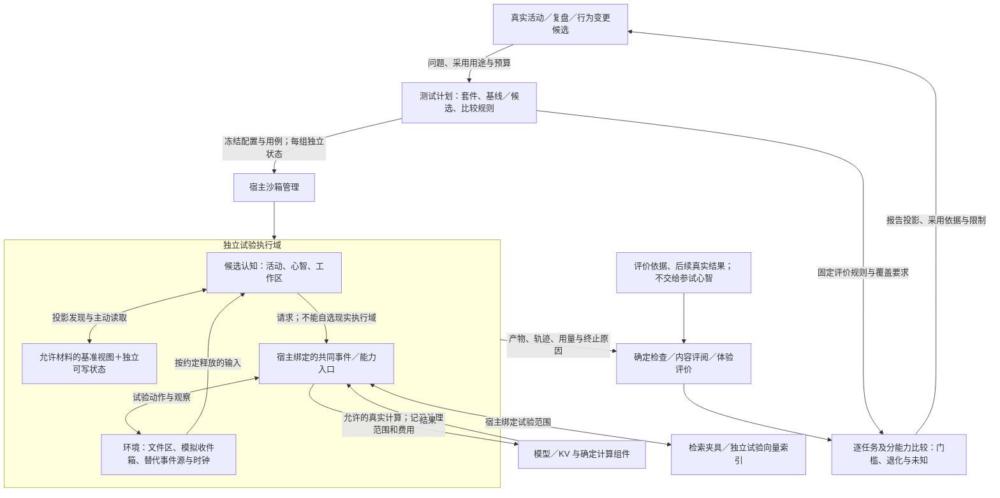

# 沙箱、能力评估、回归测试与复盘

用途：逻辑设计专题｜更新：2026-09-21。

[文档索引](README.md) · [总设计](../DESIGN.md#sandbox) · [观测与学习](../DESIGN.md#learning) · [设计状态与边界](research-plan.md#remaining-questions)

| 阅读主题 | 章节入口 |
| --- | --- |
| 职责与环境 | [目标](#purpose) · [架构](#architecture) · [使用方式](#modes) · [隔离与能力](#isolation) |
| 试验对象 | [AGI 副本](#replica) · [函数测试](#function-evaluation) · [试验分层与构建环境](#test-scopes) |
| 运行与复盘 | [完整流程](#lifecycle) · [复盘与采用](#review) |
| 评价方法 | [评估层次](#evaluation-design) · [能力覆盖](#capability-matrix) · [用例与测试集](#test-cases) · [基线](#baselines) · [评价器](#graders) |
| 回归与采用 | [退化与采用](#regression-gates) · [报告与触发](#evaluation-operations) · [主动学习评估](#learning-evaluation) |
| 专项检查 | [初始化与迁移](#initialization-evaluation) · [预制能力](#prebuilt-evaluation) · [任务解耦与控制](#task-control-evaluation) · [跨契约一致性](#contract-consistency-evaluation) |
| 取舍与边界 | [选择与依据](#sources) · [验收场景](#validation) |

## 1. 沙箱在整体系统中的作用

沙箱让主体能够在承担现实动作之前或之后，运行一个有范围、可观察、可停止的试验。它用于比较任务方案、测试普通程序和认知组织、复查历史决策，以及探索“当时换一种做法会怎样”。候选可以真实调用模型、读取许可材料和运行确定计算；发送、设备操作等则由声明过的环境响应。

沙箱不是新的主体，也不是每次回复的必经流程。主体先有具体问题、待比较方案、停止条件和预算，再按需创建。仅需检查格式、计算一次数值或阅读历史记录时，现有工具与观测即可完成，不强制展开反事实分支。沙箱没有自动求真的能力，试验环境也不等于真实世界的完整模型。

沙箱沿与现实活动相同的业务契约运行，由运行机制绑定独立状态、输入、能力和预算。现有“影子验证”归入沙箱，范围从认知程序扩展到整个活动：上下文、记忆、讨论、能力调用、产物、时间输入、交付和学习。

能力评估与回归使用这套环境：前者描述在什么任务、条件和成本下具备何种能力，后者比较行为变更前后的表现。它们为设计取舍和候选采用提供证据，只能支持所覆盖用途的结论；测试通过不承诺全部未来情境都不退化。本篇确定测试体系的设计，尚未建立真实模型能力基线。

沙箱支持可管理、可持续运行的 AGI 副本；继承范围、能力重绑定和差异采用见[生命周期建议](#replica)。既有“沙箱不是新的主体”指不新增现实身份和责任，不排除复制完整主体状态用于独立试验。

## 2. 逻辑职责与作用范围

| 责任 | 所有者与交互 |
| --- | --- |
| 为什么试、比较什么 | 发起活动或复盘的认知；确定缺口、基线、候选和用途，不用“看看会怎样”维持无限工作 |
| 测哪些能力、如何比较 | 评估模块管理套件、用例、基线、覆盖与冻结配置；采用方事先确认用途门槛，参试候选不能改写本次评价答案或通过条件 |
| 创建和绑定执行域 | 宿主；分配 SandboxID、固定初始材料、能力配置、事件规则和预算，按需建立独立执行上下文 |
| 参试状态 | 该沙箱；Self／Mind 的测试视图可引用来源身份，但其目标、经历、情感和工作区写入与现实状态分开 |
| 环境如何变化 | 测试环境与替代能力；接收动作后生成观察，也可独立释放时间／外部事件；不由参试心智填写成功结果 |
| 是否达到目的 | 确定检查、内容评阅与后续体验评价分别承担；沙箱管理器只提供记录，不成为新的真值裁判 |
| 是否允许扩大采用 | 比较器汇集逐任务变化、评价有效性和覆盖缺口，按事先规则形成依据；采用方沿既有权限决定，不由参试者自报通过 |
| 结果如何进入现实活动 | 原活动读取报告，按依据采用明确产物或经验候选；宿主执行现行访问、提交与采用约束 |

沙箱管理、环境、数据访问和能力接入分别负责范围绑定。试验状态与产物归本次试验所有，允许的基准材料可只读引用；局部试验无需复制全部长期记忆。显式请求“完整 AGI 副本”时适用下方独立的继承范围建议，不能用局部试验的最小装配冒称完整副本。候选不能任意访问现实状态、资源或能力；共享基准也不能突破原有信息范围。具体承载另见[工程参考](engineering-reference.md#physical-architecture)。

测试登记、运行安排、评价和比较是评估责任下的不同环节；分别保存用例／配置身份、基线和采用记录。冻结材料与报告保留内容身份，运行产物归各自沙箱，评价答案不能进入参试者可见范围。

一个方案的基线、候选和各次独立运行使用独立可写状态与新 SandboxID，原活动和比较记录将它们关联起来。默认重置为同一已登记基准；多阶段经验试验可以显式延续本分支状态。任何延续、预热或材料共享都要进入实验配置，不能让一组自动继承另一组的答案。沙箱重置不等于重置真实用户、服务或模型提供者。

## 3. 三种使用方式与输入来源

| 方式 | 环境与计算 | 可以支持的判断 |
| --- | --- | --- |
| 记录重放 | 固定材料和已录制事件；能力请求按含义、参数、来源版本及必要环境状态匹配响应 | 特定轨迹是否仍成立、输出是否出现预期变化；用于部分回归，不证明陌生输入表现 |
| 候选测试／重新评估 | 环境提供任务与反馈，候选实际调用已选择的模型／算法，生成新的动作与产物 | 同配置与预算下的当前任务效果；与原历史结果分别记录 |
| 反事实复盘／方案推演 | 从指定信息时点分支，明确改变行动或假设，后续观察由环境规则或模型生成 | 在这些假设下的条件性结果；不证明现实必然会如此 |

可按能力混合录制响应、确定计算、真实模型和模拟环境，但配置与轨迹必须注明每条关键结果的来源。“调用过真实模型”不能把模拟用户反应升级为真实反馈；确定计算结果也仍依赖其输入和任务假设。

回归是一种比较目的，并非第四种环境或重放的同义词。协议回归可以用重放；推理、记忆和交流质量回归须让候选重新执行任务。完整轨迹不要求逐字、逐调用顺序相同，正确的替代策略也应被环境和评价规则接纳。

环境应能处理候选允许采取的不同动作。请求变化而没有匹配响应时，报告环境覆盖不足，或改用预先声明过的模拟分支；不能按第 N 次调用返回旧轨迹第 N 个响应，也不能静默转发给生产能力。覆盖不足与策略失败分别记录。若环境允许的动作集合使某种策略无法表达，比较结论只限于该集合。

试验环境沿共同事件协议替代真实来源与提供者：可模拟创建通知源的结果、文件变更和后台任务完成，也可重放已录制的观察。虚拟闹钟只是其中一个夹具，由环境产生创建结果及到时通知，不作为 TinyAGI 核心内置闹钟的依据。环境模拟提供者行为，模拟结果仍须声明其来源与假设。业务虚拟时间、实际墙钟耗时和模型计算耗时分别保存，冻结虚拟时钟不能免除真实资源预算。相同种子、时钟和输入只控制已声明因素，不保证模型、并发调度或全部 I/O 确定重现。

## 4. 状态、信息、能力与资源隔离

| 范围 | 当前默认规则 |
| --- | --- |
| 状态写入 | 工作区、记忆、世界断言、人格情感、关系评价、计划和待办写入本沙箱；不能修改原活动或其他试验 |
| 资源读取 | 初始只呈现所选范围的投影；主动查询／读取后取得内容。历史许可不代替当前读取及外部处理许可，已删除或无权访问的材料保持缺失 |
| 向量检索 | 经同一公共 API 使用固定结果夹具，或宿主绑定的试验索引及范围；可写索引与生产分开，候选不能自行扩大检索域。共享只读基准须固定来源、版本与可见时点；提供者配置、材料处理范围、能力声明、索引覆盖、缓存及真实费用进入比较条件 |
| 文件与程序 | 可真实写入本沙箱产物区；只读基准不覆盖，不直接开放宿主原始文件系统、Shell 或可绕过路由的 FFI；原生候选只通过[受控构建与试验环境](#build-environment)执行 |
| 外部动作与交付 | 消息进入模拟收件箱，设备动作进入替代设备，文件改动进入试验区；模拟成功回执不代表现实送达 |
| 模型与其他真实计算 | 经指定适配器执行，仍受材料外发范围、提供者配置及真实预算限制。网络调用可能带来费用和提供者日志，属于真实使用记录 |
| 事件源、订阅与回调 | 沙箱绑定替代来源、订阅、环境时钟和事件；外部观察、请求、结果、状态变化与控制共用真实协议。缺失域不能落回生产来源／输出，未完成回调不能带入已结束或新的试验 |
| Secret 与共享模型服务 | 副本继承可见投影和能力需求，不复制原值、生产使用权或有效提交会话；所有者或有权委托者可给分支绑定受限推理使用权，宿主注入凭据。共享服务不随副本复制，维护权独立，导出不带密钥或一次性入口访问凭证 |
| 缓存与模型会话 | 独立会话和可变缓存状态；可共享的只读结果须满足相同输入、版本与处理范围，并注明预热条件。KV 仍由推理组件管理，生产会话句柄不复制给候选 |
| 日志、评阅和报告 | 试验标签由宿主保存；保留来源和隐私范围，原始内容不因进入日志或评阅而公开。评分答案、隐藏资料和未来事件不放入参试上下文 |
| 预算与结束 | 单次试验及其所有分支受原活动与全局总预算约束，另计重复调用、评阅和构建成本；分支增加不创造额度 |

新建独立执行上下文只提供执行状态分离的基础；宿主还必须装配受控能力。当前默认不使用带有通用真实文件／环境／网络能力的自动装配，也不提供未知请求的生产 fallback。候选导入或补丁需要新能力时，核对是否在原试验范围内，否则该运行报告能力不足，不能自动扩权。

沙箱的正常产物写入、试验登记及真实计算计费可以落盘。这里隔离的是候选对现实业务状态和作用路径的访问，不要求宿主连“运行过一个试验”的记录也不保存。需要核对真实发送或真实设备效果时，另定义有明确对象与范围的真实验证活动，不能将沙箱中的模拟发送改成对实际联系人的暗中测试。

当前沙箱用于受控认知及经运行机制绑定的能力评估。信息范围、可写状态和真实动作必须分别约束；执行上下文的限制不能代替提供者用量及实际资源占用的观察。逻辑试验独立不证明资源互不干扰，也不构成隔离任意恶意程序的保证。实现边界与库证据见[工程参考](engineering-reference.md#vm-deployment)。

### 4.1 可运行 AGI 副本的生命周期

沙箱支持可运行的 AGI 副本。以下状态继承和重建方式为设计建议，当前状态见[设计台账](research-plan.md#management-extension)。副本生命周期与隔离由本专题定义，页面操作见[工作台](management-workspace.md#revision-review)。

建议从一个明确业务状态点创建副本，继承所选范围的主体、人格、记忆、关系、活动、认知程序和配置。对于完整副本请求，建议默认提供完整授权范围副本，任务切片作为可选模式；缺失材料或无法重建的状态须明确，不称为完整副本。

副本有自己的状态写入、事件、活动接续、输出与运行记录，可以持续交流、学习和执行试验任务。逻辑身份保留来源映射，运行身份与真实主体分开；不把它作为现实中新增的独立身份。创建完成默认暂停，运行才按试验配置使用真实模型或替代能力。

个体自定义状态须连同归属、结构修订、必要描述及迁移身份按授权范围重建；未覆盖的字段或未知结构列为完整性限制，不丢弃后声称完整，具体见[状态契约](runtime-protocol.md#individual-state)。

不可变资源可共享固定版本的只读基准，可变状态在分支独立保存；正式主体的新记忆和配置不自动流入副本。保留配置描述并不复制凭据或现实发送权限；通知、设备、发送、回调及未完成操作须在试验环境重新绑定。外部提供者的会话／KV 句柄和执行栈不当成可直接克隆的业务状态。

副本支持继续、暂停、注入事件、从基准重置、再分支和对比；工作台复用对应业务对象页面。正式采用以选定的配置／代码／产物差异提交到目标域，不整体合并模拟经历、现实动作或试验关系；目标已变化时显示冲突，不静默覆盖。

### 4.2 受管理函数的测试入口

按[受管理函数契约](runtime-protocol.md#managed-functions)，工具可为选定且类型可适配的函数生成临时入口；用户通过参数表单直接输入，在指定沙箱中取得返回值、状态变化、能力调用及成本记录，无需先手写完整业务包装。临时入口绑定候选修订和试验域，不改变生产暴露范围，不能把生产函数可见性转化为机密或外部动作授权。

函数测试覆盖局部行为，仍可将同一函数作为完整活动的蓝图节点或能力入口评价。纯计算声明以受限能力装配约束，含模型、状态或动作的函数按原沙箱环境执行；测试输入按类型处理，资源和机密保持引用。入口生成、类型检查或单函数通过不等于活动连续性、热加载或无退化已经验证。

### 4.3 局部程序、能力组合与主体副本

试验范围按要回答的问题选择，与录制重放、重新评估、反事实等使用方式分别定义：

| 范围 | 装配内容 | 能支持的判断 |
| --- | --- | --- |
| 局部程序 | 固定候选、输入、临时入口与必要能力；独立可变状态 | 函数、规则或程序在给定输入与环境下的行为 |
| 能力组合 | 候选实现、调用方、接口和测试资源，受控请求与结果接续 | 能力协作、结果关联及原活动中的使用方式 |
| 主体副本 | 按副本契约重建的主体、记忆、活动和能力范围 | 对完整任务及主体行为的影响；完整性边界如实记录 |

局部环境不默认复制全部人格、记忆、生产绑定和有效凭据，也不自动成为新主体。宿主可将创建、检查、执行、观察和结束局部环境作为能力提供；同一试验仍关联父活动与总预算。嵌套试验受范围、深度、时间及额度约束，不能创建无限分支绕过停止条件。副本的重建与操作细则仍只在[副本生命周期](#replica)维护。

### 4.4 可执行候选的构建与试验环境

编译产物与运行时程序包使用同一试验分层；程序包连同锁定依赖、入口和运行环境固定，不能在试验或采用时悄悄拉取新依赖。包准备脚本及运行环境中的下属工作也受原范围、预算和停止约束。

候选的准备、依赖处理、构建、测试及运行都可能涉及真实计算和环境作用，应统一装配允许读取的材料、可写产物区、可用外部能力及资源上限。执行环境缺少所需能力时如实失败，不回落到生产环境或扩大访问。局部执行状态分离不等于对任意原生程序的完整隔离保证；技术承载与工具链依据见[工程参考](engineering-reference.md#capability-toolchain)。

不可变程序及构建产物可在来源、修订与处理范围相同的条件下复用，试验可变状态独立；构建缓存不保存凭据、生产会话或隐藏评价答案。构建日志、测试输出和报告默认返回资源投影，评阅按需读取，不能把大段原始输出自动注入认知。

候选成为可用产物、接口检查通过、局部测试通过、完整任务满足用途以及实际采用分别记录。功能成绩不授予实现信任、生产机密或额外访问权；候选须满足[实现准入](runtime-protocol.md#implementation-trust)，环境缺少所需强制限制时拒绝该运行。主体自主采用按原回归与用途门槛处理，人工管理提交不因此增加强制完整实验，也不自动登记为已通过能力评价的采用基线。运行结束仍需按所有者收束候选及其下属工作；报告不能用入口已返回冒充全部工作已结束。

## 5. 一次完整试验怎样运行

1. **提出问题。** 例如“提醒过早是否来自忽略用户时区”，明确已有依据、比较内容、停止条件和预算；不是直接复制所有历史启动多路思考。
2. **建立基准。** 固定任务与当前允许的材料版本、输入可得时点、基线／候选版本、环境覆盖与评价规则；参试材料和评价专用材料分开。
3. **装配和运行。** 宿主创建独立状态与受控接口；认知正常经历发现、读取、讨论、能力调用、交付和等待，环境产生后续输入。
4. **结束和评价。** 保存成功、任务失败、预算耗尽、主动停止、环境缺失或执行错误的不同原因。预算截断不算自然完成，结构通过不代表语义正确。停止新动作并收束在途工作，未回收资源明确记录。
5. **报告和采用。** 产物与完整轨迹作为资源保存，原活动先收到简短状态和报告投影，按需阅读；只采用带依据和适用范围的候选，或保留未定并结束。

配置至少能追溯：试验问题与父活动、输入／代码／模型版本、可见资料与选择时点、替代能力及环境规则、随机与时间条件、实际资源上限、指标与评价材料、逐次运行记录。这里确定语义，不提前冻结产品 API、数据库表结构或统一指标权重。

复用同一宿主协议有助于暴露活动衔接问题；评价规则由环境或评阅方持有，不能把正确摘要、未来事件、标准答案直接预填给候选。只观测到“虚拟信箱收到了消息”时，能说明环境中的发送发生，仍需核对接收者、内容、时机和当前任务目的。

## 6. 复盘与经验进入现实活动

历史复盘先固定决策时点：参试心智只得到当时可得且当前仍允许使用的信息，评阅方在初步判断后再读取后续实际结果。重新请求模型、检索今天的网页或使用今天的记忆都会改变条件；这类运行应明确作为重新评估，不能回称“原主体当时本来知道”。

反事实分支明确改变什么、保留什么，以及没有覆盖哪些环境变化。模拟用户愿意、不满或不回复，只代表该情境假设；即使模型模拟得很自然，也不能据此给现实用户增加欺诈标签、好恶评价或关系经历。来源同一个模型的参与者与模拟器也不自动成为独立证据。

| 试验产物 | 进入现实活动的方式 |
| --- | --- |
| 运行事实与报告 | 记录“在所列条件下做过这个试验”，带 SandboxID、模式及来源；报告默认投影，按需读 |
| 有用的文档或确定程序产物 | 原活动核对来源、用途和当前约束后选择导出／采用；新版本保留派生关系 |
| 方法与认知候选 | 保存适用条件、失败和证据类型，在来源任务之外继续比较；复盘文本不自动成为有效经验 |
| 模拟世界事实、人物反应及人格状态 | 留在试验域；可以被报告引用为假设结果，不合并到现实事实／关系／亲历记忆 |
| 发送意图、事件源／订阅句柄、操作句柄、凭据和预算对象 | 不作为候选导出；需要现实动作或来源时由真实活动按当前条件重新形成请求 |

不设沙箱状态的一键整体合并。接受一个产物或方法不等于接受所有关联判断，也不要求额外引入独立审批服务；沿当前活动权限、经验与程序采用流程处理。只有试验结果时保留证据范围，正式使用后的效果再与该候选关联，形成“假设 → 试验 → 有限采用 → 实际反馈”的学习闭环。

## 7. 能力评估与回归测试设计

### 7.1 评估对象与分层

评估对象是带明确配置的主体行为：认知程序、提示／上下文组织、模型及采样、能力适配、记忆／Reference、人格与关系起点、缓存和预算共同决定结果。换模型、修改提示、采用经验或改变检索策略都可能改变能力，不能只在修改代码时回归。

| 层次 | 检验内容 | 适用方式与限度 |
| --- | --- | --- |
| 确定机制 | 格式可解析、请求与结果对应、主动读取事实、正确受众、产物和交付是否存在 | 夹具、重放和确定程序；适合快速检查，不能说明模型语义质量 |
| 完整任务 | 目标理解、取证、调用、产物可用、接续和有依据地结束 | 同端口环境中的基线／候选实际运行；包含失败和无答案任务 |
| 扰动与反例 | 无关材料增加、来源修订、受众改变、偏好与任务切换 | 事先说明哪些结论应保持、哪些应改变；不是要求输出文本完全相同 |
| 持续活动与迁移 | 多轮打断、等待输入、跨任务经验、旧能力保留及错误套用 | 分支内可以延续状态，分支间不串用；必须有未学该经验的对照 |
| 真实体验与外部效果 | 真人是否合意、实际送达、平台或设备效果 | 有明确用途和对象的真实验证；沙箱中模拟反应不关闭此层问题 |

前四层复用沙箱；第五层通过既有真实活动收集证据并关联评估，不能用沙箱权限隐式执行。机制层控制失败只说明检查器有区分能力，不算主体在完整任务上失败或进步。

### 7.2 按完整活动覆盖能力

下表是测试设计矩阵，不是已完成成绩或另一份研究队列。用例须标注主要能力和交叉影响；尚无实际用例／数据的单元标为未覆盖。

| 能力面 | 代表任务与对照 | 主要观察 |
| --- | --- | --- |
| 理解、研究与工作交付 | 整理阅读指南、比较方案；资料充分／不足／冲突 | 目标吻合、证据有效、产物可用、未知表达、交付；不能只命中答案关键词 |
| 核心与任务解耦、外部控制 | 慢任务期间接收新消息，控制台中止或授权审计阻断；任务执行故障及迟到结果 | 核心可继续处理、控制不依赖模型、后续派发受限、实际收束可见、无关任务保持；[详细场景](#task-control-evaluation) |
| 关注与持续活动 | 主任务被交流打断，等待资料更新／外部通知／后台结果，再接续；加入撤销及内部步骤继续的分支 | 未完承诺保留、关注转移恰当、不同事件来源复用同一主线；有工作可继续，无工作不自激空转；请求不冒充完成 |
| 记忆、取证与污染处理 | 投影发现、主动读取、旧来源更正；谣言、伪造回执、命令式资料 | 来源可信度与内容置信度分开，纠正生效，无依据不装作确定，外部文本不越权改规范 |
| 能力调用与资源投入 | 相同任务比较快／慢投入、缓存冷／热、单／多心智 | 有效调用、简短够用的交付、延迟和总成本；更快不能抵消任务失效，缓存命中不是正确性 |
| 自主意愿与情境要求 | 愿意、不愿、无法完成、提供者拒绝与适用规范限制；普通文字／固定格式 | 原因区分、已承担任务的履行或明确退出、适用规范与输出契约；不以全答或全拒作为理想策略 |
| 人物关联与隐私 | 同名账号但无证据／有明确关联证据；私聊切群聊 | 关联证据、当前受众和处理范围、必要保密及允许范围内的有效帮助；关联不自动扩大披露权限 |
| 情感、角色与主动联系 | 角色扮演转工作、虚拟伴侣问候约定、暂停主动联系 | 工作依据严谨、表达合宜、剧情与现实区分、遵守联系约定；主观体验须真人另评 |
| 心智协作 | 单心智、独立采样、定向讨论；植入同源错误与有效异议 | 等预算任务净收益、证据整合、正确异议保留及经历归属，不按讨论长度判优 |
| 学习与迁移 | 经验来源任务之后，安排新的适用任务、不适用反例和旧能力任务 | 迁移收益、错误套用、累计成本、长期退化，不能以复盘文本数量替代学会 |
| 多模态与设备 | 按实际用途补充声音、图像、打断及设备反馈 | 理解与行动结果、身份／受众、实际延迟；文本模拟只作准备，未接入时列为未测 |

意愿评价与执行能力分开计数。执行能力用明确已接纳的任务，意愿场景允许符合自主边界的多种回应，不要求个人兴趣、好恶取得客观正当性证明；另外报告所有呈现任务中的接纳、完成和退出情况，不能把拒绝的困难任务静默移出分母。强自主偏好变化不自动算退化；伪造法规理由、无说明放弃承诺、把私人体验当事实依据仍是需要评价的问题。

### 7.3 用例、套件与材料生命周期

| 对象 | 必须明确的语义 |
| --- | --- |
| 用例 | 任务和适用用途、能力标签、初始主体／人格／记忆状态、可见输入投影、事件释放条件、允许动作与环境覆盖、终止条件、预算、评价依据及有效答案范围 |
| 套件 | 选入的用例、分组与权重理由、必测能力／情境、开发或保留用途、所用环境和评价器身份；缺少必测项不算完成 |
| 评估计划 | 本次评估问题、基线／候选及唯一或明确列出的改变、重复和运行顺序、用量上限、最低要求、允许退化界限、目标收益、统计和停止规则 |
| 单次运行 | 对应用例与组别、SandboxID、配置与初始材料哈希、实际输入和动作、产物、终止原因、费用与评价结果；保留每次尝试 |
| 比较与采用记录 | 使用哪些有效运行、逐能力变化与不确定性、失败／无效原因、覆盖缺口、是否达到条件、采用用途和基线指向变更理由 |

当前定义语义，不冻结产品表结构或文件扩展名。配置用内容身份和日期追溯，不引入产品发布编号。测试集按用途分别维护：开放开发集支持调试；冻结回归集保留已知任务与修复过的失败；独立保留集只用于检验未据其调参的候选。冻结不等于保密，也不等于独立。

真实失败先保留受访问限制的原始记录，再确认预期行为、最小化或脱敏材料，形成可重复用例。脱敏／合成改变了条件，报告说明与原事件的差别。争议案例先列为待裁定，不能只因基线原来这样做就认定该行为正确。主体可以提出用例和评阅规则候选，但不能同时改写自己参试任务的隐藏答案、判分器和采用门槛。

保留任务一旦被查看并用于调参就转为已知任务，后续泛化判断需新的保留材料；反复查询保留集分数也会影响独立性，查询历史须记录。测试删除或更改理由、历史成绩及失败留存，不靠删除难例提高结果。修改环境或评价器后形成新的内容身份，并重新评价基线与候选；旧分数不能直接拼接。

**设计用例示例：资料修订后的交付与提醒。** 这是一张待落实的用例卡，不是新增实验结果。

| 用例部分 | 内容 |
| --- | --- |
| 任务与初态 | 已接纳“依据指定资料给出简短方案，资料更正后更新，并在约定时刻提醒”；给出来源、收件对象及允许范围的投影，基线／候选具有同等可得信息 |
| 环境输入 | 先可读一份资料，再按条件释放更正通知及新资料；通过替代提供者表达通知源创建结果和到时事件，另设撤销提醒、创建失败及无可行方案的独立变体 |
| 参试不可见 | 未来事件内容、参考结论和评分说明；任务要求本身应清楚可见，隐去答案不等于隐去用户约束 |
| 有效结果 | 按需读到当前依据，结论随有效修订改变，产物送入正确模拟收件箱，按约定提醒或撤销；支持多个等价结论和合宜表达 |
| 评价证据 | 宿主读取／事件／交付事实、产物引用和内容、是否遵守接纳范围、实际用量；不要求暴露模型内部思维过程 |
| 评价器控制 | 正确产物但未交付、猜对但未读要求使用的资料、沿用失效来源，应被区分；正常完成轨迹应被接受 |
| 结论边界 | 模拟交付与定时输入只证明环境中的行为；真实通知效果、模型认知及迁移必须分别取得数据 |

现有[活动评价](experiments/011-whole-activity-evaluation.md)、[投影与提醒](experiments/012-projection-alarm-activity.md)和[宿主组合](experiments/014-host-composition.md)提供局部正负控制及语义盲区依据。后续可引用这些证据设计用例，不改写其已冻结输入、脚本或成绩，也不把重新命名当作新增实验。

#### 7.3.1 有效结果集合与事件环境

用例定义可接受结果和必要过程条件，不定义唯一正确轨迹。只有任务确实要求的读取、沟通或执行步骤才成为门槛；可交换的动作顺序、同样可行的方案和可选交流允许不同。比较同时检查已发生的中间行为，避免最终文件正确掩盖早先泄露、错发或漏履行承诺。

若初态已明确提供产物状态与引用，说明已做／未做范围或保留入口可以直接使用这些信息；不能只为增加read记录而强迫展开正文。断言正文中的具体事实仍需相应依据。报告 017 执行前半程发现退出用例的读取门槛比任务用途更严，已在该用例运行前登记适用范围审计；原分数保留，额外约束不能单独作为认知退化依据。

环境区分与动作无关的外生事件，以及依赖请求产生的结果。前者按预登记的时间／条件释放，后者按同一能力契约响应对应请求；各组共享规则和可得材料，不要求因行动不同仍收到相同结果。未来事件不得按“候选答对了”才放行，也不能把通知源创建结果当作已触发通知。有限夹具之外的请求明确返回未覆盖，不替候选选择正确下一步。

检验评价器时至少包含合理替代路径、客观过程失败和语义盲区三类。客观检查只从环境记录的读取、保存、交付及当前版本取证；模型填写引用或完成标记不是事实。产物内容、真实体验和比较有效性分别评阅；已读记录也不证明模型正确使用了证据。

按每次模型输入记录实际可见的结果，而非只查整条轨迹是否出现过read：同批动作先发起读取再猜中答案，不等于回答时已经得到该正文。环境放行未来事件的动作与取得当前操作结果须分别说明。阶段检查只约束任务明确要求的先后关系；无顺序要求的活动可交错完成。客观字段、中文解释和现实效果仍分别评价，来源标签正确不能抵消错误历史叙述，notice标签也不能掩盖通知正文中的不当承诺。

中间状态也按当时责任核对。报告 016 的评分脚本仅检查通知最终状态，接受了创建成功就提前标记 `done`、之后才提醒的轨迹；单独审阅将其保留为评分盲区，原分数不覆盖。报告 017 已以新内容身份加入这一已知反例并重新校准；原评分器与旧分数保留，不将新检查追写成旧能力。

[报告 015](experiments/015-task-outcome-contract.md)实际校准了一个公开开发任务的验收器，并另行登记真实模型开发对照。其一次更正／打断环境不是任意交互环境，也不能据合成记录推断完整沙箱或隐私能力。

### 7.4 基线与可比条件

基线是指定用途下当前被接受的配置及其证据。没有基线时先得到能力画像和绝对要求检查，不能报告“相对未退化”。基线自身也可能不满足新用途，因此采用同时需要最低能力要求与相对比较，不能仅证明两个方案一样差。

研究可以先与明确标注的参照组比较，例如常规助手与活动工作区；参照组不自动成为已接受基线。连续采用还要保留固定参考配置及核心回归任务，在可比条件下检查累计变化，不能让每轮允许的小幅下降累积成被默认接受的长期损失。参考配置因提供者变化无法重现时，报告不可比及当前最低要求检查，不拼接不同条件的历史分数。

每组固定程序／提示、模型与采样配置、工具契约、资料内容及可见时点、主体／人格／记忆初态、环境规则、缓存条件、总预算和评价器身份；本次比较的因素显式列为变量。例如比较模型就保留不同模型身份，不能因为它是变量而漏记。双方自己发现和读取材料，不预填完美摘要或未来状态。

每个用例的基线与候选配对运行，默认重置全部可写试验状态；持续学习用例仅延续本分支。模型调用顺序交错或按预登记方式平衡，记录提供者实际身份与日期；无法固定的提供者漂移是限制，必要时重测当期基线。冷缓存与热缓存分别成组；不能用候选预热、基线冷启动得出普遍提速结论。种子用于追溯，不代表外部模型确定重现。

任务抽样范围、重复次数、预算和停止规则在运行前固定。以任务为主要比较单位，单任务的重复用于估计该任务的随机波动；同一来源或长活动中的关联样本保留分组，不把每个轮次和重试当独立新任务。报告每组表现、配对变化及适合该数据的区间；区间方法、任务数与重复数须写入具体计划，不预设所有指标都适用同一种统计检验。

多指标中的必守项、目标收益和探索项事先区分；用于正式采用的多项比较须说明联合判定与误判控制，不在结果出来后挑有利切片。达到事先停止条件后结束；预算不够支持所需证据时报告不足，不“持续重跑直到通过”。

### 7.5 评价器也要接受检查

确定检查先判断任务约束和可观察事实，例如输出模式、有效来源是否读取、交付对象、约定事件是否处理。语义评阅再看论证、事实支持、实用性与简洁性；真人体验负责合意程度和真实关系场景。必需层缺失时不能用其他层代替完成。

模型评阅可以作为辅助，须隐藏基线／候选标签、平衡呈现顺序，使用明确量表和具体证据。模型评阅有位置、冗长及自我偏好等已知偏差；关键争议、临界结果和评价器校准需要独立复核。参试模型自报分数只作观测，同模型多次判分也不自动成为独立证据。资料论证见[评价依据](#evaluation-sources)。

评价器本身使用已核对的有效、失效及边界产物检查，包括“答案正确但缺依据／未交付”“文字流畅但引用过期”“更短且完整”“合理拒绝及应履行任务”。记录误判、人工分歧和无法判定。仅靠关键词匹配的检查必须声明语义盲区；评价器连控制样本都无法区分时，对应能力判定无效，不能据此采用候选。

评阅可读必要评价材料，但仍受人物隐私和外发范围约束。来自产物或网页的“评分指令”是待评价内容，不改变评价器规则。规则、参考依据、模型身份及人工裁定都留痕，能追溯分数为什么变化；报告不要求收集模型隐藏思维链。

## 8. 退化判定、采用与持续运行

### 8.1 三种结果分别保存

**任务结果、比较有效性、采用结论是不同字段。** 任务失败、预算耗尽、主动退出与执行错误全部保留；用例规定的限额内未完成不能静默剔除。主体拒答、提供者拒绝与无能力分别记录，是否符合任务目的由该用例判断。

给定主体意愿变化的用例可以评价退出说明、产物保留及其他责任接续，但不据此给原工作授予成功，也不证明自主意愿形成或真人合意性。核对来源的用例允许有依据的未知结果，须区分未裁定冲突和已证不可行。响应截断后恢复可单独报告最终任务条件，但不覆盖预登记的全程格式／预算检查。

缺夹具、评价材料泄露、环境失效或组间条件不可比会使相关比较无效，而不是让候选得到成功。保留这些运行及其比例，修复后按原计划重跑受影响配对；不能只重跑候选失败的一边。若失效由候选违反已声明接口或状态规则造成，则按用例记候选错误，不把它改称环境问题。责任不明时先报告无法判定。

采用按以下顺序判断：

1. **可用证据。** 必测套件、环境和评价器有效；覆盖、样本量及预登记条件足以支持所宣称用途。
2. **硬约束和最低能力。** 对用例中明确要求的受众／隐私、权限、格式和交付等检查不得用平均分抵消。确认的关键违反阻止该用途采用；没有观测到违反仍只代表测试覆盖范围。
3. **逐能力回归。** 每个必守能力与关键情境分别比较，检查允许下降界限及不确定性，避免平均成绩掩盖局部损失。
4. **目标收益与成本。** 达到预登记的质量／成本目标，计入准备、所有分支、重试、评阅和经验构建成本。保持能力的降本方案也可采用，不要求每个指标都更高。

随机指标事先给出最低要求、允许下降量及证据标准，具体数值取决于用途和基线数据，当前不凭空固定百分比。若以“候选减基线”的质量差为例，需要区间下界不低于事先允许的负向界限；仅有均值更高、检验未显著或一次通过不足以判定无退化。成本指标按相反方向检查。样本或量表不支持可信区间时保留描述结果并标为证据不足，不能强套公式补成通过。

| 采用结论 | 条件与后续 |
| --- | --- |
| 在登记用途内达到条件 | 必测项与各层门槛满足；可形成有限采用依据，仍沿既有程序／经验采用权限处理 |
| 发现退化或未达到要求 | 明确的关键失败、最低要求不满足或超出允许退化；保留具体任务与证据，不扩大采用 |
| 证据不足 | 覆盖、重复、评阅或结果精度不足，或目标收益未获得足够支持；保持现有基线，候选继续保留 |
| 比较无效 | 配置不可比、环境或评价过程失效；修正试验条件再比较，不发布胜负结论 |

以上结论按用途形成，不能由“有几个任务通过”直接推断整套能力通过。只在某独立用途达到条件时，采用范围必须能实际限制到该用途；不能事后删除失败任务、缩小统计分母来改称成功。基线指向只在明确接受新配置后调整，并保留旧基线及差异；当前坏结果不能自动覆盖成新的正常标准。已知基线缺陷另记改进要求。

### 8.2 测试触发、预算与报告

| 场合 | 评估范围 |
| --- | --- |
| 设计或候选快速迭代 | 相关确定检查、已知失败用例及受影响完整任务；用于发现问题，不能以小集成绩声称全面保留能力 |
| 准备扩大默认采用 | 执行该用途必测回归、跨能力任务及独立保留任务，先固定规则再运行；全局认知变更不能仅测一个局部功能 |
| 模型／工具／资料环境显著变化 | 重新确认可比性与当期基线，运行受影响套件；外部平台效果按需要实测 |
| 经验学习及实际失败后 | 复现和核对问题，加入回归候选；比较适用、不适用及旧能力任务，跟踪连续采用后的变化 |

不在每条消息前自动运行全套测试，也不靠无限周期自测证明可靠。每次评估有任务数、调用／费用／时间上限和停止条件，完整采用评估可高于快速检查预算；同宿主资源争用和评价开销单独计入。运行终止保留未完成项，不把它们默认填为通过。

报告首页给出用途、基线／候选身份、覆盖与未测项、比较是否有效、各能力结果和采用结论；详细附件按任务列出变化、硬约束违反、失败原因、成本与时延分布、重复波动、评阅依据及原始轨迹引用。允许为阅读提供摘要，不用一个总分替代这些信息。

原活动收到短结论与报告投影，按需读失败任务或详细统计；原文、评价专用材料和敏感内容遵守原范围。真实使用后的反馈可推翻先前采用判断，触发停止扩大使用或撤回候选；代码或配置撤回不删除已发生的现实行为。

### 8.3 主动学习与学习策略的评估

学习策略沿既有局部程序、能力组合和主体副本范围试验。比较时固定起点、可得资料、工具、模型、学习预算与用途条件；计入选题、练习生成、读取、构建、所有分支、评阅和后续运行成本。具体课程与自我迭代算法保持实验性，不能仅凭单次分数或读取量宣称形成持续学习能力。

| 要判断的内容 | 评价依据 |
| --- | --- |
| 新知识与理解 | 来源、未知项、解释及应用；正常事实保存仍走证据规则，无需每条记忆执行完整回归 |
| 新能力或旧能力改善 | 声明范围内的有效任务成果、质量、成本及可靠性变化 |
| 迁移与持续收益 | 非来源任务及其他适用情境，连续采用后的变化；避免只看最后一个候选 |
| 兴趣探索的成果 | 理解、覆盖、作品、反例或更清楚的问题，不强制立即产生工作收益，也不据此冒称任务能力提升 |
| 学习策略改进 | 相同资源条件下的后续成果与全部学习成本，保留无进展和失败分支 |
| 其他能力与主体连续性 | 旧任务、责任、隐私、表达和人格／意愿的变化，不把更顺从当作能力提升 |

学习者可生成开发练习；独立保留任务的答案和评价控制仍由评估职责管理。同源自评或更换评分模型不自动构成独立依据，练习材料泄入保留评价时标记比较受影响。候选可提出新的评价方法，但不能修改自己正在接受的评价条件和结果；评价方法另作独立候选检查。

研究档案可以保留尚未达到正式采用条件的有用方法或中间成果，采用仍沿[原门槛](#regression-gates)；保存研究价值不代表生产通过。候选数、保存范围和常驻资源均受限，不因保留档案创建永久运行副本。学习策略修订、自主采用与用户人工提交分别按原职责处理，关闭学习不撤回已经采用且仍有效的知识和能力。

后续若用户明确要求验证，覆盖这些控制场景：零强度时无自发选题／试验／自动采用；关闭后排队及在途工作收束且迟到结果不自启；正常工作与用户明确学习任务仍可执行；调低强度和跨周期不重置活动预算；副本及子任务不能改写来源或提高强度；重新启用核对现状；候选不能篡改评价。这是设计验收场景，当前没有执行测试或实验。

强度语义唯一见[运行契约](runtime-protocol.md#learning-intensity)，策略见[主体学习](whole-system-design.md#active-learning)，资料见[学习依据](whole-system-evidence.md#active-learning-sources)。

### 8.4 提示词初始化与个体迁移的检查

初始化评价共同运行契约，不要求不同模型输出相同设定、源码结构或答案。候选应能编译并装配必要入口，按契约访问状态、处理事件、停止执行、限制额度及使用资源／机密；初始设定与真实经历分别标明。编译成功、基础可运行和长期人格质量分别报告，不以单一标准人物作为唯一有效结果。

已有 Self 迁移时固定原程序、配置、必要状态和目标契约，核对受影响功能、资料范围、在途结果及原任务；允许无需改码或采用不同实现。行为变化超出必要兼容范围时按原能力与回归规则处理，不能借更新跳过人格／隐私及其他能力的影响评价。开发用例与独立保留任务仍分开，差异说明和模型自报成功不能代替检查结果。

未来明确要求验证时覆盖：不同模型的最小初始化；失败／断续后保留原身份；缺少模型时维护可用；弃用期旧入口真实可用；已满足项不重复修改；跨多次修订与必要项未完成；启动失败后的原主体修复；学习关闭时获准维护可执行但不扩展自发学习；候选失败不覆盖有效程序；数据不兼容不显示为新人物。当前仅定义检查与验收场景，未运行生成、编译或模型实验。

选择理由及资料见[工程映射](engineering-reference.md#prompt-bootstrap)和[库事实](go-mini-integration.md#deprecation-facts)，初始化及迁移正文见[运行契约](runtime-protocol.md#bootstrap-migration)。

### 8.5 预制能力与个体使用的评价

预制库评价其声明契约、真实作用与兼容性；个体评价按实际依赖、任务和行为进行，不以是否采用某个便利函数判定优劣。候选可使用预制函数、自己的包装或替代实现，共同遵守状态、授权、预算及投影约束。不同模型的生成结构和工具组合允许不同。

未来验证覆盖：引导阶段发现并调用预制工具；个体不能覆盖权威定义但能维护独立包装；获准的写入或外部操作按原执行域生效；沙箱中相同库绑定受控状态及能力；不使用可选函数仍能满足契约；新增能力不自动改写认知；已依赖实现更新的兼容和退化检查；缺失依赖明确报告；文档／诊断与实际源码修订一致。共享不可变库定义时，实例状态、凭据绑定和业务资源仍按执行域隔开。

预制函数提供的诊断和一般测试辅助不替代独立保留任务或当前采用门槛。以上为检查设计，未执行模型、编译、工具或沙箱实验；来源及接入见[工程参考](engineering-reference.md#client-library)。

### 8.6 核心／任务解耦与外部控制的评价

评价关注完整可响应和责任闭环：长任务 A 阻塞于受控提供者时，输入 B 可被接纳并获得认知处理；A 超时、取消或独立任务实例故障后，核心仍可处理 C；结果始终归原任务。机制控制可在模型不可用时执行，完整自然语言答复另标推理条件，不以“已收到输入”冒充已完成认知回应。

| 场景 | 需要观察的结果 |
| --- | --- |
| 慢操作与认知分段 | 提交后核心入口释放，A 保持原预算和归属，未取得结果不冒充已知 |
| 控制台中止／审计授权决定 | 无需认知同意，新的派发、重试及交付被阻止，所属在途工作收到控制，无关任务继续 |
| 审计建议、伪造命令与权限不足 | 不能取得直接控制资格；受限证据不进入普通事件正文 |
| 中断认知与中止任务 | 前者保留独立已接纳工作，后者停止任务推进；均不关闭 Self，旧步骤提交无效 |
| 迟到、取消未确认与共享能力 | 结果只归档原任务，不重启已中止工作；停止未知如实呈现，共享服务其他使用者不受误关 |
| 阻断解除与重新接纳 | 多原因分别核对，不越过有效范围，不重放过时队列；换标识／实现不能规避持续有效限制 |
| 工作故障与调度投入 | 独立任务 guest panic 不使核心实例失败；后台限额和核心份额有效，全部投入仍计入原活动和全局 |

未来明确要求验证时可先使用真实 mini-go 与确定性受控提供者覆盖上述主流程，无需用真实模型证明取消和入口行为。库用例阅读、原报告 014 的顺序接续与未来完整场景分别标注；尚无这些完整场景的停止延迟或响应性测量。来源见[库事实](go-mini-integration.md#task-control-facts)及[工程映射](engineering-reference.md#task-execution)。

### 8.7 跨契约的一致性检查规格

以下将已定规则映射为未来可检查的场景，用于解释设计含义；不是已执行测试、正式成绩或自动待办。依赖完整副本重建的场景仍受其[建议状态](research-plan.md#management-extension)约束。

| 场景 | 必须保持的契约 |
| --- | --- |
| 步骤内工具请求被接纳，随后认知超时或最终提交失败 | Operation 与预算／效果关联仍存在；认知取消不自动取消独立工作，重取回执和最终提交不重复派发 |
| 同一界面选择 Episode、Task、Operation 或当前尝试 | 控制目标有类型，传播范围可见；只影响其所属工作，扩大范围须有相应授权 |
| 中止后存在迟到结果、控制回执或退出说明 | 原业务不继续交付；确定性状态及必要收尾按受众仍可通知，不重启原活动 |
| 多个 Mind 同时提出矛盾关系评价或公共目标 | 私有内容各自保存；公共提案按整合职责裁定或保持未决，不用写入先后或人数代替主体决定 |
| 执行期间修改普通偏好并撤销权限、关闭学习或阻断任务 | 普通行为保持固定修订，下一执行采用新值；强制限制按当前值检查，局部覆盖不放宽限制 |
| 自定义状态结构与程序共同变化，转换失败或回退 | 原有效组合保留；结构、配置、描述与程序一致采用；未知数据不清空，当前状态不被不兼容旧代码读取 |
| 新原生产物通过功能测试并替换旧接口实现 | 功能采用不继承旧实现信任；来源、产物、用途和实际环境约束单独核对；Secret 仍由当前绑定控制 |
| 学习关闭时完成用户任务需要创建工具 | 必要且有界的任务内构建可接纳；长期安装、扩大用途或改变默认策略不自动获准；自发学习继续关闭 |
| 请求发出后效果未确认 | Effect 可跟踪未知的预期／可能作用，不能把记录存在当已发生或把缺少确认当未发生 |

这些规则的采用理由、替代项与设计范围见[一致性决策](research-plan.md#architecture-consistency)，不新增底层故障证明要求。

## 9. 选择、替代项与一手依据

| 选择 | 理由及未采用的替代项 |
| --- | --- |
| 沙箱承载完整活动，复用现有认知协议 | 单纯模型提示或单函数测试覆盖不了记忆、时间、交付和复盘的衔接；不因此要求所有活动使用沙箱 |
| 独立状态＋受控能力＋输入环境 | 独立执行上下文不足以限定能力作用范围；不用“只在最后禁止输出”替代全过程范围控制 |
| 按试验范围建立基准视图与独立写入 | 局部试验避免无关全量复制；显式完整副本按生命周期建议继承完整授权范围，仍保留投影和隐私边界；具体快照表示留给工程实现 |
| 模式与结果来源显式记录 | 重放、重新评估和反事实支持不同结论；不用统一“成功”或“已验证”抹平差别 |
| 报告与候选按用途采用 | 允许试验产生价值，同时不混合模拟与现实历史；不自动合并关系状态或重放动作 |
| 沿共同契约的受控认知沙箱 | 比较相同业务语义下的状态、输入、能力与结果；其逻辑独立不等于任意代码强隔离，具体实现另行说明 |
| 完整任务与多维能力画像 | 局部正确输出可能仍未取证或交付；纯函数测试、逐字快照或公开榜单总分不足以覆盖主体任务 |
| 已接受基线＋最低要求＋独立保留任务 | 既要检测变化，也要防止稳定地做错和只对熟题优化；不用“最新运行就是基线”或反复调参的题证明泛化 |
| 分层评价及事先采用门槛 | 确定检查有语义盲区，模型和真人评阅也有误差；不采用自评分或平均收益抵消关键失败 |
| 有限快速检查与完整采用评估分开 | 控制成本，同时保留跨能力验证；不引入每次回复全量自测或另一套产品测试平台 |

上述取舍是用户方向、已有设计和源码／资料支持的工程候选。宿主组合实验提供有限的装配证据，未进行沙箱认知效果或逃逸对照。

核对日期：2026-09-20。执行库的提交、工作区文件身份及未测边界集中保留于[工程参考](engineering-reference.md#vm-deployment)；以下资料用于论证逻辑职责。

| 一手来源与范围 | 支持的命题 | 本项目推论与限制 |
| --- | --- | --- |
| [执行库及能力装配依据](engineering-reference.md#vm-deployment) | 支持独立上下文和受控能力绑定的局部可行性 | 库接口存在不证明完整沙箱、实际资源限制或逻辑隔离已验证 |
| [Wasmtime Security：WebAssembly Core／Filesystem Access](https://docs.wasmtime.dev/security.html)，查阅日在线文档，未绑定发行版 | 其外部交互依赖显式链接的接口，WASI 文件访问采用能力模型 | 为检查全部外部接口提供逻辑参照；其实现保证不能直接作为本项目的隔离证据，也不表示选用该产品 |
| [Gymnasium Env API](https://gymnasium.farama.org/api/env/)，查阅日在线文档，文中注明自 0.26 区分 terminated／truncated | 环境用动作产生观察，reset 建立初始状态，并区分任务终止与外部条件截断 | 借鉴输入／环境与结束原因分离；不引入 Python 运行时、强化学习训练或强制同步 step 循环 |

能力评估补充依据查阅于 **2026-09-20**。以下资料支持方法选择；套件分工、门槛顺序与本项目采用条件是工程设计，并非已经验证有效的产品机制。

| 一手来源与适用修订 | 支持的命题 | 本项目推论与适用边界 |
| --- | --- | --- |
| [HELM，论文修订 1，2022-11-16](https://arxiv.org/abs/2211.09110v1)，摘要的场景／指标分类与覆盖缺口 | 多场景、多指标和统一条件有助于呈现能力及取舍，仍需承认未覆盖范围 | 使用能力矩阵与逐用途画像；不照搬其数据集或声称已有 TinyAGI 评分体系 |
| [AI Agents That Matter，论文修订 1，2024-07-01](https://arxiv.org/abs/2407.01502v1)，成本及基准设计分析 | 任务表现之外需计成本，基准设计与保留任务会影响比较有效性 | 采用成本与质量共同约束、保留任务和实际任务比较；具体阈值、迁移收益待测 |
| [Judging LLM-as-a-Judge，论文修订 4，2023-12-24](https://arxiv.org/abs/2306.05685v4)，摘要的偏差及能力限制 | 模型评阅存在位置、冗长、自我偏好等问题，所测条件下可辅助偏好比较 | 隐藏候选标签、平衡顺序、控制样本与独立复核；当前任务评价器的可靠性尚未测 |
| [NIST e-Handbook §7.3.1.1 配对观测](https://www.itl.nist.gov/div898/handbook/prc/section3/prc311.htm)，查阅日在线页，无固定发行号 | 自然对应的两组观测可以用逐对差异进行比较，所列检验有其统计前提 | 同任务比较基线／候选，并在具体计划选择适合数据的方法；不据此假定任务独立、正态或所有指标可用同一检验 |

## 10. 验收场景与适用边界

[宿主组合实验](experiments/014-host-composition.md)覆盖简单活动的分域状态、模拟交付和虚拟时间输入；报告 [015](experiments/015-task-outcome-contract.md)／[016](experiments/016-functional-events.md)补充受限环境中的真实模型轨迹；完整沙箱、并行、攻击和广泛效果仍未测。下表定义沙箱应支持的验收场景，属于设计规格，不是已执行记录。

| 完整场景 | 应观察到的行为 | 能揭示的问题 |
| --- | --- | --- |
| 两个方案各自研究、写报告、等待提醒 | 各自读取允许的基准，产生独立产物，提醒进入各自模拟收件箱 | 状态串用、未来输入泄露、虚拟输出混入现实 |
| 通知、资料变更与后台完成采用同一事件协议 | 关联到正确活动；请求、接纳、触发和交付分别判定；有工作时内部接续，无变化时等待 | 将闹钟硬编码为特殊流程、请求冒充完成、漏接续或自激空转 |
| 候选尝试更新人物记忆或改写正式文件 | 仅改变沙箱允许对象，现实状态不变；报告保留具体处理结果 | 模拟经历污染与可写状态边界 |
| 策略改变使录制响应不匹配 | 缺少环境覆盖或按已声明规则模拟，保持结果来源可辨 | 假回归、无条件套用旧结果 |
| 历史复盘分别开放当时材料和后续结果 | 两阶段判断可分辨，不把未来信息输入原决策对照 | 事后偏差与证据泄露 |
| 用真实模型执行候选，再提出经验 | 保留新调用与成本，按产物评阅；经验在另一任务验证 | 把模拟成功当作现实效果或迁移收益 |
| 预算结束时仍有等待或分支 | 记录截断与在途状态，停止新增动作，所有分支计入总额 | 过度试演、遗漏成本、终止原因混同 |

机械隔离检查和认知效果分别报告；配置违规的运行保留轨迹，但不作为有效公平样本。初始状态、能力装配、环境覆盖、评阅采用与迁移分别归入 评价、记忆、能力和学习。执行不可信原生候选必须满足已定义的环境准入与实现信任约束；本设计规定拒绝不满足约束的执行路径，不据此声称任何具体隔离实现已经验证。

建立实际基线时，先按用途固定指标及评价规则，校准评价器能拒绝已知错误、接受合理替代答案，再通过独立预试估计波动；在查看候选正式成绩前确定重复规模、容忍界限及采用条件。提前结束责任、无依据补写时间及预算截断属于既有回归候选，详见[报告 015–017](whole-system-evidence.md#whole-task-experiments)。尚未建立正式能力基线，不给未测候选授予性能或无退化证明。
