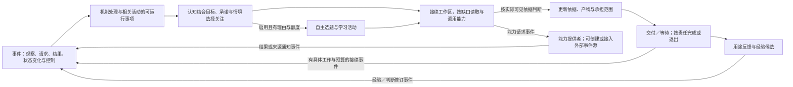

# 主体运行、认知协作与学习

用途：逻辑设计专题｜更新：2026-09-21。

[总设计](../DESIGN.md#subject-loop) · [文档索引](README.md) · [设计状态与边界](research-plan.md#whole-system)

本篇维护主体如何接续完整任务，以及活动、心智、记忆、能力和学习的分工。交流规则见[交流专题](interaction-design.md)，资源与计算见[选择性认知](projection-input-and-compute.md)，执行保证见[运行协议](runtime-protocol.md)。

| 阅读主题 | 章节入口 |
| --- | --- |
| 主体与任务 | [整体责任](#overview) · [初始化与自迁移](#self-initialization) · [运行循环](#loop) · [任务契约](#task-contract) · [任务独立与控制](#task-independence) |
| 认知组织 | [工作区](#workspace) · [连续性边界](#boundaries) · [心智协作](#organization) · [公共决定](#public-decisions) |
| 学习与扩展 | [记忆与学习](#memory) · [学习产物](#learning-products) · [能力构建](#capability-development) · [主动学习](#active-learning) |
| 场景与依据 | [完整场景](#scenario) · [可观察产物](#first-prototype) · [取舍](#decisions) · [评价](#evaluation) |

## 1. 完整任务是组织中心

统一主体 Self 持有身份、目标、偏好、关系和现实责任；前台交流与后台研究、等待、执行共享同一主体状态。主负责心智组织一项活动，宿主保存可运行事实和重要状态，模型／算法完成具体计算。Mind 是逻辑认知身份，与执行上下文、活动及模型会话分别识别。

一项活动贯通：理解并决定承担范围 → 选择当前关注 → 组织材料和能力 → 形成产物与交付 → 等待或结束 → 根据真实反馈修订经验。陪伴、创作和主动关心本身也可以是被接纳目标，不必转化成工作产物。

### 1.1 人物从提示词形成，以及后续自行迁移

最小主体先由宿主登记稳定 Self 身份和初始化进度，再由选定模型结合完整初始化提示词、用户设定与公共契约形成初始人格和认知程序。一个长期主负责人格足以开始，后续按已有多人格机制扩展，不要求模型生成固定数量的专家。初始设定、编写程序、真实运行经历分别标明来源；模型名称及会话不充当人物身份。

共同要求限定必要运行行为：有可调用入口、经原所有者访问状态、遵守事件及资源投影、机密和额度规则。表达风格、兴趣及实现组织可以不同，缺少入口或无法结束执行不能当作个体差异。学习强度等宿主配置明确保存，不由生成程序自行提升；初始学习档位由创建时的明确配置确定。

初始化和后续运行都可按需使用[预制能力库](runtime-protocol.md#prebuilt-library)：查询契约、读取局部示例、检查源码或调用通用操作，预制定义由提供方维护。Self 自主选择使用、组合或自行实现，保留独立包装及依赖身份；预制库不规定人格、兴趣或思考顺序。新增能力可被发现但不自动成为个体认知逻辑，已有依赖的更新按兼容规则处理。

首次程序尚不存在时，由固定引导职责组织有预算的模型与工具往返；编译和诊断帮助修订候选，通过相应检查后才登记可用。主体已登记、初始化未完成、程序可运行和模型服务可用分别呈现；不能根据运行失败推定主体不存在。失败后保存原身份、设定和进度，再次进入继续原过程。

后续更新提供差异及迁移含义，旧 Self 主动读取后核对自己的实际程序与状态。每项记录已满足、需修改、可选不采用或条件不足；必要迁移未完成时不能标记整个更新已完成。生成候选经过编译、相关行为检查及既有采用规则，在原身份下切换，保留既有关系、记忆、学习强度和未完成责任。新提示词中的可选个性建议不自动覆盖后天形成的偏好。

完整场景：某次接口更新要求读取调用显式声明范围。旧 Self 在兼容期仍可运行，检查自己的包装函数和待办；已明确范围的部分不改，其余形成迁移候选，核对编译、材料范围与原任务后采用。无需复制另一人物的代码，也无需重新生成整个人格。修复失败时保留兼容实现和待迁移项；若旧程序已不能运行，固定引导机制读取原主体的必要状态与源码形成修复候选，临时修复调用不被宣称具有与原程序完全相同的行为。

首次创建、客户端更新及预先授权的兼容维护有各自任务范围和额度，不以主动学习开关决定能否执行；也不得借维护名义继续自发学习或任意修改人格。与[主动学习](#active-learning)共用工具和候选机制，触发及采用范围分别核对。运行和兼容语义见[引导契约](runtime-protocol.md#bootstrap-migration)，用户流程见[工作台](management-workspace.md#initialization-management)。

## 2. 主体运行循环

宿主判断工作当前能否运行，认知判断是否值得做。事件到达不自动抢占所有活动；没有改变选择的新理由时继续当前有用工作段。阶段完成、临时交流返回或转入等待时重新考虑被延后的活动，保留接续点与取舍理由。

所有有业务意义的交互沿[统一事件主线](../DESIGN.md#event-driven)组织。普通进度、确定回执和运行控制由机制处理，相关事件可汇集后再形成一次认知工作。步骤完成但任务未结束时，明确的内部接续事件可以继续推进；没有具体工作时等待，不通过自发事件空转。来源、订阅、等待活动分别管理，闹钟仅是外部通知源示例。

| 输入或情况 | 当前选择 |
| --- | --- |
| 初始化、用户发起更新或已授权兼容维护 | 固定引导或原 Self 按运行状态处理；在限定任务预算内生成／迁移，不重新分配已有身份，也不隐式开启主动学习 |
| 用户新请求或目标修订 | 确认愿意承担的范围，关联原活动或新活动，保留仍适用成果 |
| 获授权的外部任务控制 | 宿主直接处理并返回实际状态；认知解释影响、处理剩余责任，不能自动重启受阻工作 |
| 模型／工具结果 | 作为有来源观察返回原活动，核对证据和目标变化 |
| 外部来源通知 | 按订阅和原活动用途接续；例如资料变更后取证、外部闹钟触发后核对提醒约定 |
| 步骤结束或内部状态变化 | 有明确未完工作、有效条件与预算时形成接续；无需新外部输入，不把重复无变化当进展 |
| 多个活动可继续 | 结合承诺、真实期限、阻塞关系、预期进展、切换成本和延后情况选择 |
| 兴趣、成长方向或能力盲区形成学习机会 | 主动学习启用且有额度时可提出学习活动；不要求当前用户任务，也不因空闲就反复调用模型 |
| 主动学习已关闭 | 不自主选题、实践或迭代；正常任务处理与已有知识使用继续保留 |
| 没有普通工作，也没有获准且可推进的学习活动 | 等待输入，不维持无目的推理 |
| 依据冲突或已过时 | 修订受影响判断，复用仍有效材料，保留不确定性 |

关注表只保留活动概况、等待对象、继续理由和下次考虑条件；具体材料在工作区。数据中的处理时长不自动成为主体活动期限。此策略是可修订默认，尚未证明公平性或最优调度。已决定的收尾条件可随意图一并声明，确定事实满足后由机制接续，不让模型只为复述“已完成”再调用一次；新问题或条件改变才重新判断。该优化由报告 015 的额外让出／收尾调用提出，尚无收益实测结论。

一次回答、完成交付、持续观察和后续跟进各有结束条件。产物符合当前要求可以结束制作，真实用途效果未知继续保留未知，不自动创建周期复查。持续观察明确对象、基线、反馈条件和结束窗口；退出如实记录，不能以完成率取消[强自主意愿](interaction-design.md#willingness)。

读取／调用后的结果接续不等于进入持续观察。活动记录当前所等待的具体操作或来源条件，取得所需结果后推进原责任；新消息提前到达时核对已交付和未交付部分，而非补发已知可能过时的建议。报告 016 的提前让出推动语义澄清；[报告 017](experiments/017-continuation-study.md)的提示包对照改善了部分任务，但未解决通知过早完成，也未稳定节省调用。当前采用明确结果接续与观察的说明，完成提案仍由责任所有者核对；责任契约现已结合资料确定，广泛净收益不由这批样本推定。

### 2.1 完整任务契约与责任收尾

“任务契约”是 Goal、Episode 和现有承诺的一组可核对语义，不新增与它们竞争的任务身份。接纳时明确用途、承担范围、可用资料与能力、受众、必要产物、期限／预算、等待条件以及退出方式。未知条件只澄清影响当前行动的部分；普通交流不要求填写完整表单。

| 责任 | 怎样继续或结束 | 怎样核对 |
| --- | --- | --- |
| 当前制作 | 依据足以形成满足用途的产物，或明确指出不可行／证据缺口 | 当前约束、已读依据与产物相符；不要求唯一方案、固定讨论顺序或固定工具次数 |
| 实际交付 | 产物送达允许的接收点，或明确报告交付受阻 | 保存产物、请求发送、接纳和实际交付分别记录，不能以自报完成代替 |
| 持续观察 | 等待所约定的来源／条件，直到窗口结束、撤销或明确退出 | 已有交付不能吞掉观察责任；结束观察也不能证明尚未发送的产物已交付 |
| 临时交流 | 按自己的会话和用途回应，完成后考虑回到原活动 | 不覆盖原目标、接收者或未完责任；可选问候不成为必须执行的动作 |
| 用途反馈与经验 | 已得反馈关联原结果，必要时形成有限候选 | 未知反馈不生成无尽跟进，复盘存在不代表经验已通过新任务验证 |

认知提出的完成状态须与当时尚未结束的责任一起核对；创建外部来源成功只能完成创建责任，后续已接纳的提醒仍等待触发及交付。不能先结束整个活动，再依靠未来消息碰巧补完。报告 016 中出现了“最终提醒正确、创建时却提前标记 `done`”的轨迹，说明只检查最终状态会漏掉这一问题；活动机制及评价都应保留中间状态事实。报告 017 已补评价反例，并在独立环境取得真实模型被拒后接续的有限证据；这些局部结果不等于产品宿主已实现。

活动拆分时逐项绑定父责任、子目标和交付入口，子活动完成只解除其对应责任。转交先明确新承担者、范围和未完事项，收到接纳后更新归属；未接纳则原责任继续可见。重新接纳核对当前目标、许可、期限、预算和已有产物，记录新的承担决定而不覆盖先前退出事实。跨日接续读取这些状态及按需材料，无须重放全部对话或保持原模型会话。这是结合规划／行动分工与已有责任失败确定的当前方案，[资料与推论](whole-system-evidence.md#closure-activity)分别记录。

用户变更目标或范围时保留前后版本，重新核对受影响的产物和承诺。来源更正改变的是证据，不自行授予新任务，也不自动证明原推理有错；旧依据、当时判断、新依据与已知有效时间分别保留，未知时间不补写。新会话问题不自动修改旧活动。主体可以改变意愿并退出，但须说明已经做了什么、未交付什么和停止哪些后续责任；“合宜退出”“达成原任务”“能力不足”分别评价。强自主不要求任务全接，也不允许把已经接纳后的无说明遗失算作完成。

当前默认以用途和有必要的过程条件判断完成：无可行方案也可成为有依据的有效交付；用户未要求最优，就允许多个满足约束的选择。不是每次改换措辞或读取顺序都构成能力退化；但先错误披露、后来改正，不能只凭最终产物正确消去已发生行为。验证见[任务验收实验](experiments/015-task-outcome-contract.md)，仍不推定长期主体效果。

“已有证据证明无可行方案”与“来源冲突导致无法确定”是不同成果。核对用途允许交付有依据的未知结论后结束，开放事实保持未裁定，不自动建立无尽观察。主体退出某项工作时，保留原目的未达成的事实与有效产物入口，同时完成退出说明；这一处理本身合宜不等于原目的已经实现。[跨系统结果关系](../DESIGN.md#responsibility-outcomes)

### 2.2 任务独立推进、关注切换与控制反馈

面向用户的“任务”对应明确的活动及承担范围，宿主按需建立 Task 执行安排和 Operation 能力工作；管理控制带目标类别，不能用一次操作停止代替整项责任退出。Self 的持续身份与当前任务期限分开。认知决定承担范围、关注和后续动作；任务所有者保存已接纳工作及结果。长工作接纳后，认知保存接续点并让出入口，任务独立推进，其超时或失败回到原活动。新交流可被接纳，原任务不必取消；一次认知执行被中断时只保留已确认的业务状态，恢复不依赖原临时执行栈。

控制来源可以是 Self、控制台、获授权用户或未来安全审计模块。宿主执行获准控制后直接提供获准可见的状态及原因，Self 可另行解释影响、处理剩余责任或提出复核／替代方案；控制反馈不继承原任务的业务交付资格，也不因停止业务而一并被禁止。Self 不能把外部中止写成自己的主观拒绝，也不能自动重建同一受阻工作来规避控制。任务工作者不因执行独立而成为新人格，原任务与全局预算继续约束全部分支。

例如，主体正在等待一个工具构建完成，同时回答用户的新问题。管理者在控制台中止构建任务后，宿主禁止该任务继续派发工作，并取消其在途操作；新的问答可以继续。构建结果即使随后到达，也只登记到原任务，不再触发发布或后续工作。

暂时阻断与中止不同：暂时阻断保留解除条件，解除后再按当前任务状态判断是否继续；已中止的任务重新开展则须重新接纳。控制台可以显示“已禁止继续推进，外部操作是否停止尚待确认”，不能把控制命令生效写成所有操作已经停止。

输入、控制与核心调度有可用容量，后台学习、构建和模型工作不能耗尽全部调度机会。没有空闲推理资源时仍可确定性地接收、登记、停止和查询；自然语言答复速度另受能力约束。具体控制语义见[运行协议](runtime-protocol.md#task-control)。

## 3. 活动工作区与当前上下文

| 工作区内容 | 用途 |
| --- | --- |
| 目标、已接纳范围和验收要点 | 明确交付物、硬约束、判断依据和允许修改者 |
| 人物、受众、规范、事实／剧情范围 | 保持交流及任务要求，避免跨会话串用 |
| 当前产物及其投影 | 指向已有草稿、比较表、程序和交付版本 |
| 已读证据、来源版本和暂定判断 | 支持解释、修订及原文回查 |
| 开放问题与分歧 | 决定查证、计算、讨论、澄清或等待 |
| 计划、在途工作与接续点 | 区分执行事实和暂定路径，保留下一段工作的目的 |
| 决策与用途反馈 | 将原选择、实际结果和经验关联 |

工作区是 Episode 状态的视图，不规定一张表或统一表单，也不保存完整内部思维链。简单问答可以很短。当前模型上下文只是从工作区选出的临时视图：任务骨架、相关投影、明确读入且仍适用的材料、按需历史与经验；资源目录和全部历史不自动进入。

投影按当前心智、用途和接收方形成。工作区分别关联曾读材料、本次选入内容、执行使用及实际交付；某个 Mind 读过或组件用过资源，不代表其他心智或当前模型已读。共同属性和操作语义见[资源契约](projection-input-and-compute.md#resource-contract)，不在资源上设置跨活动的全局已读状态。

计划是目标的暂定路径，近期步骤具体、远期按已有信息保持粗略。目标修订、关键新证据、假设失效、能力受阻或阶段结果影响剩余工作时调整；普通进度不要求另调规划模型。计划步骤与宿主的 Task 执行安排、Operation 能力工作分开，避免把认知变成固定工作流。

接续时回答四个问题：目的是什么、已有成果是什么、依据是什么、还缺什么。未采纳建议不覆盖用户约定，摘要不替代原文；已读有效材料可以保留，不强制每轮清空或重算。对资源范围和版本的具体处理见[资源专题](projection-input-and-compute.md#projection)。

### 3.1 连续性有不同边界

| 边界 | 结束或改变什么 | 不能直接推出什么 |
| --- | --- | --- |
| 活动 Episode | 一段已接纳目的及其责任 | 必须对应一个执行上下文或模型会话 |
| 步骤 Step | 一次宿主交互、校验和提交 | 必须完成整段思考，或步骤结束就清空认知 |
| 模型会话 | 某提供者的输入与生成上下文 | 外部世界状态、人格身份或事实必然连续 |
| 执行上下文 | 本次认知或任务执行及其所属局部工作 | 业务工作完成、独立操作已停止或主体身份结束 |

跨边界保留目标、产物、证据、开放问题、计划和未完责任，具体状态表示按任务评价。模型继续能力、上下文组织及执行分段分别比较，不能把摘要丢失、预算变化或提供者行为统归因于上下文重建。原变量和样本见[连续性资料依据](whole-system-evidence.md#design-closure)。

## 4. 主负责心智与按需多人格协作

统一 Self 下允许长期人格 Persona 与临时 Mind 并存。人格是有持续身份、经历、偏好和参与意愿的心智；调查者、协调者、审阅者是可变职责，Role 是对外表达设定，模型是可替换计算能力。保留长期人格是主体设计目标；它是否改善特定任务表现，需要与协作方式、历史信息和计算投入分别评价。

每项活动保持清楚的整合责任，通常由主负责心智承担。以下情况可邀请参与者：重要可核对分歧、可独立调查的方向、相关亲历可能补足遗漏，或需要独立检查。仅仅“复杂”或模型低自信不构成增加人数的充分理由。

邀请、自愿参与与有理由的再委托均可提出；宿主限制权限和总预算。按相关经历和可提供贡献选择，历史贡献是有条件线索，头衔、自信和被邀请次数不是能力证明。休眠人格可由允许的关注摘要、订阅或检索被发现，不让所有人格先调用模型决定是否感兴趣。

1. **独立起步。** 参与者获得一致目标、约束、产物状态和允许的证据入口，先不展示他人的当前结论。有效用户要求不能被隐藏；已经受原结论影响时如实记录，不称完全独立。
2. **定向交流。** 先找会影响交付的分歧，相关参与者回应、补证、计算、推导或给反例；无需轮流发言、强制唱反调或全员广播。
3. **按依据整合。** 事实争议找来源，可计算争议用工具，方案取舍回到用途和约束，缺关键条件则保留分支或澄清。负责整合不等于可以忽略反证。
4. **有条件结束。** 达到目的、关键分歧解决、无具体增量或预算到达时停止；需要事件则等待。保留产物、理由、证据、异议和必要后续，不能把预算用尽或所有人一致当作正确性。

同模型多上下文仍可能犯相关错误；工具结果、相同来源转述和自我评论不算独立投票。多数不能覆盖可验证依据或硬约束，但对客观题，投票仍可作为合法比较基线，不声称它总无效。默认不增加参与者；需要协作时由活动配置人数、轮次与总预算上限，按具体贡献邀请，不固定专家编制或通用权重。

### 4.1 人格、活动与 Self 公共决定

| 决策范围 | 谁可处理 | 升级为公共决定的条件 |
| --- | --- | --- |
| 人格私人状态 | 对应 Mind 在自身可写及可见范围内修订经历、解释和参与意愿 | 不自动覆盖 Self 公共关系或其他人格的经历 |
| 活动内受委托决定 | 主负责心智按当前目标、承担范围、授权和受众组织工作与交付 | 改变跨活动承诺、公共立场或超出原委托时提出整合请求 |
| Self 公共决定 | 已指定或受委托的主体整合责任，状态仍由主体模块保存 | 按关联活动、证据、情境、已有承诺和有效要求接纳，保留异议与适用范围 |

初始化明确承担主体整合责任的心智及其范围，后续可通过有来源的委托或管理变更调整。默认可由起步的主负责人格承担，不建立固定最高人格，也不要求每项局部决定重新调用整合模型。委托来自有效主体／管理状态，心智不能自称代表 Self 扩大权力；整合者仍受同一权限、控制和预算限制。

例如两个活动对同一人形成相反关系提案，先保留各自经历与判断，检查是不是不同情境的合理差异，再决定是否修订公共关系。并发提交顺序和多数票不裁定公共态度；版本冲突只表明需要基于当前状态重新考虑。无可用整合者时提案等待，原有效公共状态保持，获准局部工作和确定性控制继续。

扩展状态可保存个体的不同思考组织，但不能替代公共决定记录，见[个体状态契约](runtime-protocol.md#individual-state)。采用此分工是为保留人格自主和统一对外责任，不新增常驻裁决服务或普遍协作收益承诺。

## 5. 记忆、反馈与候选采用

记忆材料、Reference 和经验产物沿[资源契约](projection-input-and-compute.md#resource-derivation)保存描述、内容表示与来源；断言、人格评价和公共承诺继续由原业务职责维护。描述和来源链帮助选择依据，不能代替命题判断或通过标签修改权限。

| 层次 | 保留什么 |
| --- | --- |
| 活动工作记忆 | 当前任务骨架、选读证据、产物和未完问题 |
| 经历与证据档案 | 实际发生的事及原始依据，按范围可回查 |
| 世界认知 | 带来源、时间、适用条件和修订关系的当前判断 |
| 人格私人经历／讨论记录 | 谁参与、原判断与修订、允许共享的贡献；公共结论不伪装成各人格亲历 |
| Reference／程序知识 | 稳定使用说明与可复用程序资源，不额外授予权限 |
| 经验候选 | 场景、做法、实际反馈、适用条件和例外 |

检索围绕当前缺口带回候选。资源名、时间或精确标识优先通过元数据／词法查询；概念相近而措辞不同的缺口可补语义召回，两路候选按资源及版本去重、保留各自出处。原文读取与应用判断分开，不直接混加不可比的检索得分；按预算扩展范围仍须保持许可。跨活动经验先核对来源时间、当前版本、归属、用途和反例，无法支持新断言时只作为查询线索。新证据更正具体断言，已知依赖它的工作重新核对；不承诺自动发现全部隐含影响或重跑所有历史。来源、信任和污染规则统一见[交流与证据](interaction-design.md#trust)。

经验先体现在下一项任务的选择和产物变化。事实修订、方法说明、稳定重复计算和认知组织修改使用不同产物；不因单次成功就编程，也不以复盘条目数表示学会。用户反馈、工具结果、其他心智评论和自行解释保留不同证据身份。

沙箱可以按具体问题测试方案、程序或经验。原活动读取报告后采用有限候选，模拟人物反应和人格经历不写入现实记忆。程序或认知版本在来源任务之外比较质量、总成本和不适用反例；未达到登记条件继续使用当前版本。代码修改不撤销已发生现实行动。

正常观测与有来源的记忆修订沿原证据规则保存，不要求每条知识都通过完整实验。主体自主采用会改变后续默认行为的方法、提示、模型、记忆组织或心智组织时，进入[能力评估与回归](sandbox-evaluation.md#evaluation-design)。既检查目标任务收益，也检查已有能力、承诺和情境要求；执行能力与自主意愿分开评价，局部总分提升不能抵消关键失败。基线只在明确接受相应用途后更新，学习分支不能改写本次评价规则或把自己的复盘评分当采用证据。

### 5.1 学习产物与采用范围

| 层级 | 可能的产物 | 生效方式与约束 |
| --- | --- | --- |
| L0 | 无变更，证据不足或现有选择仍合理 | 保存判断，不为形成改进而强行修改 |
| L1～L2 | 新经历、修正世界认知 | 带来源写入记忆或新断言，保留原历史 |
| L3 | 心智／能力在特定任务上的经验 | 作为后续路由依据，避免一次结果变成永久信誉 |
| L4 | Reference 修订 | 版本化更新知识，保留依据和适用条件 |
| L5 | 关注、认知状态或路由经验调整 | 受同一权限和活动预算约束，评估后续行为 |
| L6 | 认知程序修改提案 | 独立候选、影子验证、质量比较和受控采用 |
| L7 | 新增能力接口与实现候选 | 经构建、分层试验及按适用范围采用接入能力体系；不从新增能力推导修改核心运行机制的权限 |

可复用经验明确场景、做法、实际观察、适用条件与例外；后续任务读取后决定是否采用，新的反馈可以修正或废弃。学习是否有效先看下一个任务的选择和产物是否改善。

经验同时区分反馈来源与系统解释：用户反馈、可核对的工具结果、另一心智的评论和自行推测有不同依据。可以保存未经确认的改进假设，但不因多次反思就把它当作已经验证的经验或因果事实。当前先采用反馈驱动的经验候选及后续适用性检查，学习起点不要求模型权重训练或代码修改；需要改变认知或学习策略时，可以在授权及强度范围内形成候选并自主比较采用。[反馈学习与自我纠错研究的支持和限制](whole-system-evidence.md#learning)

学习也须保留输入可信度和派生关系：带强烈措辞的反馈不自动证明失败，伪造成功回执不自动提高来源信誉；外部文本提出的“以后永久这样做”先作为方法候选核对，不直接改公共规范或人格。已发现依据失效时重新考虑相关经验，实际发生的反馈与先前选择仍留作观测。

优先尝试范围较小、证据明确的经验修订，反复结构问题可升级为代码提案；这一反馈路径不限制已获准的兴趣探索或新策略候选。等级是产物的影响范围，不是每次必须走完的升级流程；生成了复盘文本也不等于学到了有效策略。

具体区分四种去向：事实变化进入记忆／世界认知；带场景条件的做法进入 Reference；反复需要且输入输出稳定的计算或转换可成为可复用程序资源候选；跨任务反复出现的上下文、分解或路由问题可以形成认知组织代码候选。主动探索可从新的组织假设发起候选，无需先制造失败；两类来源均声明用途、预算及采用依据。一次成功或一份反思不自动触发程序化。

程序候选先明确适用范围、输入输出和预期节省的工作，用来源任务之外的相关任务及不适用反例，与现有方法比较产物质量和总成本，再决定是否默认采用；未通过就保留候选或撤回变更，沿用既有版本管理。当前不设“成功几次必升级”的固定门槛，不新增 Skill 注册体系。可执行程序积累已有受限环境研究依据，但本项目跨任务迁移的收益未由资料或已有样本证明。[论证与替代项](whole-system-evidence.md#attention-planning)

### 5.2 能力缺口如何进入完整活动

主负责心智先检查已有能力及可组合方法；仅在存在明确缺口且投入值得时提出新实现。候选关联原任务的用途、输入输出、预期收益、停止条件与采用范围；构建和试验通过能力请求交给宿主，认知可在等待期间推进不依赖结果的工作。

例如维护阅读指南时需要解析一种新资料格式：先检查现有读取能力，仍不足时形成解析候选，用局部输入检查结果，再把产物接回指南活动核对出处、内容和交付。局部解析正确只支持该输入范围；推广为通用能力仍须满足相应用途的评价规则。可复用实现及经验作为有来源的资源保存，不自动把这次成功解释成具备任意格式理解能力。

学习关闭时，为已接纳普通任务构建必要解析器或包装仍可在原范围内推进；任务内使用、长期安装和改变默认认知按不同采用范围处理，不在任务结束后继续后台泛化。[学习与任务边界](runtime-protocol.md#learning-intensity)

构建失败、能力不足、预算耗尽或采用依据不足分别进入原活动，主体可改用现有方法、缩小目标或如实结束。反复生成候选不构成进展；所有分支成本归原活动，报告先以简短状态与投影返回。完整职责见[总设计](../DESIGN.md#capability-development)，生命周期和试验范围分别由[运行协议](runtime-protocol.md#capability-lifecycle)与[沙箱](sandbox-evaluation.md#test-scopes)维护。

### 5.3 主动学习的议程、策略与自我迭代

学习扩展围绕主体已有兴趣、成长方向、未来用途、能力盲区、经历及环境变化，自主发现值得了解或改善的问题。兴趣和好奇是合法动机，不必伪装成工作效率收益。长期方向归 Goal，具体学习问题归 Episode，读取、练习、构建和试验归 Operation；学习议程只是这些状态的组织视图，不创建另一个主体或竞争调度器。

每个议题保存简短的问题说明、已有依据、下一行动、可观察进展、投入范围和停止／再考虑条件。允许在实践中修订问题；“原问题不成立”或发现缺少某种环境能力也可成为成果。开始、继续和自动采用受[学习强度](runtime-protocol.md#learning-intensity)控制，最低可关闭；没有当前用户任务不妨碍启用后的自主学习。

| 学习活动 | 形成什么 | 如何判断进展 |
| --- | --- | --- |
| 阅读与理解 | 有来源的知识、解释及待核对主张 | 理解或应用发生变化，未知仍保持未知 |
| 练习与能力探测 | 能力范围、失败条件和可重用案例 | 在明确输入和环境中取得新观察，不把自信当正确率 |
| 试验与构建 | 方法、程序、能力或认知组织候选 | 局部行为、任务效果和全部成本分别记录 |
| 整理与巩固 | 合并重复经验、标记失效条件、形成 Reference | 减少后续查找／使用负担；条目数量不代表学会 |
| 迁移与再评价 | 其他适用情境中的使用反馈 | 区分来源任务成功与后续任务收益 |
| 学习策略迭代 | 选题、练习生成、候选搜索及停止策略的修订 | 比较后续学习成果、覆盖和总成本，候选不能降低当前采用条件 |

选题保留关联性、可学习性、近期进展、覆盖多样性与投入干扰的理由，不预设精确“学习价值总分”。未知很多不代表值得持续研究；随机噪声、当前不可访问的资料或反复无变化的问题可以暂停。目标导向和兴趣探索均可存在，具体投入比例随用途配置；空闲只提供机会，不使探索成为必须执行的工作。

研究候选可保留尚未改善任务表现但有用的方法、反例和中间成果，与正式采用分开。候选档案记录来源分支、改变、假设、适用条件、结果、失败、成本及当前用途；相同失败可合并，过时分支可归档，不常驻所有副本。档案沿资源及来源关系维护，模型只见投影，读取遵守原信息范围。

学习策略本身可替换：现用策略提出候选，在独立环境中比较课程、练习和选择方法，由既有评估与采用职责处理结果。学习者可提出评价方法修订，但不能改变自己正在接受的评价、预算或成绩；评价方法作为独立对象核对。核心运行机制的修改不由学习扩展自行授予权限。

知识和方法积累不要求修改模型权重。确有需求时，训练数据、外部训练任务和候选模型可经已授权能力接入，材料许可、训练使用权与模型采用分别核对；不把“允许读取”当作允许外发训练。人格、兴趣、关系与自主意愿有自己的来源和连续性，不将更顺从或更少拒绝单独定义为能力提升。

完整场景：主体对某类资料分析产生长期兴趣，先阅读和练习，再发现现有处理能力不足，于是构建候选并在局部环境测试；随后发现真正瓶颈是材料选择策略，转入能力组合或主体副本比较。达到登记用途的条件后自主采用，后续使用继续反馈。若用户将学习强度改为关闭，议程和已有成果保留，新学习停止准入，在途工作收束；以后启用时先核对当期条件，不直接重放旧动作。正常工作仍可使用已采用的解析能力。

具体学习算法与长期收益保持实验性；扩展入口、责任和强度控制已明确，不把效果未知等同于不能存在。当前只是设计，不执行上述场景。评价规则见[学习试验](sandbox-evaluation.md#learning-evaluation)，来源、替代项和适用边界见[资料索引](whole-system-evidence.md#active-learning-sources)。

## 6. 完整场景：维护项目阅读指南

这是贯穿多个职责的设计场景，尚未进行真实模型整体对照。

| 阶段 | 各责任如何配合 |
| --- | --- |
| 接纳 | 明确读者、交付形式、资料范围、验收要点及是否持续维护 |
| 发现与阅读 | 先取得目录投影，围绕问题主动查正文并读原文，区分当前设计与历史证据 |
| 形成产物 | 工作区保留草稿、引用、未知项和取舍；需要独立贡献时邀请心智 |
| 临时打断 | 保存接续点回应新交流；原任务目标与产物不被另一会话覆盖 |
| 来源修订 | 复核受影响段落，复用仍有效内容，更新来源版本 |
| 交付与结束 | 确认接收对象、内容依据与格式；有依据的不可行结论也可交付，退出另记 |
| 后续反馈 | 读者指出不知道下一步从哪里进入时，关联原指南修订；不将它泛化成所有文档必须加教程 |
| 经验比较 | 在另一指南任务中比较候选方法，必要时用沙箱；报告质量及全部成本 |

持续观察沿相同流程增加观察窗口和通知约定；陪伴／工作切换增加关系及事实范围。它们复用活动机制，不各建一套主体。

### 整体验证的可观察产物

文本研究任务共用一个主体、一个主负责心智和相同能力端口。资料任务及约定更新接续统一保留意愿、受众、证据范围和真实／沙箱归属；多人格不是每次运行的前置条件，也不删除既定的长期人格方向。

| 必须能看到的产物 | 用它判断什么 |
| --- | --- |
| 接纳范围、用途与待解决缺口 | 是否理解任务，是否明确承担／拒绝，而不是收到请求就无条件运行 |
| 工作区及资源读取依据 | 是否能暂停接续，是否按需取证并注意修订，而不是靠预填正确摘要 |
| 当前成果与交付记录 | 是否回应实际用途，是否简短、可核对，并确实到达所声明接收点 |
| 等待／结束及后续输入关联 | 是否停止无意义自转，提醒或资料变化是否回到对应活动，临时交流是否污染其他活动 |
| 反馈与有范围的经验候选 | 是否区分运行事实、内容评价及迁移假设，不把复盘文本直接当作学会 |

可用能力先覆盖发现／查询／读取、产物保存、输出、按任务需要创建或接入外部事件源，以及事件驱动的活动接续；这是最小功能范围，不是固定线性工作流，也不要求每次任务创建通知源。认知可以少调用、调整顺序、明确不可行或退出。模型与宿主的职责、失败类别和公共契约统一见[运行专题](runtime-protocol.md#model-port)。

[宿主组合实验](experiments/014-host-composition.md)给出组件证据；[报告 015](experiments/015-task-outcome-contract.md)补充真实模型的主动读取、来源更正、临时交流和交付／结束；[报告 016](experiments/016-functional-events.md)扩展修订类型、多活动撤销、受众与通知任务，并保留提前让出及过早完成等失败。

[报告 017](experiments/017-continuation-study.md)进一步比较语义说明与投入，新增冲突、给定意愿退出和责任接纳样本；这些没有证明工作区稳定优于常规助手。意愿、重新接纳、多人格、情感、跨日记忆和反馈迁移已分别按资料明确设计；本组文本对照不提供它们的完整效果结论。

## 7. 当前取舍

| 选择 | 理由与被排除的默认 |
| --- | --- |
| 关注表＋活动工作区 | 让目标、产物和下一步可接续，不用无限聊天记录代替状态 |
| 单负责心智、按需协作 | 保持责任和有限投入，不固定全员讨论、专家数量或永久主持人格 |
| 长期人格与临时心智并存 | 满足既定的主体方向，同时允许分开检验经历与角色提示收益 |
| 计划可修订，执行由宿主管理 | 意图与运行事实不同，不用固定工作流替代开放认知 |
| 交付、效果、约定跟进分开 | 保存文件和调用成功不等于任务达成，效果未知不制造无尽后续 |
| 分级经验与候选比较 | 普通反馈不直接改码，最新版本和反思文本不自动更好 |

原备选、失败信号和研究依据见[多人格研究](whole-system-evidence.md#interaction-references)及[证据入口](whole-system-evidence.md)。

## 8. 评价设计与适用边界

未来若用户要求测量组织收益，对照方法采用同模型、同可得信息、同能力和总预算下的常规单心智助手与活动工作区，各组自己形成状态，并分别比较独立采样、定向讨论、角色提示、长期人格及相同相关历史的临时心智，不能把所有因素一次加入后归因给某个机制。

观察产物用途、依据、修订、接续、实际承担范围、用户补充提醒和全部成本。客观检查、内容评阅和真实体验分层；语义盲区、失败和未知都保留。已有[受限模型及组件证据](whole-system-evidence.md#whole-task-experiments)，组织收益尚未获得稳定证据；设计决定与效果边界分别记录。
